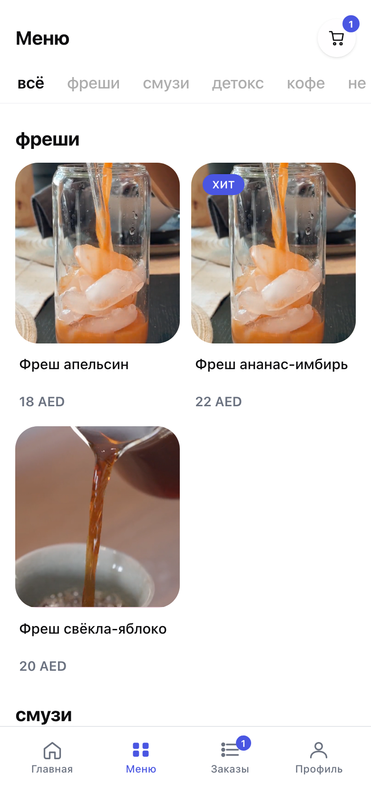
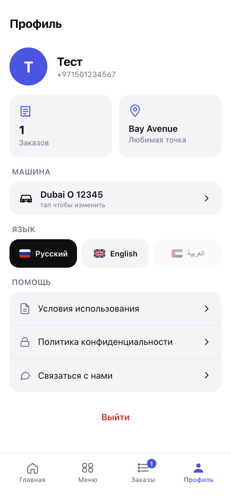
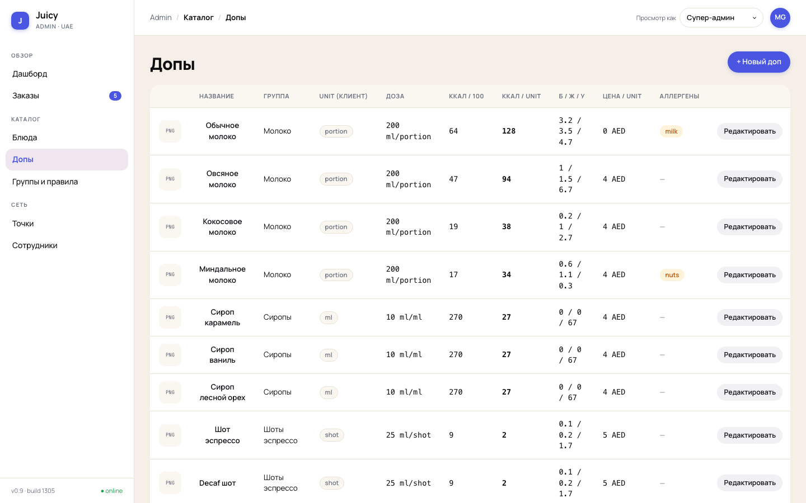
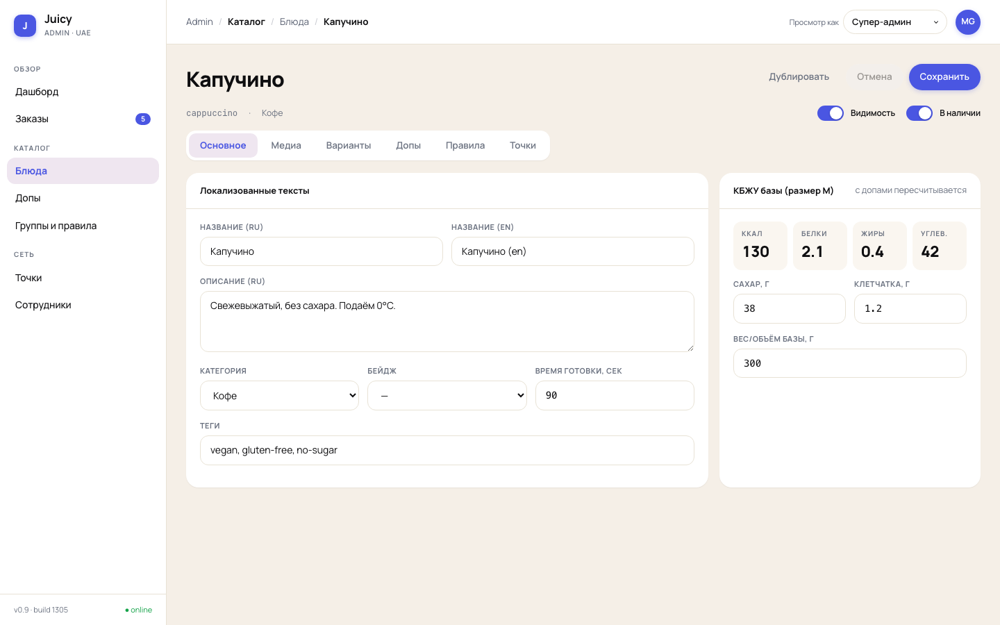
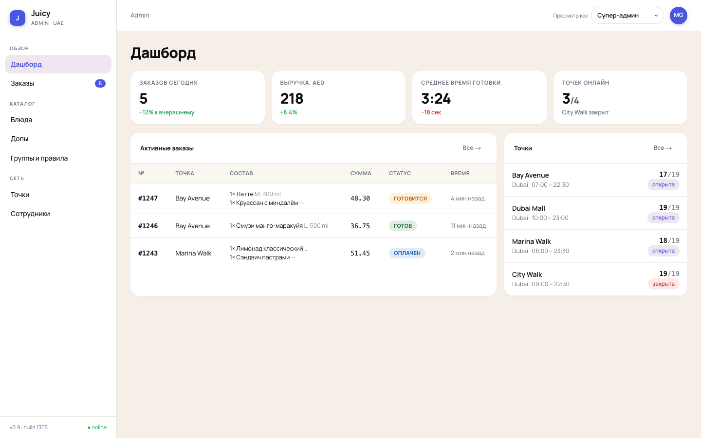
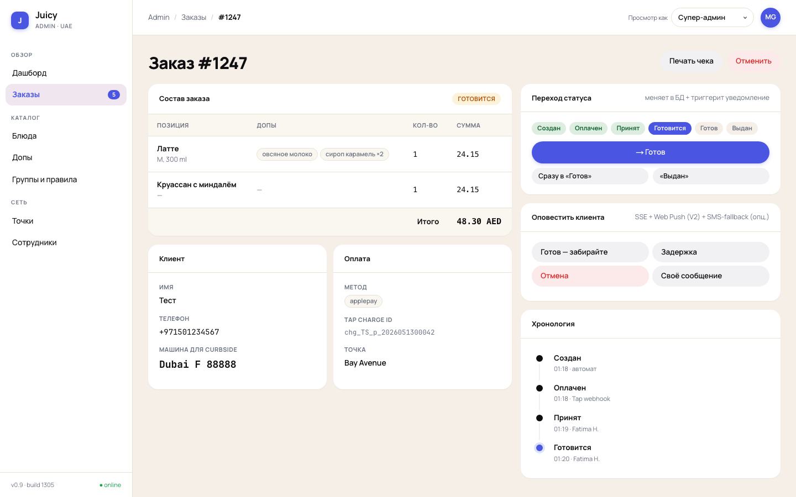

# Juicy V2 — функциональные требования: User Stories по ролям и платформам

> **Назначение.** Функциональные требования проекта в формате User Stories по ролям и платформам —
> основа для технического задания и оценки. Ответы владельца продукта на открытые вопросы
> учтены и помечены значком ✅.
>
> **Формат каждой истории:** `ID · Название` → история («Как X, я хочу Y, чтобы Z») → критерии
> приёмки (AC) → 🖥 референс экрана прототипа со **скриншотом** (если аналог уже есть) →
> 📝 примечания / ❓ открытые вопросы.
>
> **Скриншоты** — реальные снимки работающего прототипа (вставлены в документ). Коды экранов
> (A1…F1 — клиент, AD1…AD10 — админка) — внутренняя нумерация экранов прототипа.
> Для 9 новых экранов без аналога скринов нет — их предстоит спроектировать.
>
> **Дата актуализации:** 05.06.2026 (учтены ответы владельца продукта)

---

## 0. Роли и платформы

| Платформа | Роль | Код | Описание |
|---|---|---|---|
| Публичный сайт (mobile-web) | **Гость** (неавторизованный) | `PUB-G` | Просматривает каталог, собирает напиток; для оплаты должен авторизоваться |
| Публичный сайт | **Клиент** (авторизованный) | `PUB-A` | Всё, что гость + оформление, оплата, мои заказы, профиль, оценки, купоны |
| Админка (desktop) | **Супер-админ** | `ADM-S` | Полный доступ: каталог, заказы, менеджеры, пользователи, платежи, дашборд, локализация |
| Админка | **Менеджер заказов / бариста** | `ADM-M` | Только список заказов (номенклатура) + смена статусов готовки |

> 📝 В исходных требованиях роль названа «Бариста», в постановке задачи — «Админ/менеджер по работе с заказами».
> Это одна роль; в документе — **Менеджер (ADM-M)**. В прототипе админки было 6 ролей — V2 сознательно
> упрощает до 2.

### 0.1 Статусная модель заказа (сквозное требование) — ✅ решение принято

**Принято решение (ответ владельца): у заказа ОДНО поле статуса.** Разные стороны устанавливают
значения на разных этапах — дублирования и рассинхрона двух полей нет.

**Единая цепочка статусов:**

| # | Статус | Кто устанавливает | Когда |
|---|---|---|---|
| 1 | `new` — новый | система | после подтверждённой оплаты |
| 2 | `in_progress` — взят в работу / готовится | менеджер | кнопка «Взять в работу» |
| 3 | `ready` — готов к выдаче, ожидает прибытия | менеджер | напиток приготовлен |
| 4 | `completed` — передан клиенту / получен | менеджер | после выдачи; у клиента отображается как «получен» |
| — | `refund` — возврат | менеджер | опциональный модуль, см. ADM-M-06 |

**Прибытие клиента — независимый флаг, а не ступень цепочки** *(уточнение от 06.06 по итогам
реализации)*: отметка «Я на месте» (`arrived_at`) доступна клиенту **в любой момент после
оплаты**, независимо от статуса готовки. Причины: клиент часто заказывает, уже находясь у
точки; если бариста забудет нажать «готово», клиент не должен терять возможность отметить
прибытие. Бариста видит «🚗 клиент на месте» поверх любого статуса и приоритизирует заказ.

**Правила переходов:**
- Когда менеджер ставит `completed`, клиент видит у себя «получен» — это **одно и то же значение**, разные локализованные подписи для витрин клиента и менеджера.
- Каждая смена статуса пишется в **историю заказа**: тип события, новый статус, ID пользователя, метка времени (см. PUB-A-07, ADM-M-04).
- ✅ Состав событий истории подтверждён: помимо смен статуса фиксируются **создание заказа, оплата, применение купона, оценка**.

---

## 1. ПУБЛИЧНЫЙ САЙТ — Гость (неавторизованный) `PUB-G`

### PUB-G-01 · Просмотр каталога по категориям

**Как** гость, **я хочу** видеть каталог соков с переключателем категорий, **чтобы** быстро найти нужный напиток.

**AC:**

1. На странице каталога отображается фото активной категории + её название в переключателе.
2. Переключатель содержит категории, **загружаемые с бэкенда** (`GET /categories`); в дизайне — 4 категории, фактическое число определяется данными.
3. В переключателе видны только категории с флагом «активна» (управляется супер-админом, см. ADM-S-01).
4. Список товаров фильтруется по выбранной категории через **query-параметр** (`?category={id}`) — состояние шарится ссылкой.
5. В каталоге видны только напитки со статусом «**опубликован**» (черновики и скрытые не отдаются публичным API — см. ADM-S-05).
6. Клик по товару → деталка напитка.

🖥 Прототип: B1 Главная / B2 Меню (`/home`, `/menu`) — переиспользовать паттерн табов и грида.

{height=360px} {height=360px}

📝 Отличие от прототипа: категории и товары приходят с бэка, а не из `lib/data.ts`.

### PUB-G-02 · Деталка напитка с видео

**Как** гость, **я хочу** видеть страницу напитка с видео и составом, **чтобы** понять, что я покупаю.

**AC:**

1. Видео напитка подгружается и проигрывается автоматически (muted, loop).
2. Отображаются название напитка и кнопка «Назад».
3. Отображаются **категории добавок, доступные именно в этом напитке** (через промежуточную таблицу напиток×добавка, см. ADM-S-05).
4. Клик по категории добавок → раскрывается список доступных добавок этой категории в этом напитке (паттерн «как сейчас на фронте» — inline-попап).
5. Показываются только **активные** добавки и только из **активных** категорий добавок (флаги из ADM-S-02/03); деактивация в админке немедленно скрывает их из конструктора.
6. Прямой заход на деталку неопубликованного напитка → 404 (или экран «недоступно»).

🖥 Прототип: C1 Карточка продукта (`/product/[slug]`) — full-bleed видео + чипы групп + AddonPopover.

{height=360px} {height=360px}

### PUB-G-03 · Сборка напитка с добавками и пересчёт цены/КБЖУ

**Как** гость, **я хочу** добавлять добавки и видеть рост цены и пересчёт КБЖУ, **чтобы** управлять составом и бюджетом.

**AC:**

1. При добавлении добавки итоговая стоимость увеличивается на цену добавки **в этом напитке** (override из связки напиток×добавка; если цена не указана — добавка бесплатна и включена в стоимость, см. ADM-S-05).
2. КБЖУ добавки показывается **пересчитанным на её дефолтный объём** в этом напитке (КБЖУ хранится на 100 г — см. ADM-S-03).
3. При выборе нескольких порций добавки КБЖУ и цена умножаются на количество порций (×1, ×2, …).
4. Количество порций ограничено мин./макс. объёмом добавки в этом напитке (из связки).
5. Под составом видна кнопка **«Добавить в корзину»** с итоговой суммой собранного напитка.

🖥 Прототип: C1 — live-пересчёт КБЖУ и счётчики уже реализованы; добавить мин./дефолт/макс. объёмы.

{height=360px}

✅ **Решено (ответ владельца): корзина нужна** — см. PUB-G-05; кнопка деталки добавляет напиток в корзину, оплата — из корзины.
❓ Размеры напитка (S/M/L из прототипа) в исходных требованиях не упомянуты — нужны ли в V2? (остаётся открытым)

### PUB-G-04 · Авторизация при попытке оплаты

**Как** гость, **я хочу** авторизоваться в момент оформления заказа, **чтобы** не регистрироваться заранее.

**AC:**

1. Нажатие «Оформить» в корзине проверяет авторизацию.
2. Если гость не авторизован — он проходит авторизацию, после чего попадает на оформление заказа (PUB-A-01); корзина при этом сохраняется.
3. Весь каталог, сборка напитка и корзина доступны **без** авторизации; вход требуется только для оформления/оплаты.

🖥 Прототип: D1→`/auth/phone` (та же логика «вход по требованию»), флоу A4–A6 (телефон → SMS-код → имя).

{height=330px} {height=330px} {height=330px}
❓ Механизм авторизации в исходных требованиях **не описан**. Предложение по умолчанию: телефон + SMS-OTP как в прототипе (телефон всё равно обязателен для заказа). Подтвердить способ входа и провайдера SMS.

### PUB-G-05 · Корзина из нескольких напитков ✅ новое по ответу владельца

**Как** гость или клиент, **я хочу** добавлять в корзину несколько напитков, **чтобы** оформить их одним заказом.

**AC:**

1. Собранный на деталке напиток (со всеми добавками) добавляется в корзину; можно вернуться в каталог и добавить ещё напитки.
2. В корзине: список позиций (напиток + его добавки с порциями), цена каждой позиции, изменение количества (+/−), удаление позиции.
3. Итоговая сумма пересчитывается автоматически.
4. Кнопка «Оформить» ведёт к оформлению заказа (гость — через авторизацию, см. PUB-G-04).
5. Корзина сохраняется между визитами (до оформления или очистки).

🖥 Прототип: D1 Корзина — прямое переиспользование (степперы, итоги, пустое состояние).

---

## 2. ПУБЛИЧНЫЙ САЙТ — Клиент (авторизованный) `PUB-A`

### PUB-A-01 · Оформление заказа с предзаполнением

**Как** клиент, **я хочу** видеть свои данные предзаполненными при оформлении, **чтобы** оформлять покупку быстрее.

**AC:**

1. На странице оформления телефон **предзаполнен** из профиля (для авторизованного).
2. Поле «Номер автомобиля» выводится пустым, клиент заполняет сам (если в профиле сохранён номер — предзаполнить, см. PUB-A-06).
3. Обязательные поля: телефон, номер авто, имя.
4. При открытии оформления выполняются API-запросы на получение личных данных для предзаполнения.
5. Кнопка «Оплатить» активна только при заполненных обязательных полях.

🖥 Прототип: D2 Checkout (`/checkout`) — блоки «Контакт», «Машина»; добавить поле «Имя».

{height=360px}

### PUB-A-02 · Оплата через платёжную форму

**Как** клиент, **я хочу** оплатить заказ картой через защищённую форму, **чтобы** завершить покупку удалённо.

**AC:**

1. Клик «Оплатить» переводит на платёжную форму **Stripe** (hosted checkout).
2. После успешной оплаты клиент возвращается на страницу **созданного заказа**.
3. Оплаченный заказ появляется в админке у менеджеров со статусом готовки «новый».
4. Факт оплаты подтверждается **webhook'ом платёжного шлюза**, а не редиректом клиента (redirect — только UX-возврат): заказ считается оплаченным после события от шлюза; платёж сохраняется и виден в админке (ADM-S-09).
5. Неуспешная оплата: заказ не создаётся / остаётся неоплаченным, клиенту показывается ошибка с возможностью повторить.

🖥 Прототип: D3 Payment (mock) → заменить на реальный redirect-флоу.

{height=360px}

✅ **Решено (ответ владельца): платёжный шлюз — Stripe.**
❓ Валюта и требования по Apple/Google Pay внутри Stripe Checkout — уточнить при детализации.
❓ Поведение AC5 (неуспех/отмена оплаты) в исходных требованиях не описано — додумано, подтвердить.

### PUB-A-03 · Страница заказа и отметка «Я приехал»

**Как** клиент, **я хочу** отслеживать заказ и отметить своё прибытие, **чтобы** бариста вынес заказ к машине.

**AC:**

1. На странице заказа виден текущий **статус** заказа по единой модели §0.1 (новый / готовится / готов к выдаче / получен) — обновляется при изменениях менеджером (см. ADM-M-02..03).
2. Клиент может нажать **«Я на месте — вынесите к машине»** **в любой момент после оплаты** (независимый флаг, см. §0.1) — менеджер видит «🚗 клиент на месте» поверх текущего статуса вместе с данными для выдачи (ADM-M-03); повторное нажатие идемпотентно; после выдачи/возврата кнопка недоступна.
3. Смена статусов отражается с датой и временем.
4. После передачи заказа менеджером клиент видит статус «получен».
5. Обновления статуса приходят клиенту **в реальном времени по WebSocket** (без перезагрузки страницы).

🖥 Прототип: E2 Статус заказа (`/orders/[id]`) — stepper + кнопка «Я приехал» (вместо авто-таймеров — реальные статусы с бэка).

{height=360px}

✅ **Решено (ответ владельца): realtime — WebSocket** (меньше нагрузки на сервер и задержек, чем поллинг).

### PUB-A-04 · Оценка заказа и купон за плохой опыт

**Как** клиент, **я хочу** оценить заказ (и получить компенсацию за долгое ожидание), **чтобы** сервис учитывал мой опыт.

**AC:**

1. **Триггер по таймауту:** если после отметки «прибыл» статус завершения не меняется дольше **15 минут** (порог **захардкожен**, не настройка) — клиенту показывается модалка с предложением оценить заказ.
2. **Оценка после завершения:** после завершения заказа у клиента есть возможность оставить оценку.
3. **Шкала оценки: 👍 / 👎** (лайк/дизлайк).
4. Оценка **сохраняется у заказа** (значение, дата/время) и видна в админке на странице заказа (ADM-M-05) и в деталке клиента (ADM-S-08).
5. У заказа может быть **не больше одной оценки**; повторная модалка не показывается, если оценка уже оставлена.
6. Если оценка отрицательная (**👎 дизлайк**) — клиенту выдаётся **купон на бесплатный напиток**; лимит — **один купон на заказ**.
7. Купон виден клиенту (в профиле / при оформлении) и применяется при следующем заказе (PUB-A-05).

🖥 Прототип: аналога нет — **новый функционал** (модалка оценки + раздел/бейдж купона).

✅ **Решено (ответы владельца):** шкала 👍/👎 · лимит — 1 купон на заказ · порог 15 минут захардкожен.
📝 В исходных требованиях купон назван «на бесплатный кофе» — в проекте соков термин принят как «бесплатный напиток».
❓ Срок действия купона (бессрочный?) — остаётся открытым.

### PUB-A-05 · Применение купона при следующем заказе

**Как** клиент, **я хочу** применить купон на бесплатный напиток при заказе, **чтобы** получить компенсацию.

**AC:**

1. При оформлении заказа, если у клиента есть активный купон, он предлагается к применению.
2. Купон **списывает один напиток** из заказа — **напиток выбирает сам клиент** (при нескольких позициях в корзине); остаток оплачивается деньгами как обычно (смешанная оплата: часть — купон, часть — деньги).
3. Фиксируется связка: **какой напиток, какой заказ, какой пользователь** оплачен купоном (купон становится использованным).
4. Использованный купон повторно применить нельзя.

🖥 Прототип: поле «Промокод» в D1 — близкий UI-паттерн, но логика новая.

{height=360px}

✅ **Решено (ответ владельца): списываемый напиток выбирает клиент.**
❓ Покрывает ли купон добавки выбранного напитка или только базовую стоимость — уточнить при детализации.

### PUB-A-06 · Личные данные (профиль)

**Как** клиент, **я хочу** сохранить свои основные данные, **чтобы** они предзаполнялись при каждом заказе.

**AC:**

1. Клиент может указать/изменить: имя, номер телефона, номер автомобиля (базовый набор — подтвердить).
2. Эти данные используются для предзаполнения оформления заказа (PUB-A-01) через отдельные API-запросы.
3. Те же данные доступны в админке для просмотра/редактирования (ADM-S-08).

🖥 Прототип: F1 Профиль (авторизованный) — секция «Машина», имя; переиспользовать.

{height=360px}

### PUB-A-07 · Мои заказы (история)

**Как** клиент, **я хочу** видеть список своих заказов с деталями, **чтобы** проверять состав и историю.

**AC:**

1. Список всех заказов клиента.
2. В деталке заказа: **список напитков и добавок с их стоимостями и общей стоимостью**.
3. Данные выдачи: номер авто, номер телефона, имя, дата и время заказа.
4. **Даты и время смен статусов** (история заказа) видны клиенту.

🖥 Прототип: E1 История (`/orders`) + блок «Состав» из E2; добавить таймлайн статусов.

{height=360px}

### PUB-A-08 · Разные состояния экранов для гостя и клиента

**Как** продукт, **мы хотим** чтобы каждый экран корректно работал в обоих состояниях авторизации.

**AC:**

1. Все публичные экраны определяют состояние «гость / авторизован» и рендерят соответствующий вариант согласно карте различий ниже.
2. Гостю доступен весь каталог, сборка напитка и корзина; оформление, оплата, заказы, профиль, купоны — только клиенту.
3. Защищённые маршруты (мои заказы, оформление, профиль) закрыты route-guard'ами.

**Карта различий «гость / клиент» по экранам:**

| Экран | Гость | Клиент |
|---|---|---|
| Каталог, деталка напитка, корзина | полный доступ | полный доступ |
| Кнопка «Оформить» в корзине | ведёт на авторизацию | ведёт на оформление |
| Оформление и оплата | недоступны (route-guard) | доступны, данные предзаполнены |
| Мои заказы / статус заказа | недоступны (route-guard) | список и деталки своих заказов |
| Профиль | экран-приглашение «Войти» | личные данные, язык, купоны, выход |
| Купоны | нет | видны и применимы |

### PUB-A-09 · Язык пользователя (локализация на публичном сайте) ✅ новое по ответу владельца

**Как** посетитель (гость или клиент), **я хочу** переключать язык сайта и не выбирать его заново при каждом входе, **чтобы** пользоваться сервисом на удобном языке.

**AC:**

1. На публичном сайте доступен **переключатель языка** (на старте: русский / арабский), доступен и гостю, и клиенту.
2. Выбранный гостем язык сохраняется на устройстве (cookie/localStorage) и применяется при следующих визитах.
3. При **регистрации** текущий выбранный язык **фиксируется в профиле** клиента.
4. При входе в аккаунт сайт автоматически переключается на **язык из профиля** клиента.
5. Смена языка в профиле обновляет сохранённое значение; дальше сайт открывается на новом языке.
6. Арабский язык отображается в **RTL** (зеркальная вёрстка).
7. Все пользовательские тексты (категории, напитки, добавки, статусы, системные сообщения) приходят в выбранной локали; при отсутствии перевода — fallback на язык по умолчанию.

🖥 Прототип: переключатель языка в профиле (RU/EN, AR-заглушка) — расширить до полного флоу.

---

## 3. АДМИНКА — Супер-админ `ADM-S`

> Супер-админу доступно всё из раздела менеджера (ADM-M) **плюс** разделы ниже.

### ADM-S-01 · CRUD категорий напитков

**Как** супер-админ, **я хочу** управлять категориями напитков, **чтобы** контролировать витрину каталога.

**AC:**

1. Поля категории: **название, фотография, видео, активность**.
2. Тоггл активности скрывает/показывает категорию в переключателе каталога на публичном сайте (PUB-G-01).
3. Список, создание, редактирование, деактивация.

🖥 Прототип: аналога нет (в AD4 категории были строкой) — **новый раздел**.

### ADM-S-02 · CRUD категорий добавок

**Как** супер-админ, **я хочу** управлять категориями добавок (группами), **чтобы** структурировать кастомизацию.

**AC:**

1. Поля: **название, фото для иконки, активность, тип выбора**.
2. **Тип выбора** добавок в категории (✅ подтверждено владельцем — было упущено в исходных требованиях): **один** (например, один вид молока) / **несколько** (несколько разных видов) / **счётчик** (количество порций одной добавки).
3. Тип выбора задаётся **на уровне категории добавок** (дефолт для всех напитков) и может быть **переопределён в связке с конкретным напитком** (см. ADM-S-05) — так настройка остаётся гибкой и масштабируемой: «сразу на все напитки или только на один».
4. Публичный конструктор (PUB-G-02/03) применяет тип выбора при выборе добавок и не даёт нарушить правило (например, второй вид молока при типе «один»).
5. Неактивная категория не показывается на деталке напитка.

🖥 Прототип: AD7 «Группы допов» — типы выбора один/несколько/счётчик там уже реализованы (переключатель в строке группы) — переиспользовать.

{width=620px}

### ADM-S-03 · CRUD ингредиентов/добавок

**Как** супер-админ, **я хочу** управлять добавками с КБЖУ и ценой, **чтобы** каталог считал состав и стоимость.

**AC:**

1. Поля добавки: **название, изображение, КБЖУ на 100 грамм, стоимость, активность, единица измерения** (ссылка на справочник ADM-S-04), категория добавки.
2. КБЖУ на публичном сайте пересчитывается на дефолтный объём добавки в напитке (PUB-G-03).

🖥 Прототип: AD6 Допы (таблица + drawer: unit, доза, КБЖУ/100, цена) — прямое переиспользование.

{width=620px}

### ADM-S-04 · Справочник единиц измерения

**Как** супер-админ, **я хочу** управлять единицами измерения, **чтобы** добавки описывались корректно.

**AC:**

1. Справочник: **штуки, граммы, литры, мл** и др. — пополняемый.
2. ✅ Уточнено владельцем: привязка единицы к добавке происходит **на экране деталки/редактирования добавки** (ADM-S-03) — выбором из списка единиц, доступных в админке; отдельный экран справочника нужен только для пополнения списка.
3. Единица отображается в объёмах связки напиток×добавка (мин/дефолт/макс) и на публичном сайте.

🖥 Прототип: аналога нет (в AD6 был фиксированный enum) — **новый справочник**.

### ADM-S-05 · CRUD напитков + привязка добавок (связка напиток×добавка)

**Как** супер-админ, **я хочу** управлять напитками и их доступными добавками, **чтобы** публичный сайт показывал корректный конструктор.

**AC (напиток):**

1. Поля: **название, описание, статус** (черновик / опубликован / скрыт), **превью-изображение, видеоролик** для публичного сайта, **стоимость основной базы** без добавок, категория напитка.
2. На странице редактирования виден список **всех активных добавок** с их данными; у каждой — отметка **«доступна в этом напитке»**. На публичной деталке показываются только доступные.

**AC (промежуточная таблица напиток×добавка):**
3. Для каждой привязанной добавки указываются:
   - **стоимость добавки в этом напитке** — если не указана (null), добавка **бесплатна** и включена в стоимость напитка;
   - **максимальный объём** добавки в этом напитке;
   - **минимальный объём**;
   - **дефолтный объём**;
   - **тип выбора (override)** — наследуется от категории добавки (ADM-S-02), при необходимости переопределяется для этого напитка.
4. Публичный сайт использует эти поля для лимитов порций и пересчёта цены/КБЖУ (PUB-G-03).

🖥 Прототип: AD5 Редактор блюда — вкладки «Основное», «Медиа», «Допы» (bindings + overrides цены/дозы/min/max) — **почти точное совпадение** с требуемой моделью; вкладки «Варианты» и «Точки» в V2 не требуются (❓ подтвердить).

{width=620px}

{width=620px}

### ADM-S-06 · Управление менеджерами

**Как** супер-админ, **я хочу** добавлять и удалять менеджеров, **чтобы** управлять доступом персонала.

**AC:**

1. Добавление менеджера (роль «бариста/менеджер») и удаление.
2. Менеджер получает доступ только к разделу заказов (§4).

🖥 Прототип: AD10 Сотрудники (упростить: 2 роли вместо 6, без outlet-scope).

{width=620px}

### ADM-S-07 · Работа с заказами

Супер-админу доступен весь функционал менеджера по заказам (см. ADM-M-01…05).

### ADM-S-08 · Список пользователей и деталка клиента

**Как** супер-админ, **я хочу** видеть всех клиентов и их детали, **чтобы** работать с клиентской базой.

**AC:**

1. Список всех клиентов с переходом на деталку.
2. Деталка клиента: **личные данные** (просмотр/редактирование/добавление — см. PUB-A-06) + **список всех его заказов** + **его платежи** + его купоны (ADM-S-12) и оценки заказов.

🖥 Прототип: аналога нет — **новый раздел** (в прежней спеке это роль support).

### ADM-S-09 · Список платежей

**Как** супер-админ, **я хочу** видеть все платежи, **чтобы** контролировать денежный поток.

**AC:**

1. Список всех платежей.
2. У платежа — связь с **заказом** и переход к нему.
3. Из платежа доступна информация о **клиенте**, сделавшем заказ/платёж.

🖥 Прототип: аналога нет — **новый раздел**.
📝 Сюда же логично привязать фиксацию оплат купоном (PUB-A-05: часть деньгами + часть купоном).

### ADM-S-10 · Дашборд с метриками

**Как** супер-админ, **я хочу** видеть ключевые показатели с фильтром по времени, **чтобы** управлять бизнесом.

**AC — метрики (фильтр по периоду + «за всё время»):**

1. **Выручка**
2. **Количество продаж (чеков)**
3. **Количество напитков продано всего**
4. **Среднее количество напитков в чеке**
5. **Средний чек**
6. **Данные клиентов** — телефон, номер машины, имя (отдельный раздел)
7. **Время заказов** — распределение для графика пиков
8. **Top revenue by product** — минимум 20 позиций
9. **Сортировка клиентов** — кто сколько раз заказывал, когда, на какие суммы

🖥 Прототип: AD1 Дашборд (4 стат-карточки) — расширить до 9 метрик + период-фильтр.

{width=620px}

📝 Метрики 6 и 9 пересекаются с разделом «Пользователи» (ADM-S-08): п.6 — фактически реестр клиентов, п.9 — его сортировка по заказам/суммам. При проектировании решить: отдельные виджеты дашборда или ссылки в раздел пользователей с готовыми сортировками (рекомендация — второе, чтобы не дублировать).

### ADM-S-11 · Локализация

**Как** супер-админ, **я хочу** управлять переводами контента, **чтобы** публичный сайт работал на нескольких языках.

✅ По ответу владельца функционал проработан детально: блок разбит на user stories — клиентская часть
вынесена в **PUB-A-09** (переключение языка, фиксация при регистрации, автоприменение из профиля),
здесь — административная часть.

**AC:**

1. Таблица локализаций для переводимых сущностей (категории напитков, напитки, категории добавок, добавки, единицы измерения, статусы, тексты интерфейса).
2. Публичный сайт на старте: **русский + арабский** (AR ⇒ RTL); набор языков расширяемый.
3. Админка: интерфейс — **одна английская** локализация; при этом для каждой переводимой сущности админ заполняет **поля на каждом активном языке** (формат «Название (RU) / Название (AR)» на карточке сущности).
4. При сохранении сущности видно, какие переводы отсутствуют (индикатор непереведённых полей); публичный сайт делает fallback на язык по умолчанию.
5. Архитектура масштабируемая, «без лишнего кода» — добавление языка не требует миграции схемы (отдельная таблица переводов / JSONB, решить в техническом ТЗ).
6. Язык клиента фиксируется в его профиле при регистрации и редактируется в ЛК (см. PUB-A-09); админ видит язык клиента в его деталке (ADM-S-08).

**Связанные user stories локализации:** PUB-A-09 (переключатель + сохранение языка) · ADM-S-11 (управление переводами) · карта различий PUB-A-08 (язык доступен и гостю).

🖥 Прототип: F1 — переключатель языка (RU/EN, AR-заглушка); поля «Название RU/EN» уже были в AD5/AD6.
📝 ⚠️ Смена набора языков относительно прежней проработки: было RU/EN + AR(V1.1) → стало **RU/AR** (+EN admin).

### ADM-S-12 · Купоны (реестр выданных и использованных)

**Как** супер-админ, **я хочу** видеть выданные и использованные купоны, **чтобы** контролировать компенсации.

✅ По ответу владельца («продумать функционал и расписать user stories») — функционал детализирован:

**AC:**

1. **Список купонов**: кому выдан, по какому заказу/оценке выдан, дата выдачи, статус (активен / использован / истёк).
2. **Выдача автоматическая**: купон создаётся системой при оценке 👎 (PUB-A-04); ручная выдача супер-админом — опционально (подтвердить необходимость).
3. Для использованного купона видна фиксация из PUB-A-05: **какой напиток, какой заказ, какой пользователь** оплачены купоном, и сумма, списанная купоном (для сверки с платежами ADM-S-09).
4. Супер-админ может **аннулировать** активный купон (с записью кто/когда).
5. Купоны клиента видны также в его деталке (ADM-S-08); в платеже заказа с купоном видна разбивка «деньги + купон» (ADM-S-09).

🖥 Прототип: аналога нет — **новый раздел**.

---

## 4. АДМИНКА — Менеджер заказов / бариста `ADM-M`

> Доступ роли: **только** раздел заказов. Каталог, пользователи, платежи, дашборд, локализация — скрыты.

### ADM-M-01 · Список заказов с фильтрами

**Как** менеджер, **я хочу** видеть список заказов с фильтрами, **чтобы** управлять очередью.

**AC:**

1. Список заказов с номенклатурой (состав).
2. Фильтр по **активности** заказов: активные (новый / в работе / готов к выдаче) vs завершённые (передан, возврат).
3. Фильтр по **менеджеру**: кто взял в работу + «без менеджера».
4. В списке видны оба статуса заказа (готовка + клиентский) — чтобы менеджер без захода в деталку видел, кто уже приехал.

🖥 Прототип: AD2 Заказы (поиск + фильтры) — добавить фильтр по менеджеру.

{width=620px}

### ADM-M-02 · Взятие заказа в работу

**Как** менеджер, **я хочу** взять новый заказ в работу, **чтобы** зафиксировать ответственность и начать готовить.

**AC:**

1. Новый заказ создаётся со статусом готовки «**новый**»; менеджер видит кнопку «**Взять в работу**».
2. По нажатию: статус → «взят в работу/в процессе», заказ закрепляется за менеджером.
3. В **историю заказа** пишется запись: тип «смена статуса», новый статус, **ID пользователя**, **метка времени**.
4. Клиент на публичном сайте **сразу** видит, что заказ начали готовить (PUB-A-03).

🖥 Прототип: AD3 «Переход статуса» — упростить под новую модель.

{width=620px}

### ADM-M-03 · Готовность и выдача по прибытии клиента

**Как** менеджер, **я хочу** отмечать готовность и видеть прибытие клиента, **чтобы** вынести заказ к машине.

**AC:**

1. Менеджер отмечает «**Готово, ожидает прибытия**» (статус → «готов к выдаче»).
2. Когда клиент отметил «Я на месте» — менеджер видит индикатор «🚗 клиент на месте» поверх текущего статуса готовки **в реальном времени (WebSocket)**; если заказ ещё готовится — подсказку о приоритете.
3. При прибытии клиента менеджеру показывается **блок данных покупателя: телефон, номер машины, имя** — для выноса заказа.
4. После передачи менеджер отмечает «**Передан клиенту / завершён**» (у клиента отображается «получен», см. §0.1).
5. Возврат (refund) — **отдельный опциональный модуль**, см. ADM-M-06.

🖥 Прототип: AD3 — данные «Машина для curbside» уже выводятся; добавить индикатор клиентского статуса.

### ADM-M-04 · История заказа

**Как** менеджер (и супер-админ), **я хочу** видеть историю смен статусов, **чтобы** разбирать инциденты.

**AC:**

1. Каждая смена статуса фиксируется: **тип события, статус, кто сменил (ID), когда (timestamp)**.
2. История отображается на странице заказа (таймлайн).

🖥 Прототип: AD3 «Хронология» — прямое переиспользование.

### ADM-M-05 · Деталка заказа с составом

**Как** менеджер, **я хочу** видеть полный состав заказа, **чтобы** правильно приготовить напитки.

**AC:**

1. На странице заказа — список напитков; внутри каждого напитка — **список выбранных добавок с объёмом/граммовкой**.
2. Видны цены позиций и итог (для сверки); если применён купон — пометка на списанном напитке и разбивка «купон + деньги».
3. Видна **оценка заказа** клиента, если оставлена (PUB-A-04).
4. Состав заказа — **снэпшот на момент покупки**: последующие изменения цен/добавок в каталоге не меняют исторические заказы.

🖥 Прототип: AD3 «Состав заказа» — добавить объёмы добавок.

### ADM-M-06 · Возврат заказа (refund) — 🧩 ОПЦИОНАЛЬНЫЙ МОДУЛЬ

> ⚠️ **Выделено в отдельный user flow по решению владельца** — оценивается и продаётся отдельно;
> если не впишется в бюджет заказчика, модуль исключается без влияния на остальной функционал
> (базовая модель статусов §0.1 работает и без ветки `refund`).

**Как** менеджер, **я хочу** оформить возврат по заказу, **чтобы** корректно вернуть клиенту деньги при проблеме.

**AC (предварительные — детализировать при оценке модуля):**

1. Менеджер (или супер-админ) переводит заказ в статус «**возврат**» с указанием причины.
2. Возврат денег выполняется через **Stripe Refund API** (полный возврат заказа; частичный — уточнить).
3. Возврат фиксируется в платежах (ADM-S-09) со связью с исходным платежом и в истории заказа (кто, когда, причина).
4. Клиент видит статус «возврат» на странице заказа и в истории заказов.
5. Если в заказе был применён купон — решить: купон сгорает или возвращается клиенту (детализировать).

🖥 Прототип: аналога нет — **новый флоу**.

---

## 5. Матрица «История × Роль × Экран»

| ID | История | Роль | Экран прототипа | Статус |
|---|---|---|---|---|
| PUB-G-01 | Каталог по категориям | Гость/Клиент | B1/B2 | адаптировать |
| PUB-G-02 | Деталка с видео | Гость/Клиент | C1 | адаптировать |
| PUB-G-03 | Сборка + пересчёт цены/КБЖУ | Гость/Клиент | C1 | адаптировать (min/default/max) |
| PUB-G-04 | Вход при оформлении | Гость | A4–A6, D1 | адаптировать |
| PUB-G-05 | Корзина (несколько напитков) ✅ | Гость/Клиент | D1 | переиспользовать |
| PUB-A-01 | Checkout с предзаполнением | Клиент | D2 | адаптировать (+имя) |
| PUB-A-02 | Оплата Stripe ✅ | Клиент | D3 | заменить mock |
| PUB-A-03 | Статус заказа + «Прибыл» (WebSocket ✅) | Клиент | E2 | адаптировать (единый статус) |
| PUB-A-04 | Оценка 👍/👎 + купон за дизлайк ✅ | Клиент | — | **новое** |
| PUB-A-05 | Применение купона (напиток на выбор ✅) | Клиент | D1 (паттерн промокода) | **новое** |
| PUB-A-06 | Личные данные | Клиент | F1 | адаптировать |
| PUB-A-07 | Мои заказы + история статусов | Клиент | E1 + E2 | адаптировать |
| PUB-A-08 | Состояния гость/клиент (карта в истории) | — | — | адаптировать + route-guards |
| PUB-A-09 | Язык пользователя (RU/AR, RTL) ✅ | Гость/Клиент | F1 (переключатель) | **новое** |
| ADM-S-01 | Категории напитков | Супер-админ | — | **новое** |
| ADM-S-02 | Категории добавок + типы выбора ✅ | Супер-админ | AD7 (группы) | адаптировать |
| ADM-S-03 | Добавки (КБЖУ/100, цена, ед.) | Супер-админ | AD6 | переиспользовать |
| ADM-S-04 | Единицы измерения | Супер-админ | — | **новое** |
| ADM-S-05 | Напитки + связка добавок | Супер-админ | AD5 (main/media/bindings) | переиспользовать |
| ADM-S-06 | Менеджеры | Супер-админ | AD10 | упростить (2 роли) |
| ADM-S-08 | Пользователи + деталка | Супер-админ | — | **новое** |
| ADM-S-09 | Платежи | Супер-админ | — | **новое** |
| ADM-S-10 | Дашборд 9 метрик | Супер-админ | AD1 | расширить |
| ADM-S-11 | Локализация RU/AR | Супер-админ | — | **новое** |
| ADM-S-12 | Купоны (реестр) | Супер-админ | — | **новое** (derived) |
| ADM-M-01 | Список заказов + фильтры | Менеджер | AD2 | адаптировать |
| ADM-M-02 | Взять в работу | Менеджер | AD3 | адаптировать |
| ADM-M-03 | Готовность/выдача | Менеджер | AD3 | адаптировать |
| ADM-M-04 | История заказа | Менеджер | AD3 (хронология) | переиспользовать |
| ADM-M-05 | Состав с объёмами | Менеджер | AD3 (состав) | адаптировать |
| ADM-M-06 | Возврат (refund) 🧩 ОПЦИЯ | Менеджер | — | **новое, опциональный модуль** |

**Сводка:** 32 истории · публичный сайт — 14 (5 гость + 9 клиент) · админка — 18 (12 супер-админ, вкл. ADM-S-07-ссылку на блок менеджера, + 6 менеджер, из них 1 опция) · новых экранов без аналога в прототипе — 9 (оценка+купон клиента, применение купона, категории напитков, ед. измерения, пользователи, платежи, локализация, купоны-реестр, возврат-опция).

---

## 6. Реестр вопросов

### 6.1 ✅ Решено (ответы владельца внесены в истории)

| # | Вопрос | Решение | Где учтено |
|---|---|---|---|
| Q1 | Корзина или один напиток за заказ | **Корзина** — несколько напитков в заказе | PUB-G-05, PUB-G-03/04 |
| Q3 | Платёжный шлюз | **Stripe** | PUB-A-02, ADM-M-06 |
| Q4 | Список клиентских статусов / два поля | **Единое поле статуса**, стороны ставят на разных этапах; после «передан» у клиента «получен» | §0.1, PUB-A-03, ADM-M-03 |
| Q5 (частично) | Шкала, лимит купона, выбор напитка | **👍/👎** · **1 купон на заказ** · списываемый напиток **выбирает клиент** | PUB-A-04, PUB-A-05 |
| Q6 | Порог 15 минут | **Захардкожен** (не настройка) | PUB-A-04 |
| Q7 | Флоу возврата | Выделен в **отдельный опциональный модуль** (отдельная оценка, можно исключить из бюджета) | ADM-M-06 |
| Q8 (частично) | Типы выбора добавок | **Нужны**: один / несколько / счётчик; задаются на категории добавок + override в связке с напитком | ADM-S-02, ADM-S-05 |
| Q11 | Канал realtime | **WebSocket** | PUB-A-03, ADM-M-03 |
| Q13 | Противоречие статусов в исходных требованиях | Снято — поле статуса **единое**, противоречие исчезает | §0.1 |
| Q17 | События истории заказа | **Да**: создание, оплата, смены статуса, купон, оценка | §0.1, ADM-M-04 |
| — | Локализация: детализация | Расписаны отдельные истории: переключатель, фиксация языка при регистрации, автоприменение из профиля, переводы в админке | PUB-A-09, ADM-S-11 |
| — | Ед. измерения: где привязывать | На **деталке добавки**, из списка единиц админки | ADM-S-03, ADM-S-04 |
| — | Купоны в админке | Функционал детализирован (автовыдача, аннулирование, фиксация использования) | ADM-S-12 |

### 6.2 ❓ Остаются открытыми (закрыть до сборки ТЗ)

| # | Вопрос | Блокирует |
|---|---|---|
| Q2 | **Механизм авторизации** (телефон+SMS-OTP как в прототипе? провайдер SMS?) | PUB-G-04 |
| Q5a | **Срок действия купона** (бессрочный?); покрывает ли купон добавки напитка | PUB-A-04/05 |
| Q8a | Нужны ли **размеры напитков** (S/M/L) | PUB-G-03, модель Product |
| Q9 | Финальный список языков подтверждён (RU+AR паблик, EN админка) — уточнить полный перечень переводимых полей | ADM-S-11 |
| Q10 | **Точки продаж**: одна точка или сеть — подтвердить отказ от мульти-точечности | вся модель |
| Q12 | Поведение при неуспешной/брошенной оплате | PUB-A-02 |
| Q14 | **Валюта и налог**: AED? VAT 5% в чеке или цены «всё включено»? TRN? | PUB-A-01/02, ADM-S-10 |
| Q15 | **Уведомления клиенту** о смене статуса вне открытой страницы (push/SMS?) — WebSocket работает только на открытой странице | PUB-A-03 |
| Q16 | **Вход в админку**: механизм аутентификации персонала (email+пароль? 2FA?) | ADM-S-06, вся админка |
| Q18 | Возврат: частичный или только полный; судьба применённого купона | ADM-M-06 (опция) |

---

## 7. Как использовать этот документ

1. Закрыть оставшиеся вопросы §6.2 с заказчиком (приоритет: Q2, Q10, Q14 — влияют на модель данных и смету).
2. На каждую историю нанизать слои ТЗ по формату `User Story → API → Бизнес-логика`: эндпоинты, таблицы, статусы, ошибки.
3. Скриншоты в историях — референс UI из работающего прототипа; для 9 новых экранов — спроектировать дизайн.
4. Модуль «Возврат» (ADM-M-06) оценивать и согласовывать отдельно — он опциональный.
