# GRABZI — Единое техническое задание

> **Продукт:** GRABZI — mobile-web сервис предзаказа спешелти-кофе по модели drive-through
> (выдача к машине по номеру авто, дневной лимит «Come early — we don't make more»).
> **Рынок:** ОАЭ, Dubai · бренд grabzi.ae · англоязычный интерфейс (EN-first).

| Параметр | Значение |
|---|---|
| **Название документа** | Единое техническое задание проекта GRABZI |
| **Часть** | **Часть 0. ВВЕДЕНИЕ** |
| **Версия** | 1.0 |
| **Дата** | 2026-06-10 |
| **Статус** | Draft |
| **Авторы** | Технический писатель / системный аналитик (на основе прототипа `backend/` + `grabzi-web/`) |
| **Согласующие** | Владелец продукта · Заказчик/спонсор · Технический лид |
| **Канон достоверности** | Код прототипа (`backend/`, `grabzi-web/`), затем проектные спеки `docs/` |

### История изменений

| Версия | Дата | Автор | Суть изменения |
|---|---|---|---|
| 1.0 | 2026-06-10 | Тех. писатель | Первичная редакция Части 0 (Введение): Executive Summary, бизнес-ценность, экономика, границы, KPI, стейкхолдеры/RACI, глоссарий, роли, карта системы, статусная модель, «день из жизни», «Возможность→Выгода». |

### Порядок внесения изменений

Изменения вносятся через инкремент версии в этой таблице (semver: мажор — смена скоупа/архитектуры; минор — новые истории/правила; патч — правки текста). Каждая правка фиксирует автора и суть. Статус документа повышается по маршруту **Draft → Review → Approved**; перевод в Approved требует подписи согласующих (см. блок ниже).

### Согласование (подписи заказчика)

| Роль | ФИО | Решение (утверждаю / на доработку) | Дата | Подпись |
|---|---|---|---|---|
| Заказчик / спонсор |  |  |  |  |
| Владелец продукта |  |  |  |  |
| Технический лид |  |  |  |  |

---

## Легенда

**Единицы и форматы (зафиксированы один раз; применяются во всём ТЗ):**

| Что | Правило |
|---|---|
| Деньги | **AED** (дирхам ОАЭ). На фронте — `DHS. X.XX` / `AED {total}`. Цена напитка — `base_price`. |
| Налог | **VAT 5 %** — требование/решение (модель «включён в цену» по умолчанию). ⚠️ В коде налоговая строка **не реализована**: `total = subtotal − coupon_discount`. Детали и пример чека — см. Часть I и Часть IX (каталог бизнес-правил). |
| Номер машины (`car_plate`) | Обязателен для выдачи; приводится к UPPERCASE; класс PII (PDPL UAE) — см. Часть I. |
| Эмират (`emirate`) | Поле заказа/профиля. |
| Телефон | Формат `+971…`. Канон-валидация бэкенда — `^\+\d{9,15}$`. ⚠️ Фронт мягче (`^\+?\d{7,15}$`) — расхождение, см. Часть IX. |
| Локализация | Контентные поля — JSON `{"en":…[,"ar"]}`; UI пока **EN-only**, инфраструктура AR/RTL заложена (V1.1). |
| Часовой пояс | У точки свой (`Asia/Dubai`); «бизнес-день» считается в TZ точки. |
| Идентификаторы | Латиницей / как в коде (только в технических слоях). |

**Метки статуса (используются по всему ТЗ):**

| Метка | Значение |
|---|---|
| ✅ | Реализовано в прототипе (и/или покрыто тестами). |
| 🔧 | Режим заглушки/конфигурации (mock-оплата без ключа Stripe, dev-OTP) — требует подключения в проде. |
| 🚧 | Существует на уровне API, но без экрана в `grabzi-web` (проектируется по контракту). |
| 🧩 | Опциональный модуль (может быть исключён из MVP). |
| ❓ | Открытый вопрос. |
| 📝 | Примечание/допущение (не подтверждено кодом). |
| ⚠️ | Расхождение/риск (код ↔ спека или фронт ↔ бэк). |
| 🚗 | Клиент на месте (`arrived_at`). |

**Приоритет (MoSCoW):** **Must** (ядро) · **Should** · **Could** · **Won't** (отложено/исключено).

**Светофор готовности:** 🟢 работает · 🟡 заглушка/конфигурация · 🔴 ещё нет.

**Метка происхождения (GRABZI vs Juicy):** 🟦 **JUICY** — переиспользовано из проекта Juicy · 🟨 **GRABZI⁺**
— блок Juicy, доработанный под GRABZI · 🟩 **GRABZI** — новый функционал под GRABZI. Полная карта
происхождения по каждому блоку — **Приложение F**; на ней же построена смета (файл
`GRABZI_СМЕТА_по_функционалу.xlsx`, два варианта: «с нуля как Juicy» и «только доработка»).

**Сокращения и термины «контуров» (используются по тексту):**
- **Контур A** — экраны, **реально реализованные** в `grabzi-web` (клиент + кухня); скриншоты — настоящие, мобильные.
- **Контур B** — экраны супер-админа (**ADM-S**), которых ещё нет в `grabzi-web`: описаны по контракту API, визуал — desktop-референс (Приложение I).
- **Вариант A / Вариант B** (в смете) — «с нуля» / «только доработка». **Модель A / Модель B** (VAT) — «VAT включён в цену» / «начисляется сверху».
- **S9** — раздел «Охват тестами» (§IX.5, ≈77 тестов в `backend/tests/`). **S10** — desktop-прототип Juicy (`app/`), источник визуальных референсов админки.

**Перекрёстные ссылки:** на части ТЗ — `см. Часть N`; на сквозной процесс — `см. Часть VII`; на дизайн — `см. Часть II`. Полный реестр кодов ошибок — **Приложение G**. Факт описывается в одном каноническом месте; в остальных — ссылка.

---

# Часть 0. ВВЕДЕНИЕ

## 0.0 Резюме для руководителя (Executive Summary)

**Что это.** GRABZI — это сайт-приложение в телефоне, через которое покупатель за минуту заранее заказывает и оплачивает спешелти-кофе, а потом забирает его к машине, не выходя и не стоя в очереди (модель «закажи заранее — забери у окна»).

**Какую проблему решает.**
*Для покупателя* — утром не нужно стоять в очереди и ждать: он оформляет заказ из машины или по дороге, платит картой и подъезжает к готовому стакану.
*Для владельца сети* — продаёт кофе напрямую, без посредников-агрегаторов и их комиссии, сам видит всех своих клиентов и сам управляет скоростью выдачи и качеством.

**Как зарабатывает.** Прямые продажи кофе через приложение с оплатой картой; вся выручка остаётся у сети (без комиссии агрегатора доставки).

**Что входит в MVP (что заказчик получает на руки):**
- Витрина бренда и меню кофе с ценами и «остатком на сегодня».
- Сбор и оплата заказа на одном экране (ввод номера машины и телефона).
- Отслеживание готовности заказа в реальном времени и кнопка «Я приехал».
- Рабочий экран для бариста (планшет): очередь заказов, отметка «взял / готов / выдан», стоп-лист напитков, остаток дня.
- Управляющая панель владельца сети (точки, часы, лимиты, каталог, заказы, платежи, аналитика, контент).
- Дневной лимит «больше не делаем» — встроен в продукт.

**Текущая готовность (светофор):**
- 🟢 **Работает:** весь покупательский путь (выбор точки → заказ → оплата → статус → «Я приехал»), экран кухни, дневной лимит, стоп-лист, статусы заказа в реальном времени.
- 🟡 **В режиме заглушки (конфигурация, не поломка):** оплата (без подключённого Stripe деньги реально не списываются — имитируется успех); вход по телефону пока без SMS-кода (пускает по номеру).
- 🔴 **Чего ещё нет на экранах:** управляющая панель владельца существует на уровне сервера, но её визуальные экраны под GRABZI ещё не собраны (описываются в ТЗ по контракту); арабская версия интерфейса; начисление налога VAT в чеке.

**Что нужно от заказчика для публичного запуска:**
1. Торговый аккаунт **Stripe** + налоговый номер **TRN** — чтобы принимать реальные деньги.
2. Выбранный **SMS-провайдер** — чтобы вход подтверждался кодом.
3. Подтверждение модели **VAT 5 %** (включён в цену) и реквизитов для чека.

**Ключевые риски / открытые вопросы:**
- Без Stripe и SMS-провайдера запуск «по-настоящему» невозможен — это внешние подключения, которые предоставляет заказчик.
- Налог VAT 5 % сейчас не отражается в сумме — нужно решение и реквизиты (см. Часть IX).
- Номинал и срок жизни купона за оценку 👎 в коде не зафиксированы — это прямой расход бизнеса, требует решения заказчика (см. Часть IX).

---

## 0.1 Обзор продукта и бизнес-ценность

> **Для заказчика.** GRABZI — это «утренний кофе без очереди»: фирменный спешелти-кофе, который покупатель заказывает заранее с телефона и забирает к машине у окна выдачи. Сердце концепции — **дневной лимит**: каждый день готовится ограниченное число порций («Come early — we don't make more»). Это даёт свежесть, предсказуемый объём и эффект «успей купить».

**Что видит покупатель.** Заходит на витрину бренда, видит, сколько порций ещё осталось на сегодня, выбирает точку (с её часами и остатком), собирает заказ на одном экране, вводит номер машины и телефон, оплачивает картой, следит за готовностью в реальном времени и жмёт «Я приехал». Кофе выносят к окну, сверяя номер машины.

**Что получает владелец сети.** Прямой канал продаж без агрегатора: свои клиенты, свои данные, свой контроль скорости выдачи. Управляющая панель даёт каталог и цены, точки с часами и лимитами, все заказы и платежи, аналитику по точкам, контент сайта и персонал. Бариста на точке работает с очередью заказов на планшете и ведёт стоп-лист, когда что-то заканчивается.

**Где ценность.**
- **Скорость утреннего потока** — заказ готов к приезду, очередь у окна не копится.
- **Предсказуемость** — дневной лимит планирует загрузку и исключает списания нераспроданного.
- **Прямое владение клиентом** — без посредника, с полной аналитикой и контентом в своих руках.
- **Узнаваемый бренд** — единый фирменный стиль grabzi.ae на каждом экране.

Четыре проекции одного продукта (подробнее — §0.7): клиентское mobile-web приложение · экран кухни/KDS бариста · управляющая панель владельца · серверная часть.

### 0.1.1 Экономика и почему именно эта модель

> **Для заказчика.** Ниже — деловое обоснование, почему GRABZI устроен именно так. Конкретные проценты приведены **как допущения** 📝 (в коде/источниках их нет) — они иллюстрируют логику, а не являются финансовой моделью.

**1. Модель выручки.** Прямые продажи кофе через mobile-web с оплатой картой. Покупатель платит в приложении, заказ привязывается к его телефону, выдача — к машине. Посредника (агрегатора доставки) в цепочке нет — вся выручка остаётся у сети.

**2. Логика дневного лимита («Come early — we don't make more»).** Каждая точка готовит ограниченное число порций в день (в текущих данных — **150** напитков). Это даёт:
- **Свежесть и качество** — готовится столько, сколько распродаётся, без «вчерашних» остатков.
- **Предсказуемый объём** — закупка ингредиентов и смена планируются под известный потолок.
- **Эффект дефицита и утренний пик** — «успей, пока есть» подталкивает заказывать рано, выравнивая поток к открытию.
- **Нет списаний** — не делается лишнее, которое пришлось бы выбрасывать.

**3. Почему drive-through/curbside, а не агрегаторы доставки.**
- **Нет комиссии агрегатора** 📝 (у агрегаторов доставки она обычно составляет десятки процентов от чека — это допущение, иллюстрирующее экономию; точное значение зависит от площадки).
- **Прямое владение клиентом и его данными** — телефон, история заказов, аналитика остаются у сети, а не у площадки.
- **Контроль скорости и бренда** — выдача у окна по номеру машины управляется самой точкой; покупатель видит фирменный стиль GRABZI, а не интерфейс агрегатора.

**4. Что это значит для юнит-экономики (простыми словами).** Каждый проданный стакан приносит сети полную цену за вычетом себестоимости и эквайринга (комиссии платёжной системы) 📝, без удержания агрегатора. Дневной лимит превращает спрос в прогнозируемый план, снижая потери на списаниях и переработке. Прямые данные о клиентах позволяют возвращать их повторно без оплаты «за лид» площадке.

> Источник фактов: README, `docs/GRABZI_IMPLEMENTATION_PLAN.md`, описание бренда grabzi.ae и сид-данные (`seed_grabzi.py`). Проценты и суммы — допущения 📝.

---

## 0.2 Границы проекта (Scope)

> **Для заказчика.** Ниже — три явных списка: что **точно делаем** (MVP), что **точно не делаем** сейчас, и что **отложено на будущее**. Каждый пункт помечен статусом, чтобы границы и готовность были однозначны.

### In-scope (MVP) — доставляемое и проверяемое

| Возможность | Приоритет | Статус |
|---|---|---|
| Витрина бренда и «остаток на сегодня» (Home) | Must | ✅ |
| Выбор точки с часами, статусом и остатком | Must | ✅ |
| Просмотр меню кофе с ценами | Must | ✅ |
| Сбор и оплата заказа на одном экране (номер машины + телефон) | Must | ✅ |
| Оплата картой (Stripe Checkout) | Must | 🔧 (без ключа — mock) |
| Вход клиента по телефону | Must | 🔧 (OTP-заглушка, вход без кода) |
| Отслеживание статуса заказа в реальном времени | Must | ✅ |
| Отметка «Я приехал» (curbside-выдача) | Must | ✅ |
| Мои заказы / вход по телефону | Must | ✅ |
| Дневной лимит в напитках + атомарная проверка при оплате | Must | ✅ |
| Стоп-лист напитков по точке | Must | ✅ |
| Статус точки (open/paused/closed/inactive) | Must | ✅ |
| Экран кухни / KDS (канбан, взять/готов/выдан) | Must | ✅ |
| Управляющая панель владельца: дашборд, заказы, клиенты, платежи, купоны, персонал, каталог, локации, настройки, CMS, медиа | Must | 🚧 (на API, без экрана в `grabzi-web`) |
| Инфо-страница (CMS-блоки) | Should | ✅ |
| Информ-страница инфо/контакты | Should | ✅ |

### Out-of-scope — явно исключено

| Что не делаем | Статус |
|---|---|
| Нативные мобильные приложения (iOS/Android) | Won't |
| Доставка курьером / интеграция с агрегаторами | Won't |
| Программа лояльности/баллы (помимо купона за оценку) | Won't |
| Мультиарендность (несколько брендов на одной платформе) | Won't |
| Конфигуратор добавок в публичном потоке (таблицы есть, «спят») | Won't / 🧩 |
| Корзина-многошаговый чекаут, онбординг, отдельный ввод имени | Won't |

### Future / Roadmap — отложено на будущее

| Что планируется | Приоритет | Статус |
|---|---|---|
| Арабская версия интерфейса (AR/RTL) — V1.1 | Could | 🚧 (инфраструктура заложена) |
| Реальные SMS-OTP (подключение провайдера) | Should | 🔧 |
| Реальная оплата Stripe + TRN/VAT в чеке | Must для прода | 🔧 |
| Конфигуратор добавок (single/multi/counter) | Could | 🧩 |
| Возвраты заказа (refund) как полноценный модуль | Could | 🧩 |
| Карточка напитка `/product/[slug]` | Could | 🧩 |

---

## 0.3 Метрики успеха (KPI)

> **Для заказчика.** KPI сформулированы как вопросы владельца бизнеса. Технический термин — в скобках. Для каждого — почему он важен. Базовые/целевые значения проставляются после первого месяца работы.

| # | Вопрос владельца | Что измеряем (термин) | Почему важно | Baseline → Target |
|---|---|---|---|---|
| KPI-1 | Сколько начавших заказ доходят до оплаты? | конверсия экрана заказа O1 | прямая выручка: каждый «отвалившийся» — потерянная продажа | 📝 определить |
| KPI-2 | За сколько минут заказ готов? | медиана «заказ → готов» | пропускная способность окна и довольство клиента | 📝 определить |
| KPI-3 | Какая доля дневного лимита распродаётся? | sell-through (продано / лимит) | показывает спрос vs лимит — пора ли поднимать лимит/открывать точку | 📝 определить |
| KPI-4 | Какая доля оплат проходит успешно? | success-rate платежей | деньги, теряемые на сбоях оплаты | 📝 определить |
| KPI-5 | Каково соотношение 👍 / 👎 после заказа? | рейтинг удовлетворённости | сигнал качества и повод для купона-компенсации | 📝 определить |
| KPI-6 | Сколько клиентов возвращаются? | доля повторных заказов по телефону | ценность прямого владения клиентом vs агрегатор | 📝 определить |

> Системные критерии приёмки релиза (UAT exit) ведутся отдельно от per-story критериев приёмки — см. Часть IX.

---

## 0.4 Заинтересованные стороны (стейкхолдеры) и RACI

> **Для заказчика.** Стейкхолдеры — это люди и команды вокруг проекта (в отличие от системных ролей в продукте, §0.6). RACI показывает, кто за что отвечает в ключевых решениях: **R** — исполняет, **A** — отвечает за результат (один на решение), **C** — консультируют, **I** — информируют.

**Стейкхолдеры:**

| Стейкхолдер | Кто это | Интерес |
|---|---|---|
| Заказчик / спонсор | владелец бизнеса GRABZI, финансирует проект | запуск, выручка, бренд |
| Владелец продукта | принимает решения по объёму и приоритетам | соответствие продукта бизнес-целям |
| Команда разработки | фронт/бэк-инженеры | исполнимость требований |
| Владелец платежей и юр./PDPL | отвечает за Stripe, TRN/VAT, защиту персональных данных | легальность приёма денег и обработки PII |
| Персонал точек (бариста/менеджеры) | работают на экране кухни | удобство операционки |

**RACI ключевых решений:**

| Решение | Заказчик | Владелец продукта | Разработка | Платежи/юр./PDPL |
|---|---|---|---|---|
| Подключение Stripe + TRN | **A** | C | R | C |
| Выбор SMS-провайдера | **A** | C | R | I |
| Модель VAT (включён/сверху) | **A** | C | I | **C** |
| Номинал/срок купона за 👎 | **A** | R | I | I |
| Срок хранения заказов / PII | C | R | C | **A** |
| Запуск арабской версии (V1.1) | **A** | R | C | I |
| Приоритеты MVP / scope | C | **A** | C | I |

> Полный реестр открытых вопросов с бизнес-колонками (почему важно · дефолт · блокирует ли запуск · кто решает) — см. Часть IX.

---

## 0.5 Глоссарий и сокращения

| Термин / аббревиатура | Простое определение |
|---|---|
| **GRABZI** | Сервис предзаказа спешелти-кофе по модели drive-through (этот продукт). |
| **Drive-through / curbside pickup** | Выдача заказа к машине у окна: покупатель не выходит, не стоит в очереди. |
| **Спешелти-кофе** | Кофе высокого качества, приготовленный по особой технологии (здесь — Ice V'60). |
| **Дневной лимит** | Максимум порций, которые точка готовит за день («больше не делаем»). Считается в напитках. |
| **«Come early — we don't make more»** | Слоган-концепция дневного лимита: приходи раньше, лишнего не готовим. |
| **Стоп-лист** | Список напитков, временно недоступных на точке (кончился ингредиент). |
| **Бизнес-день** | Сутки в часовом поясе точки; по нему считается лимит, сбрасывается в местную полночь. |
| **mock-режим** | Имитация работы внешнего сервиса без реального подключения (напр. оплата без Stripe). |
| **Эмират** | Административная единица ОАЭ; поле заказа/профиля. |
| **Номер машины (car_plate)** | Госномер авто покупателя — по нему узнают у окна выдачи; персональные данные. |
| **base_price** | Базовая цена напитка в каталоге. |
| **Soft-delete (мягкое удаление)** | Отключение записи без физического удаления (история сохраняется). |
| **effective_status / статус точки** | Вычисляемый статус точки: open / paused / closed / inactive. |
| **arrived_at («Я приехал»)** | Независимая отметка «клиент на месте»; не входит в цепочку статусов заказа. |
| **MVP** | Минимально жизнеспособный продукт — то, что доставляется первым релизом. |
| **JTBD** | «Job To Be Done» — задача, которую продукт решает для пользователя. |
| **KDS** | Kitchen Display System — экран кухни с очередью заказов для бариста. |
| **OTP** | One-Time Password — одноразовый код (для входа по SMS). |
| **VAT** | Value Added Tax — налог на добавленную стоимость (в ОАЭ — 5 %). |
| **TRN** | Tax Registration Number — налоговый номер продавца (нужен для чеков/VAT). |
| **PDPL** | Personal Data Protection Law — закон ОАЭ о защите персональных данных. |
| **PII** | Personally Identifiable Information — персональные данные (телефон, номер машины, имя). |
| **WS / WebSocket** | Канал постоянной связи сервер↔браузер для обновлений в реальном времени. |
| **JWT** | JSON Web Token — подписанный токен авторизации. |
| **KPI** | Key Performance Indicator — ключевая метрика успеха. |
| **MoSCoW** | Приоритизация: Must / Should / Could / Won't. |
| **RACI** | Матрица ответственности: Responsible / Accountable / Consulted / Informed. |
| **RTO / RPO** | Целевое время восстановления / допустимая потеря данных (надёжность). |
| **КБЖУ** | Калории/белки/жиры/углеводы (в публичном потоке GRABZI не используются, `kcal=0`). |
| **PUB-G / PUB-A / ADM-M / ADM-S** | Коды ролей в ТЗ: гость / авторизованный клиент / менеджер-бариста / супер-админ (§0.6). |
| **AED / DHS** | Дирхам ОАЭ — валюта расчётов (на фронте `DHS. X.XX`). |

> Любой термин, встречающийся далее в ТЗ, должен присутствовать в этой таблице.

---

## 0.6 Роли «по-человечески» + матрица доступа

> **Для заказчика.** В продукте четыре роли. Сначала — кто это и что может/не может (и почему), затем — таблица «роль × право».

**PUB-G — Гость.** Любой посетитель, ещё не вошедший в систему. Свободно листает витрину, точки, меню и инфо, собирает заказ. Платить и видеть «мои заказы» не может, пока не «представится» — на оплате он входит по номеру телефона. Так покупателю не нужно регистрироваться, чтобы посмотреть продукт.

**PUB-A — Авторизованный клиент.** Тот, кто вошёл по телефону. Может оплачивать, отслеживать статус, жать «Я приехал», видеть свою историю заказов, ставить оценку 👍/👎 и применять купон. Все его заказы привязаны к его номеру — пароль не нужен.

**ADM-M — Менеджер / бариста (рабочее место ОДНОЙ точки).** Видит и обрабатывает только заказы и статус **своей** точки: берёт заказ в работу, отмечает «готов» и «выдан», ведёт стоп-лист, видит остаток дня. **Не видит** другие точки, **не управляет** каталогом, ценами, персоналом и деньгами сети — так данные сети защищены, а у сотрудника точки нет лишних полномочий. Вход — по email и паролю.

**ADM-S — Супер-админ (владелец/администратор всей сети).** Полный доступ: каталог и цены, все точки, персонал, все заказы, платежи, купоны, настройки, контент и аналитика. Видит все заказы сети. Вход — по email и паролю.

> Эта же расшифровка приводится рядом с историями кухни и админки (см. Часть V, Часть VI).

**Матрица «роль × право доступа»** (✓ — доступно, — — нет):

| Право / возможность | PUB-G | PUB-A | ADM-M | ADM-S |
|---|:--:|:--:|:--:|:--:|
| Просмотр витрины/меню/точек/инфо | ✓ | ✓ | ✓ | ✓ |
| Сбор заказа | ✓ | ✓ | — | — |
| Оплата заказа | — | ✓ | — | — |
| «Мои заказы» / история | — | ✓ | — | — |
| Статус заказа в реальном времени | — | ✓ | — | — |
| Отметка «Я приехал» | — | ✓ | — | — |
| Оценка 👍/👎 и купон | — | ✓ | — | — |
| Очередь заказов своей точки (канбан) | — | — | ✓ | ✓ |
| Смена статуса заказа (взять/готов/выдан) | — | — | ✓ (своя точка) | ✓ |
| Стоп-лист напитков | — | — | ✓ (своя точка) | ✓ |
| Остаток/лимит точки | — | — | ✓ (своя точка) | ✓ |
| Пауза точки | — | — | ⚠️ см. прим. | ✓ |
| Заказы всей сети | — | — | — | ✓ |
| Клиенты / платежи / купоны (управление) | — | — | — | ✓ |
| Каталог и цены (CRUD) | — | — | — | ✓ |
| Локации (CRUD, часы, лимиты, корректировки) | — | — | — | ✓ |
| Персонал (CRUD, привязка к точке) | — | — | — | ✓ |
| Настройки и контент (CMS), медиа | — | — | — | ✓ |
| Аналитика (дашборд) | — | — | своя точка | ✓ |

> ⚠️ **Примечание по паузе точки.** Проектное решение (проектное решение) — пауза точки только у супер-админа. В прототипе пауза включается через `accepting_orders`; точное разграничение прав менеджер/супер-админ для этого действия фиксируется в Части VI/IX. Менеджер всегда видит статус своей точки.

---

## 0.7 Карта системы (4 проекции)

> **Для заказчика.** GRABZI — это одна система, видимая с четырёх сторон: глазами покупателя (приложение в телефоне), глазами бариста (планшет на точке), глазами владельца (управляющая панель) и «под капотом» (сервер, который всё связывает). Ниже — как они соединены.

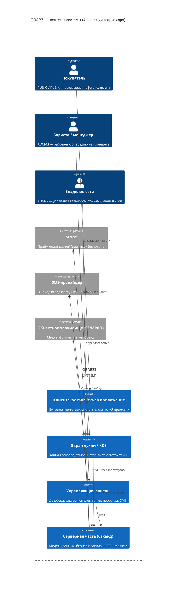
```mermaid
C4Context
    title GRABZI — контекст системы (4 проекции вокруг ядра)

    Person(cust, "Покупатель", "PUB-G / PUB-A — заказывает кофе с телефона")
    Person(barista, "Бариста / менеджер", "ADM-M — работает с очередью на планшете")
    Person(owner, "Владелец сети", "ADM-S — управляет каталогом, точками, аналитикой")

    System_Boundary(grabzi, "GRABZI") {
        System(webClient, "Клиентское mobile-web приложение", "Витрина, меню, заказ, оплата, статус, «Я приехал»")
        System(kds, "Экран кухни / KDS", "Канбан заказов, статусы, стоп-лист, остаток точки")
        System(adminUI, "Управляющая панель", "Дашборд, заказы, каталог, точки, персонал, CMS")
        System(backend, "Серверная часть (бэкенд)", "Модель данных, бизнес-правила, REST + realtime")
    }

    System_Ext(stripe, "Stripe", "Приём оплат картой (или mock без ключа)")
    System_Ext(sms, "SMS-провайдер", "OTP-код входа (заглушка, не выбран)")
    System_Ext(storage, "Объектное хранилище (S3/MinIO)", "Медиа: фото напитков, бренд")

    Rel(cust, webClient, "Заказывает и платит")
    Rel(barista, kds, "Готовит и выдаёт")
    Rel(owner, adminUI, "Управляет сетью")

    Rel(webClient, backend, "REST + realtime статусов")
    Rel(kds, backend, "REST + realtime очереди")
    Rel(adminUI, backend, "REST")

    Rel(backend, stripe, "Оплата / вебхук")
    Rel(backend, sms, "OTP (план)")
    Rel(backend, storage, "Медиа")
```

**Как проекции связаны (сквозные процессы — подробно см. Часть VII):**

| Сквозная нить | Откуда видна |
|---|---|
| Жизненный цикл заказа + realtime | клиент (статус) ↔ кухня (канбан) ↔ владелец (заказы) ↔ сервер |
| Дневной лимит и счётчик | клиент («осталось N») ↔ кухня (прогресс) ↔ владелец (корректировка) ↔ сервер |
| Стоп-лист напитков | клиент («Sold out») ↔ менеджер (стоп-лист) ↔ сервер |
| Статус точки | клиент (бейдж) ↔ кухня (хедер) ↔ владелец (пауза) ↔ сервер |
| Оплата (Stripe + mock + вебхук) | клиент (оплата) ↔ владелец (платежи) ↔ сервер |
| Купоны и рейтинг | клиент (оценка/купон) ↔ владелец (купоны) ↔ сервер |

> Технологический стек (Next.js / FastAPI / БД / хранилище) и контейнерная схема — см. Часть I.

---

## 0.8 Статусная модель заказа

> **Для заказчика.** У заказа есть две независимые «оси»: **стадия готовки** (новый → делается → готов → выдан) и **факт оплаты**. Отдельно от них — флаг **«Я приехал»**: покупатель может отметить, что он у окна, на любой стадии, и это не двигает готовку. Ниже — машина состояний стадии готовки.

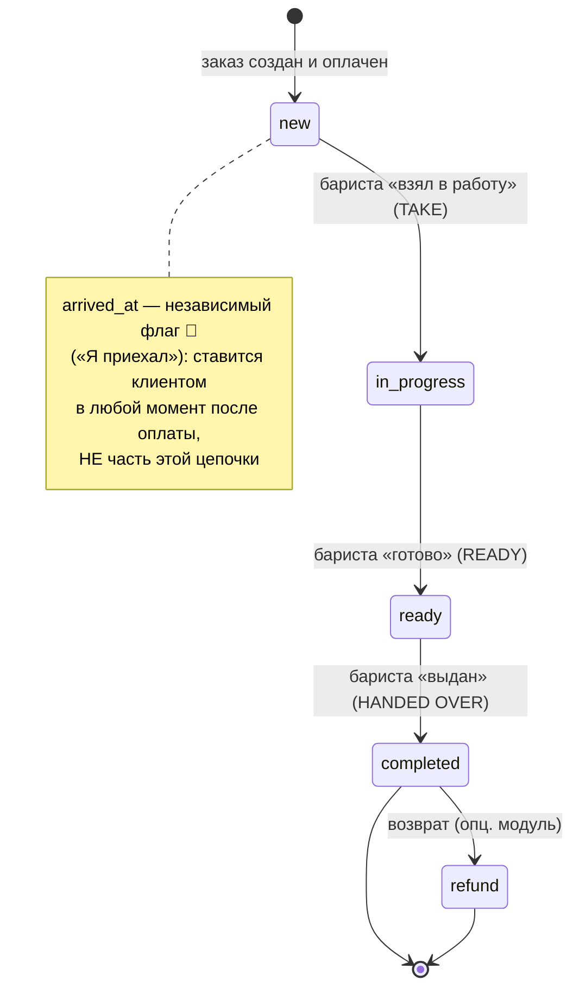
```mermaid
stateDiagram-v2
    [*] --> new: заказ создан и оплачен
    new --> in_progress: бариста «взял в работу» (TAKE)
    in_progress --> ready: бариста «готово» (READY)
    ready --> completed: бариста «выдан» (HANDED OVER)
    completed --> refund: возврат (опц. модуль)
    completed --> [*]
    refund --> [*]

    note right of new
        arrived_at — независимый флаг 🚗
        («Я приехал»): ставится клиентом
        в любой момент после оплаты,
        НЕ часть этой цепочки
    end note
```

**Расшифровка статусов «для людей» (`Order.status`):**

| Статус | Колонка кухни | Что значит по-человечески | Кто двигает |
|---|---|---|---|
| `new` | NEW | Оплаченный заказ упал в очередь — его ещё никто не взял. | система (после оплаты) |
| `in_progress` | MAKING | Бариста взял заказ в работу и готовит; за заказом закреплён менеджер. | ADM-M (кнопка TAKE) |
| `ready` | READY · HANDOUT | Кофе готов и ждёт выдачи у окна. | ADM-M (кнопка READY) |
| `completed` | DONE | Заказ выдан покупателю; остаётся в истории. | ADM-M (кнопка HANDED OVER) |
| `refund` | — | Заказ возвращён (опциональный модуль); деньги возвращены, день-счётчик откатывается, если возврат в тот же бизнес-день. | ADM-M (возврат) |

**Независимый флаг `arrived_at` (🚗 «Я приехал»):** покупатель нажимает «I'm here 🚗» — у бариста на карточке загорается «🚗 HERE». Это **отдельная отметка**, а не ступень цепочки: можно приехать, когда заказ ещё `new` или уже `ready`. Бариста выносит кофе, сверяя номер машины. (Хореография выдачи — см. Часть IV, ST1; процесс — см. Часть VII.)

**Параллельная ось оплаты (`payment_status`):** `pending → paid` (основной путь), `failed` / `refunded` (отклонения). Заказ становится виден кухне и списывает дневной лимит **только** после `paid`. Детали — см. Часть VII (платёж, дневной лимит).

---

## 0.9 Сценарии «день из жизни»

> **Для заказчика.** Два связных рассказа обычным языком — чтобы «прожить» рабочий день продукта. Коды экранов в скобках для навигации по ТЗ.

### Сценарий А — День покупателя

Утром по дороге на работу Лейла открывает GRABZI на телефоне. На витрине (H1) сразу видит крупное **«TODAY'S LIMIT»** — сколько порций ещё осталось на сегодня, и кнопку «ORDER NOW». Она выбирает ближайшую точку (L1): видит, что точка открыта, её часы и что свободно ещё много порций. На экране заказа (O1) Лейла кнопками «+/−» набирает два «Classic Ice V'60» и один «Cherry Bomb», тут же видит сумму **AED 92** и остаток на день. Вводит номер машины (по нему её узнают у окна) и телефон, к которому привяжется заказ, и жмёт «Proceed to Payment». Оплата проходит картой, и она попадает на экран статуса (ST1): шаги «Received · Making · Ready · Handed over» обновляются сами. Подъезжая, Лейла жмёт «I'm here 🚗». Когда статус становится «Ready», бариста выносит кофе к её машине, сверив номер. Лейла ставит 👍.

*Негативный поворот.* На следующий день Лейла заходит позже обычного. На экране заказа точка показывает **«Sold out for today»**: дневной лimit исчерпан, кнопка оплаты неактивна, и появляется понятное сообщение «приходите раньше — больше сегодня не готовим». Лейла понимает правило и приезжает завтра пораньше. *(≈210 слов)*

### Сценарий Б — Смена бариста / менеджера

Карим открывает смену: входит на планшете по email и паролю (ADM-M-01) и попадает на экран кухни (ADM-M-02). В липком хедере он видит имя своей точки, её статус «Open» и прогресс **«Sold 0 / Limit 150»**. С первым оплаченным заказом в колонке **NEW** появляется карточка с номером и таймером ⏱. Карим жмёт «TAKE ▶» — карточка уходит в **MAKING**, заказ закрепляется за ним. Готовит кофе, жмёт «READY ✓» — карточка в **READY · HANDOUT**. На одной из карточек загорается бейдж **«🚗 HERE»** — клиент уже у окна; Карим выносит стакан, сверяет номер машины и жмёт «HANDED OVER ✓» — карточка уходит в **DONE**. Ближе к полудню заканчивается сироп для «Cherry Bomb» — Карим в два тапа ставит напиток в **стоп-лист**, и у покупателей он сразу показывается «Sold out». Прогресс на хедере растёт: жёлтый при 80 %, красный при достижении лимита. К вечеру счётчик упирается в **150** — точка показывает «закрыто на сегодня», новые заказы не принимаются. Карим закрывает смену. *(≈205 слов)*

---

## 0.10 Таблица «Возможность → Выгода»

> **Для заказчика.** Обзорная таблица: что умеет продукт, что это даёт покупателю и владельцу, где это в ТЗ. Первые три колонки — без терминов.

| Возможность | Что это значит для покупателя | Что даёт владельцу сети | Где в продукте |
|---|---|---|---|
| Заказ на одном экране | Собрал кофе, ввёл номер машины и телефон, оплатил — без блужданий по корзине | Меньше шагов → больше доведённых до оплаты заказов, быстрее утренний поток | Часть IV (O1) |
| Выдача к машине по номеру (curbside) | Не выходишь и не стоишь в очереди — забираешь у окна | Быстрая выдача, не нужен зал ожидания | Часть IV (ST1), Часть VI |
| Дневной лимит «больше не делаем» | Видишь, сколько осталось; берёшь свежий кофе | Предсказуемый объём, свежесть, нет списаний, утренний пик | Часть VII (дневной лимит) |
| Статус в реальном времени | Видишь, когда кофе готов, и жмёшь «Я приехал» | Меньше звонков и недопонимания у окна | Часть IV (ST1), Часть VII |
| Экран кухни (KDS) | Кофе готовят по очереди, ничего не теряется | Прозрачная операционка, контроль скорости | Часть VI |
| Стоп-лист напитков | Не закажешь то, что кончилось — без разочарования у окна | Бариста в 2 тапа убирает недоступное, нет отказов после оплаты | Часть VI, Часть VII |
| Аналитика дашборда | — | Видно выручку, продажи и выработку лимита по точкам | Часть V |
| Купоны за оценку | За неудачный заказ получаешь компенсацию-скидку | Возврат лояльности недовольных, удержание клиента | Часть IV, Часть VII |
| Мультиточечность | Выбираешь удобную точку с её часами и остатком | Управление сетью точек с разными часами и лимитами | Часть V, Часть VII |
| Вход без пароля (по телефону) | Не заводишь пароль — все заказы привязаны к номеру | Ниже барьер входа → выше конверсия | Часть IV (OR1) |

---

> **Конец Части 0.** Архитектура, стек, NFR, безопасность (PDPL), доступность, единицы и пример чека с VAT — см. **Часть I**. Дизайн-система — см. **Часть II**. Модель данных — см. **Часть III**.


---

# Часть I. Архитектура и сквозные конвенции

> **Назначение части.** Здесь зафиксированы технологический фундамент GRABZI, правила входа,
> честный статус интеграций (что работает «по-настоящему», а что в режиме заглушки), а также
> сквозные требования, общие для всех экранов: нефункциональные требования (NFR), приватность
> (PDPL), доступность (a11y), локализация, единая таксономия ошибок и денежные правила (AED,
> VAT 5 %). Доменная модель — см. Часть III; дизайн-система — см. Часть II; сквозные процессы
> (оплата, лимит, статусы) — см. Часть VII; справочник API — см. Часть VIII; реестр кодов ошибок —
> см. Приложение C.

---

## I.1 Технологический стек

> **Для заказчика.** Продукт состоит из двух частей: «витрина», которую видит покупатель в браузере
> телефона, и «сервер» — мозг системы, где хранятся заказы, цены, точки и считается дневной лимит.
> Витрина быстрая и не требует установки приложения (это веб-страница). Сервер устроен так, чтобы
> запускаться и на простом «ноутбучном» хранилище данных для демонстрации, и на «промышленной» базе
> для реальной работы — без переписывания.

### Как это работает (простыми словами)

Покупатель открывает сайт в браузере телефона — это и есть всё «приложение», ничего скачивать не
нужно. Когда он собирает заказ или платит, браузер обращается к серверу, а сервер хранит данные,
проверяет правила (открыта ли точка, есть ли свободные порции на сегодня) и мгновенно сообщает кухне
о новом заказе. Кухня видит очередь на планшете и обновляется в реальном времени — без нажатия
«обновить».

### Технические детали (для разработки)

| Слой | Технология | Назначение | Канон-источник |
|---|---|---|---|
| Фронтенд | **Next.js 16 / React 19** (App Router, TypeScript) | клиентское mobile-web + экран кухни (KDS) | `grabzi-web/` |
| Состояние фронта | **Zustand** (persist в `localStorage`) | черновик заказа `grabzi-draft` | `grabzi-web/src/app/order/` |
| Бэкенд | **FastAPI** (Python), **Pydantic v2** (`pydantic-settings`) | REST API + WebSocket + вебхук Stripe | `backend/app/main.py`, `backend/app/core/config.py` |
| ORM | **SQLAlchemy** | доменная модель, транзакции, `FOR UPDATE` | `backend/app/models/**` |
| База данных | **SQLite** (dev, файл) → **PostgreSQL 16** (прод) | хранение данных | `config.py` (`database_url`), `docker-compose.yml` (`postgresql+psycopg`) |
| Кэш / шина | **Redis 7** (опционально) | pub/sub для realtime, хранение OTP | `config.py` (`redis_url`), `core/pubsub.py` |
| Realtime | **WebSocket** (asyncio, in-process) | пуш статусов заказа клиенту и кухне | `routers/ws.py`, `core/pubsub.py` |
| Хранилище медиа | **S3 / MinIO** | картинки каталога/CMS | `services/storage.py`, `routers/admin_media.py` |
| Миграции (прод) | **Alembic** | `alembic upgrade head` при старте контейнера | `docker-compose.yml` |
| Платежи | **Stripe Checkout** (hosted) + mock-режим | приём оплаты | `routers/payments.py` |

**Принцип «запускается без инфраструктуры».** По умолчанию (`config.py`) база — SQLite-файл
(`database_url = "sqlite:///./juicy.db"`; ⚠️ имя файла — наследие прежнего прототипа Juicy, в проде
переопределяется через `DATABASE_URL`), Redis отсутствует (`redis_url = None` → in-memory fallback
для pub/sub и OTP), Stripe и S3 не настроены (mock / URL-фолбэк). В проде всё переключается через
переменные окружения **без правок кода** (`docker-compose.yml`).

**Две формы запуска (канон — `docker-compose.yml`):**
- **dev без Docker** — SQLite + uvicorn + in-memory pubsub; быстрый старт, схема через `create_all`;
- **прод/полный стек (Docker)** — PostgreSQL + Redis + MinIO; схема через Alembic; команда контейнера
  `alembic upgrade head && uvicorn app.main:app --host 0.0.0.0 --port 8000`.

📝 *Версии Next.js 16 / React 19 — по описанию проекта; точные patch-версии сверять с
`grabzi-web/package.json` при сборке релиза.*

---

## I.2 Авторизация и токены

> **Для заказчика.** У продукта два разных входа. **Покупатель** не заводит пароль — он входит по
> номеру телефона (в будущем — с SMS-кодом), и все его заказы привязываются к этому номеру.
> **Сотрудник** (бариста-менеджер или администратор сети) входит по рабочей почте и паролю. Это
> разделение защищает данные сети: у сотрудника точки нет доступа к деньгам и каталогу всей сети.

### Как это работает (простыми словами)

Покупатель указывает телефон — система выдаёт ему «пропуск» (он хранится в браузере), по которому его
узнают при следующем заходе и показывают его заказы. Сейчас вход происходит без SMS-кода (см. статус
интеграций, §I.3) — это временная настройка, не дефект. Сотрудник входит по почте и паролю и получает
свой «пропуск» с указанием роли: бариста видит только свою точку, администратор — всю сеть. Пропуск
действует 30 дней; по истечении нужно войти заново.

### Технические детали (для разработки)

| Аспект | Клиент (PUB-G/PUB-A) | Персонал (ADM-M/ADM-S) | Канон |
|---|---|---|---|
| Метод входа | телефон + OTP (`/api/auth/request-code` → `/api/auth/verify`) | email + пароль (`/api/staff/login`) | `routers/auth.py`, `routers/staff.py` |
| Хранение токена (фронт) | `localStorage['grabzi_token']` | `localStorage['grabzi_staff_token']` | канон: backend/app/routers/auth.py |
| Тип токена | **JWT**, `kind="customer"` | **JWT**, `kind="staff"`, `role` в payload | `core/security.py` |
| Заголовок защищённых вызовов | `Authorization: Bearer <token>` | `Authorization: Bearer <token>` | `core/security.py` (`HTTPBearer`) |

**JWT (канон — `core/security.py` + `config.py`):**
- алгоритм **HS256** (`jwt_alg = "HS256"`); секрет `jwt_secret` (dev-дефолт `"dev-secret-change-me"` —
  ⚠️ обязательно переопределить в проде через `JWT_SECRET`);
- срок жизни **30 дней** (`jwt_ttl_hours = 24 * 30 = 720` ч);
- payload: `{sub, kind, role, exp}`; невалидный/просроченный токен → `401 AUTH_REQUIRED`.

**Хэш паролей персонала:** **pbkdf2_sha256** (`passlib`, `core/security.py`) — pure-python, без
нативных зависимостей; bcrypt сознательно не используется.

**Ролевые зависимости (FastAPI Depends, `core/security.py`):**
- `get_current_user` — клиент (`kind="customer"`), иначе `403 FORBIDDEN`;
- `get_current_staff` — персонал (`kind="staff"`); отключённый (`disabled=true`) → `401`;
- `require_super_admin` — только `role="super_admin"`;
- `require_manager_or_super` — `manager` или `super_admin`;
- `manager_scope_location(staff)` — менеджер с `location_id` ограничен своей точкой; super-admin или
  менеджер без точки → без ограничения (см. ролевой скоуп в Части V/VI).

**Сиды учёток (сиды backend/app/services/seed_grabzi.py):** `admin@grabzi.ae / grabzi-admin` (super_admin, `location_id=null`);
`barista@grabzi.ae / grabzi-barista` (manager, `location_id=1`).

⚠️ **Расхождение фронт/бэк по валидации телефона** (канон — бэк): бэкенд требует `^\+\d{9,15}$`
(`routers/auth.py`, `PhoneIn.phone`, ведущий `+` обязателен, 9–15 цифр); фронт использует более мягкое
`^\+?\d{7,15}$` (`grabzi-web/src/app/order/page.tsx:68`, `orders/page.tsx:32`). Привести к единому
правилу `^\+\d{9,15}$` — открытый вопрос (см. Часть IX).

---

## I.3 Статус интеграций / mock-режим

> **Для заказчика.** Некоторые внешние сервисы (приём денег, отправка SMS) в собранном прототипе
> работают в «режиме заглушки» — это **настройка, а не поломка**. Продукт целиком готов их
> использовать; чтобы включить их «по-настоящему», нужно подключить аккаунты провайдеров. Ниже
> честно показано, что работает реально, а что ждёт подключения — со «светофором».

### I.3.1 Светофор интеграций

| Интеграция | Статус | Что это значит | Канон |
|---|---|---|---|
| **WebSocket (realtime)** | 🟢 реальный | статусы заказа летят клиенту и кухне мгновенно (asyncio, in-process) | `routers/ws.py`, `core/pubsub.py` |
| **S3 / MinIO (медиа)** | 🟢 реальный | загрузка картинок работает; без `s3_bucket` — фолбэк на URL-строки | `services/storage.py`, `config.py` |
| **JWT-авторизация** | 🟢 реальная | пропуски подписываются и проверяются (HS256) | `core/security.py` |
| **Redis** | 🟡 опционально | при `redis_url=None` — in-memory fallback (pub/sub, OTP); для нескольких процессов нужен Redis | `config.py`, `core/pubsub.py` |
| **Stripe (оплата)** | 🔧 mock без ключа | без `STRIPE_SECRET_KEY` оплата подтверждается сразу, **деньги не списываются** | `routers/payments.py` |
| **SMS-OTP (вход)** | 🔧 заглушка | `auth_otp_enabled=false` → вход по телефону без кода; провайдер не выбран | `config.py`, `routers/auth.py` |

### I.3.2 Что значит режим заглушки для запуска (бизнес-перевод)

> Подробный сквозной разбор оплаты — см. Часть VII (процесс «Оплата»); входа — Часть VII (процесс
> «OTP»). Здесь — деловой перевод «что это значит для запуска».

**Stripe-mock (🔧)**

| Колонка | Содержание |
|---|---|
| **Что сейчас** | Оплата **имитируется**: заказ моментально помечается оплаченным, покупателя возвращает на страницу заказа (`/orders/{id}?paid=1`), но реальные деньги с карты **не списываются**. |
| **Что это значит для запуска** | Принимать **реальные деньги нельзя**. Для демонстраций, тестов и приёмки — пригодно: весь поток заказа и кухни работает «как настоящий». |
| **Что нужно от заказчика** | Аккаунт **Stripe (merchant)** + налоговый номер **TRN** (ОАЭ), ключи `STRIPE_SECRET_KEY` и `STRIPE_WEBHOOK_SECRET`. |
| **Усилия на подключение** | 📝 ориентир: настройка ключей и проверка вебхука — порядка 0.5–1 дня разработки + время на открытие/верификацию аккаунта Stripe на стороне заказчика (внешний срок). Код за флагом уже есть (`routers/payments.py`), переписывать не нужно. |

**OTP-заглушка (🔧)**

| Колонка | Содержание |
|---|---|
| **Что сейчас** | Вход **без SMS-кода**: `auth_otp_enabled=false`, фронт сразу вызывает подтверждение с пустым кодом и пускает по номеру телефона. SMS-провайдер не выбран. В dev-режиме «код» фиксированный (`otp_dev_code="1836"`) и вернулся бы в ответе API. |
| **Что это значит для запуска** | Принимать заказы можно (телефон = контакт для выдачи; покупатель мотивирован указать верный — заказ уже оплачен). Но **подлинность номера не проверяется** — для публичного запуска это риск (чужой номер, спам). |
| **Что нужно от заказчика** | Выбранный **SMS-провайдер** (например, региональный для ОАЭ) + учётные данные. Включение — флагом `AUTH_OTP_ENABLED=true` **без правок кода** (адаптер подключается в `services/sms.py`). |
| **Усилия на подключение** | 📝 ориентир: адаптер провайдера + включение проверки кода в `/verify` — порядка 1–2 дней разработки (логика верификации в `routers/auth.py` уже заложена за флагом). |

> **Готово к публичному приёму реальных денег, когда подключены:** Stripe merchant + TRN
> (`STRIPE_SECRET_KEY`, `STRIPE_WEBHOOK_SECRET`) **и** выбранный SMS-провайдер (`AUTH_OTP_ENABLED=true`).
> Тон: это **конфигурация, а не доработка продукта**. Связь со Scope — см. Часть 0 (§0.2) и допущения
> (§I.4); бизнес-правила — см. Часть IX (каталог BR).

---

## I.4 Допущения, зависимости и ограничения

> **Для заказчика.** Чтобы продукт заработал «вживую», часть условий обеспечивает заказчик (аккаунты,
> номера), часть зависит от внешних провайдеров, а часть — это осознанные ограничения текущей версии.
> Ниже три коротких списка с указанием, кто за что отвечает и что именно блокирует запуск.

### I.4.1 Допущения (что считаем истинным)

| ID | Допущение | Владелец | Что блокирует, если ложно |
|---|---|---|---|
| AS-01 | Заказчик предоставит аккаунт **Stripe (merchant)** и **TRN** для приёма реальных платежей | Заказчик | реальный приём денег |
| AS-02 | Заказчик выберет **SMS-провайдера** для OTP | Заказчик | проверка подлинности телефона |
| AS-03 | Сеть на старте — **одна точка** (`seed_grabzi`: GRABZI Drive-Through, Dubai); модель поддерживает множество | Заказчик | масштабирование (не блокирует MVP) |
| AS-04 | VAT для ОАЭ — **5 %**, модель «включён в цену» по умолчанию (см. §I.10) | Заказчик / бухгалтерия | корректность чека/отчётности |
| AS-05 | Часовой пояс точки — **`Asia/Dubai`**; «бизнес-день» считается в TZ точки | — | корректность дневного лимита |
| AS-06 | UI на старте — **английский** (EN-first); AR/RTL — V1.1 | Заказчик | выход на арабоязычную аудиторию |

### I.4.2 Внешние зависимости

| ID | Провайдер / сервис | Что блокирует | Статус |
|---|---|---|---|
| DEP-01 | **Stripe** (Checkout + webhook) | реальный приём оплаты | 🔧 mock без ключа |
| DEP-02 | **SMS-провайдер** (не выбран) | проверка телефона при входе | 🔧 заглушка |
| DEP-03 | **S3 / MinIO** | загрузка медиа каталога/CMS | 🟢 реальный (фолбэк на URL) |
| DEP-04 | **Redis** | realtime/OTP при нескольких процессах | 🟡 опционально (in-memory fallback) |
| DEP-05 | **PostgreSQL** (прод) | промышленное хранение | 🟢 (dev — SQLite) |

### I.4.3 Ограничения

| ID | Категория | Ограничение | Владелец |
|---|---|---|---|
| LIM-01 | Технические | один процесс бэкенда → realtime через in-memory pubsub; масштабирование на несколько процессов требует **Redis** | Разработка |
| LIM-02 | Технические | dev-схема создаётся через `create_all`; в проде — только через **Alembic** (`docker-compose.yml`) | Разработка |
| LIM-03 | Юридические / PDPL | хранятся PII (телефон, номер машины, имя, эмират) — нужны политика хранения и удаления (см. §I.6) | Заказчик / юр. |
| LIM-04 | Регуляторные | **VAT 5 %** и **TRN** (ОАЭ) — обязательны для фискального чека (см. §I.10) | Заказчик / бухгалтерия |
| LIM-05 | Лицензионные | шрифт **Grenadine MVB** — **лицензия на проверке** ⚠️; заложен фолбэк (Bricolage Grotesque → system-ui), см. Часть II | Заказчик |
| LIM-06 | Локализация | UI — **EN-only**; инфраструктура AR/RTL (`dir`, `pick_locale`) заложена, но не активирована (V1.1) | Заказчик |
| LIM-07 | Часовые пояса | вся бизнес-логика дня привязана к TZ точки `Asia/Dubai`; смешение TZ точек требует проверки переходов через полночь | Разработка |

> Полный реестр открытых вопросов с бизнес-колонками (почему важно / дефолт / блокирует ли запуск /
> кто решает) — см. Часть IX.

---

## I.5 Нефункциональные требования (NFR)

> **Для заказчика.** Это требования «как хорошо», а не «что делает» система: насколько быстро,
> насколько надёжно, на каких устройствах. Каждое сформулировано как **проверяемый порог** — его
> можно подтвердить замером, а не на словах.

| ID | Категория | Измеримый порог | Способ проверки |
|---|---|---|---|
| NFR-01 | Производительность (API) | p95 времени ответа ключевых GET-эндпоинтов (`/api/locations`, `/api/drinks`, `/api/orders/{id}`) ≤ **300 мс** при типичной нагрузке точки | нагрузочный замер (k6/Locust) на прод-подобной БД |
| NFR-02 | Производительность (оплата) | p95 `POST /api/payments/checkout-session` (включая `FOR UPDATE` на счётчике) ≤ **800 мс** | нагрузочный замер с конкурентными заказами |
| NFR-03 | Realtime | задержка WS-пуша смены статуса (кухня → клиент) ≤ **1 с** в 95 % случаев; fallback polling клиента **20 с**, кухни **10 с** | замер end-to-end (см. Часть VII) |
| NFR-04 | Производительность (фронт) | TTI экрана `/menu` на эмуляции **3G** ≤ **3 с** | Lighthouse mobile (throttling Fast 3G) |
| NFR-05 | Ёмкость | устойчивая обработка ≥ **20** одновременных оформлений заказа на точку без потери корректности лимита | стресс-тест гонки за последнюю порцию (есть тест в S9) |
| NFR-06 | Ёмкость | дневной лимит точки конфигурируем (сид `daily_drink_limit=150`); система корректна при любом значении и при `null` («без лимита») | модульные тесты лимита |
| NFR-07 | Доступность (uptime) | целевой uptime прод-сервиса ≥ **99.5 %**/мес; окно планового обслуживания — вне утреннего пика точки | мониторинг (uptime-чек) |
| NFR-08 | Надёжность (оплата) | вебхук оплаты **идемпотентен**: повторная доставка `checkout.session.completed` не двойно списывает лимит (`payment_status != "paid"` гард) | тест повторной доставки события |
| NFR-09 | Надёжность (RTO/RPO) | RPO ≤ **5 мин** (бэкап БД), RTO ≤ **1 ч** на восстановление прод-инстанса | регламент бэкапов + учебное восстановление |
| NFR-10 | Целостность лимита | продажа последней порции — ровно одному покупателю (пессимистическая блокировка `FOR UPDATE`); гонка не уводит счётчик за лимит и не ниже 0 | тест конкуренции (S9), см. Часть VII |
| NFR-11 | Безопасность | все защищённые вызовы — только с валидным `Bearer`-JWT; пароли персонала — pbkdf2_sha256; секреты — из ENV, не в коде | ревью + тесты авторизации |
| NFR-12 | Совместимость | актуальные мобильные браузеры (iOS Safari, Android Chrome) + desktop Chrome/Edge/Safari; мин. ширина экрана **320 px** | кросс-браузерная проверка |
| NFR-13 | Доступность (a11y) | соответствие **WCAG 2.2 AA** на ключевых экранах (контраст, tap-target, фокус) — см. §I.8 | аудит axe / ручная проверка |

> Сводка NFR и связь с тестами (S9) — см. Часть IX; трассировка история↔NFR — см. Приложение A.

---

## I.6 Безопасность и приватность (PDPL UAE)

> **Для заказчика.** Продукт собирает минимум личных данных, нужных только для выдачи заказа: номер
> телефона, номер машины, имя и эмират. По закону ОАЭ о персональных данных (PDPL) такие данные нужно
> хранить ограниченное время, защищать при передаче и хранении и уметь удалять по запросу. Ниже —
> опись данных и правила обращения с ними.

### Как это работает (простыми словами)

Когда покупатель оформляет заказ, он указывает телефон (чтобы узнавать его заказы и связаться) и номер
машины (чтобы узнать его у окна выдачи). Эти данные видит сотрудник точки только по заказам своей
точки; администратор сети — по всей сети. Данные передаются по защищённому каналу. В демонстрациях и
скриншотах используются только **выдуманные** телефон и номер машины — настоящие данные людей туда не
попадают.

### Технические детали (для разработки)

**PII-инвентарь (минимальный обязательный набор):**

| Поле | Класс | Где хранится | Правовое основание | Срок хранения (дефолт 📝) | Путь удаления |
|---|---|---|---|---|---|
| `phone` | прямой идентификатор | `User.phone`, `Order.phone` | исполнение заказа (контракт) | привязка к жизни аккаунта; заказы — см. ниже | удаление/анонимизация аккаунта |
| `car_plate` | косвенный идентификатор (выдача) | `User.car_plate`, `Order.car_plate` (UPPERCASE) | исполнение выдачи | срок хранения заказа | очистка поля при анонимизации заказа |
| `name` | имя | `User.name`, `Order.customer_name` | контакт при выдаче | жизнь аккаунта | удаление аккаунта |
| `emirate` | гео-атрибут | `User.emirate`, `Order.emirate` | контекст выдачи/аналитика | жизнь аккаунта/заказа | удаление аккаунта |

📝 **Решение с дефолтом (вынести в BR, Часть IX):**
- **Срок хранения заказов** — по умолчанию **24 месяца** (фискальная отчётность ОАЭ), затем
  анонимизация PII в заказе (телефон/номер машины/имя → обезличить, сумма/состав — оставить для
  аналитики). ❓ подтвердить с заказчиком.
- **`car_plate` как PII** — трактуем как косвенный идентификатор; хранение и удаление — по правилам
  заказа. ❓ подтвердить классификацию.

**Меры (требования):**
- **Транзит** — HTTPS/TLS на проде (обязательно); WS — `wss://`.
- **Покой** — секреты (`jwt_secret`, ключи Stripe/S3) только из ENV; БД-бэкапы — в защищённом
  хранилище.
- **Контроль доступа** — серверный ролевой скоуп: менеджер видит PII только по заказам **своей** точки
  (`FOREIGN_LOCATION → 403`, см. Часть VI); super-admin — по всей сети; клиент — только свои заказы.
- **Маскирование** — в логах и нефискальных выгрузках телефон/номер машины маскировать (например,
  `+9715****0000`, `DEMO ••01`); полный вид — только в защищённых админ-экранах по праву доступа.
  📝 централизованная маскировка PII в логах — задача реализации (в коде прототипа не зафиксирована).
- **Синтетические PII в демо** — обязательное правило: в сидах и скриншотах только выдуманные данные
  (`+971500000000`, `DEMO 0001`).

---

## I.7 Доступность (a11y, WCAG 2.2 AA)

> **Для заказчика.** Продуктом должны пользоваться все, включая людей со слабым зрением и тех, кто
> работает с клавиатуры. Целевой стандарт — международный **WCAG 2.2 уровень AA**. Это критерий
> приёмки каждого экрана, а не пожелание.

**Базовые требования a11y (строка в AC каждой истории — см. формат в Части IV/V/VI):**

| Требование | Порог | Где проверяется |
|---|---|---|
| Контраст основного текста | ≥ **4.5:1** | проверенные пары — см. Часть II (дизайн-система) |
| Контраст крупного текста / иконок-смысла | ≥ **3:1** | Часть II |
| Размер зоны нажатия (tap-target) | ≥ **44 × 44 px** | кнопки, степперы, нав-иконки |
| Видимый фокус | обязателен | поля ввода, кнопки, нав-ссылки |
| Клавиатурная навигация | полная (особенно desktop-админка ADM-S) | формы, таблицы, действия |
| Альтернатива для emoji/бренд-иконок | `alt`/`aria-label` (смысловые), `aria-hidden` (декоративные) | иконки навигации, бренд-ассеты, emoji напитков |

⚠️ **Зона риска по контрасту** — фирменная терракота (`--color-brand #c44429`) и лайм
(`--color-lime #b5bd62`) на кремовом фоне (`--color-cream-yellow #fdf6d8`). Дизайн-система (Часть II)
**обязана** опубликовать проверенные пары с фактическим коэффициентом контраста и затемнённые
варианты токенов для текста, где базовая пара не проходит AA.

---

## I.8 Локализация и адаптив

> **Для заказчика.** Бренд GRABZI — англоязычный, поэтому интерфейс на старте на английском.
> Арабская версия с письмом справа налево (RTL) запланирована на следующую версию — её фундамент уже
> заложен. Продукт корректно отображается на телефоне (основной сценарий), на планшете кухни и на
> большом экране администратора.

### Технические детали (для разработки)

**Локализация (i18n):**
- контентные поля хранятся как JSON `{"en":…, "ar":…, "ru":…}` (см. Часть III);
- выбор языка — `pick_locale` / `t()` (`services/i18n.py`); порядок fallback: запрошенная локаль →
  `default_locale` (в коде `config.py` `default_locale="ru"`; ⚠️ для рынка ОАЭ целевой UI — **EN-first**,
  расхождение default-локали с целевым EN зафиксировать как открытый вопрос, см. Часть IX);
- допустимые локали — `config.py` `locales=["ru","ar"]`; **UI-строки фронта — EN-only**, без хардкода
  бизнес-строк в нескольких местах;
- **RTL** (`dir="rtl"` для AR) — инфраструктура заложена, активируется в V1.1.

**Адаптив и брейкпоинты:**

| Профиль | Ширина | Особенности |
|---|---|---|
| Mobile (основной) | от **320 px** | mobile-frame, нижняя навигация (Menu/Location/Orders/Info), safe-area, OfflineBanner |
| **Брейкпоинт** | **768 px** | ниже — мобильная нав.; от 768 px — липкий хедер с логотипом и «Create order» (desktop) |
| Tablet (KDS) | планшет (цель для кухни) | экран `/admin/kitchen` — канбан 4 колонки; навигация скрыта на `/admin/*` |
| Desktop (ADM-S) | широкий | супер-админ (контур B; см. Часть V) |

Детали токенов, компонентов и mobile-frame — см. Часть II.

---

## I.9 Таксономия ошибок и краевых случаев

> **Для заказчика.** Система должна вести себя предсказуемо не только когда всё хорошо, но и когда
> что-то идёт не так: пропал интернет, точка закрылась, кончились порции, оплата не прошла. Ниже —
> карта таких ситуаций и понятная реакция продукта. Из этой таблицы вырастает список состояний
> экранов для скриншотов и критериев приёмки.

**Единый формат ошибок (канон — `core/errors.py`):** при бизнес-ошибке сервер возвращает HTTP-код и
тело с кодом ошибки. Для совместимости с фронтом `detail` — строка-код (если нет доп. данных) либо
объект `{"code": …, …meta}` (при наличии метаданных, например `remaining`, `next_open_at`)
(`http_error()`). Фронт сопоставляет ровно эти строки и показывает локализованный текст (ERR_COPY).
Полный реестр кодов — см. Приложение C; полный список с HTTP и смыслом — Приложение G.

**Таксономия краевых случаев:**

| Категория | Триггер | Поведение системы | Текст пользователю (смысл) | Восстановление |
|---|---|---|---|---|
| Сеть / offline | `navigator.onLine=false` | показ OfflineBanner, блок защищённых действий | «Вы офлайн» | автоповтор при возврате сети |
| Загрузка данных | ошибка/таймаут GET | карточка-ошибка с «Try again» | «Не удалось загрузить» | повтор по кнопке |
| Обрыв WebSocket | разрыв соединения | fallback на polling (клиент 20 с, кухня 10 с), heartbeat 25 с | прозрачно (без алерта) | авто-переподключение |
| Двойная отправка оплаты | повторный `checkout.session.completed` или повторный клик | идемпотентность по `payment_status != "paid"` (NFR-08) | без двойного списания | — |
| Гонка за лимит | две оплаты на последнюю порцию | под `FOR UPDATE` второй заказ возвращается (`refunded`), `409 LOCATION_LIMIT_REACHED` (+`remaining`) | «Закончилось на сегодня» | вернуть деньги/выбрать другое |
| Точка закрыта | вне рабочих часов | `409 LOCATION_CLOSED` (+`next_open_at`) | «Закрыто, откроется в …» | дождаться/др. точка |
| Точка на паузе | `accepting_orders=false` | `409 LOCATION_PAUSED` | «Приём заказов приостановлен» | позже |
| Стоп-лист | напиток снят на точке | `409 DRINK_UNAVAILABLE_AT_LOCATION` | «Sold out» (неактивен) | выбрать другой |
| Лимит/остаток | заказ > остатка | `409 STOCK_LESS_THAN_ORDER` (+`remaining`) / `LOCATION_SOLD_OUT` | «Осталось N» | уменьшить кол-во |
| Нет номера машины | пустой `car_plate` | `422 CAR_PLATE_REQUIRED` | «Укажите номер машины» | ввести |
| Пустой заказ | нет позиций | `422 CART_EMPTY` | кнопка оплаты неактивна | добавить напиток |
| OTP (при включении) | неверный/просроченный код | `401 OTP_INVALID` | «Неверный код» | запросить заново |
| Истечение сессии | просроченный/битый JWT | `401 AUTH_REQUIRED` | «Войдите снова» | повторный вход |
| Чужая точка (менеджер) | доступ к не своей точке | `403 FOREIGN_LOCATION` / `403 FORBIDDEN` | «Нет доступа» | — |
| Переход бизнес-дня | полночь в TZ точки | счётчик нового дня с нуля; возврат прошлого дня не декрементит сегодня | прозрачно | — |

> Реализация процессов (оплата, лимит, статусы, WS, OTP) — см. Часть VII; коды и HTTP — Приложение C.

---

## I.10 Единицы, деньги и налог (AED, VAT 5 %)

> **Для заказчика.** Все цены — в дирхамах ОАЭ (**AED**). В ОАЭ действует НДС (**VAT**) **5 %**.
> **Важно и требует вашего решения:** в собранном прототипе налоговая строка в чеке **не считается** —
> итог равен сумме напитков минус скидка по купону. Это значит, что VAT нужно либо **«зашить» в цену
> напитка** (модель «включён в цену» — по умолчанию для ОАЭ-розницы), либо **начислять сверху** —
> и это надо настроить до приёма реальных денег.

### Как это работает (простыми словами)

Покупатель видит цену каждого напитка и итог к оплате. Итог считается просто: сумма всех напитков
минус скидка по купону (если применён). Отдельной строки «VAT 5 %» в текущем расчёте нет. Для
розницы в ОАЭ стандартная модель — **цена уже включает VAT** (тогда видимый итог не меняется, налог
выделяется в фискальном чеке «обратным счётом»). Если же выбрать модель «налог сверху», итог к оплате
увеличится на 5 % — это другое поведение, и его нужно сознательно включить.

### Технические детали (для разработки)

**Канон расчёта (`services/order_flow.py`):**
```
order.subtotal = round(Σ(unit_price × quantity), 2)
order.coupon_discount = round(цена_выбранного_напитка, 2)   # купон списывает 1 напиток, иначе 0
order.total = round(order.subtotal − order.coupon_discount, 2)
```
⚠️ **VAT в коде НЕ начисляется** — отдельной налоговой строки нет, `total = subtotal − coupon`. Это
зафиксированное расхождение «код ↔ требование VAT 5 %» (см. реестр дефектов §IX.6 и Приложение H).

**Формат на фронте:** цена напитка — `DHS. X.XX`; итог — `AED {total}`.

#### Пример расчёта чека (реальные числа из сида `seed_grabzi`)

> Цены берутся из каталога-сида (`base_price`): Classic Ice V'60 = **28.00**, Cherry Bomb Ice V'60 =
> **36.00**, Choco Berry Ice V'60 = **34.00**, Melon Spark Ice V'60 = **37.00** AED.

Заказ: **2× Classic Ice V'60 @ 28.00** + **1× Cherry Bomb Ice V'60 @ 36.00**.

**Так, как считает код сейчас (без VAT-строки):**

| Позиция | Кол-во | Цена | Сумма |
|---|---|---|---|
| Classic Ice V'60 | 2 | 28.00 | 56.00 |
| Cherry Bomb Ice V'60 | 1 | 36.00 | 36.00 |
| **Подытог (subtotal)** | | | **92.00 AED** |
| Скидка по купону | | | 0.00 |
| **Итого к оплате (total)** | | | **92.00 AED** |

(Это совпадает с состоянием скриншота `order--loaded`: «2× Classic, 1× Cherry, AED 92».)

**Модель A — «VAT включён в цену» (рекомендуемый дефолт для ОАЭ-розницы) ⚠️ требует настройки:**
итог к оплате **не меняется** (92.00 AED), но в фискальном чеке VAT выделяется обратным счётом:
```
VAT (5 %, включён) = total − total / 1.05 = 92.00 − 87.62 = 4.38 AED
Нетто (без VAT)    = 87.62 AED
К оплате           = 92.00 AED
```

**Модель B — «VAT начисляется сверху» (альтернатива) ⚠️:**
итог к оплате **увеличивается**:
```
Подытог (нетто) = 92.00 AED
VAT 5 %         = 4.60 AED
К оплате        = 96.60 AED
```

> ⚠️ **Решение заказчика (вынести в BR, Часть IX):** выбрать модель VAT (по умолчанию — **A,
> «включён в цену»**), указать **TRN** для фискального чека и при необходимости включить отдельную
> налоговую строку. До этого приём **реальных** денег невозможен (см. §I.3, Stripe-mock). Макет чека
> повторяется в Части IV (экран O1) и в процессе оплаты (Часть VII).
>
> 📝 Дополнительные открытые вопросы по деньгам (вынести в Часть IX): **минимальная сумма заказа** (в
> коде не задана), **номинал и срок купона** за 👎 (в коде жёстко не зафиксированы).

**Прочие единицы и форматы:**
- **Телефон** — `+971…`; канон-валидация бэка `^\+\d{9,15}$` (⚠️ фронт мягче, см. §I.2).
- **Номер машины** (`car_plate`) — обязателен для выдачи, приводится к **UPPERCASE**; PII (§I.6).
- **Эмират** (`emirate`) — поле заказа/профиля.
- **Время** — TZ каждой точки (`Asia/Dubai`); «бизнес-день» — в TZ точки (дневной лимит, см. Часть VII).
- **Идентификаторы** (поля, enum, коды ошибок, маршруты) — латиницей, как в коде.

---

## I.11 Конфигурация и переменные окружения (ENV)

> **Для заказчика.** Переключение между «демо без настроек» и «полноценным проливом» делается
> переменными окружения — без переписывания кода. Ниже — что и чем включается.

**Канон — `backend/app/core/config.py` + `docker-compose.yml`.**

| ENV | Назначение | Dev-дефолт (код) | Прод (Docker) |
|---|---|---|---|
| `DATABASE_URL` | подключение к БД | `sqlite:///./juicy.db` ⚠️ | `postgresql+psycopg://…@db:5432/grabzi` |
| `REDIS_URL` | pub/sub, OTP | `None` (in-memory) | `redis://redis:6379/0` |
| `JWT_SECRET` | подпись JWT | `dev-secret-change-me` ⚠️ переопределить | задаётся секретом |
| `JWT_ALG` / `JWT_TTL_HOURS` | алгоритм/срок токена | `HS256` / `720` (30 дней) | те же |
| `STRIPE_SECRET_KEY` | реальный Stripe | `None` → mock | ключ merchant |
| `STRIPE_WEBHOOK_SECRET` | проверка подписи вебхука | `None` (принимает тестовые) | секрет вебхука |
| `AUTH_OTP_ENABLED` | включить проверку SMS-кода | `false` (вход без кода) | `true` при наличии провайдера |
| `OTP_DEV_MODE` / `OTP_DEV_CODE` / `OTP_TTL_SECONDS` | dev-OTP | `true` / `1836` / `300` | выключить в проде |
| `DEFAULT_LOCALE` / `LOCALES` | локали | `ru` / `["ru","ar"]` ⚠️ (целевой UI — EN) | по решению |
| `S3_ENDPOINT_URL` / `S3_PUBLIC_URL` | запись/отдача медиа | `None` (аплоад выкл., URL-фолбэк) | `http://minio:9000` / `http://localhost:9000` |
| `S3_ACCESS_KEY` / `S3_SECRET_KEY` / `S3_BUCKET` / `S3_REGION` | доступ к хранилищу | `None` / `us-east-1` | MinIO-креды / `grabzi-media` |
| `CORS_ORIGINS` | разрешённые origin (CSV или `*`) | `*` | `http://localhost:3000` (пример) |

**Инфраструктура (`docker-compose.yml`):** сервисы `db` (postgres:16-alpine, healthcheck `pg_isready`),
`redis` (redis:7-alpine), `minio` (+`createbuckets` — one-shot создание bucket `grabzi-media` с
public-read), `backend` (build `./backend`, миграции Alembic перед стартом, порт 8000). Запуск медиа:
запись изнутри Docker по `minio:9000`, ссылки клиенту — по `localhost:9000`.

**Заголовки запроса:** защищённые вызовы — `Authorization: Bearer <token>`; контент — `Content-Type:
application/json`. CORS — настраивается через `CORS_ORIGINS` (`main.py`: `*` или CSV-список).

---

### Метки части

✅ реально работает: WebSocket, S3/MinIO, JWT, расчёт заказа · 🔧 mock/заглушка: Stripe (без ключа),
OTP (вход без кода) · 🟡 опционально: Redis · ⚠️ расхождения: VAT не начисляется в коде; телефон-regex
фронт↔бэк; `default_locale=ru` vs целевой EN-first; dev-секрет/имя SQLite-файла (наследие Juicy) ·
❓ открытые вопросы (см. Часть IX): модель VAT, минимальная сумма заказа, номинал/срок купона, срок
хранения заказов, лицензия Grenadine, SMS-провайдер, Stripe merchant/TRN.


---

# Часть II. ДИЗАЙН-СИСТЕМА (binding)

> **Статус:** обязательная часть ТЗ. Дизайн-система — это контракт внешнего вида: каждая
> история (Часть IV–VI) ссылается на её токены и компоненты, а критерий приёмки любого
> экрана обязан включать пункт «визуально соответствует дизайн-системе + контраст ≥ AA».
> Канон значений — `grabzi-web/src/app/globals.css` и `grabzi-web/src/app/layout.tsx`;
> эталон композиции — `reference_design/` (живой grabzi.ae). Все числа в этой части
> сверены с кодом на момент сборки.

---

## II.0 Для заказчика — «фирменный стиль grabzi.ae»

GRABZI узнаётся с первого взгляда — это тёплый, «ремесленный», немного игривый кофейный
бренд, а не безликий маркетплейс. Язык внешнего вида держится на пяти приёмах:

- **Тёплый терракотовый** фирменный цвет (цвет обожжённой глины) — им написаны заголовки,
  цена и главные кнопки «заказать».
- **Рукотворный курсивный шрифт** Grenadine — все крупные надписи идут жирным наклонным
  начертанием, как будто их написали от руки кистью. Это главный носитель «характера» бренда.
- **Кремово-жёлтый фон** страниц и чуть более светлые «бумажные» карточки — ощущение
  тёплой бумаги, а не белого экрана.
- **Оливково-лаймовый акцент** для блока «остаток на сегодня» (TODAY'S LIMIT) и
  иллюстраций — он выделяет ключевую механику «приходи раньше, больше не делаем».
- **Скруглённые карточки и кнопки-пилюли** плюс ряд фирменных иконок (лёд, чашка,
  воронка V60, рука) — мягкая, дружелюбная геометрия.

Любой экран — клиентский, кухонный или админский — обязан говорить на этом языке. Это
не пожелание, а критерий приёмки: заказчик подписывает каждый экран по скриншоту, сверяя
его с эталоном `reference_design/`.

**Что заказчик получает в этой части:** палитру фирменных цветов с точными кодами,
шрифт и размеры, набор готовых «кирпичиков» (кнопка, карточка, поле ввода, бейдж
наличия, блок лимита), правила поведения на телефоне и на десктопе, а также честную
проверку читаемости (контраст) — где текст читается уверенно, а где цвет можно
использовать только крупно или в декоре.

---

## II.1 Цветовые токены

Палитра задана CSS-переменными в `:root` (канон — `globals.css`). HEX-значения сверены
с кодом дословно; «Назначение» — как токен используется в прототипе.

| Токен | HEX | Назначение |
|---|---|---|
| `--color-brand` | `#c44429` | терракота — фирменный цвет: главные CTA, заголовки, цена, нав-ссылки |
| `--color-brand-hover` | `#a8381f` | наведение на главную кнопку (только desktop) |
| `--color-brand-press` | `#780406` | нажатие кнопки · активная нав-ссылка · цена в меню |
| `--color-heading` | `#a42325` | альтернативный тон заголовка (тёмно-красный) |
| `--color-cream` | `#e8d5c7` | кремовая подложка под изображениями/иллюстрациями |
| `--color-cream-yellow` | `#fdf6d8` | фон страниц · фон полей ввода |
| `--color-paper` | `#fffdf6` | «бумажный» фон карточек (`.card`) |
| `--color-teal` | `#29c4b4` | кольцо фокуса (`:focus-visible`) · «мы вас видим» |
| `--color-teal-soft` | `#98c3c9` | декоративные разделители (`.divider`) |
| `--color-lime` | `#b5bd62` | акцент «TODAY'S LIMIT», иллюстрации (см. ⚠️ по контрасту в II.7) |
| `--color-ink` | `#2a1d14` | основной текст |
| `--color-muted` | `#8a7866` | вторичный/служебный текст |
| `--color-border` | `#ead9c4` | границы карточек, полей, хедера/нав-панели |
| `--color-paper` | `#fffdf6` | фон карточек (повтор для удобства) |
| `--color-danger` | `#dc2626` | ошибки |
| `--color-success` | `#16a34a` | успех |
| `--color-instock` | `#3ed660` | бейдж «в наличии / open» |
| `--color-lowstock` | `#ee9441` | бейдж «мало / low» |
| `--color-outofstock` | `#c8c8c8` | бейдж «нет / closed / paused» · фон disabled-кнопок · оффлайн-баннер |

**Технические детали (для разработки).** Токены объявлены дважды: «сырые» значения — в
`:root`, и проброс в Tailwind v4 — через `@theme inline` (поэтому доступны утилиты вида
`bg-brand`, `text-lime` и т. п.). Не все `:root`-токены проброшены в `@theme`: например
`--color-brand-hover`, `--color-brand-press`, `--color-paper`, `--color-border`,
`--color-danger`, `--color-success`, `--color-teal-soft` используются через
`var(--…)` в инлайн-стилях, а не как Tailwind-классы. При добавлении нового цвета —
добавлять в оба места. Системный цвет темы браузера (`themeColor`) задан в
`layout.tsx` как `#c44429` (терракота) — им красится строка состояния мобильного браузера.

---

## II.2 Типографика

**Шрифты.** Фирменный дисплейный шрифт — **Grenadine MVB** (self-hosted WOFF2, подключён
через `@font-face` в `globals.css`), в двух начертаниях:

| Файл (в `/public/fonts/`) | font-weight | font-style | Размер файла |
|---|---|---|---|
| `Grenadine-Black.woff2` | 900 | normal | ~16 КБ |
| `Grenadine-ExtraBoldItalic.woff2` | 800 | italic | ~16 КБ |

`font-display: swap` — текст показывается фолбэком, пока грузится бренд-шрифт (без
«мигания пустотой»).

**Семейства (стек шрифтов).**

- **Дисплейное** (`--font-display`): `"Grenadine MVB", "Bricolage Grotesque", system-ui,
  sans-serif`. Применяется ко всем `h1/h2/h3`, классу `.display` и брендовым подписям.
  В коде фактически используется начертание **800 italic** (ExtraBoldItalic) — это и есть
  «фирменный приём»: **жирный курсив терракотой**. Начертание 900 (Black) заявлено в
  `@font-face`, но в текущих экранах напрямую не вызывается (задел).
- **Текстовое** (`--font-sans`): `system-ui, -apple-system, "Segoe UI", sans-serif` —
  основной текст, лейблы, служебные подписи. Бренд-шрифт для длинного текста не
  применяется (читаемость).

> ⚠️ **Лицензия Grenadine MVB — на проверке** (см. ограничения, Часть I). Фолбэк
> (`Bricolage Grotesque` → `system-ui`) заложен в стек, поэтому при отсутствии лицензии
> экран остаётся рабочим, но теряет «рукописный» характер. Решение по лицензии — открытый
> вопрос (см. Часть IX).

**Размеры (px) — сверены с кодом экранов.** Размеры заданы инлайн на конкретных экранах
(не как глобальная шкала), поэтому таблица — фактический реестр, а не «идеальная» сетка:

| Где | Стиль | font-size |
|---|---|---|
| H1 на `/menu` («Menu») | `.display`, 800 italic | **52 px** |
| Большой emoji-визуал товара в меню | декоративный | **92 px** |
| Заголовок `ICE V'60` на `/order` | `.display` | **38 px** |
| `.limit-value` (число остатка) | `.limit-value` (CSS) | **30 px**; на Home переопределён инлайн на **38 px** |
| `.limit-title` («TODAY'S LIMIT») | `.limit-title` (CSS) | **26 px**, letter-spacing `.04em` |
| Имя товара в меню (uppercase) | `.display` | **26 px** |
| Заголовок секции на Home | `.display` | **24 px** |
| Цена в меню | `.display`, `--color-brand-press` | **18 px** |
| Кнопка `.btn-primary` / `.btn-block` | 800 italic / 700 | **17 px** |
| `.field-label` | 800 italic, `--color-brand` | **14 px**, letter-spacing `.02em` |
| `.nav-link` (desktop) | 800 italic | **15 px** |
| Подпись мобильной нав-иконки | text | **11 px** (иконка-emoji — 20 px) |
| Служебные/мелкие подписи | text | **13–14 px** |

> Числа выше — реестр на момент сборки; в критериях приёмки экранов **не замораживать**
> конкретные px, а ссылаться на токен/класс и роль («дисплейный заголовок», «лейбл
> поля»). Точные значения смотреть в коде экрана.

---

## II.3 Радиусы, отступы, tap-target

**Радиусы (токены).**

| Токен / значение | Где |
|---|---|
| `--radius-card: 22px` | карточки `.card`, `.limit-card` |
| `--radius-pill: 9999px` | кнопки-пилюли `.btn-primary`, бейджи `.badge` |
| `14px` | `.btn-block`, скелетон (`.skeleton`) |
| `12px` | `.field-input` (поля ввода) |

**Отступы.** Базовый внутренний отступ контентной «обёртки» страницы — **20 px**
(`padding: 20`, см. `wrap` на `/order` и др.); карточка `.card` — `padding: 16px`;
`.limit-card` — `padding: 18px`; `.field-input` — `padding: 14px`. **Safe-area** —
через `env(safe-area-inset-bottom)`: нижняя мобильная навигация добавляет
`calc(10px + env(safe-area-inset-bottom))` снизу, чтобы кнопки не попадали под «домашнюю
полоску» iPhone. Класс `.has-bottom-nav` резервирует **80 px** снизу под нижнюю
навигацию на мобайле (на ≥768px резерв снимается).

**Tap-target (a11y).** Целевой минимум интерактивных элементов — **≥ 44×44 px**
(WCAG 2.2). Фактически: `.btn-primary` — `min-block-size: 52px`; кнопка «Create order»
в хедере — `min-height: 40px` (⚠️ ниже целевого 44 — отметить как риск a11y, поднять до
≥44). Нижняя нав-ссылка набирает высоту за счёт двух строк (иконка 20 px + подпись
11 px + `paddingBlock: 10px`) — близко к минимуму, проверить по факту на устройстве.
Степперы «−/+» и компактные элементы каталога — проверять индивидуально (≥44 px —
требование AC).

---

## II.4 Компоненты

Все классы определены в `globals.css`. Для каждого — назначение и ключевые свойства
(сверено с кодом).

| Класс / компонент | Что это | Ключевые свойства (факт) |
|---|---|---|
| `.btn-primary` | главная кнопка-пилюля (CTA) | фон `--color-brand`, текст `#fff`, радиус pill, дисплейный 800 italic 17px, `min-block-size: 52px`; hover → `--color-brand-hover`, active → `--color-brand-press`, disabled → `--color-outofstock` |
| `.btn-block` | широкая кнопка на всю ширину (оплата, отправка) | `width:100%`, фон `--color-brand`, радиус 14px, 17px/700; disabled → `--color-outofstock` |
| `.card` | базовая карточка | фон `--color-paper`, border `1px --color-border`, радиус 22px, `padding:16px` |
| `.badge` | бейдж-пилюля статуса/наличия | inline-flex, радиус pill, 13px/700, белый текст; модификаторы: `.badge--open` (instock), `.badge--low` (lowstock), `.badge--out/--closed/--paused` (outofstock, текст `#333`) |
| `.limit-card` | блок «TODAY'S LIMIT» | border `--color-border`, радиус 22px, `padding:18px`, центрирован, прозрачный фон |
| `.limit-title` / `.limit-value` | заголовок и число остатка | дисплейный 800 italic, цвет `--color-lime` (см. ⚠️ контраст II.7); 26px / 30px |
| `.field-label` | подпись поля формы | дисплейный 800 italic, `--color-brand`, 14px |
| `.field-input` | поле ввода | `width:100%`, `padding:14px`, радиус 12px, фон `--color-cream-yellow`, border `--color-border` |
| `.nav-link` | ссылка навигации | дисплейный 800 italic, `--color-brand`, 15px; активная (`data-active="true"`) → `--color-brand-press` |
| `.skeleton` | плейсхолдер загрузки | фон `#efe3cf`, радиус 12px, анимация `pulse` (opacity 1→.55, 1.2s, бесконечно) |
| `.divider` | текстовый декоративный разделитель | цвет `--color-teal-soft`, letter-spacing 6px, opacity .8 |
| `BrandDivider` (React) | ряд из 14 брендовых иконок | `/brand/ice·hand·v60·cup·ice-lime.png`, иконки 26×26, gap 18, opacity .85, `aria-hidden` |
| `.footer` | подвал | центр, `--color-muted`, 12px |

**Технические детали.** `BrandDivider` и `OfflineBanner` — React-компоненты
(`src/components/`), остальное — CSS-классы. `:focus-visible` глобально рисует кольцо
`2px solid --color-teal` с `outline-offset: 2px` — единый видимый фокус для клавиатурной
навигации (a11y). Состояния кнопок (`:hover`/`:active`/`:disabled`) реализованы только
у `.btn-primary` и `.btn-block`.

---

## II.5 Адаптив и оболочка приложения

**Принцип mobile-frame.** Базовый таргет — телефон (viewport 390×844, см. карту
скриншотов в Части I / Приложении D). Контент занимает 100% ширины и центрируется
обёрткой с ограничением по `max-width`. Фактические ограничители по экранам:

| Экран | max-width обёртки/секции |
|---|---|
| Home (`/`) | секции 460 px · логотип 360 px · BrandDivider 560 px · хвост 720 px |
| Menu (`/menu`) | 560 px |
| Locations (`/locations`) | 600 px |
| Order (`/order`) | 640 px (модалка 320 px) |
| Orders (`/orders`) | 560 px |
| Order status (`/orders/[id]`) | 520 px |
| Info (`/info`) | 640 px |
| Product (`/product/[slug]`) | 560 px |

> Единой переменной `max-width` нет — значения заданы поэкранно (диапазон ~460–720 px).
> Это допустимо, но для согласованности — кандидат на токенизацию (примечание дизайна).

**Брейкпоинт.** Единственный медиа-запрос — `@media (min-width: 768px)`. Ниже 768px —
мобильная раскладка, на 768px и выше — десктоп. Переключение реализовано классами
`.mobile-only` (flex < 768) / `.desktop-only` (flex ≥ 768).

**Навигация (компонент `Nav`).** Адаптивная, скрывается на `/admin/*` (у админки своя
оболочка):

- **Мобайл (< 768px) — нижняя навигация** (`position: fixed`, низ экрана, `z-index 20`):
  четыре пункта с emoji-иконками и подписями — **🧊 Menu** (`/menu`), **📍 Location**
  (`/locations`), **🧾 Orders** (`/orders`), **ℹ️ Info** (`/info`). Активный пункт
  подсвечивается `--color-brand-press` (через `data-active`). Учитывает safe-area
  (см. II.3).
- **Десктоп (≥ 768px) — липкий хедер** (`position: sticky`, верх, `z-index 20`, фон
  `#fff`, нижняя граница `--color-border`): слева логотип `/brand/logo.png` (высота
  40px, ссылка на `/`), справа — те же четыре `.nav-link` + кнопка `.btn-primary`
  «Create order» (ведёт на `/locations`).

**OfflineBanner** (компонент): фиксированная полоса вверху (`z-index 100`, фон
`--color-outofstock`, текст `#333`, 14px/600) с надписью «You're offline. We'll reload
when you're back.» Показывается автоматически при потере сети
(`navigator.onLine === false` / событие `offline`) и скрывается при возврате (событие
`online`). Это источник состояния `*--offline` для скриншотов (Часть I, Приложение D).

**Состояния экранов.** Дизайн-система предусматривает для экранов с загрузкой данных
набор состояний: **скелетон** (`.skeleton`, есть на menu/locations/order/orders/
orders[id]/product) → **данные** → **пусто** → **ошибка с «Try again»** (реализовано на
`/locations`; на остальных экранах ошибочное состояние — требование к доработке, отметить
в AC) → **offline**. Каждое значимое состояние снимается отдельным скриншотом (Часть I).

**Локализация/направление.** `layout.tsx` фиксирует `<html lang="en" dir="ltr">` —
UI сейчас EN-only, LTR. Инфраструктура AR/RTL заложена (логические CSS-свойства
`inset*`, `padding-block/inline`, `border-block/inline` использованы повсеместно вместо
top/left), переключение `dir` — задел V1.1. Полные брейкпоинты/ширины — см. Часть I
(локализация и адаптив).

---

## II.6 Бренд-ассеты

**Шрифты — `grabzi-web/public/fonts/`:**

- `Grenadine-Black.woff2` (900)
- `Grenadine-ExtraBoldItalic.woff2` (800 italic)

**Иконки и лого — `grabzi-web/public/brand/`** (PNG, line-art в фирменном стиле):

| Файл | Назначение |
|---|---|
| `logo.png` | логотип GRABZI (хедер desktop · витрина Home) |
| `tagline.png` | подпись «Come early, we don't make more!!» (Home) |
| `ice.png` | иконка «лёд» (BrandDivider) |
| `ice-lime.png` | иконка «лёд» (лаймовый вариант, BrandDivider) |
| `hand.png` | иконка «рука» (BrandDivider · декор Home) |
| `v60.png` | иконка «воронка V60» (BrandDivider) |
| `cup.png` | иконка «чашка» (BrandDivider) |

Эталон композиции (как иконки/лого/лимит собираются вместе) — `reference_design/home.png`
(снимок живого grabzi.ae). На него ссылаются критерии приёмки уровня «для заказчика»:
«узнаваемо в стиле grabzi.ae».

> **a11y бренд-иконок.** Декоративные иконки в `BrandDivider` помечены `aria-hidden` и
> `alt=""` — корректно (не озвучиваются скринридером). Логотип — `alt="GRABZI"`,
> `tagline.png` — `alt` с текстом слогана (доступно). Правило: смысловые изображения —
> с осмысленным `alt`; чисто декоративные — `aria-hidden`/пустой `alt`.

---

## II.7 Контраст и доступность (a11y)

**Цель — WCAG 2.2 AA:** обычный текст ≥ 4.5:1, крупный текст (≥ 24px либо ≥ 18.66px
жирный) и нетекстовые элементы UI ≥ 3:1. Ниже — **проверенные пары** (коэффициент
посчитан по формуле относительной яркости WCAG для фактических HEX из `globals.css`).
Фон страниц — кремово-жёлтый `--color-cream-yellow #fdf6d8`; фон карточек — «бумажный»
`--color-paper #fffdf6`.

**Текст на фоне страницы/карточки:**

| Пара (текст на фоне) | Контраст | Обычный (≥4.5) | Крупный/UI (≥3) | Вердикт |
|---|---:|:--:|:--:|---|
| `ink #2a1d14` на cream-yellow | **15.07:1** | ✅ | ✅ | основной текст — отлично |
| `ink #2a1d14` на paper | **16.07:1** | ✅ | ✅ | текст в карточках — отлично |
| `brand-press #780406` на cream-yellow | **10.64:1** | ✅ | ✅ | цена/активная нав — отлично |
| `heading #a42325` на cream-yellow | **6.80:1** | ✅ | ✅ | заголовки — ок |
| `brand #c44429` на cream-yellow | **4.60:1** | ✅ (впритык) | ✅ | заголовки/CTA-текст — проходит, но запас мал |
| `brand #c44429` на paper | **4.91:1** | ✅ | ✅ | на карточках — ок |
| `muted #8a7866` на cream-yellow | **3.90:1** | ❌ | ✅ | ⚠️ вторичный текст — только крупно; для мелких подписей затемнить |
| `muted #8a7866` на paper | **4.16:1** | ❌ (впритык) | ✅ | ⚠️ почти проходит; для тела текста затемнить токен |
| `lime #b5bd62` на cream-yellow | **1.86:1** | ❌ | ❌ | 🔴 НЕ ДЛЯ ТЕКСТА (см. ниже) |
| `lime #b5bd62` на paper | **1.98:1** | ❌ | ❌ | 🔴 НЕ ДЛЯ ТЕКСТА |
| `danger #dc2626` на cream-yellow | **4.45:1** | ❌ (впритык) | ✅ | почти AA; для мелкого текста ошибки затемнить |
| `success #16a34a` на cream-yellow | **3.04:1** | ❌ | ✅ | только крупно; мелкий «успех» затемнить |
| `teal-soft #98c3c9` на cream-yellow | **1.76:1** | ❌ | ❌ | только декор (`.divider`) — не несёт смысла, допустимо |

**Текст на цветных плашках/кнопках:**

| Пара | Контраст | Вердикт |
|---|---:|---|
| `#fff` на `brand #c44429` (CTA) | **4.99:1** | ✅ обычный текст проходит |
| `#fff` на `brand-hover #a8381f` | **6.46:1** | ✅ |
| `#fff` на `brand-press #780406` | **11.55:1** | ✅ |
| `#333` на `outofstock #c8c8c8` (badge closed/paused, disabled, offline) | **7.55:1** | ✅ |
| `#fff` на `instock #3ed660` (badge open) | **1.91:1** | 🔴 белый текст на зелёном НЕ читается |
| `#fff` на `lowstock #ee9441` (badge low) | **2.35:1** | 🔴 белый текст на оранжевом НЕ читается |

**Кольцо фокуса:** `teal #29c4b4` на cream-yellow = **2.01:1** — для индикатора фокуса
WCAG требует ≥ 3:1 относительно соседних цветов → ⚠️ риск; усилить (темнее/толще обводка)
либо добавить второй контур.

### Рисковые места (фиксируется как требование к доработке a11y — Часть IX)

1. 🔴 **Лайм `--color-lime` как текст** (`.limit-title`, `.limit-value`) — контраст
   1.86–1.98:1, проваливает даже AA-large. «TODAY'S LIMIT» и число остатка — **смысловой**
   текст, поэтому: либо использовать лайм только как акцентную плашку/обводку и писать
   число тёмным (`--color-ink`/`--color-brand-press`), либо ввести **затемнённый
   текстовый вариант лайма** (ориентир: тон с яркостью, дающей ≥ 4.5:1 на кремовом —
   уйти в оливково-коричневую зону). До исправления пометить как известный дефект a11y.
2. 🔴 **Бейджи наличия с белым текстом** на `instock`/`lowstock` (1.91 / 2.35:1) — белый
   текст нечитаем. Решение: тёмный текст (`#333`/`--color-ink`) на этих плашках, как уже
   сделано у `outofstock`. (Зелёный/оранжевый цвет можно оставить как сигнал, но текст —
   тёмный; плюс не полагаться только на цвет — дублировать словом «Open/Low/Sold out».)
3. ⚠️ **Вторичный текст `--color-muted`** (3.90–4.16:1) — для мелких подписей не дотягивает
   до 4.5:1. Затемнить токен для текстового применения.
4. ⚠️ **`danger`/`success` мелким кеглем** (4.45 / 3.04:1) — для мелкого статус-текста
   затемнить; крупно/как иконка-плашка — допустимо.
5. ⚠️ **Кольцо фокуса teal** (2.01:1) — усилить контраст индикатора.
6. ⚠️ **Tap-target «Create order»** в хедере — 40px (< 44). Поднять до ≥ 44px.

**Безопасные пары (использовать без оговорок):** `ink`/`brand-press`/`heading` на
кремовом или бумажном фоне; `#fff` на любом из `brand/brand-hover/brand-press`; `#333`
на `outofstock`. `brand` (терракота) как текст проходит впритык (4.60–4.91:1) — допустим
для заголовков и CTA-текста, но не наслаивать на более тёмные/насыщенные фоны.

**Прочие правила a11y (baseline, проверяется в AC каждого экрана):** tap-target
≥ 44×44px; видимый фокус (`:focus-visible`, см. оговорку выше); осмысленный `alt`/`aria`
для смысловых картинок, `aria-hidden` для декоративных; не передавать смысл только цветом
(дублировать текстом/иконкой — особенно бейджи наличия и прогресс лимита). Цель —
WCAG 2.2 AA (см. Часть I, раздел доступности).

---

> **Перекрёстные ссылки.** Привязка токенов/компонентов к экранам — в историях Частей
> IV–VI (поле «Экран и стиль»). Полные брейкпоинты, стандарт a11y и правила локализации —
> Часть I. Карта скриншотов (включая `*--offline`/`*--error`) — Часть I и Приложение D.
> Открытые вопросы (лицензия Grenadine, дефекты контраста лайма/бейджей) — Часть IX.


---

# Часть III. МОДЕЛЬ ДАННЫХ

> **Канон.** Все поля, типы и значения по умолчанию в этой части взяты **поле-в-поле** из кода:
> `backend/app/models/catalog.py`, `locations.py`, `orders.py`, `users.py`. Где правило выходит за рамки
> схемы (расчёт итога, инкремент счётчика, блокировки) — ссылка на сквозные процессы (см. Часть VII).
> Идентификаторы (имена таблиц, полей, enum) — латиницей, как в коде.

---

### Для заказчика

> **Что система помнит и зачем.** Чтобы сервис работал, GRABZI хранит несколько групп сведений —
> и ничего лишнего:
>
> - **Каталог** — что вы продаёте: категории, напитки, цены, картинки, описания. Сюда же заложен (но
>   в текущем потоке «спит») конструктор добавок — на будущее, когда захотите кастомизацию напитков.
> - **Точки выдачи** — где работает drive-through: адрес, часы по дням недели, дневной лимит порций
>   («сегодня делаем не больше N»), временная пауза приёма заказов и список «сегодня здесь закончилось».
> - **Заказы и деньги** — каждый заказ: кто, какая машина, что заказал, сколько заплатил, на какой он
>   стадии (принят → готовим → готов → выдан), оценка клиента и купон-компенсация, история платежей.
> - **Люди** — клиенты (узнаются по номеру телефона, пароль не нужен) и персонал (бариста-менеджер
>   точки и супер-админ сети).
>
> Два важных принципа, заметных бизнесу:
>
> 1. **Тексты для клиента многоязычны.** Названия и описания хранятся сразу на нескольких языках в одном
>    месте — добавить язык можно без переделки системы (см. «i18n-поля» ниже). Сейчас интерфейс
>    англоязычный, арабский/RTL заложен на будущее.
> 2. **Ничего не теряется бесследно.** Каждое значимое действие с заказом и с точкой записывается в
>    журнал (кто, что, когда): оплата, смена стадии, пауза точки, «закончилось здесь». Это даёт прозрачную
>    историю для разбора спорных ситуаций и аналитики (см. «Аудит» ниже).
>
> Всего система оперирует **22 видами записей** (сущностей). Полный технический перечень — ниже.

---

## III.0. Обзор сущностей (факт: 22 ORM-класса)

**Зафиксированный факт.** В `backend/app/models/**` ровно **22** ORM-класса, сгруппированных по 4 файлам:

| Файл | Кол-во | Сущности (классы) |
|---|---:|---|
| `catalog.py` | **6** | `DrinkCategory`, `Unit`, `AddonCategory`, `Addon`, `Drink`, `DrinkAddon` |
| `locations.py` | **6** | `Location`, `LocationDailyCounter`, `LocationDrinkStop`, `LocationStatusEvent`, `AppSetting`, `InfoBlock` |
| `orders.py` | **6** | `Order`, `OrderItem`, `OrderItemAddon`, `OrderEvent`, `Payment`, `Coupon` |
| `users.py` | **4** | `User`, `StaffUser`, `OtpCode`, `UiTranslation` |
| **Итого** | **22** | — |

> Базовый класс всех сущностей — `Base` (`app/core/db.py`). Технология ORM — SQLAlchemy 2.x
> (`Mapped[...]` / `mapped_column`). СУБД — PostgreSQL (прод) / SQLite (dev), тип `JSON` маппится на
> `JSONB`/`JSON` соответственно. Архитектура и стек — см. Часть I.

Группировка по доменам:

- **Каталог** (`catalog.py`) — что продаётся и как конфигурируется напиток.
- **Точки и операционка** (`locations.py`) — где продаётся, лимиты, паузы, стоп-лист, настройки, CMS.
- **Заказы и платежи** (`orders.py`) — транзакции клиента, позиции, события, деньги, купоны.
- **Люди и i18n** (`users.py`) — клиенты, персонал, OTP-коды, словарь UI-строк.

---

## III.1. Сущности каталога — `catalog.py`

> **Замечание о статусе.** Конструктор добавок (`Unit`, `AddonCategory`, `Addon`, `DrinkAddon`) в коде
> полностью описан схемой, но в текущем публичном потоке GRABZI **не используется** («спит» 🧩 — см.
> Часть IX). Таблицы сохранены под будущую кастомизацию напитков (ADM-S-02/03/04). Поля приведены как в
> коде, без додумывания.

### `DrinkCategory` — категория напитков (переключатель каталога)
Таблица `drink_categories`.

| Поле | Тип (код) | Default | Назначение |
|---|---|---|---|
| `id` | `int` PK | — | идентификатор |
| `name` | `JSON` (i18n) | — | название категории `{ru,ar,en}` |
| `photo_url` | `str(300)` \| null | — | картинка категории |
| `video_url` | `str(300)` \| null | — | видео категории |
| `is_active` | `bool` | `True` | активна в каталоге |
| `sort` | `int` | `0` | порядок сортировки |

Связь: `drinks` (1→N `Drink`).

### `Unit` — справочник единиц измерения 🧩
Таблица `units`.

| Поле | Тип (код) | Default | Назначение |
|---|---|---|---|
| `id` | `int` PK | — | идентификатор |
| `code` | `str(20)` unique | — | код единицы: `g`, `ml`, `pcs`, `l` |
| `name` | `JSON` (i18n) | — | человекочитаемое имя единицы |

### `AddonCategory` — категория добавок 🧩
Таблица `addon_categories`.

| Поле | Тип (код) | Default | Назначение |
|---|---|---|---|
| `id` | `int` PK | — | идентификатор |
| `name` | `JSON` (i18n) | — | название категории добавок |
| `icon_url` | `str(300)` \| null | — | иконка категории |
| `is_active` | `bool` | `True` | активна |
| `selection_type` | `str(10)` | `"counter"` | тип выбора по умолчанию: `single` \| `multi` \| `counter` |

Связь: `addons` (1→N `Addon`).

### `Addon` — ингредиент/добавка 🧩
Таблица `addons`. КБЖУ хранятся на 100 единиц, цена — за порцию.

| Поле | Тип (код) | Default | Назначение |
|---|---|---|---|
| `id` | `int` PK | — | идентификатор |
| `name` | `JSON` (i18n) | — | название добавки |
| `image_url` | `str(300)` \| null | — | изображение |
| `category_id` | `int` FK→`addon_categories.id` | — | категория |
| `unit_id` | `int` FK→`units.id` | — | единица измерения |
| `kcal_per_100` | `float` | `0` | ккал на 100 ед. |
| `protein_per_100` | `float` | `0` | белки на 100 ед. |
| `fat_per_100` | `float` | `0` | жиры на 100 ед. |
| `carbs_per_100` | `float` | `0` | углеводы на 100 ед. |
| `base_price` | `float` | `0` | цена за 1 порцию (дефолт) |
| `is_active` | `bool` | `True` | активна |

Связи: `category` (N→1 `AddonCategory`), `unit` (N→1 `Unit`).

### `Drink` — напиток (ядро каталога)
Таблица `drinks`.

| Поле | Тип (код) | Default | Назначение |
|---|---|---|---|
| `id` | `int` PK | — | идентификатор |
| `slug` | `str(80)` unique, index | — | человекочитаемый ключ (маршрут `/product/[slug]`) |
| `name` | `JSON` (i18n) | — | название напитка `{ru,ar,en}` |
| `description` | `JSON` (i18n) | `dict` | описание |
| `status` | `str(12)` | `"draft"` | `draft` \| `published` \| `hidden` |
| `preview_url` | `str(300)` \| null | — | превью (PNG-стикер) |
| `video_url` | `str(300)` \| null | — | видео |
| `base_price` | `float` | `0` | базовая цена напитка (AED) |
| `kcal` | `float` | `0` | калорийность (в потоке GRABZI `0` — не используется) |
| `protein` | `float` | `0` | белки |
| `fat` | `float` | `0` | жиры |
| `carbs` | `float` | `0` | углеводы |
| `category_id` | `int` FK→`drink_categories.id` | — | категория |

Связи: `category` (N→1 `DrinkCategory`), `addon_links` (1→N `DrinkAddon`, `cascade=all,delete-orphan`).

### `DrinkAddon` — связка напиток × добавка 🧩
Таблица `drink_addons`. Промежуточная таблица конфигуратора: переопределяет цену/тип выбора и задаёт
диапазон порций для конкретного напитка.

| Поле | Тип (код) | Default | Назначение |
|---|---|---|---|
| `id` | `int` PK | — | идентификатор |
| `drink_id` | `int` FK→`drinks.id`, index | — | напиток |
| `addon_id` | `int` FK→`addons.id` | — | добавка |
| `price_override` | `float` \| null | `null` | переопределение цены; `null` = бесплатна (включена в стоимость) |
| `min_portions` | `int` | `0` | минимум порций |
| `default_portions` | `int` | `1` | порций по умолчанию |
| `max_portions` | `int` | `3` | максимум порций |
| `portion_amount` | `float` | `30` | грамм/мл в одной порции |
| `selection_type_override` | `str(10)` \| null | `null` | перекрывает `selection_type` категории |

Связи: `drink` (N→1 `Drink`), `addon` (N→1 `Addon`).

---

## III.2. Сущности точек и операционки — `locations.py`

> **Ключевое архитектурное решение (из docstring модели):** статус точки (`open`/`paused`/`closed`)
> **не хранится** в БД — он **вычисляется при чтении** из `is_active` + `accepting_orders` + расписания
> `working_hours` в часовом поясе точки. Дневной лимит считается **в напитках** (сумма количеств) через
> материализованный счётчик `LocationDailyCounter`. Логика вычисления — `services/location_service.py`,
> бизнес-правила — см. Часть VII («статус точки», «дневной лимит»).

### `Location` — точка выдачи (drive-through)
Таблица `locations`. Контентные поля локализуемы (JSON i18n; в сиде заполняется `en`).

| Поле | Тип (код) | Default | Назначение |
|---|---|---|---|
| `id` | `int` PK | — | идентификатор |
| `name` | `JSON` (i18n) | `dict` | название точки |
| `description` | `JSON` (i18n) | `dict` | описание |
| `address` | `str(300)` \| null | — | адрес |
| `coordinates` | `JSON` \| null | `null` | `{"lat":..,"lng":..}` |
| `working_hours` | `JSON` | `dict` | часы по дням недели `{"mon":[{"open":"05:30","close":"22:00"}], …, "sun":[]}` |
| `timezone` | `str(40)` | `"Asia/Dubai"` | TZ точки (бизнес-день считается здесь) |
| `daily_drink_limit` | `int` \| null | `null` | дневной лимит напитков; `null` = без лимита |
| `accepting_orders` | `bool` (not null) | `True` | ручная операционная пауза приёма заказов |
| `color` | `str(20)` \| null | — | фирменный цвет точки (сид: `#c44429`) |
| `image_url` | `str(300)` \| null | — | относительный ключ MinIO |
| `is_active` | `bool` | `True` | точка активна |
| `sort` | `int` | `0` | порядок |
| `created_at` | `datetime` | `func.now()` | дата создания |

Связи: `counters` (1→N `LocationDailyCounter`), `stops` (1→N `LocationDrinkStop`),
`status_events` (1→N `LocationStatusEvent`); все три — `cascade=all,delete-orphan`.

> **Расхождение код↔факт (зафиксировано).** Конфиг бэкенда (`core/config.py`) объявляет
> `locales = ["ru","ar"]`, а слой i18n GRABZI и FACTS-канон оперируют тройкой `{ru,ar,en}`/EN-first
> (см. III.5). На уровне схемы это не препятствие (JSON хранит любые ключи), но реестр поддерживаемых
> локалей в коде ≠ заявленному. Внести в открытые вопросы (см. Часть IX).

### `LocationDailyCounter` — материализованный счётчик проданных напитков за бизнес-день
Таблица `location_daily_counters`. Уникальность `(location_id, business_date)` (`uq_location_day`) —
одна строка на точку-день. Инкремент O(1) под `FOR UPDATE` в момент оплаты; декремент при возврате того
же дня (не ниже 0) — см. Часть VII.

| Поле | Тип (код) | Default | Назначение |
|---|---|---|---|
| `id` | `int` PK | — | идентификатор |
| `location_id` | `int` FK→`locations.id` (`ondelete=CASCADE`), index | — | точка |
| `business_date` | `date`, index | — | торговый день в TZ точки |
| `committed_drinks` | `int` (not null) | `0` | сумма проданных напитков за день |
| `updated_at` | `datetime` | `func.now()` / `onupdate` | время обновления |

Связь: `location` (N→1 `Location`).

### `LocationDrinkStop` — стоп напитка на точке («кончилось здесь»)
Таблица `location_drink_stops`. Existence-based: стоп = наличие строки, снятие = удаление строки.
Уникальность `(location_id, drink_id)` (`uq_location_drink`). Отдельная ось от глобального
`Drink.status=hidden`.

| Поле | Тип (код) | Default | Назначение |
|---|---|---|---|
| `id` | `int` PK | — | идентификатор |
| `location_id` | `int` FK→`locations.id` (`ondelete=CASCADE`), index | — | точка |
| `drink_id` | `int` FK→`drinks.id` (`ondelete=CASCADE`), index | — | напиток |
| `reason` | `str(200)` \| null | `null` | причина стопа |
| `by_staff_id` | `int` FK→`staff_users.id` \| null | `null` | кто поставил стоп |
| `created_at` | `datetime` | `func.now()` | когда |

Связь: `location` (N→1 `Location`).

### `AppSetting` — глобальные бизнес-дефолты (key-value)
Таблица `app_settings`. Типизированный key-value: `value` — JSON-конверт `{"v": <typed>}`. Реестр
допустимых ключей/типов — `services/settings_registry.py`. Редактирует супер-админ (`/admin/settings`).

| Поле | Тип (код) | Default | Назначение |
|---|---|---|---|
| `key` | `str(64)` **PK** | — | ключ настройки |
| `value` | `JSON` | `dict` | значение-конверт `{"v":…}` |
| `updated_at` | `datetime` | `func.now()` / `onupdate` | обновлено |
| `updated_by` | `int` FK→`staff_users.id` \| null | `null` | кем |

### `InfoBlock` — CMS-контент публичного сайта
Таблица `info_blocks`. Story / Contact / часы / соцсети. Контент локализуем (JSON i18n).
Источник экрана `/info` (I1).

| Поле | Тип (код) | Default | Назначение |
|---|---|---|---|
| `id` | `int` PK | — | идентификатор |
| `key` | `str(64)` unique, index | — | ключ блока |
| `title` | `JSON` (i18n) | `dict` | заголовок |
| `body` | `JSON` (i18n) | `dict` | тело (richtext) |
| `sort` | `int` | `0` | порядок |
| `is_active` | `bool` | `True` | активен |
| `updated_at` | `datetime` | `func.now()` / `onupdate` | обновлено |

---

## III.3. Сущности заказов и платежей — `orders.py`

> **Цепочка статусов (из модели, `ORDER_STATUSES`):** `new → in_progress → ready → completed`
> (+ терминальный `refund`). Кто ставит статус (`STATUS_SETTER`): `new` — `system`, остальные —
> `staff`. **`arrived_at` — независимый флаг** «клиент на месте», ставится клиентом в любой момент
> после оплаты и **не входит** в цепочку статусов. Расчёт денег (факт из `order_flow.py`):
> `order.total = round(subtotal − coupon_discount, 2)`. **VAT 5 % в коде не реализован** (нет налоговой
> строки; `total` = финальная сумма) — в ТЗ VAT описывается как требование/решение (см. Часть I, IX).

### `Order` — заказ
Таблица `orders`.

| Поле | Тип (код) | Default | Назначение |
|---|---|---|---|
| `id` | `int` PK | — | идентификатор |
| `number` | `int` unique, index | — | публичный номер заказа |
| `user_id` | `int` FK→`users.id`, index | — | клиент |
| `location_id` | `int` FK→`locations.id` \| null, index | `null` | точка заказа (null для исторических Juicy) |
| `status` | `str(15)`, index | `"new"` | `new`\|`in_progress`\|`ready`\|`completed`\|`refund` |
| `payment_status` | `str(15)` | `"pending"` | `pending`\|`paid`\|`failed`\|`refunded` |
| `customer_name` | `str(80)` \| null | — | имя клиента |
| `phone` | `str(20)` | — | телефон (`+971…`) |
| `car_plate` | `str(20)` | — | номер машины (выдача; PII) |
| `emirate` | `str(40)` \| null | — | эмират |
| `subtotal` | `float` | `0` | сумма позиций |
| `coupon_discount` | `float` | `0` | скидка по купону |
| `total` | `float` | `0` | к оплате (`subtotal − coupon_discount`) |
| `manager_id` | `int` FK→`staff_users.id` \| null | `null` | менеджер, взявший заказ |
| `coupon_id` | `int` FK→`coupons.id` \| null | `null` | применённый купон |
| `rating` | `str(8)` \| null | `null` | `like` \| `dislike` |
| `rated_at` | `datetime` \| null | `null` | время оценки |
| `arrived_at` | `datetime` \| null | `null` | **независимый флаг** «клиент приехал» |
| `created_at` | `datetime` | `func.now()` | создан |

Связи: `items` (1→N `OrderItem`, cascade), `events` (1→N `OrderEvent`, cascade), `payments` (1→N `Payment`).

### `OrderItem` — позиция заказа (снэпшот на момент покупки)
Таблица `order_items`.

| Поле | Тип (код) | Default | Назначение |
|---|---|---|---|
| `id` | `int` PK | — | идентификатор |
| `order_id` | `int` FK→`orders.id`, index | — | заказ |
| `drink_id` | `int` | — | id напитка (не FK — снэпшот) |
| `drink_name` | `str(160)` | — | снэпшот названия в локали заказа |
| `custom_name` | `str(60)` \| null | — | пользовательское имя позиции |
| `unit_price` | `float` | — | цена напитка со всеми добавками |
| `quantity` | `int` | `1` | количество |
| `paid_by_coupon` | `bool` | `False` | позиция оплачена купоном (PUB-A-05) |

Связи: `order` (N→1 `Order`), `addons` (1→N `OrderItemAddon`, cascade).

### `OrderItemAddon` — добавка в позиции (снэпшот) 🧩
Таблица `order_item_addons`.

| Поле | Тип (код) | Default | Назначение |
|---|---|---|---|
| `id` | `int` PK | — | идентификатор |
| `item_id` | `int` FK→`order_items.id`, index | — | позиция |
| `addon_id` | `int` | — | id добавки (снэпшот) |
| `addon_name` | `str(160)` | — | снэпшот названия добавки |
| `portions` | `int` | `1` | число порций |
| `amount` | `float` | `0` | граммовка: `portions * portion_amount` |
| `unit_code` | `str(20)` | `"g"` | единица |
| `price_per_portion` | `float` | `0` | цена за порцию (снэпшот) |

### `OrderEvent` — журнал событий заказа (аудит)
Таблица `order_events`. См. III.6 «Аудит».

| Поле | Тип (код) | Default | Назначение |
|---|---|---|---|
| `id` | `int` PK | — | идентификатор |
| `order_id` | `int` FK→`orders.id`, index | — | заказ |
| `type` | `str(20)` | — | `created`\|`paid`\|`status_change`\|`coupon_applied`\|`rated`\|`refund` |
| `status` | `str(15)` \| null | `null` | статус (для `status_change`) |
| `by_user_id` | `int` \| null | `null` | кто из клиентов |
| `by_staff_id` | `int` \| null | `null` | кто из персонала |
| `note` | `str(300)` \| null | `null` | примечание |
| `created_at` | `datetime` | `func.now()` | когда |

Связь: `order` (N→1 `Order`).

### `Payment` — платёж
Таблица `payments`. Связь заказ↔платёж↔клиент. Stripe (реальный) либо mock (без ключа) — см. Часть VII.

| Поле | Тип (код) | Default | Назначение |
|---|---|---|---|
| `id` | `int` PK | — | идентификатор |
| `order_id` | `int` FK→`orders.id`, index | — | заказ |
| `amount` | `float` | — | сумма |
| `currency` | `str(5)` | `"AED"` | валюта |
| `provider` | `str(20)` | `"stripe"` | провайдер |
| `provider_id` | `str(120)` \| null | — | id транзакции у провайдера |
| `status` | `str(15)` | `"pending"` | `pending`\|`succeeded`\|`failed`\|`refunded` |
| `created_at` | `datetime` | `func.now()` | когда |

Связь: `order` (N→1 `Order`).

### `Coupon` — купон-компенсация за дизлайк
Таблица `coupons`. Один купон на заказ; списывает **1** напиток в следующем заказе.
Номинал/срок в коде жёстко не зафиксированы (открытый вопрос — см. Часть IX).

| Поле | Тип (код) | Default | Назначение |
|---|---|---|---|
| `id` | `int` PK | — | идентификатор |
| `user_id` | `int` FK→`users.id`, index | — | владелец |
| `source_order_id` | `int` | — | заказ с дизлайком |
| `status` | `str(10)` | `"active"` | `active`\|`used`\|`void` |
| `issued_at` | `datetime` | `func.now()` | выпущен |
| `used_at` | `datetime` \| null | `null` | использован |
| `used_order_id` | `int` \| null | `null` | заказ применения |
| `used_item_id` | `int` \| null | `null` | позиция применения |
| `discount_amount` | `float` \| null | `null` | сумма скидки |

> ⚠️ `source_order_id`, `used_order_id`, `used_item_id` в коде объявлены как `Integer` **без** FK-связи
> (логические ссылки, не enforced на уровне БД). Зафиксировано как есть.

---

## III.4. Сущности людей и i18n — `users.py`

### `User` — клиент публичного сайта
Таблица `users`. Узнаётся по телефону (пароль не нужен; вход по OTP — см. Часть VII).

| Поле | Тип (код) | Default | Назначение |
|---|---|---|---|
| `id` | `int` PK | — | идентификатор |
| `phone` | `str(20)` unique, index | — | телефон (`+971…`) — естественный ключ клиента |
| `name` | `str(80)` \| null | — | имя |
| `car_plate` | `str(20)` \| null | — | номер машины (PII) |
| `emirate` | `str(40)` \| null | — | эмират |
| `preferred_locale` | `str(5)` | `"ru"` | предпочтительный язык (фиксируется при регистрации, PUB-A-09) |
| `created_at` | `datetime` | `func.now()` | создан |

### `StaffUser` — персонал админки
Таблица `staff_users`. Роли: `super_admin` (вся сеть, `location_id=null`) и `manager` (привязан к точке).
Мягкое удаление через `disabled=true` (история `by_staff_id` сохраняется).

| Поле | Тип (код) | Default | Назначение |
|---|---|---|---|
| `id` | `int` PK | — | идентификатор |
| `email` | `str(120)` unique, index | — | логин |
| `password_hash` | `str(200)` | — | хэш пароля (pbkdf2_sha256, см. Часть I) |
| `name` | `str(80)` | — | имя сотрудника |
| `role` | `str(20)` | `"manager"` | `super_admin` \| `manager` |
| `location_id` | `int` FK→`locations.id` \| null | `null` | точка (обязательна для `manager`, `null` для `super_admin`) |
| `disabled` | `bool` | `False` | мягкое удаление |
| `created_at` | `datetime` | `func.now()` | создан |

### `OtpCode` — OTP-коды (fallback-хранилище без Redis)
Таблица `otp_codes`.

| Поле | Тип (код) | Default | Назначение |
|---|---|---|---|
| `id` | `int` PK | — | идентификатор |
| `phone` | `str(20)`, index | — | телефон |
| `code` | `str(6)` | — | код |
| `expires_at` | `datetime` | — | истекает |
| `used` | `bool` | `False` | использован |

### `UiTranslation` — словарь системных строк UI
Таблица `ui_translations`. Здесь — переводы **интерфейсных** строк (статусы, кнопки, сообщения).
Контентные переводы (названия напитков и т.п.) живут в JSON-полях самих сущностей.

| Поле | Тип (код) | Default | Назначение |
|---|---|---|---|
| `id` | `int` PK | — | идентификатор |
| `key` | `str(120)` unique, index | — | ключ строки |
| `values` | `JSON` (i18n) | `dict` | переводы `{ru,ar,…}` |

> **Примечание о ролях.** Код использует **две** роли персонала: `manager`, `super_admin`. Роль
> `customer` из FACTS-канона — это **клиент** (`User`), а не значение `StaffUser.role`. Коды историй ТЗ:
> PUB-G / PUB-A (клиент), ADM-M (= `manager`), ADM-S (= `super_admin`).

---

## III.5. Перечисления (enum)

> В коде перечисления реализованы **строковыми полями** (`String(N)`), а не SQL-`ENUM` — допустимые
> значения зафиксированы в комментариях модели и в логике сервисов/роутеров. Таблица сводит **все**
> такие наборы значений из четырёх файлов моделей.

| Enum (поле) | Сущность.поле | Тип | Допустимые значения | Default | Канон |
|---|---|---|---|---|---|
| Статус напитка | `Drink.status` | `str(12)` | `draft` \| `published` \| `hidden` | `draft` | `catalog.py` |
| Тип выбора добавок | `AddonCategory.selection_type` | `str(10)` | `single` \| `multi` \| `counter` | `counter` | `catalog.py` |
| Переопределение типа выбора | `DrinkAddon.selection_type_override` | `str(10)` \| null | `single` \| `multi` \| `counter` | `null` | `catalog.py` |
| Статус заказа | `Order.status` | `str(15)` | `new` \| `in_progress` \| `ready` \| `completed` \| `refund` | `new` | `orders.py` (`ORDER_STATUSES`) |
| Статус оплаты заказа | `Order.payment_status` | `str(15)` | `pending` \| `paid` \| `failed` \| `refunded` | `pending` | `orders.py` |
| Оценка | `Order.rating` | `str(8)` \| null | `like` \| `dislike` | `null` | `orders.py` |
| Тип события заказа | `OrderEvent.type` | `str(20)` | `created` \| `paid` \| `status_change` \| `coupon_applied` \| `rated` \| `refund` | — | `orders.py` |
| Статус платежа | `Payment.status` | `str(15)` | `pending` \| `succeeded` \| `failed` \| `refunded` | `pending` | `orders.py` |
| Статус купона | `Coupon.status` | `str(10)` | `active` \| `used` \| `void` | `active` | `orders.py` |
| Провайдер платежа | `Payment.provider` | `str(20)` | `stripe` (по факту; mock тоже пишется как stripe) | `stripe` | `orders.py` |
| Тип события точки | `LocationStatusEvent.action` | `str(20)` | `pause` \| `open` \| `drink_stopped` \| `drink_resumed` | — | `locations.py` |
| Роль персонала | `StaffUser.role` | `str(20)` | `super_admin` \| `manager` | `manager` | `users.py` |
| Код единицы | `Unit.code` | `str(20)` unique | `g` \| `ml` \| `pcs` \| `l` (примеры) | — | `catalog.py` 🧩 |

**Вычисляемый «enum» (НЕ хранится в БД):** статус точки `effective_status` ∈
`open` / `paused` / `closed` / `inactive` — выводится в `services/location_service.py` из
`is_active` + `accepting_orders` + `working_hours`/TZ. См. Часть VII («статус точки»).

> ⚠️ **Несостыковки наборов статусов между слоями (для финальной сверки, см. Часть IX):**
> - `Payment.status` использует `succeeded`, а `Order.payment_status` — `paid`. Это **разные** оси
>   (платёж vs. заказ); не путать при маппинге.
> - `Order.payment_status` допускает `failed`/`refunded`, но default-цикл — `pending → paid`.

---

## III.6. ER-обзор (ключевые связи)

> Диаграмма отражает **связи, объявленные через `relationship`/`ForeignKey` в коде**. Логические ссылки
> без FK (`OrderItem.drink_id`, `OrderEvent.by_*`, `Coupon.source_order_id`/`used_*`,
> `LocationStatusEvent.drink_id`) показаны пунктиром как «слабые» (snapshot/audit) и не enforce'ятся БД.

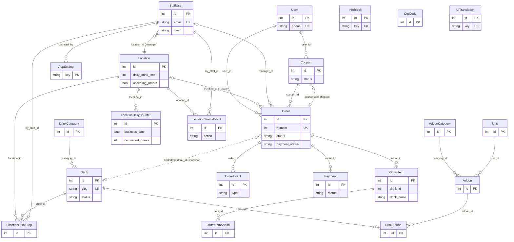
```mermaid
erDiagram
    DrinkCategory  ||--o{ Drink            : "category_id"
    Drink          ||--o{ DrinkAddon       : "drink_id"
    Addon          ||--o{ DrinkAddon       : "addon_id"
    AddonCategory  ||--o{ Addon            : "category_id"
    Unit           ||--o{ Addon            : "unit_id"

    Location       ||--o{ LocationDailyCounter : "location_id"
    Location       ||--o{ LocationDrinkStop    : "location_id"
    Location       ||--o{ LocationStatusEvent  : "location_id"
    Drink          ||--o{ LocationDrinkStop    : "drink_id"
    StaffUser      ||--o{ LocationStatusEvent  : "by_staff_id"
    StaffUser      ||--o{ LocationDrinkStop    : "by_staff_id"
    StaffUser      ||--o{ AppSetting           : "updated_by"

    User           ||--o{ Order            : "user_id"
    Location       |o--o{ Order            : "location_id (nullable)"
    StaffUser      |o--o{ Order            : "manager_id"
    Coupon         |o--o{ Order            : "coupon_id"
    Order          ||--o{ OrderItem        : "order_id"
    OrderItem      ||--o{ OrderItemAddon   : "item_id"
    Order          ||--o{ OrderEvent       : "order_id"
    Order          ||--o{ Payment          : "order_id"
    User           ||--o{ Coupon           : "user_id"

    StaffUser      }o--|| Location          : "location_id (manager)"

    Order          }o..o| Drink            : "OrderItem.drink_id (snapshot)"
    Coupon         }o..o| Order            : "source/used (logical)"

    DrinkCategory { int id PK }
    Unit          { int id PK }
    AddonCategory { int id PK }
    Addon         { int id PK }
    Drink         { int id PK string slug UK string status }
    DrinkAddon    { int id PK }
    Location      { int id PK int daily_drink_limit bool accepting_orders }
    LocationDailyCounter { int id PK date business_date int committed_drinks }
    LocationDrinkStop    { int id PK }
    LocationStatusEvent  { int id PK string action }
    AppSetting    { string key PK }
    InfoBlock     { int id PK string key UK }
    Order         { int id PK int number UK string status string payment_status }
    OrderItem     { int id PK int drink_id string drink_name }
    OrderItemAddon { int id PK }
    OrderEvent    { int id PK string type }
    Payment       { int id PK string status }
    Coupon        { int id PK string status }
    User          { int id PK string phone UK }
    StaffUser     { int id PK string email UK string role }
    OtpCode       { int id PK }
    UiTranslation { int id PK string key UK }
```

**Узлы без FK-связей с другими сущностями** (стоят особняком в схеме): `InfoBlock`, `OtpCode`,
`UiTranslation`, `AppSetting` (имеет лишь nullable `updated_by`→`StaffUser`). Это справочно-контентные
таблицы.

---

## III.7. i18n-поля (JSON `{ru, ar, en}`)

> **Архитектурное решение (docstring `catalog.py`):** контентные многоязычные поля хранятся как
> JSON-словарь `{"ru":…, "ar":…, "en":…}` прямо в строке сущности. Добавление языка **не требует
> миграции схемы** (требование ADM-S-11). Извлечение перевода — `services/i18n.py::t(value, locale)` с
> fallback на `default_locale`; выбор локали — `pick_locale(locale)`.

**Полный перечень JSON-i18n полей по сущностям:**

| Сущность | i18n-поля (JSON) |
|---|---|
| `DrinkCategory` | `name` |
| `Unit` | `name` 🧩 |
| `AddonCategory` | `name` 🧩 |
| `Addon` | `name` 🧩 |
| `Drink` | `name`, `description` |
| `Location` | `name`, `description` |
| `InfoBlock` | `title`, `body` |
| `UiTranslation` | `values` (словарь системных UI-строк) |

**Как работает fallback (`i18n.py::t`):** взять значение по запрошенной локали, если её нет в
`settings.locales` — взять `default_locale`; если в JSON нет ключа — отдать значение
`default_locale`, иначе — первое доступное значение, иначе пустую строку.

> ⚠️ **Расхождение код↔факт (зафиксировано для финальной сверки):**
> 1. **Реестр локалей.** Код (`core/config.py`): `default_locale="ru"`, `locales=["ru","ar"]` —
>    **`en` отсутствует** в реестре поддерживаемых локалей, хотя FACTS-канон и слой UI заявляют
>    `{ru,ar,en}` и EN-first. Сами JSON-поля и сиды используют ключ `en`, но `t()`/`pick_locale()`
>    воспринимают только `ru`/`ar`. Это означает: при запросе локали `en` функция нормализует её к
>    `default_locale="ru"`, а не к `en`. **Несостыковка** — внести в Часть IX (открытые вопросы).
> 2. **`User.preferred_locale` default = `"ru"`** — расходится с EN-first позиционированием продукта.
> 3. Снэпшоты в заказе (`OrderItem.drink_name`) — **не** i18n: это строка, зафиксированная в локали на
>    момент покупки (поле `String(160)`, не JSON), чтобы заказ не «переписывался» при смене языка/каталога.

**Разделение переводов:**
- **Контентные** (названия/описания напитков, точек, категорий, CMS) → JSON-поля сущностей.
- **Системные** (статусы, кнопки, сообщения UI) → `UiTranslation.values` (key→`{ru,ar,…}`).

---

## III.8. Аудит (журналы событий)

> **Принцип (для заказчика):** значимые операции с заказом и с точкой не теряются — каждая пишет строку
> в журнал «кто-что-когда». Это даёт историю для разбора спорных случаев, отчётности и восстановления
> хронологии. Два журнала: по заказам и по точкам.

### `OrderEvent` — журнал заказа
Аудит жизненного цикла одного заказа. На каждое значимое действие добавляется неизменяемая строка
(см. III.3 — поля). Покрываемые типы (`type`): `created`, `paid`, `status_change` (+ поле `status`),
`coupon_applied`, `rated`, `refund`. Авторство события: `by_user_id` (клиент) **или** `by_staff_id`
(персонал) — взаимоисключающе по контексту; `note` — свободный комментарий. Связь — `Order.events`
(`cascade=all,delete-orphan`, `order_by=OrderEvent.id`).

Трассировка событий ↔ процессов (см. Часть VII): `created`/`paid` — оплата; `status_change` — жизненный
цикл заказа + WS; `coupon_applied` — купоны; `rated` — рейтинг/купон; `refund` — возврат (декремент
дневного счётчика).

### `LocationStatusEvent` — журнал точки
Аудит операционных рычагов точки (см. III.2 — поля). Типы (`action`): `pause` / `open` (пауза и
возобновление приёма), `drink_stopped` / `drink_resumed` (стоп-лист напитка; для них заполняется
`drink_id`). Авторство — `by_staff_id`; `reason` — причина. Связь — `Location.status_events`
(`cascade=all,delete-orphan`, `order_by=LocationStatusEvent.id`).

Трассировка: процессы «стоп-лист» и «статус точки» (Часть VII); рычаги доступны ADM-M (свою точку) и
ADM-S (любую) — см. Части V, VI.

> **Косвенный аудит счётчика.** `LocationDailyCounter` (`updated_at`, `onupdate=func.now()`) фиксирует
> момент последнего изменения проданных напитков, дополняя журнал точки операционными цифрами дня.

> ⚠️ Контрактный дефект (известный, см. FACTS): экран кухни ожидает `name: string`, а бэкенд
> `/api/admin/location-status` отдаёт `name` как i18n-объект `{"en":…}` → ложное «Session expired».
> Это дефект **API-контракта**, не модели данных; зафиксирован в Часть IX. Здесь упомянут лишь как
> связанный с i18n-полем `Location.name`.

---

## III.9. Трассировка и перекрёстные ссылки

- **Деньги/налог:** `Order.subtotal/coupon_discount/total`; VAT 5 % — не в коде, описан как требование
  (см. Часть I «деньги», Часть IX «BR/открытые вопросы»).
- **Дневной лимит:** `Location.daily_drink_limit` + `LocationDailyCounter.committed_drinks` под
  `FOR UPDATE` — см. Часть VII («дневной лимит»).
- **Статус точки:** вычисляемый из `Location` — см. Часть VII («статус точки»).
- **Стоп-лист:** `LocationDrinkStop` — см. Часть VII («стоп-лист»).
- **Купоны/рейтинг:** `Coupon` + `Order.rating` — см. Часть VII («купоны/рейтинг»).
- **Платежи:** `Payment` + `Order.payment_status` — см. Часть VII («платёж»).
- **i18n:** JSON-поля + `UiTranslation` — см. Часть VII («i18n»).
- **API над сущностями** — см. Часть VIII; **коды ошибок** (`core/errors.py`) — см. Приложение C.


---

# Часть IV. КЛИЕНТСКОЕ MOBILE-WEB ПРИЛОЖЕНИЕ — USER STORIES

> _Происхождение блоков (🟦 JUICY · 🟨 GRABZI⁺ · 🟩 GRABZI) — см. Приложение F._

> Эта часть описывает продукт «глазами покупателя»: бренд-витрина → выбор точки → сбор заказа на одном
> экране → номер машины и телефон → оплата → отслеживание статуса и «Я приехал» → выдача у окна по номеру
> машины. Все истории — по единому формату трёх слоёв (единый формат историй): **Для заказчика** → **MoSCoW** →
> **Как `<роль>`** → **Как это работает (простыми словами)** → **AC** → **Экран и стиль** (с реальным
> мобильным скриншотом) → *— Технические детали —*: **Бизнес-логика** → **API** → **Что видит другая
> сторона** → **Трассировка** → **Метки**.
>
> Роли клиента (см. Часть 0, §0.6): **PUB-G** — гость (не авторизован), **PUB-A** — авторизованный клиент.
> Сквозные процессы (платёж, дневной лимит, статус заказа, купоны) описаны один раз в **Части VII** — здесь
> только ссылки. Модель данных — **Часть III**, дизайн-токены/компоненты — **Часть II**, коды ошибок —
> **Приложение C**.
>
> **Деньги (см. Часть I, §деньги).** Все суммы в **AED**. ⚠️ В коде прототипа **VAT 5 % не начисляется**:
> итог рассчитывается как `total = subtotal − coupon_discount`, отдельной налоговой строки нет, цена
> напитка считается финальной. VAT 5 % зафиксирован в ТЗ как **требование/решение** (модель «включён в
> цену» по умолчанию) со статусом ⚠️ «не реализовано / к настройке» — см. бизнес-правило BR в Части IX и
> макет чека в Части I. Во всех примерах ниже суммы приведены **по фактической логике кода (без VAT)** с
> явной пометкой допущения.

---

## §IV.0. История одного заказа (для заказчика) и вход клиента без пароля

### (А) История одного заказа — простыми словами

Утром покупатель открывает GRABZI на телефоне. На **главном экране** он сразу видит фирменный логотип и
крупную строку **«TODAY'S LIMIT»** — сколько порций уже продано из дневного лимита на сегодня. Это и есть
суть бренда: *«come early — we don't make more»* (приходи раньше — больше не сделаем). Он жмёт **«ORDER
NOW»**.

Дальше он **выбирает точку**: на карточке видно, открыта ли она сейчас, часы работы и сколько порций ещё
осталось на сегодня (зелёная/жёлтая/красная полоска). Жмёт **«Order here ▶»** — и попадает на **экран
заказа**.

Весь заказ собирается **на одном экране**. Покупатель кнопками «−/+» набирает напитки, сверху всё время
видит остаток дня. Тут же он вводит **номер машины** (по нему его узнают у окна выдачи) и **номер
телефона** (к нему привяжется заказ и история). Внизу — одна кнопка **«Proceed to Payment · AED {сумма}»**.
Он жмёт её и **оплачивает картой**.

После оплаты открывается **экран статуса заказа** с номером заказа и «дорожкой» из четырёх шагов:
*Received → Making → Ready → Handed over*. Статус меняется **сам, в реальном времени** — бариста на кухне
двигает заказ, а покупатель видит это на телефоне. Когда он подъезжает к окну, он жмёт **«I'm here 🚗»** —
у бариста загорается метка **«🚗 HERE»**, и на телефоне появляется **«We know you're here ✓»**. Заказ
выносят к машине, сверяя номер. Все прошлые заказы покупателя лежат в разделе **«My orders»**.

**Негативный поворот — лимит исчерпан.** Если покупатель пришёл поздно и на сегодня всё распродано, точка
показывает **«Sold out today»**, кнопка заказа неактивна, а если он всё же пытается оплатить «последнюю»
порцию, которую одновременно купил кто-то другой, — **оплата не начинается** и он видит понятное сообщение
«Sold out for today at this spot». Никаких денег при этом не списывается. Это и есть честное «больше не
делаем»: лимит защищён даже от двух одновременных покупателей последней порции (см. процесс «дневной
лимит» в Части VII).

### (Б) Вход клиента — без пароля, по номеру телефона

Покупатель **не заводит логин и пароль**. Он входит **по номеру телефона**. В целевой модели на телефон
приходит SMS-код (one-time password), который он вводит для подтверждения; ⚠️ **в текущем прототипе вход
происходит без кода** — SMS-провайдер ещё не подключён, поэтому система пускает по одному номеру телефона
(см. «Статус интеграций» в Части I и процесс OTP в Части VII). Все заказы, сделанные с этого номера,
**привязаны к нему** и видны покупателю в разделе **«My orders»**. Фактически авторизация происходит
**незаметно — в момент оплаты**: гость собирает заказ свободно, а когда жмёт «Proceed to Payment», система
тихо «узнаёт» его по введённому телефону и с этого момента он — авторизованный клиент (PUB-A).

> 📝 Вход «по телефону без кода» — это **режим заглушки** (🔧), а не уязвимость дизайна: целевое требование —
> SMS-OTP, текущее поведение — конфигурация на время, пока не выбран SMS-провайдер.

---

## §IV.1. Общие принципы клиента (вынесено один раз)

Чтобы не повторять в каждой истории (см. Часть II — дизайн-система, Часть I — конвенции):

- **Mobile-frame и навигация.** Контент центрируется (max-width ~460–720px). На телефоне — **нижняя
  навигация** (фиксированная): 🧊 **Menu** / 📍 **Location** / 🧾 **Orders** / ℹ️ **Info** с активным
  состоянием; на десктопе (≥768px) — **липкий хедер** с логотипом, теми же ссылками и кнопкой **«Create
  order»**. Навигация скрыта на маршрутах `/admin/*`. Сверху — **OfflineBanner** при потере сети
  (`navigator.onLine = false`).
- **Деньги.** AED; цена напитка отображается как `DHS. X.XX` (меню) либо `{n} AED` / `AED {total}`
  (заказ/статус). ⚠️ VAT 5 % в коде не начисляется (см. шапку Части IV).
- **Идентификация выдачи.** **Номер машины (`car_plate`) обязателен**, приводится к UPPERCASE; это PII
  (PDPL UAE) — см. Часть I, §PDPL.
- **Телефон.** Формат `+971…`. ⚠️ **Расхождение фронт/бэк:** фронт валидирует мягко `^\+?\d{7,15}$`
  (экраны `/order`, `/orders`), бэкенд-канон строже `^\+\d{9,15}$` (`request-code`/`PhoneIn`). Привести к
  одному правилу (открытый вопрос — Часть IX).
- **Дневной лимит.** Проверяется мягко при наборе и **жёстко при оплате** (см. процесс «дневной лимит» —
  Часть VII).
- **Realtime-статус.** Статус заказа обновляется по WebSocket; при обрыве — резервный опрос каждые **20 с**
  (см. процесс «жизненный цикл заказа + WS» — Часть VII).
- **Состояния экрана.** Скелетон (загрузка) → пусто → ошибка с «Try again»/«Change location» → данные;
  оффлайн-баннер. Локализация **UI EN-only** (инфраструктура AR/RTL заложена — V1.1).
- **Хранение на клиенте.** Токен клиента — `localStorage['grabzi_token']`; черновик заказа (выбранная
  точка + количества) — `localStorage['grabzi-draft']` (Zustand persist, `version:1`).

---

## РАЗДЕЛ A — Гость (PUB-G)

---

### H1. Сводка дня и старт заказа — `/` [PUB-G]  🟩 GRABZI


**Для заказчика.**
- **Проблема:** покупатель, открыв сервис, должен за секунду понять, *что это* и *стоит ли спешить*; без
  этого он уходит, не начав заказ.
- **Выгода:** первый экран — это бренд и «крючок дефицита»: логотип grabzi.ae, крупная сводка «сколько уже
  продано из сегодняшнего лимита» и одна большая кнопка «ORDER NOW».
- **Что даёт бизнесу:** мотивация прийти раньше (эффект дефицита → утренний пик), мгновенная узнаваемость
  бренда и один очевидный следующий шаг → выше доля начавших заказ.

**Приоритет (MoSCoW):** Must.

**Как** гость, **я хочу** на главном экране сразу увидеть бренд и сколько порций уже продано сегодня,
**чтобы** понять, что нужно спешить, и одним нажатием начать заказ.

**Как это работает (простыми словами):** Открыв сервис, покупатель видит фирменный логотип, строку
**«TODAY'S LIMIT»** с цифрами «продано / лимит на сегодня» и яркую кнопку **«ORDER NOW»**, которая ведёт к
выбору точки. Цифры берутся по открытой точке (если открытых нет — по первой в списке). Если связи с
сервером нет — вместо цифр показывается прочерк, но экран всё равно открывается и бренд виден. Ниже —
тэглайн *«Come early, we don't make more!!»* и фирменная иллюстрация. При потере сети сверху появляется
баннер «вы офлайн».

**Критерии приёмки (AC):**
1. На экране отображается логотип GRABZI (бренд-ассет `/brand/logo.png`).
2. Отображается блок **«TODAY'S LIMIT»** со значением в формате `{soldToday} / {dailyDrinkLimit}`; если
   лимита нет — знак `∞`; если данные недоступны — прочерк `—`.
3. Кнопка **«ORDER NOW»** ведёт на экран выбора точки (`/locations`).
4. Отображается тэглайн-картинка *«Come early, we don't make more!!»* (`/brand/tagline.png`) и подпись
   *«Only Ice V60»*.
5. При `navigator.onLine = false` сверху показан **OfflineBanner**; сам экран остаётся доступен (логотип и
   тэглайн видны).
6. **Визуально** узнаваемо в стиле grabzi.ae (тёплая терракота, рукописный курсив, фирменные иконки — сверка
   с `reference_design/`); токены и компоненты — см. ниже; контраст текста ≥ AA.
7. **A11y:** кнопка-пилюля — tap-target ≥ 44px; видимый фокус (`:focus-visible` — teal); декоративные
   изображения помечены `aria-hidden`/пустым `alt`, логотип имеет `alt="GRABZI"`.

**Экран и стиль:** H1 (`/`) · токены: `--color-brand`, `--color-brand-press`, `--color-lime`,
`--color-cream-yellow` · компоненты: `.btn-primary`, `.limit-title`, `.limit-value`, `BrandDivider`,
`.footer`.

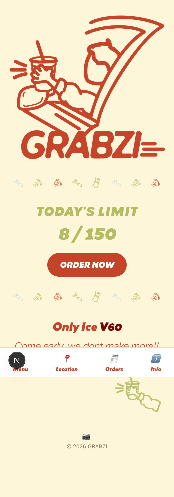
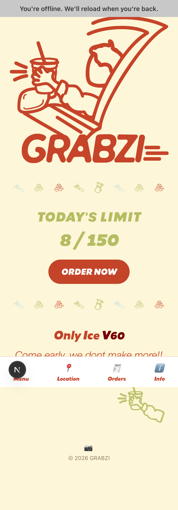

*— Технические детали (для разработки) —*

**Бизнес-логика (под капотом):** 1) экран — серверный компонент (RSC), при рендере запрашивает список точек
и берёт значения по первой открытой (`isOpen`) либо по первой в списке; 2) показывает `soldToday` /
`dailyDrinkLimit` (или `∞`); при ошибке/таймауте сети безопасно отдаёт `—` (бренд-витрина не падает);
3) кнопка «ORDER NOW» — навигация на `/locations`; 4) `OfflineBanner` — клиентский компонент по
`navigator.onLine` (см. Часть I).

**API:** `GET /api/locations?locale=en` (публичный, без токена; кэш ~30 с). Поля ответа: `soldToday`,
`dailyDrinkLimit`, `isOpen` (см. Приложение B). Ошибок не показывает — деградирует до прочерка.

**Что видит другая сторона:** значение «продано сегодня» — то же, что бариста видит в хедере кухни как
прогресс «Sold X / Limit Y» (см. Часть VI), и что супер-админ корректирует через adjust-day (см. Часть V).

**Трассировка:** сущности `Location`, `LocationDailyCounter` (Часть III) · процесс «дневной лимит» (Часть
VII) · дизайн-токены (Часть II).

**Метки:** ✅ реализовано.

---

### L1. Выбор точки (часы, статус, остаток) — `/locations` [PUB-G]  🟩 GRABZI


**Для заказчика.**
- **Проблема:** покупатель не должен ехать к точке, чтобы узнать, что она закрыта или всё распродано.
- **Выгода:** на одной карточке видно, открыта ли точка сейчас, её часы работы и сколько порций ещё
  осталось на сегодня; заехать в закрытую/распроданную точку нельзя — кнопка неактивна.
- **Что даёт бизнесу:** меньше пустых поездок и разочарований; статус и остаток управляют ожиданиями и
  снова работают на «приходи раньше».

**Приоритет (MoSCoW):** Must.

**Как** гость, **я хочу** увидеть точки с их статусом, часами и остатком на сегодня, **чтобы** выбрать ту,
где сейчас можно заказать.

**Как это работает (простыми словами):** Покупатель видит список карточек точек. На каждой — название и
адрес, цветной **бейдж статуса** (открыта / на паузе / закрыта со временем открытия / распродано / «осталось
мало»), строка **«сегодняшние часы»** с возможностью раскрыть полное расписание на неделю, и **остаток на
сегодня** в виде «N / лимит left» с цветной полоской (зелёная → жёлтая при ≤15 → красная при 0). Кнопка
внизу карточки активна **только если точка открыта** — тогда это «Order here ▶»; иначе — «Temporarily
paused» / «Sold out today» / «Closed now» и нажать нельзя. По нажатию выбранная точка запоминается и
покупатель переходит к сбору заказа. Если связи нет — показывается «Can't reach GRABZI» с кнопкой «Try
again».

**Критерии приёмки (AC):**
1. Заголовок экрана **«Pick a spot»**, подпись *«Drive-through · pick up in your car 🚗»*.
2. Каждая точка — карточка с названием, адресом (`📍`), бейджем статуса и цветной полосой слева (цвет
   точки `color` или брендовый).
3. **Бейдж статуса** отражает состояние: `Paused` / `Closed · opens HH:MM` / `Sold out today` / `Only N
   left` (при `remaining ≤ 15`) / `Open now`.
4. Блок часов: строка **«🕐 Today {интервалы}»**; по нажатию **«All hours ▼»** раскрывается недельное
   расписание со склейкой одинаковых дней (например, «Mon–Sat 05:30–22:00»), повторное нажатие — «Hide
   hours ▲».
5. Остаток дня: при наличии лимита — «{remaining} / {dailyDrinkLimit} left» + полоска (цвет: красный при
   0, жёлтый при ≤15, иначе зелёный); при отсутствии лимита — «♾️ No daily limit».
6. Кнопка точки активна **только при `isOpen`** и тогда показывает **«Order here ▶»**; иначе текст
   соответствует причине («Temporarily paused» / «Sold out today» / «Closed now») и кнопка `disabled`.
7. Нажатие на активную кнопку запоминает выбранную точку и ведёт на экран заказа (`/order`).
8. **Состояния:** загрузка — скелетоны; пусто — «No locations yet»; ошибка — «Can't reach GRABZI. Check
   your connection.» + «Try again».
9. **Визуально** соответствует дизайн-системе: `.card`, `.badge`/`.badge--*`, `.btn-block`, `.skeleton`;
   контраст ≥ AA. **A11y:** кнопка-аккордеон и CTA — tap-target ≥ 44px; видимый фокус; цвет статуса
   дублируется текстом бейджа (не только цветом).

**Экран и стиль:** L1 (`/locations`) · токены: `--color-brand`, `--color-instock`, `--color-lowstock`,
`--color-danger`, `--color-border`, `--color-cream-yellow` · компоненты: `.card`, `.badge`, `.badge--open`,
`.badge--low`, `.badge--out`, `.badge--closed`, `.badge--paused`, `.btn-block`, `.skeleton`.

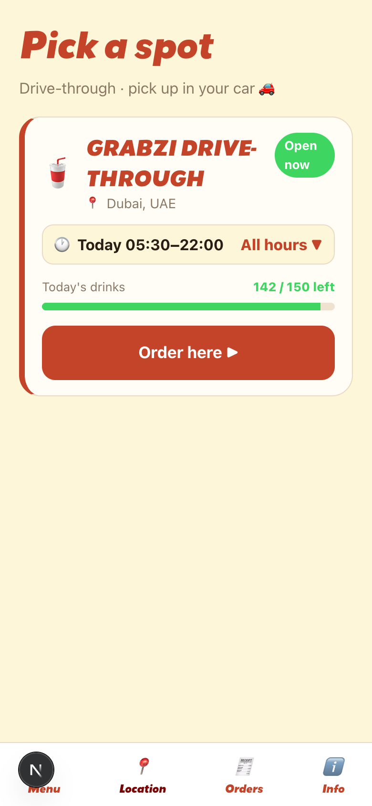
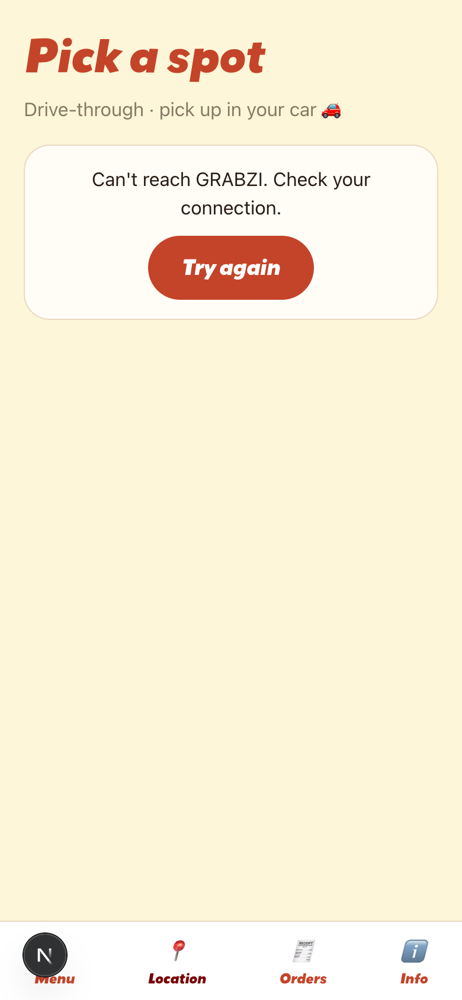

*— Технические детали (для разработки) —*

**Бизнес-логика (под капотом):** 1) клиентский компонент загружает список точек; пока грузится — скелетоны;
пустой список → «empty»; исключение → «error» с повтором (`load()`); 2) бейдж вычисляется из полей
`status` / `isSoldOut` / `remaining` / `nextOpenAt`; 3) часы группируются функцией склейки соседних дней с
одинаковыми интервалами; «сегодня» определяется по индексу дня недели; 4) выбор точки пишет `locationId` в
черновик (Zustand persist, ключ `grabzi-draft`) и навигирует на `/order`; выбор заблокирован, если
`!isOpen`.

**API:** `GET /api/locations?locale=en` (публичный). Ключевые поля: `id`, `name`, `address`,
`workingHours`, `dailyDrinkLimit`, `soldToday`, `remaining`, `isSoldOut`, `isOpen`, `status`
(`open/paused/closed/inactive`), `nextOpenAt`, `acceptingOrders`, `color` (см. Приложение B). Статус точки —
**вычисляемый** (`effective_status`, см. процесс «статус точки» — Часть VII).

**Что видит другая сторона:** тот же статус и остаток отражаются в хедере кухни (Часть VI) и в управлении
локациями супер-админа — пауза/корректировка лимита/история (Часть V).

**Трассировка:** сущности `Location`, `LocationDailyCounter`, `LocationStatusEvent` (Часть III) · процессы
«статус точки», «дневной лимит» (Часть VII) · тесты locations (S9).

**Метки:** ✅ реализовано.

---

### M1. Просмотр меню — `/menu` [PUB-G]  🟦 JUICY


**Для заказчика.**
- **Проблема:** покупатель хочет посмотреть, что вообще можно купить, ещё до выбора точки.
- **Выгода:** красивый каталог напитков с фирменными иллюстрациями, названиями и ценами `DHS. X.XX` и
  кнопкой «ORDER NOW».
- **Что даёт бизнесу:** витрина продаёт ассортимент и «разогревает» к заказу; единый стиль усиливает бренд.

**Приоритет (MoSCoW):** Must.

**Как** гость, **я хочу** просмотреть меню напитков с ценами, **чтобы** выбрать, что заказать.

**Как это работает (простыми словами):** Покупатель видит список напитков: крупная иллюстрация (фирменный
стикер или эмодзи), название заглавными буквами и цена в формате **«DHS. X.XX»**. Внизу — кнопка **«ORDER
NOW»**, ведущая к выбору точки. Пока меню грузится — показываются «заглушки»; если загрузить не удалось —
короткое «Couldn't load the menu.» Меню здесь — **витрина для просмотра**; собрать и оплатить заказ можно
после выбора точки (на экране заказа).

**Критерии приёмки (AC):**
1. Заголовок **«Menu»** (крупный, фирменный) с разделительной линией.
2. Каждый напиток: иллюстрация (`previewUrl`, иначе крупный эмодзи из названия), название UPPERCASE (без
   эмодзи в тексте) и цена **«DHS. {basePrice}»** с двумя знаками после запятой.
3. Кнопка **«ORDER NOW»** ведёт на `/locations`.
4. **Состояния:** загрузка — скелетоны; ошибка — карточка «Couldn't load the menu.»
5. **Визуально** соответствует дизайн-системе: `.display` (имя/цена), `.skeleton`, `.btn-primary`; цена —
   цветом `--color-brand-press`; контраст ≥ AA.
6. **A11y:** иллюстрация имеет осмысленный `alt` (название без эмодзи) либо `aria-hidden` для
   эмодзи-заглушки; CTA — tap-target ≥ 44px; видимый фокус.

**Экран и стиль:** M1 (`/menu`) · токены: `--color-brand`, `--color-brand-press` · компоненты: `.display`,
`.skeleton`, `.btn-primary`, `.footer`.

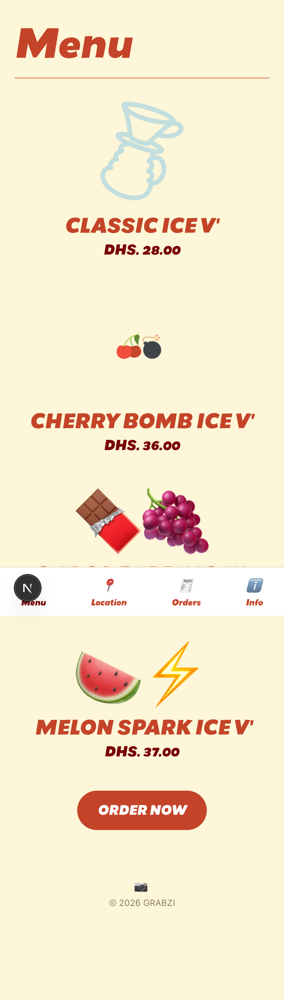
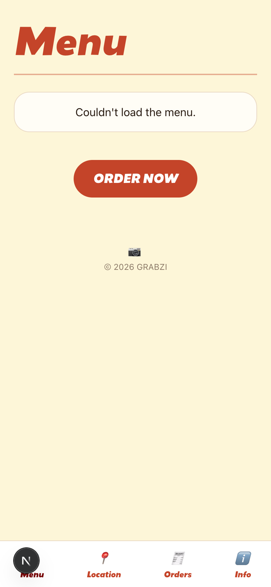

*— Технические детали (для разработки) —*

**Бизнес-логика (под капотом):** 1) клиентский компонент запрашивает опубликованные напитки; до ответа —
скелетоны; ошибка → флаг `err` и карточка-сообщение; 2) из имени извлекается ведущий эмодзи для крупной
иллюстрации-заглушки и «очищенное» имя для подписи; 3) цена форматируется `toFixed(2)` как `DHS. X.XX`;
4) кнопка «ORDER NOW» — навигация на `/locations` (без локации заказ не собрать).

**API:** `GET /api/drinks?locale=en` (публичный; без `location_id` — общий каталог). Поля: `id`, `slug`,
`name`, `previewUrl`, `basePrice`, `categoryId`, `soldOut` (см. Приложение B). Отдаются только
опубликованные напитки (`Drink.status = published`).

**Что видит другая сторона:** каталог и статусы публикации напитков (`draft/published/hidden`), КБЖУ, цены
и медиа ведёт супер-админ (каталог CRUD — Часть V).

**Трассировка:** сущности `Drink`, `DrinkCategory` (Часть III) · процесс «каталог и i18n» (Часть VII) ·
тесты catalog (S9).

**Метки:** ✅ реализовано · 🧩 КБЖУ/категории в публичном потоке GRABZI «спят».

---

### P1. Карточка напитка — `/product/[slug]` 🧩 [PUB-G]  🟦 JUICY


**Для заказчика.**
- **Проблема:** иногда покупателю нужно подробнее рассмотреть напиток (фото, описание) и сразу выбрать
  количество.
- **Выгода:** отдельная страница напитка с крупным фото, описанием, ценой и счётчиком «−/+» и кнопкой
  «Add to order ▶».
- **Что даёт бизнесу:** возможность «раскрыть» позицию для покупателя; модуль **опциональный** — без него
  заказ собирается прямо на экране заказа.

**Приоритет (MoSCoW):** Could (🧩 опциональный модуль).

**Как** гость, **я хочу** открыть карточку напитка, рассмотреть его и добавить нужное количество в заказ,
**чтобы** не собирать заказ вслепую.

**Как это работает (простыми словами):** Покупатель видит крупное фото напитка (или иконку-заглушку),
название, описание и цену **«AED {цена}»**. Счётчиком «−/+» он выбирает количество (минимум 1) и жмёт **«Add
to order ▶»** — выбранное количество добавляется к черновику заказа, и он переходит на экран заказа, где
видит свой набор. Если напиток не найден — «Drink not found.» с кнопкой «Back to menu».

**Критерии приёмки (AC):**
1. Отображаются фото (`previewUrl`, иначе иконка-заглушка), название, описание и цена **«AED {basePrice}»**.
2. Счётчик количества: «−» не опускает ниже 1, «+» увеличивает; текущее значение показано между кнопками.
3. Кнопка **«Add to order ▶»** прибавляет выбранное количество к текущему в черновике и ведёт на `/order`.
4. **Состояния:** загрузка — скелетон; не найдено — «Drink not found.» + «Back to menu».
5. **Визуально** соответствует дизайн-системе: подложка фото `--color-cream`, радиус `--radius-card`,
   `.btn-primary`; контраст ≥ AA.
6. **A11y:** кнопки счётчика — tap-target ≥ 44px (степпер 44×44); фото имеет `alt` (название);
   видимый фокус.

**Экран и стиль:** P1 (`/product/[slug]`) · токены: `--color-cream`, `--radius-card`, `--color-brand`,
`--color-border` · компоненты: `.btn-primary`, `.skeleton`, степпер 44×44.

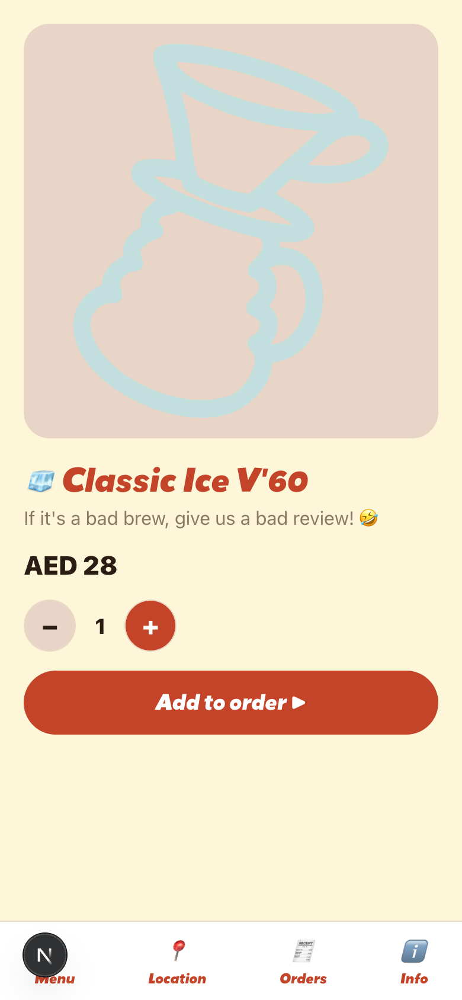

*— Технические детали (для разработки) —*

**Бизнес-логика (под капотом):** 1) клиентский компонент по `slug` грузит напиток (`api.drink(slug)`); до
ответа — скелетон; ошибка → «not found»; 2) локальное состояние `qty` (≥1); 3) «Add to order» вызывает
`setQty(drink.id, текущее_в_черновике + qty)` в Zustand-сторе (`grabzi-draft`) и навигирует на `/order`.

**API:** `GET /api/drinks/{slug}?locale=en` (публичный). Поля: `id`, `slug`, `name`, `description`,
`previewUrl`, `basePrice`, `kcal` (см. Приложение B).

**Что видит другая сторона:** содержимое карточки (фото/описание/цена/статус) ведёт супер-админ в каталоге
(Часть V).

**Трассировка:** сущность `Drink` (Часть III) · store-черновик `useOrderDraft` · процесс «каталог» (Часть
VII).

**Метки:** ✅ реализовано · 🧩 опциональный модуль (может быть исключён из MVP — заказ собирается и без него
на O1).

---

### O1. Сбор заказа на одном экране — `/order` [PUB-G → PUB-A]  🟩 GRABZI


**Для заказчика.**
- **Проблема:** многошаговая корзина теряет покупателей до оплаты — особенно в утренней спешке.
- **Выгода:** весь заказ — на одном экране: набрал напитки, увидел остаток дня, ввёл номер машины и
  телефон, оплатил.
- **Что даёт бизнесу:** меньше шагов → выше доля доведённых до оплаты заказов (конверсия), быстрее утренний
  поток; номер машины собирается сразу — выдача у окна без задержек.

**Приоритет (MoSCoW):** Must.

**Как** гость, **я хочу** собрать заказ и перейти к оплате на одном экране, **чтобы** не блуждать по
корзине.

**Как это работает (простыми словами):** Покупатель набирает напитки прямо на одном экране кнопками «−/+» и
сразу видит блок **«TODAY'S LIMIT»** — сколько порций продано на этой точке. Напиток из стоп-листа показан
как «Sold out» и неактивен. Тут же он вводит **номер машины** (по нему его узнают у окна) и **телефон** (к
нему привяжется заказ), а внизу — одна кнопка **«Proceed to Payment · AED {сумма}»**, неактивная, пока не
выбран ни один напиток. Остаток дня проверяется дважды: мягко при наборе (подсказать) и строго в момент
оплаты (чтобы два человека не «купили» одну последнюю порцию). Если порций не осталось, точка закрыта или
на паузе, или поля заполнены неверно — оплата не начинается и человек видит понятное сообщение во
всплывающем окне. Если точка ещё не выбрана — экран предлагает «Pick a spot first» со ссылкой на выбор
точки.

**Критерии приёмки (AC):**
1. Если точка не выбрана — экран показывает **«Pick a spot first»** с кнопкой **«Choose location»**
   (`/locations`).
2. Показан блок **«TODAY'S LIMIT»** выбранной точки: `{soldToday} / {dailyDrinkLimit}` либо `{soldToday} ·
   No limit`.
3. Каждый напиток — строка со степпером **«− {qty} +»**; цена показана как «{basePrice} AED»; напиток из
   стоп-листа показан бейджем **«Sold out»**, его строка приглушена и без степпера.
4. Поля **«CAR NUMBER *»** (плейсхолдер `DUBAI A 12345`) и **«PHONE NUMBER *»** (плейсхолдер `+9715X XXX
   XXXX`) обязательны.
5. Кнопка оплаты неактивна, пока `totalDrinks === 0` (текст «Pick a drink»); при наборе — **«Proceed to
   Payment · AED {total}»**; во время оплаты — «Creating order…».
6. **Мягкая проверка лимита:** если суммарное количество > остатка точки — всплывает «Only {remaining} left
   here. Reduce your order.», оплата не стартует.
7. **Валидация полей:** телефон проверяется (фронт `^\+?\d{7,15}$` — ⚠️ мягче бэк-канона `^\+\d{9,15}$`),
   иначе «Enter a valid phone number.»; пустой номер машины → «Add your car plate so we find you.»
8. **Жёсткие ошибки оплаты** (от сервера) показываются человеко-понятным текстом: закрыта — «This spot is
   closed now.», пауза — «This spot paused new orders.», лимит — «Sold out for today at this spot.»,
   распродано — «Sold out for today.», стоп-лист — «A drink just sold out here.», мало остатка — «Only a
   few left — reduce the quantity.»; при сетевой ошибке — «Can't reach GRABZI…».
9. Номер машины при отправке приводится к UPPERCASE; телефон при отправке нормализуется к `+…`.
10. **Состояния:** загрузка — скелетоны; ошибка загрузки точки — карточка с «Change location».
11. **Визуально** соответствует дизайн-системе: `.card`, `.limit-card`, `.field-input`, `.field-label`,
    `.btn-block`, `.badge--out`; контраст ≥ AA. **A11y:** поля с `label`; степперы имеют `aria-label`
    (`minus`/`plus`); tap-target степпера 40px (⚠️ < 44px — отметить как замечание a11y, см. Часть IX);
    модалка закрывается кнопкой «OK»; видимый фокус.

**Экран и стиль:** O1 (`/order`) · токены: `--color-brand`, `--color-lime`, `--color-cream-yellow`,
`--radius-card`, `--color-border` · компоненты: `.card`, `.limit-card`, `.field-input`, `.field-label`,
`.btn-block`, `.badge--out`, степпер.

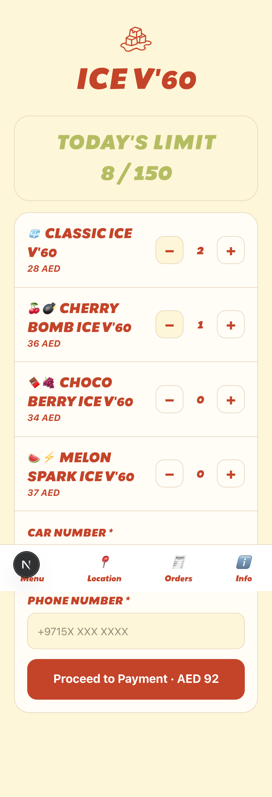
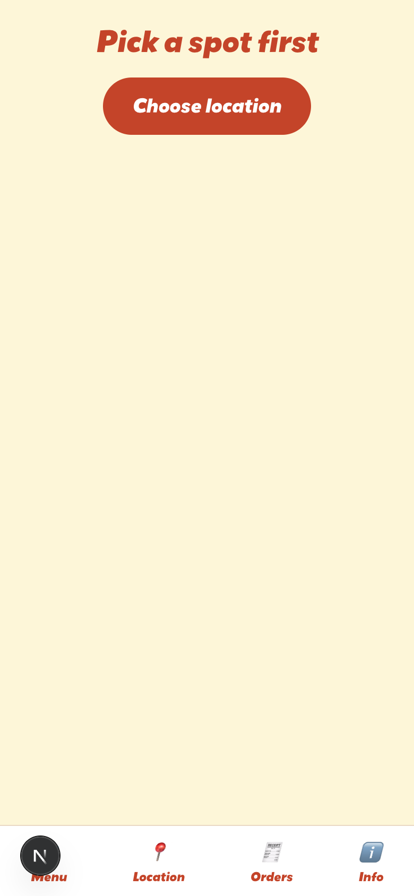

> **Пример суммы (по фактической логике кода — без VAT, ⚠️ допущение):** 2× Classic Ice V'60 @ 28.00 =
> 56.00 + 1× Cherry Bomb Ice V'60 @ 36.00 = 36.00 → **итог к оплате = AED 92.00**. (Если VAT 5 % будет
> включён «сверху», итог изменится — см. макет чека в Части I и BR-VAT в Части IX.)

*— Технические детали (для разработки) —*

**Бизнес-логика (под капотом):** 1) черновик — `useOrderDraft` (Zustand persist, `localStorage
['grabzi-draft']`: `{locationId, items}`); при наличии `locationId` параллельно грузятся
`api.location(id)` + `api.drinks(id)`; 2) `total` считается на клиенте как Σ `basePrice × qty`;
`totalDrinks` — сумма количеств; 3) по нажатию «pay»: мягкая проверка `totalDrinks > remaining` → overlay;
валидация телефона/plate → overlay; 4) затем последовательно: `api.login(phone)` (авто-вход без OTP,
`code:""`, сохраняет `grabzi_token`) → `api.createOrder({locationId, items, carPlate})` →
`api.checkout(orderId)`; 5) после успеха черновик очищается; при `mock:true` — редирект
`/orders/{id}?paid=1`, иначе — переход на `checkoutUrl` Stripe; 6) **жёсткая проверка лимита — на сервере
под блокировкой** при создании заказа (см. процесс «дневной лимит» — Часть VII).

**API:** `GET /api/locations/{id}?locale=en`, `GET /api/drinks?locale=en&location_id={id}`, `POST
/api/auth/verify` (вход), `POST /api/orders?locale=en` (создание; `total = subtotal − coupon_discount`,
⚠️ без VAT), `POST /api/payments/checkout-session` (см. Приложение B). Ошибки: `LOCATION_CLOSED`,
`LOCATION_PAUSED`, `LOCATION_LIMIT_REACHED`, `LOCATION_SOLD_OUT`, `DRINK_UNAVAILABLE_AT_LOCATION`,
`STOCK_LESS_THAN_ORDER`, `CART_EMPTY`, `CAR_PLATE_REQUIRED` (см. Приложение C).

**Что видит другая сторона:** **оплаченный** заказ попадает в колонку **NEW** на кухне (Часть VI); номер
машины и состав видны бариста на карточке заказа.

**Трассировка:** сущности `Order`, `OrderItem` (Часть III) · процессы «дневной лимит», «платёж» (Часть
VII) · тесты orders/limits/race (S9) · NFR конверсии O1 (Часть I).

**Метки:** ✅ реализовано · 🔧 оплата в mock-режиме без Stripe-ключа · 🔧 вход без OTP · ⚠️ телефон-regex
фронт/бэк расходится · ⚠️ VAT 5 % не начисляется · ⚠️ степпер 40px < 44px (a11y).

---

## РАЗДЕЛ B — Авторизованный клиент (PUB-A)

---

### PUB-A-02. Оплата заказа (Stripe / mock) — на переходе с `/order` [PUB-A]  🟨 GRABZI⁺


**Для заказчика.**
- **Проблема:** оплата — момент, где теряются деньги: лишний шаг, непонятная ошибка, двойное списание.
- **Выгода:** покупатель платит картой одним переходом; после оплаты сразу попадает на экран статуса
  заказа.
- **Что даёт бизнесу:** прямая выручка без комиссии агрегатора; быстрый «доход до кухни» — заказ
  попадает к бариста только после подтверждённой оплаты.

**Приоритет (MoSCoW):** Must.

**Как** клиент, **я хочу** оплатить заказ картой и сразу видеть его статус, **чтобы** не сомневаться, что
оплата прошла.

**Как это работает (простыми словами):** Нажав «Proceed to Payment», покупатель оплачивает картой. Когда
платёжный провайдер подключён (Stripe), он попадает на защищённую страницу оплаты и после успеха
возвращается на экран статуса своего заказа. ⚠️ **Сейчас провайдер не подключён** — работает **mock-режим**:
оплата имитируется, заказ сразу помечается оплаченным, и покупатель перенаправляется на экран статуса с
пометкой «оплачено» (`?paid=1`). **Реальные деньги в mock не списываются.** Заказ становится «оплаченным» и
попадает на кухню только после подтверждения оплаты; если в момент оплаты выяснилось, что последняя порция
уже ушла, — оплата не подтверждается, деньги (в реальном режиме) подлежат возврату провайдером.

**Критерии приёмки (AC):**
1. После создания заказа запускается оплата; при mock-режиме (`mock:true`) — редирект на
   `/orders/{id}?paid=1`; при реальном Stripe — переход на `checkoutUrl` провайдера.
2. Заказ переходит в «оплачен» (`payment_status = paid`) и становится виден кухне **только** после
   подтверждения оплаты (в реальном режиме — по webhook'у, не по редиректу).
3. Если в момент подтверждения оплаты дневной лимит уже исчерпан — оплата не подтверждается, заказ
   возвращается (refund-логика), деньги не «зависают» проданными.
4. Повторная отправка того же заказа на оплату, если он уже `paid`, не создаёт второй платёж.
5. **Визуально:** экран-результат — это статус заказа (ST1), узнаваемо в стиле grabzi.ae; контраст ≥ AA.
6. **A11y:** на экране результата фокус на заголовке заказа; элементы статуса доступны.

**Экран и стиль:** результат оплаты = **ST1** (`/orders/[id]?paid=1`) · см. историю ST1 ниже (скриншот
там).

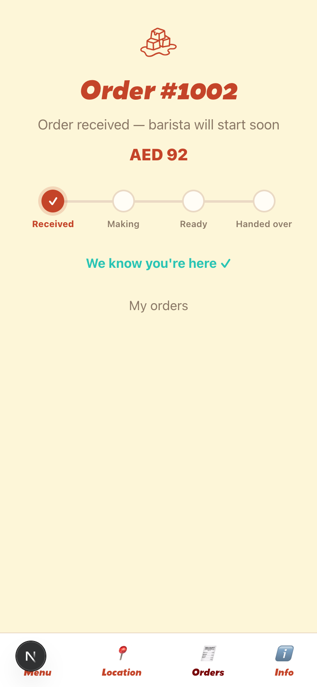

> **Статус интеграций (🔧).** Без `STRIPE_SECRET_KEY` — **mock**: платёж создаётся и сразу подтверждается,
> редирект `/orders/{id}?paid=1`, реальные деньги НЕ списываются. Для прода нужен Stripe merchant + TRN
> (см. Часть I, §Статус интеграций; процесс «платёж» — Часть VII).

*— Технические детали (для разработки) —*

**Бизнес-логика (под капотом):** 1) `POST /api/payments/checkout-session` создаёт `Payment`; 2) если есть
`STRIPE_SECRET_KEY` и SDK — создаётся Stripe Checkout Session, возвращается `{checkoutUrl, mock:false}`;
3) иначе — **mock**: `provider_id = mock_{payment.id}`, немедленно вызывается `mark_paid(...)`
(`payment_status → paid`), возвращается `{checkoutUrl:"/orders/{id}?paid=1", mock:true}`; 4) реальный факт
оплаты в проде подтверждается `POST /api/payments/webhook` (`checkout.session.completed`); в `mark_paid`
повторно проверяется лимит — при исчерпании заказ возвращается (refund). Идемпотентность: если `order
.payment_status == "paid"`, новый платёж не создаётся.

**API:** `POST /api/payments/checkout-session` (body `{orderId}`, ответ `{checkoutUrl, mock}`), `POST
/api/payments/webhook` (см. Приложение B). Связано с `mark_paid` / `refund_order` (`order_flow.py`).

**Что видит другая сторона:** оплаченный заказ → колонка **NEW** на кухне (Часть VI); супер-админ видит
транзакцию в разделе «Платежи» (Часть V).

**Трассировка:** сущности `Order`, `Payment` (Часть III) · процесс «платёж (Stripe + mock + webhook)»
(Часть VII) · NFR идемпотентности вебхука (Часть I) · тесты payments (S9).

**Метки:** ✅ реализовано · 🔧 mock-режим без Stripe-ключа (деньги не списываются).

---

### ST1-a. Отслеживание статуса заказа в реальном времени — `/orders/[id]` [PUB-A]  🟨 GRABZI⁺


**Для заказчика.**
- **Проблема:** после оплаты покупатель не знает, готов ли заказ, и нервно ждёт / звонит.
- **Выгода:** экран статуса показывает «дорожку» из четырёх шагов и сам обновляется в реальном времени —
  видно, что заказ принят, готовится, готов, выдан.
- **Что даёт бизнесу:** меньше тревожных вопросов у окна, выше доверие; покупатель подъезжает «к готовому» —
  быстрее оборачивается окно выдачи.

**Приоритет (MoSCoW):** Must.

**Как** клиент, **я хочу** видеть статус своего заказа в реальном времени, **чтобы** понимать, когда
подъезжать к окну.

**Как это работает (простыми словами):** После оплаты покупатель видит экран с **номером заказа**, суммой и
**дорожкой из четырёх шагов: Received → Making → Ready → Handed over**. Пройденные шаги подсвечены, текущий
выделен, под дорожкой — человеко-понятная подпись («Making your drink», «Ready — come on over 🚗» и т.п.).
Статус **меняется сам**, как только бариста на кухне двигает заказ: это происходит мгновенно через постоянное
соединение, а если связь прерывается — экран всё равно обновляется опросом раз в ~20 секунд. Пока оплата
подтверждается — показывается «Confirming your payment…»; возвращённый заказ помечен «Refunded».

**Критерии приёмки (AC):**
1. Отображается **«Order #{number}»**, сумма **«AED {total}»** и подпись текущего статуса.
2. Степпер из 4 шагов — **Received / Making / Ready / Handed over** — отражает текущий `status`
   (`new/in_progress/ready/completed`); пройденные отмечены «✓», текущий выделен ореолом.
3. Статус-подпись соответствует статусу: «Order received — barista will start soon» / «Making your drink» /
   «Ready — come on over 🚗» / «Handed over. Enjoy!»; для возврата — «Refunded».
4. Пока `payment_status != paid` — показывается «Confirming your payment…», степпер скрыт.
5. **Realtime:** при изменении статуса на кухне экран обновляется без перезагрузки (WebSocket); при обрыве —
   резервный опрос каждые **20 с** (см. Часть VII).
6. **Ошибка:** если заказ не найден — «Order not found.» + «My orders».
7. **Визуально** соответствует дизайн-системе: фирменная иконка `ice.png`, `.display`, степпер на
   `--color-brand`; контраст ≥ AA. **A11y:** иконка `aria-hidden`; ссылка «My orders» доступна; видимый
   фокус.

**Экран и стиль:** ST1 (`/orders/[id]`) · токены: `--color-brand`, `--color-border`, `--color-teal`,
`--color-muted` · компоненты: степпер-прогресс, `.display`, `.btn-primary`.


*— Технические детали (для разработки) —*

**Бизнес-логика (под капотом):** 1) при монтировании — `api.order(id)` (`refresh`); 2) открывается
WebSocket `ws://…/ws/orders/{id}?token=…`; на любое не-`ping` сообщение вызывается `refresh()`; 3)
параллельно — `setInterval(refresh, 20000)` как fallback; при размонтировании — `ws.close()` +
`clearInterval`; 4) степпер строится по индексу текущего `status` в массиве шагов; отображение зависит от
`paymentStatus === "paid"` и `status === "refund"`.

**API:** `GET /api/orders/{id}` (защищённый, Bearer). WebSocket: `WS /ws/orders/{id}?token=…` (см.
Приложение B). Поля заказа: `number`, `status`, `paymentStatus`, `arrived`, `total`.

**Что видит другая сторона:** каждый шаг дорожки соответствует действию бариста на кухне — TAKE / READY /
HANDED OVER (Часть VI); каждый переход пишет событие `OrderEvent`.

**Трассировка:** сущности `Order`, `OrderEvent` (Часть III) · процесс «жизненный цикл заказа + WS» (Часть
VII) · NFR задержки WS-пуша (Часть I) · тесты ws/orders (S9).

**Метки:** ✅ реализовано · WebSocket реальный, polling-fallback 20 с.

---

### ST1-b. Отметка «Я приехал» (curbside) — `/orders/[id]` [PUB-A]  🟩 GRABZI


**Для заказчика.**
- **Проблема:** у окна выдачи (drive-through) бариста должен знать, что именно *этот* покупатель уже подъехал
  и какую машину высматривать.
- **Выгода:** покупатель жмёт одну кнопку **«I'm here 🚗»** — у бариста загорается метка «🚗 HERE», и заказ
  выносят к машине, сверяя номер.
- **Что даёт бизнесу:** хореография выдачи без звонков и путаницы; быстрая оборачиваемость окна; отметка не
  зависит от готовности — можно приехать на любой стадии.

**Приоритет (MoSCoW):** Must.

**Как** клиент, **я хочу** отметить, что я подъехал, **чтобы** бариста вынес заказ к моей машине.

**Как это работает (простыми словами):** Покупатель подъезжает к окну выдачи и на экране статуса жмёт **«I'm
here 🚗»**. В тот же момент у бариста на кухне на карточке этого заказа загорается метка **«🚗 HERE»**, а у
покупателя появляется подтверждение **«We know you're here ✓»**. Бариста выносит напиток к машине,
**сверяя номер машины** из заказа. Важно: отметка «я приехал» — **независимый флаг**, она не двигает статус
готовности: можно нажать «I'm here» хоть пока напиток ещё готовится, хоть когда он уже готов. Кнопка
показывается, только пока заказ оплачен, ещё не выдан и приезд не отмечен; повторное нажатие ничего не
ломает (отметка идемпотентна). После того как заказ выдан, кнопки уже нет.

**Критерии приёмки (AC):**
1. Кнопка **«I'm here 🚗»** показывается только если: заказ оплачен (`paid`), **не** `completed`, **не**
   `refund` и приезд ещё не отмечен (`arrived = false`).
2. Нажатие отправляет отметку приезда; после успеха отображается **«We know you're here ✓»** (teal), кнопка
   исчезает.
3. Отметка **независима от статуса** готовности: доступна на стадиях `new/in_progress/ready` (хоть до
   готовности).
4. Повторная отметка не создаёт дубликат (идемпотентность по `arrived_at`).
5. **Визуально** соответствует дизайн-системе: `.btn-primary`, подтверждение цветом `--color-teal`;
   контраст ≥ AA. **A11y:** кнопка — tap-target ≥ 44px; видимый фокус; подтверждение читается скринридером.

**Экран и стиль:** ST1 (`/orders/[id]`) · токены: `--color-brand`, `--color-teal` · компоненты:
`.btn-primary`, текст-подтверждение.


*— Технические детали (для разработки) —*

**Бизнес-логика (под капотом):** 1) кнопка вызывает `POST /api/orders/{id}/arrived` (Bearer); 2) на сервере
— если `arrived_at is None`, проставляется `arrived_at = now` и пишется `OrderEvent("arrived")`
(идемпотентно: повтор не меняет время); 3) после ответа — `refresh()`, экран показывает подтверждение;
4) `arrived` — **независимый флаг**, не часть цепочки `Order.status`.

**API:** `POST /api/orders/{id}/arrived` (защищённый, Bearer; идемпотентный). Ответ обновляет `arrived` в
заказе (см. Приложение B).

**Что видит другая сторона:** на кухне карточка заказа мгновенно получает бейдж **«🚗 HERE»** (Часть VI) —
сигнал «выносить к машине»; бариста сверяет `car_plate`/`emirate`.

**Трассировка:** сущности `Order` (поле `arrived_at`), `OrderEvent` (Часть III) · процесс «жизненный цикл
заказа + WS» (Часть VII) · тесты arrived (S9).

**Метки:** ✅ реализовано · 🚗 независимый флаг приезда.

---

### OR1. Мои заказы / вход по телефону — `/orders` [PUB-A]  🟦 JUICY


**Для заказчика.**
- **Проблема:** покупателю нужно вернуться к своему заказу (узнать статус, открыть «Я приехал») и видеть
  историю.
- **Выгода:** раздел **«My orders»** показывает список всех заказов клиента (номер · статус · сумма); если
  он ещё не вошёл — простая форма входа **по номеру телефона** без пароля.
- **Что даёт бизнесу:** удержание (покупатель видит свою историю), быстрый повторный заказ, единая привязка
  заказов к номеру телефона.

**Приоритет (MoSCoW):** Must.

**Как** клиент, **я хочу** видеть список своих заказов или войти по телефону, **чтобы** вернуться к нужному
заказу и его статусу.

**Как это работает (простыми словами):** Если покупатель уже вошёл, он видит **список своих заказов** —
каждая строка: **«#номер»**, статус и **«AED сумма»**; нажатие открывает экран статуса этого заказа. Если он
ещё не вошёл — показывается карточка **«Create your first order or sign in.»** с полем для телефона и кнопкой
**«Sign in»** (вход **по номеру телефона, без пароля** — в целевой модели с SMS-кодом; ⚠️ сейчас без кода).
Если заказов ещё нет — «No orders yet. Your first GRABZI is one tap away.» со ссылкой на меню. Все заказы
привязаны к номеру телефона, под которым покупатель вошёл.

**Критерии приёмки (AC):**
1. Заголовок **«My orders»**.
2. **Если не авторизован:** карточка «Create your first order or sign in.», поле телефона (плейсхолдер
   `Phone (+9715X XXX XXXX)`), кнопка **«Sign in»** (во время входа — «Signing in…»), ссылка «Browse menu».
3. Вход выполняется **по номеру телефона без пароля** (⚠️ авто-вход без OTP); телефон валидируется
   `^\+?\d{7,15}$` (⚠️ мягче бэк-канона), при невалидном — вход не выполняется.
4. **Если авторизован и заказов нет:** «No orders yet. Your first GRABZI is one tap away.» + «Browse menu».
5. **Если есть заказы:** список карточек-строк **«#{number} · {status} · AED {total}»**; нажатие ведёт на
   `/orders/{id}` (ST1).
6. **Состояние загрузки:** скелетон.
7. **Визуально** соответствует дизайн-системе: `.card`, `.btn-primary`, `.skeleton`; контраст ≥ AA.
   **A11y:** поле телефона с понятным плейсхолдером; карточки-строки — кликабельные кнопки с tap-target ≥
   44px; видимый фокус.

**Экран и стиль:** OR1 (`/orders`) · токены: `--color-brand`, `--color-muted`, `--color-border` ·
компоненты: `.card`, `.btn-primary`, `.skeleton`.

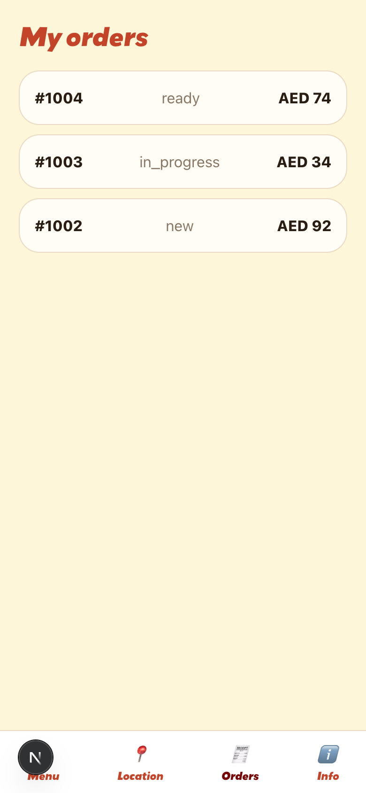
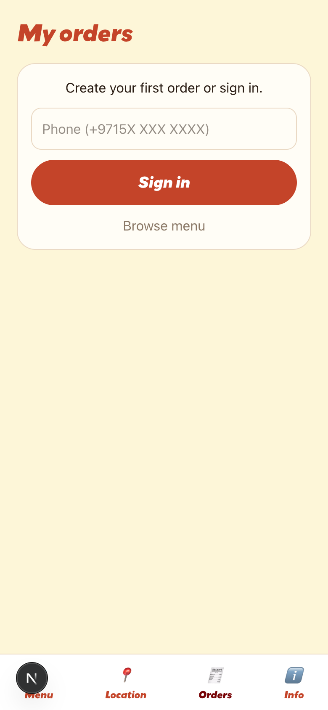
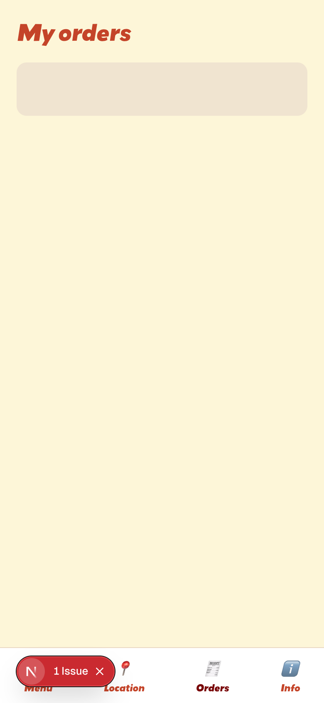

*— Технические детали (для разработки) —*

**Бизнес-логика (под капотом):** 1) при загрузке читается `localStorage['grabzi_token']`: если токена нет —
`authed=false`, показывается форма входа; если есть — `GET /api/orders` с Bearer; 2) «Sign in» → `api.login
(phone)` (авто-вход без OTP, `code:""`, сохраняет токен) → повторная загрузка списка; 3) карточка-строка
навигирует на `/orders/{id}`.

**API:** `GET /api/orders` (защищённый, Bearer; список заказов клиента — `id`, `number`, `status`,
`paymentStatus`, `total`), `POST /api/auth/verify` (вход) (см. Приложение B).

**Что видит другая сторона:** супер-админ видит все заказы и привязку к клиенту (Часть V); бариста видит
только активные оплаченные заказы своей точки (Часть VI).

**Трассировка:** сущности `Order`, `User` (Часть III) · процессы «OTP/вход», «жизненный цикл заказа» (Часть
VII) · тесты orders/auth (S9).

**Метки:** ✅ реализовано · 🔧 вход без OTP · ⚠️ телефон-regex фронт/бэк расходится.

---

### PUB-A-04. Оценка 👍/👎 и получение купона — `/orders/[id]` (🚧 API, без клиентского экрана) [PUB-A]  🟦 JUICY


**Для заказчика.**
- **Проблема:** недовольный покупатель просто уходит и не возвращается; бизнес не узнаёт о проблеме.
- **Выгода:** после заказа покупатель ставит **👍 или 👎**; **👎 автоматически выдаёт купон** —
  компенсацию-скидку на следующий заказ, и человек получает повод вернуться.
- **Что даёт бизнесу:** возврат недовольных клиентов (купон-компенсация), сигнал о качестве; 👍 ничего не
  стоит и измеряет довольство.

**Приоритет (MoSCoW):** Could (🧩/🚧 — реализовано на API, клиентского экрана в `grabzi-web` пока нет).

**Как** клиент, **я хочу** оценить заказ и при недовольстве получить купон, **чтобы** компенсировать неудачу
и вернуться.

**Как это работает (простыми словами):** После того как заказ выдан (или покупатель отметил приезд), ему
предлагается оценить заказ — **👍 (понравилось)** или **👎 (не понравилось)**. Один заказ — одна оценка. Если
он ставит **👎**, система автоматически **выпускает ему купон** — скидку на следующий заказ как извинение;
👍 купона не даёт. Купон действует на **одну позицию** следующего заказа. ⚠️ Номинал и срок действия купона
в коде жёстко не зафиксированы — это расход бизнеса и требует решения (открытый вопрос — Часть IX).

**Критерии приёмки (AC):**
1. Оценка доступна, только если заказ завершён (`completed`) **или** отмечен приезд (`arrived`).
2. Значение оценки — `like` или `dislike`; **один заказ — одна оценка** (повторная отклоняется).
3. При `dislike` автоматически создаётся **купон** клиенту (источник — этот заказ, `status = active`);
   при `like` купон не выдаётся.
4. Ответ сообщает, выпущен ли купон (`couponIssued`) и его идентификатор.
5. **Визуально** (целевой экран): кнопки 👍/👎 узнаваемы в стиле grabzi.ae; контраст ≥ AA. **A11y:** кнопки
   с понятными подписями/aria; tap-target ≥ 44px.

**Экран и стиль:** ST1 (`/orders/[id]`) — 🚧 **клиентский UI оценки в `grabzi-web` пока не реализован**
(кнопки 👍/👎 на экране статуса отсутствуют). Логика существует на API. Скриншот контура A отсутствует →
проектируется по контракту API (контур B — экран по контракту API, см. Приложение I).

*— Технические детали (для разработки) —*

**Бизнес-логика (под капотом):** 1) `POST /api/orders/{id}/rate` с `{rating: "like"|"dislike"}`; сервер
проверяет, что заказ завершён или есть `arrived_at`, и что `rating` ещё не выставлен; 2) пишет `o.rating`,
событие `OrderEvent("rated")`; 3) при `dislike` создаёт `Coupon(user_id, source_order_id, status=active)`;
4) возвращает `{ok, couponIssued, couponId}`. Подсказка о просьбе оценить — поле `ratingPromptDue` в
деталях заказа (по таймауту после приезда).

**API:** `POST /api/orders/{id}/rate` (защищённый, Bearer; `rating ∈ {like, dislike}`), `GET /api/coupons`
(мои купоны) (см. Приложение B).

**Что видит другая сторона:** супер-админ видит купоны и может аннулировать активный (`void`) (Часть V);
соотношение 👍/👎 — метрика довольства (KPI, Часть 0).

**Трассировка:** сущности `Order` (поле `rating`), `Coupon`, `OrderEvent` (Часть III) · процесс
«купоны/рейтинг» (Часть VII) · KPI 👍/👎 (Часть 0).

**Метки:** 🚧 на API без клиентского экрана в `grabzi-web` · ❓ номинал/срок купона не зафиксированы · ✅
покрыто логикой бэкенда.

---

### PUB-A-05. Применение купона к заказу — `/order` (🚧 API, без клиентского экрана) [PUB-A]  🟦 JUICY


**Для заказчика.**
- **Проблема:** выданный за 👎 купон бесполезен, если его негде применить.
- **Выгода:** при следующем заказе покупатель применяет купон к **одной позиции** — её стоимость
  списывается как скидка.
- **Что даёт бизнесу:** замыкает цикл «недовольство → компенсация → повторный заказ»; купон гасится ровно
  один раз.

**Приоритет (MoSCoW):** Could (🧩/🚧 — реализовано на API, клиентского экрана в `grabzi-web` пока нет).

**Как** клиент, **я хочу** применить свой купон к одной позиции заказа, **чтобы** получить обещанную скидку.

**Как это работает (простыми словами):** Собирая новый заказ, покупатель может **применить купон** к **одной
выбранной позиции** — её цена вычитается из суммы как скидка (итог = сумма заказа минус стоимость этой
позиции). Применить можно только **свой активный** купон. Когда заказ оплачен, купон **гасится** (становится
«использован») и больше не применяется. ⚠️ В текущем клиентском приложении (`grabzi-web`) **нет элемента
выбора купона** на экране заказа — выбор позиции и купона передаётся в заказ на уровне API; UI применения
купона предстоит реализовать.

**Критерии приёмки (AC):**
1. К заказу можно привязать **активный купон клиента**; купон применяется к **одной** позиции (по индексу).
2. Скидка = цена выбранной позиции; **итог = подытог − скидка купона** (⚠️ без VAT).
3. Чужой/неактивный/несуществующий купон — отклоняется (ошибка применения).
4. Если позиция под купон не указана — купон не применяется (нечего скидывать).
5. После оплаты заказа купон переходит в статус **«использован»** (с фиксацией заказа/позиции/суммы).
6. **Визуально** (целевой экран): выбор купона/позиции узнаваем в стиле grabzi.ae; контраст ≥ AA. **A11y:**
   элементы выбора доступны; tap-target ≥ 44px.

**Экран и стиль:** O1 (`/order`) — 🚧 **UI применения купона в `grabzi-web` пока не реализован** (на экране
заказа нет выбора купона). Логика существует на API. Скриншот контура A отсутствует → проектируется по
контракту API.

*— Технические детали (для разработки) —*

**Бизнес-логика (под капотом):** 1) при создании заказа в payload передаются `couponId` и `couponItemIndex`;
2) позиция с этим индексом помечается `paid_by_coupon=true`, её цена запоминается; 3) проверяется, что купон
принадлежит клиенту и `status=active`, иначе — ошибка; 4) `order.coupon_id`, `order.coupon_discount =
цена_позиции`, пишется событие `coupon_applied`; **`order.total = subtotal − coupon_discount`**; 5) при
оплате (`mark_paid`) купон переводится в `used` (`used_at`, `used_order_id`, `used_item_id`,
`discount_amount`).

**API:** `POST /api/orders?locale=…` с полями `couponId`, `couponItemIndex` (см. Приложение B); `GET
/api/coupons` (список купонов клиента). Ошибки применения — невалидный/чужой купон, отсутствие позиции под
купон (см. Приложение C / Часть VII).

**Что видит другая сторона:** супер-админ видит купон как «использован» и связанный заказ (Часть V); бариста
видит готовый состав заказа без деталей скидки (Часть VI).

**Трассировка:** сущности `Coupon`, `Order` (`coupon_id`, `coupon_discount`), `OrderItem` (`paid_by_coupon`)
(Часть III) · процесс «купоны/рейтинг» (Часть VII) · тесты coupons (S9).

**Метки:** 🚧 на API без клиентского экрана в `grabzi-web` · ⚠️ итог без VAT · ✅ покрыто логикой бэкенда.

---

### I1. Инфо: история бренда, контакты, часы — `/info` [PUB-G]  🟩 GRABZI

**Для заказчика.**
- Проблема: покупателю негде узнать о бренде, как связаться и когда вы работаете — он уходит к конкуренту.
- Выгода: отдельная страница со «Story», контактами и часами; вы редактируете её сами из админки (CMS).
- Что даёт бизнесу: доверие к бренду и снижение нагрузки на связь; контент меняется без программиста.

**Приоритет (MoSCoW):** Should.

**Как** гость, **я хочу** прочитать о GRABZI и увидеть контакты/часы, **чтобы** доверять бренду и знать, как и когда забрать кофе.

**Как это работает (простыми словами):** Страница показывает текстовые блоки (например «Our Story», «Contact», «Hours»), которые владелец заполняет в админке. Если блоки ещё не заведены, гость видит понятную заглушку с почтой и телефоном, а не пустой экран. Тексты подгружаются по выбранному языку (сейчас английский); если перевода нет — показывается запасной язык.

**Критерии приёмки (AC):**
1. Отображается заголовок «GRABZI» и список контентных блоков (заголовок + текст) в порядке сортировки.
2. Если активных блоков нет — показывается фолбэк-карточка с «Our Story / Coming soon» и контактом «grabzi150@gmail.com · +971 55 667 6679».
3. Есть ссылка возврата «← Home» на H1.
4. Контент берётся по текущей локали с фолбэком на запасной язык (пустого места гость не видит).
5. Экран соответствует дизайн-системе: для заказчика — «узнаваемо в стиле grabzi.ae (см. `reference_design/`)»; для разработки — `.card`, токены `--color-ink`/`--color-muted`, контраст ≥ AA (`см. Часть II`).
6. A11y: текст читаем (контраст), фокус на ссылке виден, tap-target ссылки ≥ 44px.

**Экран и стиль:** I1 (`/info`) · токены: `--color-paper`, `--color-ink`, `--color-muted` · компоненты: `.card`, типографика заголовков.

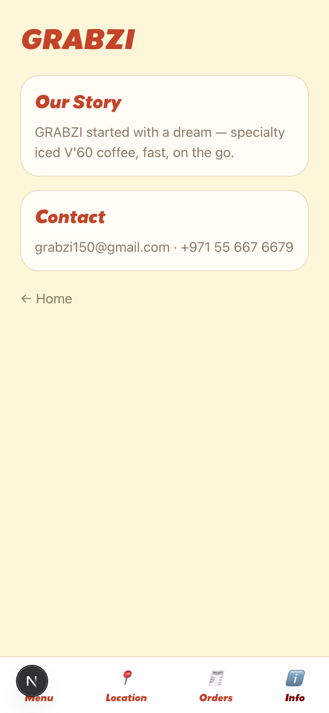

*— Технические детали (для разработки) —*

**Бизнес-логика (под капотом):** RSC `getBlocks()` → `GET /api/content?locale=en` (revalidate 60с) → массив `{key, title, body}`; при ошибке/пустом ответе — статический фолбэк в компоненте. Источник блоков — `InfoBlock` (CMS, `см. Часть VII «CMS»`).

**API:** `GET /api/content?locale=en` (без токена) → `[{key, title, body}]` (`см. Часть VIII`).

**Что видит другая сторона:** супер-админ заводит и редактирует эти блоки в CMS (`см. ADM-S-12, Часть V`).

**Метки:** ✅ реализовано · 📝 контент наполняется через админку.

---

## §IV.2. Финальные блоки клиентской части

### (1) Сводка бизнес-логики для заказчика

| Возможность | Что это значит для покупателя | Где в продукте |
|---|---|---|
| Однооэкранный заказ | Весь заказ — напитки, номер машины, телефон, оплата — на одном экране | O1 (`/order`) |
| Выдача по номеру машины (curbside) | Подъехал, нажал «I'm here», заказ выносят к машине | O1 + ST1-b |
| Дневной лимит «больше не делаем» | Видно, сколько осталось; последнюю порцию не «купят» двое | H1, L1, O1 + Часть VII |
| Статус в реальном времени | Дорожка Received→…→Handed over обновляется сама | ST1-a |
| История заказов / вход по телефону | Все заказы под одним номером, вход без пароля | OR1 |
| Купон за 👎 | Недоволен → получил скидку на следующий заказ | PUB-A-04/05 (🚧 API) |

### (2) Ограничения и статус интеграций (клиентская часть)

- **Оплата — mock-режим (🔧):** без Stripe-ключа платёж имитируется, реальные деньги не списываются;
  редирект `/orders/{id}?paid=1`. Для прода — Stripe merchant + TRN.
- **Вход — без OTP (🔧):** SMS-провайдер не выбран; вход по телефону без кода (`code:""`). Для прода —
  подключить SMS-провайдера; целевое поведение — SMS-OTP.
- **VAT 5 % не начисляется (⚠️):** `total = subtotal − coupon_discount`; VAT — требование/решение «включён в
  цену», статус «к настройке» (Часть IX, BR-VAT).
- **Телефон-regex расходится (⚠️):** фронт `^\+?\d{7,15}$` мягче бэк-канона `^\+\d{9,15}$` — привести к
  одному правилу (Часть IX).
- **UI EN-only:** инфраструктура AR/RTL заложена (V1.1).
- **Addon-конфигуратор «спит» (🧩):** таблицы допов есть, в публичном потоке GRABZI не используются.
- **A11y-замечание (⚠️):** степпер на O1 — 40px (< целевых 44px) — внести в реестр (Часть IX).

### (3) Реализовано на API, но без клиентского экрана в `grabzi-web` (🚧)

- **Оценка 👍/👎 и выдача купона** (`POST /api/orders/{id}/rate`) — кнопок на ST1 нет; логика на бэкенде
  (PUB-A-04).
- **Применение купона к позиции** (`couponId`/`couponItemIndex` при создании заказа) — выбора купона на O1
  нет; логика на бэкенде (PUB-A-05).
- **Просмотр своих купонов** (`GET /api/coupons`) — отдельного экрана купонов в клиенте нет.

> Эти возможности существуют на уровне контракта API и описаны как **целевые требования**; их клиентский UI —
> на этапе реализации (помечены 🚧). См. также Часть VII (процесс «купоны/рейтинг») и Часть V (управление
> купонами у супер-админа).


---

# Часть V. АДМИН-ПАНЕЛЬ СУПЕР-АДМИНА — USER STORIES (ADM-S)

> 📷 **Скриншоты супер-админки (desktop-референс на реальных данных GRABZI) — см. Приложение I** (галерея ADM-S-01…10). Здесь — бизнес-логика, AC и контракты; визуальные референсы вынесены в галерею, чтобы не дробить текст.

> _Происхождение блоков (🟦 JUICY · 🟨 GRABZI⁺ · 🟩 GRABZI) — см. Приложение F._

> **Канон достоверности — код.** Контракты, поля, коды ошибок и ролевой скоуп в этой части взяты
> построчно из `backend/app/routers/` (`dashboard.py`, `admin_orders.py`, `admin_catalog.py`,
> `admin_locations.py`, `admin_settings.py`, `admin_media.py`, `staff.py`, `coupons.py`, `content.py`),
> `backend/app/core/security.py`, `backend/app/services/{location_service,settings_registry}.py`.
> Сквозные процессы (платёж, лимит, статус точки, купоны, медиа, CMS) описаны один раз в **см. Часть VII**;
> здесь — только то, что специфично для экрана супер-админа. Модель данных — **см. Часть III**, дизайн-система
> — **см. Часть II**, коды ошибок — **см. Приложение C**.

> 🚧 **Дисклеймер контура B (ко всем историям ADM-S-01…ADM-S-12).** Этих экранов **нет** в `grabzi-web`:
> реализован только публичный клиент и экран кухни/KDS (см. Часть VI). Поэтому каждая история ниже —
> **экран проектируется по контракту API; визуальный референс — desktop Juicy admin (`app/`); мобильная
> версия — на этапе реализации.** Реальных мобильных скриншотов GRABZI для ADM-S **нет** — вместо 📷 даётся
> помеченный референс или 🚧-плейсхолдер (см. Приложение D, корзина B). Логика и критерии приёмки выведены
> из контракта API, а не из существующего UI.

---

## V.0 Что меняется в вашей ежедневной работе

> **Для заказчика (владельца сети).** Раньше управление точкой кофе — это блокнот, мессенджер и звонки
> бариста: «сколько продали?», «закончился ли сироп?», «сделай скидку постоянному клиенту». Админ-панель
> супер-админа превращает всё это в **один защищённый рабочий кабинет**, где вы видите сеть целиком и
> управляете ею сами, без программиста. Бариста по-прежнему работает на своей точке с планшетом (см. Часть
> VI) — а вы получаете «вид сверху» на всю сеть.

**Что у вас появляется (простыми словами):**

- **Утренний взгляд на бизнес.** Открыли дашборд — за выбранный период видно: выручка, сколько заказов,
  сколько порций продано, разбивка по точкам, по каким часам пик, какие напитки приносят больше всего денег
  и кто ваши самые активные клиенты. Можно отфильтровать по датам и по конкретной точке.
- **Все заказы сети под рукой.** Не нужно идти к бариста — вы видите любой оплаченный заказ: состав, номер
  машины, эмират, кто из персонала его взял, и **полную ленту событий** (создан → оплачен → взят → готов →
  выдан). Можно отфильтровать незакрытые заказы, заказы конкретного менеджера, заказы без исполнителя.
- **Карточка клиента.** По каждому покупателю — его заказы, платежи и купоны в одном месте; можно поправить
  имя, номер машины и эмират (например, по просьбе клиента).
- **Деньги и купоны.** Видите ленту всех платежей сети. Видите все купоны (компенсации за оценку 👎) и можете
  **аннулировать** ещё не использованный купон, если он выдан ошибочно.
- **Персонал — сами.** Заводите бариста и менеджеров, назначаете роль, **привязываете сотрудника к точке**
  (он будет видеть только её), отключаете уволенного — при этом история его смен сохраняется.
- **Каталог и цены — без разработчика.** Категории, напитки, цены, статус «черновик / опубликован / скрыт»,
  картинки. Допы и единицы измерения (модуль на вырост 🧩) — там же.
- **Точки и режим работы.** Заводите точки, задаёте рабочие часы (в т.ч. смену через полночь), дневной лимит
  «больше не делаем», ставите точку **на паузу** одним переключателем, вручную корректируете счётчик дня
  (если, скажем, продали офлайн) и смотрите историю включений/пауз/стоп-листа.
- **Настройки и контент.** Глобальные дефолты (валюта, часовой пояс, язык, контакты поддержки, включение
  опциональных модулей) и блоки информационной страницы (наша история, контакты, часы), а также загрузка
  картинок.

**Что делать ежедневно:** заглянуть в дашборд (выручка/пик/остаток лимита по точкам), просмотреть
незакрытые заказы при необходимости, отреагировать на купоны/жалобы.
**Что делать еженедельно:** свериться по выручке и топ-товарам, проверить персонал и стоп-листы, при
необходимости обновить цены/контент.
**Что потребует обучения персонала:** для супер-админа — навигация по разделам и фильтрам, понимание
разницы «пауза точки» (временно не принимаем) и «закрыто» (вне часов), правило купонов и корректировка
счётчика дня. Бариста/менеджеру обучение по своему рабочему месту — см. Часть VI.

> **Ролевой скоуп (важно для всей части).** Супер-админ (роль `super_admin`, сид `admin@grabzi.ae`) —
> **полный доступ ко всей сети**, без привязки к точке. Менеджер/бариста (роль `manager`, сид
> `barista@grabzi.ae`) ограничен своей точкой и **не видит** дашборд, клиентов, платежи, купоны, каталог,
> настройки, CMS — это отдельная проекция (см. Часть VI). Технически разделение даёт зависимость
> `require_super_admin` (роль обязана быть `super_admin`, иначе `403 FORBIDDEN`), а где экран общий с
> менеджером (заказы, статус точки, стоп-лист) — серверный скоуп `manager_scope_location` ограничивает
> менеджера его точкой (`403 FOREIGN_LOCATION` на чужую). См. `core/security.py`.

---

### ADM-S-01 · Дашборд сети

**Для заказчика:**
- **Проблема:** без сводки владелец узнаёт результаты дня «на слух» от бариста и не видит, какая точка и
  какой напиток реально зарабатывают, когда приходит пик и кто его лучшие клиенты.
- **Выгода:** один экран отвечает на главные вопросы бизнеса — сколько заработали, сколько продали, где и
  когда, что популярно, кто возвращается. С фильтром по датам и точке.
- **Что даёт бизнесу:** решения о ценах, часах, лимитах и закупке принимаются по цифрам, а не на ощущениях;
  виден утренний пик, под который надо ставить смену, и товары-локомотивы.

**Приоритет (MoSCoW):** Should.
**Как** супер-админ, **я хочу** видеть ключевые метрики сети за период и по точкам, **чтобы** управлять
бизнесом по фактам.

**Как это работает (простыми словами):** Владелец задаёт период (с какой по какую дату) и, при желании,
конкретную точку. Система считает только **оплаченные** заказы и показывает: выручку, число заказов, сколько
порций продано, среднюю порцию на заказ и средний чек, разбивку по точкам (с остатком дневного лимита на
сегодня), распределение заказов по часам (для графика пиков), список самых доходных напитков и список самых
активных клиентов (сколько заказов и на какую сумму, когда заказывал последний раз). Если за период продаж
не было — все числа показываются нулями, экран не «ломается».

**Критерии приёмки (AC):**
1. Показываются метрики: выручка (`revenue`), число заказов (`ordersCount`), продано напитков (`drinksSold`),
   средняя порция на заказ (`avgDrinksPerOrder`), средний чек (`avgOrderValue`).
2. Есть разбивка по точкам (`byLocation`): по каждой — выручка, число заказов, продано напитков, а также
   `soldToday` / `limit` / `remaining` (остаток лимита **на сегодня**, не за период).
3. Есть распределение заказов по часам (`ordersByHour`, ключи 0…23) для графика пиков.
4. Есть топ доходных напитков (`topProducts`: имя, выручка, количество) — до 20 позиций.
5. Есть топ клиентов (`topCustomers`: имя/телефон, число заказов, сумма, дата последнего заказа),
   отсортированный по числу заказов по убыванию.
6. Фильтры: период `from`/`to` и точка `location_id` применяются ко всем агрегатам, считающим за период.
7. В расчёт включаются **только оплаченные** заказы (`payment_status='paid'`); неоплаченные не учитываются.
8. Пустой период → все числа `0` (деление на ноль не происходит), экран отображается без ошибки.
9. **Ролевой скоуп:** доступно только роли `super_admin`; запрос от менеджера/без токена → `403`/`401`.
10. **Визуально** узнаваемо в стиле grabzi.ae (см. Часть II): карточки-метрики `.card`, акцент выручки
    терракотой `--color-brand`, прогресс остатка лимита — лаймом `--color-lime`; контраст ≥ AA; для desktop
    клавиатурная навигация по фильтрам и видимый фокус.

**Экран и стиль:** 🚧 ADM-S Dashboard (`/admin/dashboard`, проектируется) · токены: `--color-brand`,
`--color-lime`, `--radius-card` · компоненты: `.card`, графики. 📷 *референс — desktop Juicy admin
`app/` (дашборд); мобильная версия — на этапе реализации* (см. Приложение D, корзина B).

*— Технические детали (для разработки) —*
**Бизнес-логика (под капотом):** базовый фильтр `paid = [payment_status=='paid', created_at>=from,
created_at<=to, location_id==…]`. `revenue = SUM(Order.total)`, `ordersCount = COUNT(Order.id)`,
`drinksSold = SUM(OrderItem.quantity)`. `avgDrinksPerOrder`/`avgOrderValue` — деления с защитой от нуля.
`ordersByHour` — из `Order.created_at.hour`. `topProducts` — `GROUP BY OrderItem.drink_name`, сортировка по
`SUM(unit_price*quantity)`, `LIMIT 20`. `topCustomers` — `GROUP BY User.id`, сортировка по `COUNT(orders)`.
`byLocation` — выручка/заказы/напитки по `location_id` + `ls.sold_today`/`ls.remaining` на сегодня.
⚠️ Сумма выручки = `SUM(Order.total)`, где `total = subtotal − coupon_discount`; **VAT-строки нет**
(VAT 5 % не реализован, см. Часть IX) — дашборд показывает финальную цену, налог отдельно не выделяется.
**API:** `GET /api/admin/dashboard?from=&to=&location_id=` (роль `super_admin`). Ошибки: `401 AUTH_REQUIRED`,
`403 FORBIDDEN`. Полный контракт — см. Часть VIII.
**Что видит другая сторона:** клиент эти агрегаты не видит; для точки те же остатки лимита показываются
бариста на KDS (см. Часть VI, статус точки).
**Трассировка:** сущности Order/OrderItem/User/Location (Часть III) · процессы «дневной лимит», «оплата»
(Часть VII) · NFR p95 дашборда (Часть I).
**Метки:** 🚧 экран по контракту API (контур B) · ⚠️ VAT не выделяется.

---

### ADM-S-02 · Все заказы сети (список, детали, события)

**Для заказчика:**
- **Проблема:** чтобы разобрать спорный заказ или проверить работу смены, владельцу приходится спрашивать
  бариста и верить на слово — нет единого журнала.
- **Выгода:** любой оплаченный заказ сети открывается с полным составом, номером машины, исполнителем и
  лентой событий — видно, что и когда произошло.
- **Что даёт бизнесу:** прозрачность операций и быстрый разбор инцидентов (жалоба, возврат, спор по выдаче),
  контроль работы персонала.

**Приоритет (MoSCoW):** Should.
**Как** супер-админ, **я хочу** видеть все заказы сети с фильтрами и открывать карточку с историей событий,
**чтобы** контролировать операции и разбирать спорные случаи.

**Как это работает (простыми словами):** Владелец видит список оплаченных заказов всей сети (новые сверху).
Можно отфильтровать: только активные (ещё не выданные), заказы конкретного менеджера, заказы без исполнителя,
заказы конкретной точки. Открыв заказ, видит состав (с допами и граммовкой), сумму, номер машины и эмират,
отметку «клиент на месте», и **полную ленту событий** — когда создан, оплачен, взят в работу, готов, выдан,
кто это сделал. Менеджер тот же список видит **только по своей точке**; чужой заказ ему недоступен.

**Критерии приёмки (AC):**
1. Список содержит только оплаченные заказы (`payment_status='paid'`), отсортированные по `id` по убыванию.
2. Фильтры: `active` (true → только статусы `new/in_progress/ready`; false → завершённые/возврат),
   `manager_id`, `unassigned` (заказы без `manager_id`), `location_id`.
3. Строка заказа содержит: номер, статус, статус оплаты, точку, имя/телефон клиента, номер машины, эмират,
   `subtotal`/`couponDiscount`/`total`, исполнителя (`managerId`), оценку (`rating`), флаг `arrived`, состав
   позиций (имя, количество, цена, `paidByCoupon`, допы с граммовкой).
4. Карточка заказа (`GET …/{id}`) дополнительно содержит **ленту событий** (`events`): тип, статус, кто
   (`byStaffId`/`byUserId`), примечание, время.
5. **Ролевой скоуп:** супер-админ видит всю сеть и применяет `location_id`-фильтр; менеджер **принудительно**
   ограничен своей точкой (его `location_id`-фильтр игнорируется), обращение к заказу чужой точки → `403
   FOREIGN_LOCATION`. Несуществующий заказ → `404`.
6. **Визуально** (см. Часть II): карточки `.card`, бейджи статуса/оплаты, бейдж «🚗 HERE» при `arrived=true`;
   контраст ≥ AA; на desktop — таблица с клавиатурной навигацией.

**Экран и стиль:** 🚧 ADM-S Orders (`/admin/orders`, `/admin/orders/{id}`, проектируется). 📷 *референс —
desktop Juicy admin `app/` (заказы); мобильная версия — на этапе реализации.*

*— Технические детали (для разработки) —*
**Бизнес-логика (под капотом):** список — `select(Order).where(payment_status=='paid')` + опциональные
фильтры; скоуп: `manager_scope_location(staff)` → если не None, форсированно `Order.location_id == scope`
(перебивает `location_id`-параметр); иначе применяется `location_id`. Детали — `_order_row(o)` + лента
`o.events`. Изменение статусов заказа — **см. Часть VI** (ADM-M: take/status) и **см. Часть VII** (жизненный
цикл + WS); супер-админ использует те же эндпоинты без скоупа точки.
**API:** `GET /api/admin/orders?active=&manager_id=&location_id=&unassigned=` (роль `manager`/`super_admin`,
скоуп по роли), `GET /api/admin/orders/{id}`. Связанные действия (общие с KDS): `POST …/orders/{id}/take`,
`POST …/orders/{id}/status`, `POST …/orders/{id}/refund` 🧩. Ошибки: `403 FOREIGN_LOCATION`, `404 NOT_FOUND`,
`409 ORDER_NOT_PAID`. См. Часть VIII.
**Что видит другая сторона:** клиент видит свой заказ и статус на ST1 (Часть IV); бариста — на канбане KDS
(Часть VI). Лента `events` — общий журнал.
**Трассировка:** сущности Order/OrderItem/OrderEvent (Часть III) · процесс «жизненный цикл заказа + WS»
(Часть VII) · тесты orders (S9).
**Метки:** 🚧 экран по контракту API · ✅ контракт списка/деталей покрыт тестами · 🧩 refund — опц. модуль.

---

### ADM-S-03 · Клиенты (список, карточка, редактирование)

**Для заказчика:**
- **Проблема:** клиентская база «живёт» в заказах, и нет места, где по человеку видно всю его историю и можно
  поправить данные по его просьбе.
- **Выгода:** карточка клиента собирает его заказы, платежи и купоны; имя, номер машины и эмират можно
  отредактировать прямо из админки.
- **Что даёт бизнесу:** забота о постоянных клиентах, быстрый разбор обращений, основа для будущей лояльности.

**Приоритет (MoSCoW):** Should.
**Как** супер-админ, **я хочу** видеть клиентов и их историю и при необходимости править их данные, **чтобы**
поддерживать клиентов и разбирать обращения.

**Как это работает (простыми словами):** Владелец открывает список клиентов (новые сверху): телефон, имя,
номер машины, язык, дата регистрации. В карточке клиента — все его заказы (с составом), все платежи и все
купоны. Если клиент просит поправить имя, номер машины или эмират — это делается здесь же; номер машины
сохраняется заглавными буквами.

**Критерии приёмки (AC):**
1. Список клиентов содержит: `id`, телефон, имя, номер машины (`carPlate`), язык (`locale`), дату создания;
   сортировка по `id` по убыванию.
2. Карточка (`GET …/{id}`) содержит профиль + массивы: заказы (с составом), платежи, купоны.
3. Редактирование (`PATCH …/{id}`) принимает `name`, `carPlate`, `emirate`; переданные поля обновляются,
   непереданные — нет; `carPlate` нормализуется в UPPERCASE. Несуществующий клиент → `404`.
4. **PII (см. Часть I, PDPL):** телефон и номер машины — персональные данные; доступ только супер-админу,
   в сидах/демо — синтетические значения.
5. **Ролевой скоуп:** доступно только `super_admin` (`require_super_admin`); менеджер/без токена → `403`/`401`.
6. **Визуально** (см. Часть II): список `.card`, вкладки/секции «Заказы/Платежи/Купоны»; контраст ≥ AA.

**Экран и стиль:** 🚧 ADM-S Customers (`/admin/customers`, `/admin/customers/{id}`, проектируется). 📷
*референс — desktop Juicy admin `app/` (клиенты); мобильная версия — на этапе реализации.*

*— Технические детали (для разработки) —*
**Бизнес-логика (под капотом):** список — `select(User).order_by(User.id.desc())`. Карточка — профиль +
`orders` (`selectinload(Order.items)`), `payments` (`join(Order).where(user_id)`), `coupons`
(`where(user_id)`). PATCH меняет только переданные поля; `car_plate = body.carPlate.upper()`.
**API:** `GET /api/admin/customers`, `GET /api/admin/customers/{id}`, `PATCH /api/admin/customers/{id}`
(`{name?, carPlate?, emirate?}`) — все `require_super_admin`. Ошибки: `404 NOT_FOUND`, `403`/`401`.
**Что видит другая сторона:** клиент видит свои заказы/купоны через клиентское API (Часть IV); правка
админом отражается в его профиле.
**Трассировка:** сущности User/Order/Payment/Coupon (Часть III) · PDPL (Часть I).
**Метки:** 🚧 экран по контракту API · 🔒 PII.

---

### ADM-S-04 · Платежи (журнал транзакций)

**Для заказчика:**
- **Проблема:** без журнала платежей невозможно сверить деньги, найти конкретную транзакцию или понять статус
  оплаты по спорному заказу.
- **Выгода:** единая лента всех платежей сети с привязкой к заказу и клиенту.
- **Что даёт бизнесу:** финансовая прозрачность, сверка с эквайрингом, быстрый поиск по проблемной оплате.

**Приоритет (MoSCoW):** Should.
**Как** супер-админ, **я хочу** видеть журнал всех платежей, **чтобы** сверять деньги и разбирать спорные
оплаты.

**Как это работает (простыми словами):** Владелец видит ленту платежей (новые сверху): сумма, валюта,
провайдер, идентификатор транзакции у провайдера, статус, дата, а также номер заказа, телефон клиента и его
идентификатор. Это «зеркало» движения денег по сети. Сам платёжный поток (как именно происходит оплата,
mock-режим без Stripe-ключа) описан отдельно — **см. Часть VII**.

**Критерии приёмки (AC):**
1. Лента содержит по каждому платежу: `amount`, `currency`, `provider`, `providerId`, `status`, дату, а также
   `orderNumber`, `customerPhone`, `userId`; сортировка по `id` по убыванию.
2. Статус платежа — одно из `pending|succeeded|failed|refunded` (модель данных, Часть III).
3. **Это только просмотр:** создание/изменение платежей из этого экрана не предусмотрено (платежи рождаются в
   платёжном потоке — см. Часть VII).
4. **Ролевой скоуп:** доступно только `super_admin`; иначе `403`/`401`.
5. **Визуально** (см. Часть II): табличный список, бейджи статуса (`--color-success`/`--color-danger`);
   контраст ≥ AA.

**Экран и стиль:** 🚧 ADM-S Payments (`/admin/payments`, проектируется). 📷 *референс — desktop Juicy admin
`app/` (платежи); мобильная версия — на этапе реализации.*

*— Технические детали (для разработки) —*
**Бизнес-логика (под капотом):** `select(Payment).options(selectinload(Payment.order)).order_by(id.desc())`;
к каждому платежу добавляются `order.number`, `order.phone`, `order.user_id`. Запись/возврат денег — в
платёжном потоке и refund (Часть VII), не здесь.
**API:** `GET /api/admin/payments` (роль `super_admin`). Ошибки: `403`/`401`. См. Часть VIII.
**Что видит другая сторона:** клиент видит факт оплаты на ST1 (Часть IV); провайдер (Stripe/mock) — см.
Часть VII.
**Трассировка:** сущность Payment (Часть III) · процесс «оплата» (Часть VII).
**Метки:** 🚧 экран по контракту API · 🔧 в mock-режиме без Stripe-ключа `providerId`/`provider` отражают
имитацию (см. Часть VII).

---

### ADM-S-05 · Купоны (реестр и аннулирование)

**Для заказчика:**
- **Проблема:** купоны-компенсации (за оценку 👎) — это расход бизнеса; без реестра нельзя ни проверить, кому
  и за что выдан купон, ни отозвать ошибочный.
- **Выгода:** виден список всех купонов с их статусом и происхождением; активный купон можно аннулировать.
- **Что даёт бизнесу:** контроль над «раздачей скидок», защита от злоупотреблений, управляемость расхода.

**Приоритет (MoSCoW):** Could.
**Как** супер-админ, **я хочу** видеть все купоны и аннулировать ошибочные, **чтобы** контролировать расход
на компенсации.

**Как это работает (простыми словами):** Владелец видит реестр купонов: кому выдан, статус (действует /
использован / аннулирован), из какого заказа возник, в каком заказе и на какую позицию применён, сумма
скидки, даты. Если купон выдан ошибочно и **ещё не использован** — его можно аннулировать одним действием;
уже использованный или ранее аннулированный аннулировать нельзя. Как купон **появляется** (👎 после заказа)
и **применяется** (к одной позиции следующего заказа) — описано отдельно: **см. Часть VII**.

**Критерии приёмки (AC):**
1. Реестр содержит по каждому купону: `userId`, `status` (`active|used|void`), `sourceOrderId`, `usedOrderId`,
   `usedItemId`, `discountAmount`, даты выпуска/использования; сортировка по `id` по убыванию.
2. Аннулирование (`POST …/{id}/void`) переводит купон в `void` **только если** текущий статус `active`.
3. Попытка аннулировать неактивный купон (`used`/`void`) → `409 COUPON_NOT_ACTIVE`; несуществующий → `404`.
4. **Ролевой скоуп:** доступно только `super_admin`; иначе `403`/`401`.
5. **Визуально** (см. Часть II): список `.card`, бейджи статуса; действие «Void» с подтверждением; контраст ≥ AA.

**Экран и стиль:** 🚧 ADM-S Coupons (`/admin/coupons`, проектируется). 📷 *референс — desktop Juicy admin
`app/` (купоны); мобильная версия — на этапе реализации.*

*— Технические детали (для разработки) —*
**Бизнес-логика (под капотом):** реестр — `select(Coupon).order_by(id.desc())`. Void: загрузка купона; если
`status != 'active'` → `409 COUPON_NOT_ACTIVE`; иначе `status = 'void'`, commit. Выдача (👎) и применение
купона — клиентский поток (Часть VII); клиент видит свои купоны через `GET /api/coupons`.
**API:** `GET /api/admin/coupons`, `POST /api/admin/coupons/{id}/void` (роль `super_admin`). Ошибки:
`409 COUPON_NOT_ACTIVE`, `404 NOT_FOUND`, `403`/`401`. См. Часть VIII.
**Что видит другая сторона:** клиент получает купон после 👎 и применяет его при оформлении (Часть IV); после
void купон у клиента более недоступен.
**Трассировка:** сущность Coupon (Часть III) · процесс «купоны/рейтинг» (Часть VII).
**Метки:** 🚧 экран по контракту API · ❓ номинал/срок купона в коде не зафиксированы (открытый вопрос,
Часть IX) · ⚠️ `COUPON_NOT_ACTIVE` — raw-код, вне канонического `Err`-enum (см. расхождения, Приложение C).

---

### ADM-S-06 · Персонал (CRUD, роль, привязка к точке, отключение)

**Для заказчика:**
- **Проблема:** нанимая или увольняя бариста, владелец не должен звонить разработчику; и нельзя, чтобы один
  сотрудник видел заказы и деньги всей сети.
- **Выгода:** учётки персонала заводятся и отключаются самостоятельно; каждому назначается роль и **точка**,
  за пределы которой он не видит; уволенный отключается без потери истории его смен.
- **Что даёт бизнесу:** безопасность данных сети, управляемость персоналом, чистый аудит «кто что сделал».

**Приоритет (MoSCoW):** Must.
**Как** супер-админ, **я хочу** заводить и настраивать учётки персонала с ролью и привязкой к точке, **чтобы**
безопасно управлять командой.

**Как это работает (простыми словами):** Владелец видит список персонала (имя, почта, роль, точка, активна ли
учётка). Можно создать нового сотрудника (почта, пароль, имя, роль, точка), изменить его имя/роль/точку или
**отключить**. Менеджер, привязанный к точке, видит и обрабатывает только её заказы; супер-админ — всю сеть.
Уволенного **не удаляют физически**, а отключают — так история его смен и заказов остаётся достоверной.
Удалить самого себя нельзя.

**Критерии приёмки (AC):**
1. Список (`GET …/managers`) содержит по каждому: `id`, email, имя, роль (`manager`/`super_admin`), `locationId`,
   `disabled`.
2. Создание (`POST …/managers`): `email`, `password`, `name`, `role`, `locationId`. Роль вне множества
   `{manager, super_admin}` → `422`; занятый email → `409 EMAIL_TAKEN`. Пароль хранится хэшем (pbkdf2_sha256,
   см. Часть I), в открытом виде не возвращается.
3. Редактирование (`PATCH …/managers/{id}`): переданные `name`/`role`/`locationId`/`disabled` обновляются;
   роль валидируется тем же множеством; несуществующий → `404`.
4. Привязка к точке (`locationId`) определяет скоуп менеджера: он видит/трогает только заказы и статус своей
   точки (см. ADM-S-02, ADM-S-10, Часть VI); чужая точка → `403 FOREIGN_LOCATION`.
5. Отключение/«удаление» (`DELETE …/managers/{id}`) — **мягкое**: ставит `disabled=true` (история
   `by_staff_id` сохраняется). Удаление **самого себя** запрещено → `409 CANNOT_DELETE_SELF`. Отключённый
   сотрудник не может войти (`401 INVALID_CREDENTIALS`) и не проходит проверку токена.
6. **Ролевой скоуп:** управление персоналом доступно только `super_admin`; иначе `403`/`401`.
7. **Визуально** (см. Часть II): список `.card`, форма создания с полями `.field-input`, переключатель
   активности; контраст ≥ AA; на desktop — клавиатурная навигация по форме.

**Экран и стиль:** 🚧 ADM-S Staff (`/admin/staff`, проектируется). 📷 *референс — desktop Juicy admin `app/`
(персонал); мобильная версия — на этапе реализации.*

*— Технические детали (для разработки) —*
**Бизнес-логика (под капотом):** список/создание/правка/деактивация — `staff.py`. Создание:
`hash_password(password)`, проверка уникальности email. Вход — `POST /api/staff/login` (email+пароль → JWT,
HS256, TTL 30 дней; роль кладётся в токен). Скоуп — `manager_scope_location(staff)`. Soft-delete:
`s.disabled = True`; запрет self-delete по `staff_id == me_.id`.
**API:** `POST /api/staff/login` (общий вход персонала), `GET /api/staff/me`, `GET /api/staff/managers`,
`POST /api/staff/managers`, `PATCH /api/staff/managers/{id}`, `DELETE /api/staff/managers/{id}`
(CRUD — `require_super_admin`). Ошибки: `409 EMAIL_TAKEN`, `409 CANNOT_DELETE_SELF`, `401 INVALID_CREDENTIALS`,
`422 VALIDATION_ERROR`, `404 NOT_FOUND`. См. Часть VIII.
**Что видит другая сторона:** менеджер входит на KDS (Часть VI) и видит только свою точку; супер-админ — всю
сеть.
**Трассировка:** сущность StaffUser (Часть III) · авторизация персонала (Часть I) · скоуп заказов
(ADM-S-02, Часть VI).
**Метки:** 🚧 экран по контракту API · ✅ контракт CRUD покрыт тестами · ⚠️ `EMAIL_TAKEN`/`CANNOT_DELETE_SELF`/
`INVALID_CREDENTIALS` — raw-коды вне `Err`-enum (Приложение C).

---

### ADM-S-07 · Каталог: категории напитков

**Для заказчика:**
- **Проблема:** меню нужно структурировать (например «Ice V'60», сезонные линейки), и владелец не должен
  ждать разработчика, чтобы добавить или переименовать раздел.
- **Выгода:** категории заводятся и редактируются самостоятельно — с названием на нужных языках, картинкой/
  видео, активностью и порядком.
- **Что даёт бизнесу:** гибкое управление витриной, сезонные подборки, аккуратная навигация по меню.

**Приоритет (MoSCoW):** Should.
**Как** супер-админ, **я хочу** управлять категориями напитков, **чтобы** структурировать меню без разработчика.

**Как это работает (простыми словами):** Владелец видит категории по порядку сортировки и может создать новую
или отредактировать существующую: название (мультиязычное), картинка и видео-обложка, признак активности и
позиция в списке. Неактивная категория не показывается клиенту в меню.

**Критерии приёмки (AC):**
1. Список (`GET …/drink-categories`) отсортирован по `sort`; каждая — `name` (мультиязычный объект),
   `photoUrl`, `videoUrl`, `isActive`, `sort`.
2. Создание (`POST`) и обновление (`PATCH …/{id}`) принимают `name`, `photoUrl`, `videoUrl`, `isActive`, `sort`.
   Несуществующая категория при обновлении → `404`.
3. Название — мультиязычный объект `{ "en":…, "ru":…, "ar":… }` (см. i18n, Часть I/VII); клиенту показывается
   по его локали.
4. **Ролевой скоуп:** доступно только `super_admin`; иначе `403`/`401`.
5. **Визуально** (см. Часть II): список с превью, форма `.field-input`, переключатель активности; контраст ≥ AA.

**Экран и стиль:** 🚧 ADM-S Catalog · Categories (`/admin/catalog/categories`, проектируется). 📷 *референс —
desktop Juicy admin `app/` (каталог); мобильная версия — на этапе реализации.*

*— Технические детали (для разработки) —*
**Бизнес-логика (под капотом):** `admin_catalog.py` — `DrinkCategory` CRUD (`_cat`). Публичная выдача меню и
выбор локали (`pick_locale`) — см. Часть IV/VII.
**API:** `GET/POST /api/admin/catalog/drink-categories`, `PATCH /api/admin/catalog/drink-categories/{id}`
(весь роутер `require_super_admin`). Ошибки: `404 NOT_FOUND`, `403`/`401`. См. Часть VIII.
**Что видит другая сторона:** клиент видит активные категории в меню M1 (Часть IV).
**Трассировка:** сущность DrinkCategory (Часть III) · i18n (Часть VII).
**Метки:** 🚧 экран по контракту API.

---

### ADM-S-08 · Каталог: напитки (статус, цена, медиа)

**Для заказчика:**
- **Проблема:** цены, картинки и состав меню меняются часто; зависеть в этом от разработчика — медленно и
  дорого. Нужно ещё уметь готовить позицию «в черновике», не показывая её клиентам.
- **Выгода:** напитки заводятся и редактируются самостоятельно — название, описание, цена, картинка/видео, и
  главное **статус**: черновик (не виден), опубликован (в продаже), скрыт (снят с витрины).
- **Что даёт бизнесу:** мгновенное управление ассортиментом и ценами, безопасная подготовка новинок, контроль
  того, что видит клиент.

**Приоритет (MoSCoW):** Must.
**Как** супер-админ, **я хочу** управлять напитками, их ценами, медиа и статусом публикации, **чтобы** гибко
вести ассортимент без разработчика.

**Как это работает (простыми словами):** Владелец видит **все** напитки, включая черновики и скрытые. Может
создать новый (с уникальным адресом-slug) или отредактировать: название и описание (мультиязычные), цена,
картинка-превью и видео, категория, и статус. **Черновик** не показывается клиенту; **опубликован** — в
продаже; **скрыт** — убран с витрины. Картинку сначала загружают в хранилище (см. ADM-S-12 / Часть VII) и
подставляют ссылку в напиток.

**Критерии приёмки (AC):**
1. Список (`GET …/drinks`) включает **все** напитки независимо от статуса (черновики и скрытые тоже).
2. Создание (`POST`): обязательны `slug`, `name`, `categoryId`; `status` по умолчанию `draft`. Статус вне
   `{draft, published, hidden}` → `422`; занятый slug → `409 SLUG_TAKEN`.
3. Обновление (`PATCH …/{id}`): `slug`, `name`, `description`, `status`, `previewUrl`, `videoUrl`, `basePrice`,
   `kcal/protein/fat/carbs`, `categoryId`. Несуществующий → `404`.
4. Статус управляет видимостью для клиента: только `published` попадает в публичное меню (см. Часть IV);
   `draft`/`hidden` — нет.
5. Цена — `basePrice` в AED (см. Часть I, деньги/VAT). КБЖУ-поля присутствуют в модели, но в публичном потоке
   GRABZI не используются (`kcal=0`, см. _FACTS / Часть III).
6. Медиа подставляется как ссылка (`previewUrl`/`videoUrl`); сама загрузка файла — ADM-S-12 (Часть VII).
7. **Ролевой скоуп:** доступно только `super_admin`; иначе `403`/`401`.
8. **Визуально** (см. Часть II): карточка напитка с превью, ценой `--color-brand`, бейджем статуса; форма
   `.field-input`; контраст ≥ AA.

**Экран и стиль:** 🚧 ADM-S Catalog · Drinks (`/admin/catalog/drinks`, проектируется). 📷 *референс — desktop
Juicy admin `app/` (каталог напитков); мобильная версия — на этапе реализации.*

*— Технические детали (для разработки) —*
**Бизнес-логика (под капотом):** `admin_catalog.py` — `Drink` CRUD (`_drink`, включает `bindings`). Валидация
статуса и уникальности slug при создании. Публичная выдача (`status=='published'`) — см. Часть IV. Привязки
допов задаются отдельным эндпоинтом — см. ADM-S-09.
**API:** `GET/POST /api/admin/catalog/drinks`, `PATCH /api/admin/catalog/drinks/{id}` (`require_super_admin`).
Ошибки: `409 SLUG_TAKEN`, `422 VALIDATION_ERROR`, `404 NOT_FOUND`. См. Часть VIII.
**Что видит другая сторона:** клиент видит только опубликованные напитки в меню M1 и карточке P1 (Часть IV);
бариста — снэпшот имени/цены в заказе (Часть VI).
**Трассировка:** сущность Drink (Часть III) · медиа (Часть VII) · i18n (Часть VII).
**Метки:** 🚧 экран по контракту API · ⚠️ `SLUG_TAKEN` — raw-код вне `Err`-enum (Приложение C).

---

### ADM-S-09 · Каталог: допы, единицы, категории допов + привязки drink × addon 🧩

**Для заказчика:**
- **Проблема:** в будущем напитки могут собираться из добавок (сиропы, топпинги) с правилами «сколько можно
  положить»; без модели допов это невозможно настроить.
- **Выгода:** заложен полный конструктор добавок — единицы измерения, категории добавок (как выбирать:
  одну/несколько/счётчиком), сами добавки и **правила привязки** добавки к напитку (мин/по умолчанию/макс
  порций, граммовка, цена-override).
- **Что даёт бизнесу:** готовность к расширению меню и допродажам без переделки системы.

**Приоритет (MoSCoW):** Could (🧩 опциональный модуль — в публичном потоке GRABZI «спит»).
**Как** супер-админ, **я хочу** настраивать добавки, единицы и их привязку к напиткам, **чтобы** в будущем
собирать кастомизируемые напитки и допродажи.

**Как это работает (простыми словами):** Этот модуль — «на вырост». Владелец заводит единицы измерения (г, мл),
категории добавок с типом выбора (одна / несколько / счётчиком), сами добавки (с категорией, единицей, ценой,
КБЖУ), и затем для напитка задаёт список привязок: какие добавки доступны, сколько порций минимум/по
умолчанию/максимум, граммовка на порцию и цена (если не указана — добавка бесплатна, входит в стоимость). В
текущем публичном клиенте GRABZI конфигуратор не задействован (см. Часть IV) — но контракт API существует.

**Критерии приёмки (AC):**
1. Единицы (`units`): создание принимает уникальный `code` и `name` (мультиязычный); дубль кода → `409
   CODE_TAKEN`.
2. Категории допов (`addon-categories`): `name`, `iconUrl`, `isActive`, `selectionType` ∈ `{single, multi,
   counter}`; иной тип → `422`.
3. Добавки (`addons`): `name`, `imageUrl`, `categoryId`, `unitId`, КБЖУ-на-100, `basePrice`, `isActive`.
4. Привязки (`PUT …/drinks/{id}/bindings`) — **полная замена** списка: каждая привязка `addonId`,
   `priceOverride` (null → бесплатно), `minPortions`, `defaultPortions`, `maxPortions`, `portionAmount`,
   `selectionTypeOverride`. Несуществующая добавка → `409 ADDON_NOT_FOUND:{id}`; нарушение
   `0 ≤ min ≤ default ≤ max` → `422 PORTIONS_RANGE_INVALID`.
5. **Ролевой скоуп:** доступно только `super_admin`; иначе `403`/`401`.
6. **Визуально** (см. Часть II): редактор привязок таблицей со степперами; контраст ≥ AA.

**Экран и стиль:** 🚧 ADM-S Catalog · Addons (`/admin/catalog/addons`, проектируется). 📷 *референс — desktop
Juicy admin `app/` (конструктор допов); мобильная версия — на этапе реализации.*

*— Технические детали (для разработки) —*
**Бизнес-логика (под капотом):** `admin_catalog.py` — CRUD `Unit`/`AddonCategory`/`Addon` + `set_bindings`
(полная замена `DrinkAddon`: валидация существования addon и неравенства порций, затем
`d.addon_links.clear()` и пересоздание). Снэпшоты допов в заказе (имя/граммовка) — Часть III (OrderItemAddon).
**API:** `GET/POST /api/admin/catalog/units`, `GET/POST/PATCH /api/admin/catalog/addon-categories`,
`GET/POST/PATCH /api/admin/catalog/addons`, `PUT /api/admin/catalog/drinks/{id}/bindings`
(`require_super_admin`). Ошибки: `409 CODE_TAKEN`, `409 ADDON_NOT_FOUND:{id}`, `422 PORTIONS_RANGE_INVALID`,
`422 VALIDATION_ERROR`, `404 NOT_FOUND`. См. Часть VIII.
**Что видит другая сторона:** в текущем публичном клиенте допы не показываются (модуль спит, Часть IV);
заложены под P1-конфигуратор V1.1.
**Трассировка:** сущности Unit/AddonCategory/Addon/DrinkAddon/OrderItemAddon (Часть III).
**Метки:** 🧩 опциональный модуль (в потоке GRABZI спит) · 🚧 экран по контракту API · ⚠️ `CODE_TAKEN`/
`ADDON_NOT_FOUND`/`PORTIONS_RANGE_INVALID` — raw-коды вне `Err`-enum (Приложение C).

---

### ADM-S-10 · Локации (CRUD, часы, лимит, пауза, корректировка дня, история)

**Для заказчика:**
- **Проблема:** точка — это режим работы, дневной лимит «больше не делаем» и возможность временно перестать
  принимать заказы; всё это должно управляться владельцем, а действия — фиксироваться.
- **Выгода:** точки заводятся и настраиваются полностью — адрес, рабочие часы (в т.ч. смена через полночь),
  дневной лимит, пауза одним переключателем, ручная корректировка счётчика дня и история всех включений/пауз/
  стоп-листа.
- **Что даёт бизнесу:** контроль над пропускной способностью и свежестью (лимит), оперативное управление
  («встал — поставил на паузу»), аудит операций по точке.

**Приоритет (MoSCoW):** Must.
**Как** супер-админ, **я хочу** заводить и настраивать точки, их часы, лимит и паузу, **чтобы** управлять
работой сети и её пропускной способностью.

**Как это работает (простыми словами):** Владелец видит точки с их статусом «прямо сейчас» (открыта / на
паузе / закрыта по часам / выключена) и остатком дневного лимита на сегодня. Может создать/отредактировать
точку: название и описание (мультиязычные), адрес, координаты, рабочие часы по дням (поддерживается смена
через полночь), часовой пояс, дневной лимит (или «без лимита»), цвет, картинка, активность, порядок. Может
**поставить точку на паузу/снять с паузы** — это временная остановка приёма заказов, не то же самое, что
«закрыто по часам». Может вручную **скорректировать счётчик дня** (например, продали офлайн — увеличить, или
ошибка — сбросить). И смотреть **историю** событий точки с длительностью пауз. Статус «прямо сейчас»
вычисляется, его нельзя проставить вручную — он следует из активности, паузы и часов работы. Подробно про
дневной лимит и статус точки — **см. Часть VII**.

**Критерии приёмки (AC):**
1. Список (`GET …/locations`) и карточка содержат: название, описание, адрес, координаты, рабочие часы,
   часовой пояс, дневной лимит, флаг приёма заказов, цвет, картинку, активность, сортировку, а также
   вычисляемые `soldToday`/`remaining`/`status`/`isOpen`.
2. Создание (`POST`) и обновление (`PATCH …/{id}`): `PATCH` меняет **только переданные** поля (отличает
   «не передано» от явного `null` — можно снять лимит, передав `dailyDrinkLimit: null`). Несуществующая →
   `404 LOCATION_NOT_FOUND`.
3. Рабочие часы — объект по дням (`mon…sun`, массив интервалов `{open, close}`); пустой массив дня = выходной;
   поддерживается окно через полночь (close < open). Статус `open/paused/closed/inactive` **вычисляется**, не
   хранится (см. Часть VII).
4. Пауза (`POST …/{id}/pause` `{acceptingOrders, reason?}`) — **только `super_admin`**; идемпотентна (повтор
   того же значения не плодит событий); каждое реальное изменение пишет событие (`open`/`pause`) в историю.
5. Счётчик дня: просмотр (`GET …/{id}/daily?date=`) возвращает `soldDrinks`/`limit`/`remaining`; корректировка
   (`POST …/{id}/adjust-day` `{date?, setCommitted?|delta?}`) задаёт абсолютное значение или сдвиг, не ниже 0.
6. История (`GET …/{id}/history`) — события `open`/`pause`/`drink_stopped`/`drink_resumed` с автором и
   причиной; для пауз вычисляется `durationMinutes` (pause → ближайший следующий open).
7. **Ролевой скоуп:** CRUD/пауза/daily/adjust/history — **только `super_admin`** (`403`/`401` иначе).
   Стоп-лист и панель «статус точки» — общие с менеджером, **см. Часть VI** (там менеджер ограничен своей
   точкой; чужая → `403 FOREIGN_LOCATION`).
8. **Визуально** (см. Часть II): карточка точки с бейджем статуса и прогрессом лимита (`--color-lime`),
   редактор часов по дням, переключатель паузы; контраст ≥ AA; на desktop — клавиатурная навигация.

**Экран и стиль:** 🚧 ADM-S Locations (`/admin/locations`, `/admin/locations/{id}`, проектируется). 📷
*референс — desktop Juicy admin `app/` (локации); мобильная версия — на этапе реализации.*

*— Технические детали (для разработки) —*
**Бизнес-логика (под капотом):** `admin_locations.py` — `Location` CRUD (`_admin_row` отдаёт вычисляемые
`status=ls.effective_status`, `isOpen=ls.is_open`, `soldToday`, `remaining`); `PATCH` использует
`model_fields_set`. Пауза — `LocationStatusEvent(action='open'|'pause')`, идемпотентна. `adjust-day` —
`ls.get_counter_row` + `setCommitted`/`delta` (clamp ≥0). История — длительность пауз считается на чтении.
Вычисление статуса/лимита/часов (включая полночь) — `services/location_service.py` (см. Часть VII).
**API:** `GET/POST /api/admin/locations`, `PATCH /api/admin/locations/{id}`,
`POST /api/admin/locations/{id}/pause`, `GET /api/admin/locations/{id}/daily`,
`POST /api/admin/locations/{id}/adjust-day`, `GET /api/admin/locations/{id}/history`
(все — `require_super_admin`). Стоп-лист (`…/{id}/stops` GET/POST/DELETE) и `GET /api/admin/location-status`
— `require_manager_or_super` + скоуп (см. Часть VI). Ошибки: `404 LOCATION_NOT_FOUND`, `403 FOREIGN_LOCATION`,
`403`/`401`. См. Часть VIII.
**Что видит другая сторона:** клиент видит статус и остаток точки на L1/O1 (Часть IV); бариста — статус и
лимит в хедере KDS, стоп-лист — на KDS (Часть VI).
**Трассировка:** сущности Location/LocationDailyCounter/LocationStatusEvent/LocationDrinkStop (Часть III) ·
процессы «дневной лимит», «статус точки», «стоп-лист» (Часть VII) · тесты locations/limits (S9).
**Метки:** 🚧 экран по контракту API · ✅ логика статуса/лимита покрыта юнит-тестами.

---

### ADM-S-11 · Настройки сети

**Для заказчика:**
- **Проблема:** общесетевые параметры (валюта, часовой пояс, язык по умолчанию, контакты поддержки, включение
  опциональных модулей) разбросаны или «зашиты» в код — менять их без разработчика нельзя.
- **Выгода:** единый экран настроек с редактируемыми бизнес-дефолтами и **только для чтения** статусом
  интеграций (подключён ли Stripe, включён ли вход по SMS-коду) — без показа секретов.
- **Что даёт бизнесу:** самостоятельная настройка продукта и прозрачность готовности к запуску.

**Приоритет (MoSCoW):** Should.
**Как** супер-админ, **я хочу** управлять глобальными настройками и видеть статус интеграций, **чтобы**
настраивать продукт и понимать готовность к запуску.

**Как это работает (простыми словами):** Экран делится на две зоны. **Редактируемая** — бизнес-дефолты:
валюта (AED), часовой пояс по умолчанию, язык по умолчанию, контакты поддержки (email/телефон), дефолтный
дневной лимит, включение опциональных модулей (карточка напитка, купоны). **Только для чтения** — статус
интеграций: подключён ли Stripe и его вебхук, включён ли вход по SMS-коду, какой алгоритм токенов, подключён
ли Redis, тайм-аут оценки, список языков. Секреты и пароли здесь **не показываются** — только «подключено /
не подключено». Параметры конкретной точки (часы, лимит) здесь **не дублируются** — они в разделе точек
(ADM-S-10).

**Критерии приёмки (AC):**
1. `GET …/settings` возвращает `editable` (вкладки `general` и `defaults` с текущими значениями) и
   `readonly.integrations`.
2. Редактируемые ключи (из реестра): `default_daily_drink_limit`, `display_currency` (`AED`),
   `default_timezone`, `default_locale` (`en|ru|ar`), `support_contact_email`, `support_contact_phone`,
   `feature_product_detail` (вкл. карточку P1), `feature_coupons` (вкл. купоны).
3. `PATCH …/settings` принимает набор ключей; неизвестный ключ → `422 UNKNOWN_SETTING_KEY`; невалидное
   значение по типу/формату (bool/int/enum/email/phone/tz) → `422 INVALID_SETTING` с причиной.
4. **Read-only интеграции** показывают только статус (`configured|missing`) и неконфиденциальные значения
   (`otpEnabled`, `jwtAlg`, `ratingTimeoutMinutes`, `locales`); секреты/строка БД не раскрываются
   (`database: "masked"`).
5. Per-location параметры здесь **не редактируются** (они в ADM-S-10).
6. **Ролевой скоуп:** доступно только `super_admin`; иначе `403`/`401`.
7. **Визуально** (см. Часть II): вкладки настроек, поля `.field-input`, секция «Интеграции» с бейджами
   статуса (`--color-success`/`--color-muted`); контраст ≥ AA.

**Экран и стиль:** 🚧 ADM-S Settings (`/admin/settings`, проектируется). 📷 *референс — desktop Juicy admin
`app/` (настройки); мобильная версия — на этапе реализации.*

*— Технические детали (для разработки) —*
**Бизнес-логика (под капотом):** `admin_settings.py` + `services/settings_registry.py`. `SETTINGS_SCHEMA` —
единый реестр (тип/дефолт/вкладка/валидация); новый параметр = одна строка без миграции. `_integrations()` —
read-only зеркало env (через `core/config.settings`), отдаёт `configured|missing`, без значений секретов.
PATCH валидирует каждый ключ через `_validate` (типы `bool/int_or_null/enum/email/phone/tz`).
**API:** `GET /api/admin/settings`, `PATCH /api/admin/settings` (`require_super_admin`). Ошибки:
`422 UNKNOWN_SETTING_KEY`, `422 INVALID_SETTING`. См. Часть VIII.
**Что видит другая сторона:** флаги `feature_product_detail`/`feature_coupons` управляют доступностью
соответствующих клиентских модулей (Часть IV); язык/валюта влияют на витрину.
**Трассировка:** сущность AppSetting (Часть III) · статус интеграций (Часть I) · модули P1/купоны (Часть IV).
**Метки:** 🚧 экран по контракту API · 🔧 интеграции в статусе `missing` означают mock/заглушку (Stripe-mock,
OTP-заглушка — см. Часть I/VII) · ⚠️ `UNKNOWN_SETTING_KEY`/`INVALID_SETTING` — raw-коды вне `Err`-enum.

---

### ADM-S-12 · CMS-контент и медиа

**Для заказчика:**
- **Проблема:** тексты информационной страницы (наша история, контакты, часы) и картинки меню нельзя менять
  без разработчика — а они меняются регулярно.
- **Выгода:** блоки контента редактируются самостоятельно (мультиязычно, с порядком и активностью), а
  картинки загружаются в хранилище и подставляются в каталог/контент.
- **Что даёт бизнесу:** живой бренд-контент и актуальная информация без зависимости от разработки.

**Приоритет (MoSCoW):** Could.
**Как** супер-админ, **я хочу** управлять блоками информационной страницы и загружать медиа, **чтобы**
держать бренд-контент и картинки актуальными без разработчика.

**Как это работает (простыми словами):** Владелец редактирует блоки информационной страницы (например «Наша
история», «Контакты», «Часы работы»): у каждого — ключ, заголовок и текст на нужных языках, порядок и
активность. Клиент на инфо-странице видит только активные блоки на своём языке. Картинки (для напитков,
категорий, контента) загружаются в облачное хранилище, а в ответ приходит ссылка, которую подставляют в
нужное поле каталога. Как именно работают хранилище и выбор языка — **см. Часть VII**.

**Критерии приёмки (AC):**
1. Блоки (`GET /api/admin/content`) — список по `sort`; каждый: `key`, `title` (мультиязычный), `body`
   (мультиязычный), `sort`, `isActive`.
2. Создание (`POST`): `key` уникален — дубль → `409 KEY_TAKEN`. Обновление (`PATCH …/{id}`) меняет **только
   переданные** поля (`title`/`body`/`sort`/`isActive`); несуществующий → `404`.
3. Публичная выдача (`GET /api/content?locale=`) возвращает только активные блоки, текст — по запрошенной
   локали с фолбэком (см. i18n, Часть VII).
4. Загрузка медиа (`POST /api/admin/media`, multipart `file` + `folder`) кладёт файл в хранилище и возвращает
   `{key, url, …}`; ссылка затем подставляется в поле каталога/контента обычным PATCH (см. ADM-S-08).
5. **Ролевой скоуп:** CMS-CRUD и загрузка медиа — только `super_admin`; иначе `403`/`401`. Публичная выдача
   контента — без авторизации.
6. **Визуально** (см. Часть II): редактор блоков с языковыми вкладками, drag-сортировка, загрузчик файла с
   превью; контраст ≥ AA.

**Экран и стиль:** 🚧 ADM-S CMS & Media (`/admin/content`, `/admin/media`, проектируется). 📷 *референс —
desktop Juicy admin `app/` (контент/медиа); мобильная версия — на этапе реализации.*

*— Технические детали (для разработки) —*
**Бизнес-логика (под капотом):** `content.py` — `InfoBlock` CRUD (super_admin) + публичная выдача
(`pick_locale`/`t`). `admin_media.py` — `storage.upload(file, folder)` (S3/MinIO; fallback на URL-строки,
см. Часть VII). Медиа не привязывается автоматически — ссылка подставляется в каталог отдельным PATCH.
**API:** `GET/POST /api/admin/content`, `PATCH /api/admin/content/{id}` (super_admin),
`GET /api/content?locale=` (публично), `POST /api/admin/media` (super_admin, multipart). Ошибки:
`409 KEY_TAKEN`, `404 NOT_FOUND`, `403`/`401`. См. Часть VIII.
**Что видит другая сторона:** клиент видит активные блоки на инфо-экране I1 (Часть IV); загруженные картинки
— в меню/карточке напитка.
**Трассировка:** сущность InfoBlock (Часть III) · процессы «CMS», «медиа», «i18n» (Часть VII).
**Метки:** 🚧 экран по контракту API · 🔧 S3/MinIO реальный, при отсутствии — fallback на URL-строки
(Часть VII) · ⚠️ `KEY_TAKEN` — raw-код вне `Err`-enum · 📝 `PATCH …/content/{id}` при отсутствии блока
отдаёт `Err.LOCATION_NOT_FOUND` как generic NOT_FOUND (см. расхождения ниже).


---

# Часть VI. ЭКРАН КУХНИ / KDS — USER STORIES (ADM-M)

> _Происхождение блоков (🟦 JUICY · 🟨 GRABZI⁺ · 🟩 GRABZI) — см. Приложение F._

> Канон достоверности этой части — код прототипа: `grabzi-web/src/app/admin/kitchen/page.tsx`,
> `grabzi-web/src/app/admin/login/page.tsx`, `grabzi-web/src/lib/api.ts`,
> `backend/app/routers/admin_orders.py`, `backend/app/routers/admin_locations.py`,
> `backend/app/routers/staff.py`, `backend/app/routers/ws.py`, `backend/app/services/order_flow.py`.
> Дизайн-система — см. Часть II. Сквозные процессы (жизненный цикл заказа + realtime, дневной лимит,
> стоп-лист, статус точки, возврат) — см. Часть VII. Модель данных и enum — см. Часть III.
> Коды ошибок — см. Приложение C. Супер-админ как отдельная роль — см. Часть V.

---

### Для заказчика (кто что может и почему)

**Экран кухни (KDS — Kitchen Display System)** — это рабочее место бариста-менеджера у кофейной станции.
Планшет или большой экран, на котором живёт очередь оплаченных заказов: видно, что готовить прямо сейчас,
кто из клиентов уже подъехал к окну выдачи, сколько порций ещё можно продать сегодня. Менеджер ведёт заказ
пальцем по трём шагам — «взял в работу» → «готово» → «отдал клиенту» — и при этом не отвлекается на сеть,
цены, других сотрудников или другие точки.

В системе две рабочие роли, и они намеренно разные:

- **ADM-M — бариста/менеджер точки.** Это «руки на станции». Он видит и обрабатывает **только** заказы и
  статус **своей** точки, может временно поставить точку на паузу и вести стоп-лист (отметить, что какой-то
  напиток сегодня кончился). Он **не видит** другие точки сети и **не управляет** каталогом, ценами,
  персоналом, платежами и аналитикой. Так данные сети защищены, а у сотрудника точки нет лишних
  полномочий и нет соблазна по ошибке что-то поменять «на всю сеть».
- **ADM-S — супер-админ.** Это владелец/администратор всей сети: каталог и цены, все точки, персонал,
  заказы, платежи, купоны, настройки, контент и аналитика. Полное описание его экранов — **см. Часть V**.

> Зачем разделять. Бариста в час пик не должен «утонуть» в управлении сетью — ему нужен один простой
> экран-очередь. Владелец, наоборот, должен видеть всё и менять всё. Поэтому кухня — это **узкий
> операционный инструмент менеджера**, а супер-админка — широкий управленческий пульт.

> ⚠️ **Важное ограничение текущего прототипа (для заказчика — без жаргона).** Экран кухни рассчитан на
> **бариста-менеджера, привязанного к одной точке**. Если на кухню зайдёт супер-админ (он не привязан к
> точке), экран не сможет показать «остаток дня по одной точке» и выдаст ложное сообщение «сессия истекла».
> Это не поломка входа — это незавершённый сценарий «супер-админ за кухонным планшетом»; в проде кухней
> пользуется менеджер точки. Технические подробности дефекта — ниже (ADM-M-04) и в Части IX.

### Что меняется в ежедневной работе бариста/менеджера (операционная памятка)

1. **Открыть смену:** войти по рабочей почте и паролю (ADM-M-01), убедиться, что точка «open».
2. **Работать с очередью на планшете:** новые оплаченные заказы появляются сами; вести каждый по кнопкам
   «взял → готов → отдал» (ADM-M-02, ADM-M-03).
3. **Выдавать по номеру машины:** когда у карточки загорается «🚗 HERE» — клиент подъехал; вынести заказ,
   сверив номер машины и эмират на карточке (ADM-M-02).
4. **Следить за дневным лимитом:** прогресс-бар в шапке показывает, сколько уже продано и сколько осталось
   (ADM-M-04).
5. **Вести стоп-лист:** кончился сироп/ингредиент — отметить напиток как недоступный, чтобы его перестали
   заказывать (ADM-M-05); вернуть, когда снова есть.
6. **Поставить точку на паузу** при необходимости (наплыв, технический перерыв) — приём заказов
   останавливается (ADM-M-04 / см. Часть VII «статус точки»).

> Обучение персонала: 10–15 минут — три кнопки заказа, смысл «🚗 HERE» и стоп-лист. Остальное —
> у супер-админа.

---

### Канбан кухни — единая таблица «статус ↔ колонка ↔ кнопка»

Канбан состоит **всегда из 4 колонок**. Каждая колонка собирает заказы одного статуса; на карточке —
одна кнопка действия, переводящая заказ в следующий статус. **«HANDED OVER» — это кнопка** внутри колонки
READY · HANDOUT, **а не отдельная пятая колонка**.

Канон — `COLS` в `grabzi-web/src/app/admin/kitchen/page.tsx` (строки 7–12) и `TRANSITIONS` в
`backend/app/services/order_flow.py` (строки 55–59).

| Статус (`Order.status`) | Колонка (заголовок) | Кнопка на карточке | Переход | Цвет колонки/кнопки |
|---|---|---|---|---|
| `new` | **NEW** | «TAKE ▶» | `new → in_progress` (+ закрепляется `manager_id`) | `#4A56E2` (сине-фиолетовый) |
| `in_progress` | **MAKING** | «READY ✓» | `in_progress → ready` | `--color-lowstock` (жёлтый) |
| `ready` | **READY · HANDOUT** | «HANDED OVER ✓» | `ready → completed` | `--color-instock` (зелёный) |
| `completed` | **DONE** | — (кнопки нет; карточка остаётся видимой) | — | `--color-outofstock` (серый) |

> Заголовок каждой колонки показывает счётчик: `<TITLE> · <N>` (число карточек). Пустая колонка
> отображает «— empty —».

**Что попадает на кухню (фильтр выборки).** Менеджеру показываются только заказы, которые **оплачены**
(`payment_status = 'paid'`) и находятся в активных или завершённом статусах. Активные статусы —
`ACTIVE_STATUSES = ["new", "in_progress", "ready"]` (`order_flow.py:18`); фронт запрашивает
`/api/admin/orders?active=true`, поэтому в DONE попадают завершённые заказы того же запроса (см. ADM-M-02).
Неоплаченные черновики на кухню не попадают.

**Независимый флаг `🚗 HERE`.** Отметка «клиент приехал» (`arrived_at` на заказе) — **не часть цепочки
статусов**. Клиент может нажать «I'm here 🚗» на любой стадии (см. Часть IV, история ST1). На кухне это
показывается отдельным бейджем и красной рамкой карточки, не двигая заказ между колонками.

---

### ADM-M-01 · Вход персонала — `/admin/login`  🟩 GRABZI


**Для заказчика:**
- **Проблема:** к рабочему экрану кухни нельзя пускать кого попало — это очередь заказов с номерами машин
  и телефонами клиентов; нужен контролируемый вход для сотрудника.
- **Выгода:** сотрудник открывает смену за пару секунд — рабочая почта и пароль, и он на кухне. Не нужны
  отдельные коды, приложения, SMS.
- **Что даёт бизнесу:** быстрый старт смены и понятная ответственность — каждый заказ потом «подписан»
  тем, кто его взял; доступ к операционке отделён от управления сетью.

**Приоритет (MoSCoW):** Must.

**Как** бариста/менеджер, **я хочу** войти по рабочей почте и паролю, **чтобы** получить доступ к очереди
заказов своей точки и начать смену.

**Как это работает (простыми словами):** Сотрудник вводит рабочую почту и пароль и нажимает «Sign in».
Если данные верны — система запоминает его на этом устройстве (не нужно входить заново каждый раз) и сразу
открывает экран кухни. Если почта или пароль неверны — он видит понятное «Wrong email or password.» и
остаётся на форме. Пока сотрудник «помнится» устройством, переход на кухню не спрашивает вход повторно;
если же доступ перестал действовать — кухня вернёт его на эту же форму входа.

**Критерии приёмки (AC):**
1. Форма содержит поле «email», поле «password» (скрытый ввод) и кнопку «Sign in».
2. Успешный вход (верные учётные данные) → сотрудник запоминается на устройстве и автоматически
   перенаправляется на `/admin/kitchen`.
3. Неверные учётные данные (ответ 401) → показывается сообщение «Wrong email or password.»; на любой иной
   сбой — «Can't sign in.». Сотрудник остаётся на форме.
4. На время отправки кнопка переходит в состояние ожидания (подпись «…») и **заблокирована** (`disabled`)
   — повторная отправка невозможна.
5. Отключённый сотрудник (`disabled = true`) войти не может — система отвечает как на неверные данные (401).
6. Навигация клиентского приложения (нижняя/верхняя) на `/admin/*` **скрыта** — см. Часть II.
7. **Визуально** узнаваемо в стиле grabzi.ae: тёплый кремовый фон, заголовок «Staff sign in» фирменным
   жирным курсивом-терракотой, поля со скруглением, кнопка-пилюля терракотового цвета (сверка с
   `reference_design/`). Для разработки: контраст текста кнопки (белый на `--color-brand`) ≥ AA,
   tap-target кнопки ≥ 44px.
8. **A11y:** поля имеют видимые подписи-плейсхолдеры; видимый фокус; клавиатурный ввод.

**Экран и стиль:** ADM-M вход (`/admin/login`) · токены: `--color-brand`, `--color-cream-yellow`,
`--color-border`, `--radius-pill` · компоненты: `.btn-primary`, поля ввода (inline-стиль `inp`,
`borderRadius: 12`), `.badge.badge--out` (текст ошибки).

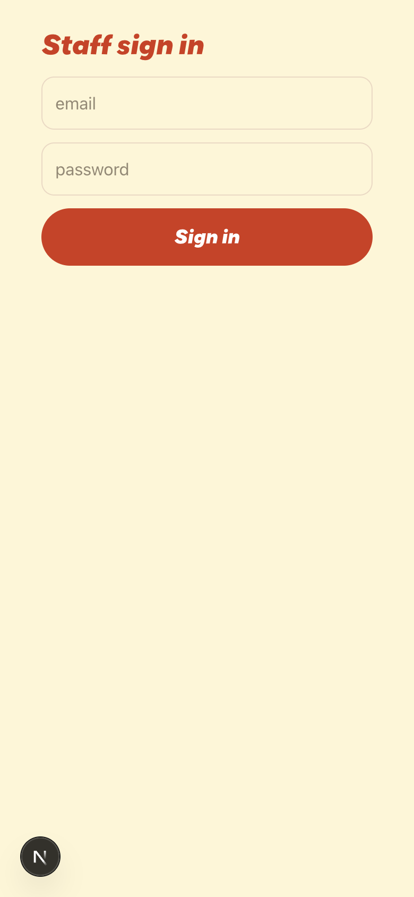

*— Технические детали (для разработки) —*

**Бизнес-логика (под капотом):**
1. `submit()` (`admin/login/page.tsx:13`) → `admin.login(email, password)` (`lib/api.ts:188`).
2. `POST /api/staff/login {email, password}` (`routers/staff.py:25`). Бэкенд ищет `StaffUser` по email,
   проверяет `not disabled` и `verify_password(...)` (pbkdf2_sha256); при провале — `401
   INVALID_CREDENTIALS`.
3. Успех → ответ `{token, staff:{id,email,name,role,locationId,disabled}}`. Токен — JWT HS256, TTL 30 дней
   (`make_token(str(staff.id), "staff", role=...)`, `core/security.py`).
4. Фронт кладёт токен в `localStorage['grabzi_staff_token']` (`lib/api.ts:192`) и делает
   `router.push("/admin/kitchen")`.
5. `staff.role` — `manager` либо `super_admin`; `locationId` — точка менеджера (или `null` у супер-админа)
   — далее используется для скоупа (ADM-M-02/04 и WS-канал, ADM-M-03).

**API:**

| Метод · путь | Тело | Ответ | Ошибки |
|---|---|---|---|
| `POST /api/staff/login` | `{email, password}` | `{token, staff}` | `401 INVALID_CREDENTIALS` |

Полный контракт staff-API — см. Часть VIII.

**Что видит другая сторона:** после входа открывается канбан (ADM-M-02). Супер-админ тем же входом
попадает в кухню, но видит её в режиме «All points» с дефектом остатка — см. ⚠️ в ADM-M-04 и Часть IX.

**Трассировка:** сущность `StaffUser` (Часть III) · процесс «авторизация персонала / JWT» (Часть I, VII) ·
тесты staff-auth (S9) · NFR безопасности (Часть I).

**Метки:** ✅ реализовано · 📝 учётки из сида: `barista@grabzi.ae / grabzi-barista` (manager, точка 1),
`admin@grabzi.ae / grabzi-admin` (super_admin).

---

### ADM-M-02 · Канбан заказов — `/admin/kitchen`  🟩 GRABZI


**Для заказчика:**
- **Проблема:** в час пик заказы сыплются один за другим; без единого экрана-очереди легко перепутать, что
  уже готовится, что готово, и кому выносить.
- **Выгода:** вся очередь — на одном экране, разложена по понятным колонкам «новые → готовятся → на выдаче
  → выдано». На каждой карточке — номер заказа, время с момента оплаты (чтобы не «зависали»), номер машины
  и состав. Когда клиент подъехал — карточка подсвечивается «🚗 HERE».
- **Что даёт бизнесу:** меньше ошибок и быстрее выдача → выше пропускная способность утреннего окна и
  довольство клиентов; видно «застрявшие» заказы по таймеру.

**Приоритет (MoSCoW):** Must.

**Как** бариста/менеджер, **я хочу** видеть очередь оплаченных заказов своей точки в виде канбана,
**чтобы** ничего не потерять и быстро понимать, что готовить и кому выносить.

**Как это работает (простыми словами):** На экране — четыре колонки: новые, в работе, на выдаче и выданные.
Каждый оплаченный заказ — карточка с номером, бегущим таймером «сколько прошло с момента оплаты», номером
машины (и эмиратом), составом и одной кнопкой действия. Новые заказы приходят сами, без обновления
страницы. Когда клиент в приложении нажимает «Я приехал», на его карточке загорается «🚗 HERE» и рамка
становится красной — сигнал «выносить, клиент у окна». Колонка «выдано» хранит карточки без кнопок —
как лента закрытых за смену заказов. Если кончились ингредиенты или нужно остановить приём — это делается
через стоп-лист и паузу точки (ADM-M-05, статус точки в ADM-M-04).

**Критерии приёмки (AC):**
1. Канбан содержит ровно **4 колонки** в порядке: **NEW**, **MAKING**, **READY · HANDOUT**, **DONE**
   (таблица «статус ↔ колонка ↔ кнопка» выше). Заголовок каждой колонки — `<TITLE> · <count>`.
2. На кухне показываются **только оплаченные** заказы (`payment_status = 'paid'`); активные статусы —
   `new/in_progress/ready` (`ACTIVE_STATUSES`); фронт запрашивает `active=true`.
3. Карточка заказа содержит: `#<номер>`, таймер `⏱ M:SS` (от `createdAt`, тикает раз в секунду), номер
   машины `carPlate` (UPPERCASE, моноширинно), при наличии — эмират `emirate` перед номером, и состав
   построчно `<qty>× <name>`.
4. При `arrived = true` на карточке выводится бейдж **«🚗 HERE»** (терракота) и рамка карточки —
   утолщённая терракотовая (`3px solid var(--color-brand)`); иначе обычная рамка `--color-border`.
5. Карточки в колонке сортируются по времени создания (раньше — выше): `localeCompare` по `createdAt`.
6. Колонки NEW/MAKING/READY·HANDOUT несут кнопку действия; колонка **DONE** кнопок **не имеет** (заказы
   остаются видимыми).
7. Пустая колонка показывает «— empty —».
8. Карточки приходят/обновляются **в реальном времени** (см. ADM-M-03 «realtime»); без realtime — обновление
   опросом каждые 10 секунд.
9. **Ролевой скоуп:** менеджер видит заказы **только своей точки** (серверное ограничение по `location_id`);
   супер-админ — все точки (по фильтру). См. также ⚠️ в ADM-M-04.
10. **Визуально** в стиле grabzi.ae: липкая белая шапка с логотипом, карточки `.card` на кремовом фоне,
    цветные заголовки колонок и кнопки фирменных статус-цветов (сверка с `reference_design/`). Для
    разработки: кнопки `minHeight: 48` (tap-target ≥ 44px), контраст белого текста на цветной кнопке ≥ AA.
11. **A11y:** видимый фокус кнопок; emoji «🚗» сопровождается текстом «HERE»; таймер моноширинный.

**Экран и стиль:** ADM-M канбан (`/admin/kitchen`) · токены: `--color-brand`, `--color-instock`,
`--color-lowstock`, `--color-outofstock`, `--color-border`, `--color-muted`, `--radius-card` ·
компоненты: `.card`, `.badge.badge--paused` (статус точки), кнопки-действия (inline), прогресс-бар (шапка,
ADM-M-04).

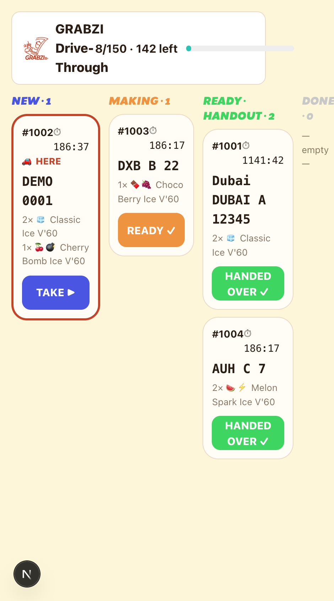

> На скриншоте: шапка «GRABZI Drive-Through · 8/150 · 142 left» с прогресс-баром (ADM-M-04); колонка
> **NEW · 1** — заказ `#1002` с бейджем **🚗 HERE** и кнопкой **TAKE ▶**; **MAKING · 1** — `#1003` с
> **READY ✓**; **READY · HANDOUT · 2** — `#1001` и `#1004` с **HANDED OVER ✓**; **DONE · 0** — «— empty —».
> 📝 Для скриншота имя точки нормализовано до строки (см. дефект в ADM-M-04).

*— Технические детали (для разработки) —*

**Бизнес-логика (под капотом):**
1. `KitchenPage` (`kitchen/page.tsx:22`): при монтировании, если в `localStorage` нет
   `grabzi_staff_token` → редирект на `/admin/login` (строки 45–48).
2. `load()` (строки 30–43): `Promise.all([admin.orders(true), admin.locationStatus()])` →
   `GET /api/admin/orders?active=true` + `GET /api/admin/location-status`. Результаты в `orders` и `loc`.
3. Карточки раскладываются по колонкам: `orders.filter(o => o.status === col.status)` для каждой из четырёх
   `COLS` (строки 113–115), сортировка по `createdAt`.
4. Таймер: `timer(createdAt)` (строки 16–20) — `(Date.now() - createdAt)/1000`, перерисовка по
   `setInterval(tick, 1000)`.
5. Бэкенд `admin_orders()` (`admin_orders.py:50`): `WHERE payment_status='paid'`, при `active=true` —
   `status IN ACTIVE_STATUSES`; **скоуп точки** через `manager_scope_location(staff)` — менеджер
   форсированно ограничен своей точкой, супер-админ — по необязательному `?location_id` (строки 68–73).
6. `_order_row()` (строки 25–47) формирует поля карточки: `number, status, carPlate, emirate,
   arrived = arrived_at is not None, createdAt, items[{name,quantity,...}]`.

**API:**

| Метод · путь | Назначение | Ключевые поля ответа | Скоуп |
|---|---|---|---|
| `GET /api/admin/orders?active=true` | очередь заказов | `[{id,number,status,carPlate,emirate,arrived,createdAt,items[]}]` | менеджер → своя точка; super_admin → все/`?location_id` |
| `GET /api/admin/orders/{id}` | детальная карточка (+ `events[]`) | как выше + аудит-события | `403 FOREIGN_LOCATION` для чужой точки |
| `GET /api/admin/location-status` | шапка остатка/статуса (ADM-M-04) | см. ADM-M-04 | менеджер → своя точка |

Полный список — см. Часть VIII.

**Что видит другая сторона:** оплаченный заказ клиента (Часть IV, O1 «Сбор заказа» → оплата) появляется в
колонке NEW; статусы, которые менеджер двигает здесь, клиент видит на ST1 «Статус заказа» (Часть IV) в
реальном времени. Отметка «🚗 HERE» — это нажатие клиентом «I'm here 🚗» на ST1.

**Трассировка:** сущности `Order`, `OrderItem`, `OrderEvent` (Часть III) · процессы «жизненный цикл заказа
+ realtime», «дневной лимит» (Часть VII) · тесты admin-orders / scope (S9) · NFR задержки WS-пуша (Часть I).

**Метки:** ✅ реализовано · ⚠️ супер-админ на кухне — см. ADM-M-04 и Часть IX.

---

### ADM-M-03 · Смена статусов заказа (TAKE / READY / HANDED OVER) + realtime  🟩 GRABZI


**Для заказчика:**
- **Проблема:** заказ должен «двигаться» по понятным шагам, и клиент должен видеть эти шаги у себя в
  телефоне — иначе он не знает, готов ли кофе и можно ли подъезжать.
- **Выгода:** менеджер ведёт заказ тремя кнопками — «взял», «готово», «отдал». Каждое нажатие мгновенно
  отражается у клиента и фиксируется в истории заказа (кто и когда что сделал).
- **Что даёт бизнесу:** прозрачная операционка и автоматическое информирование клиента без звонков; история
  переходов — основа для разбора спорных ситуаций и аналитики времени готовки.

**Приоритет (MoSCoW):** Must.

**Как** бариста/менеджер, **я хочу** переводить заказ по шагам «взял → готов → выдан» одной кнопкой,
**чтобы** клиент видел актуальный статус, а действия фиксировались.

**Как это работает (простыми словами):** На карточке нового заказа — кнопка «TAKE ▶»; нажатие забирает
заказ в работу и закрепляет его за этим сотрудником (заказ переезжает в колонку «готовятся»). Там кнопка
«READY ✓» отмечает готовность — заказ уходит на выдачу. Кнопка «HANDED OVER ✓» закрывает заказ после
вручения клиенту. Двигать можно только вперёд и только на один шаг — «перепрыгнуть» статус нельзя. Каждое
действие тут же видит клиент в своём приложении (статус обновляется сам), а в журнале заказа остаётся
запись: какой шаг, кем из персонала и когда. Новые заказы и чужие изменения подтягиваются на экран
автоматически; если живой канал связи временно недоступен — экран всё равно сам обновляется каждые
несколько секунд.

**Критерии приёмки (AC):**
1. В колонке **NEW** кнопка «TAKE ▶» → заказ переходит `new → in_progress` и **закрепляется** за
   сотрудником (`manager_id = staff.id`), переезжает в **MAKING**.
2. В колонке **MAKING** кнопка «READY ✓» → `in_progress → ready`, переезд в **READY · HANDOUT**.
3. В колонке **READY · HANDOUT** кнопка «HANDED OVER ✓» → `ready → completed`, переезд в **DONE**.
4. Переходы строго последовательны: разрешён только следующий шаг (`TRANSITIONS`); иной переход —
   `409 INVALID_TRANSITION:<from>-><to>`.
5. «TAKE» возможен только для оплаченного заказа; иначе `409 ORDER_NOT_PAID`.
6. `set_status` принимает только `ready` либо `completed`; иное — `422 VALIDATION_ERROR`.
7. Каждый переход создаёт запись аудита (`OrderEvent`, тип `status_change`, с `by_staff_id`).
8. После действия экран перезагружает данные, и заказ виден в новой колонке.
9. **Realtime:** новые/изменённые заказы появляются без перезагрузки страницы (живой канал по роли/точке);
   при недоступности канала — опрос каждые **10 секунд** (polling fallback); «пинги» канала игнорируются.
10. **Ролевой скоуп:** менеджер может действовать только над заказами своей точки; обращение к чужой —
    `403 FOREIGN_LOCATION`.
11. **Визуально/a11y:** кнопки фирменных статус-цветов, белый текст ≥ AA, `minHeight 48`; действие не
    «молчит» — карточка перемещается.

**Экран и стиль:** ADM-M канбан (`/admin/kitchen`) · кнопки-действия со статус-цветами `#4A56E2` /
`--color-lowstock` / `--color-instock` (см. таблицу канбана и ADM-M-02).


*— Технические детали (для разработки) —*

**Бизнес-логика (под капотом):**
1. `act(o, col)` (`kitchen/page.tsx:62`): если колонка `new` → `admin.take(o.id)`; иначе → `admin.setStatus(o.id, col.next)` (`col.next` = `ready` | `completed`); затем `load()`.
2. `POST /api/admin/orders/{id}/take` (`admin_orders.py:94`): проверка `_assert_scope`, `payment_status=='paid'`, затем `transition(db, o, "in_progress", by_staff_id=staff.id)`. Внутри `transition` (`order_flow.py:233`): при `new_status == "in_progress" and by_staff_id` присваивается `order.manager_id`.
3. `POST /api/admin/orders/{id}/status {status, note?}` (`admin_orders.py:113`): `status ∈ {ready, completed}`, иначе `422`; `transition(db, o, status, by_staff_id=staff.id, note=...)`.
4. `transition()` валидирует переход по `TRANSITIONS` (`order_flow.py:55–59`); недопустимый → `409 INVALID_TRANSITION:<from>-><to>`; пишет `add_event(... "status_change", status=new_status, by_staff_id=...)`.
5. **Realtime канал** (`kitchen/page.tsx:50–59`): WS `${API_URL→ws}/ws/admin/orders?token=<staff_token>`; `onmessage` → если `m.type !== "ping"` вызывает `load()`. Параллельно `setInterval(load, 10000)` (polling fallback 10с) и `setInterval(tick, 1000)` (таймеры). На размонтировании — `ws.close()` + сброс интервалов.
6. **Сервер WS** (`ws.py:65` `ws_admin`): по токену — канал `admin:orders`; если `role=="manager"` и есть `location_id` → `admin:orders:{location_id}` (только своя точка); heartbeat `{"type":"ping"}` раз в ~25с при простое (`_pump`, `ws.py:30–39`).

**API:**

| Метод · путь | Тело | Эффект | Ошибки |
|---|---|---|---|
| `POST /api/admin/orders/{id}/take` | — | `new→in_progress`, `manager_id=staff.id`, `OrderEvent` | `403 FOREIGN_LOCATION`, `409 ORDER_NOT_PAID`, `404 NOT_FOUND` |
| `POST /api/admin/orders/{id}/status` | `{status: ready\|completed, note?}` | переход + `OrderEvent` | `422 VALIDATION_ERROR`, `409 INVALID_TRANSITION:*`, `403 FOREIGN_LOCATION` |
| `WS /ws/admin/orders?token=` | — | пуш событий заказов; `admin:orders[:loc]`; heartbeat `ping`/25с | `WS 1008` при невалидном/неперсональном токене |

**Что видит другая сторона:** клиент на ST1 (Часть IV) видит обновление статуса в реальном времени по
своему WS-каналу заказа; история переходов (`OrderEvent`) доступна в детальной карточке заказа супер-админу
(Часть V, ADM-S «Все заказы»).

**Трассировка:** `Order.status`, `OrderEvent` (Часть III) · процессы «жизненный цикл заказа + realtime»
(Часть VII) · тесты transitions / scope (S9) · NFR «задержка WS-пуша статуса», «fallback polling» (Часть I,
§таксономия ошибок).

**Метки:** ✅ реализовано · realtime: WS реальный (asyncio in-process) + polling fallback 10с.

---

### ADM-M-04 · Статус точки и дневной лимит (липкая шапка + прогресс-бар)  🟩 GRABZI


**Для заказчика:**
- **Проблема:** модель GRABZI — «приходи раньше, больше не делаем»; бариста должен в любой момент видеть,
  сколько порций ещё можно продать сегодня и открыта ли точка, чтобы не обещать невозможного.
- **Выгода:** в шапке кухни всегда видно имя точки, её состояние (работает / на паузе / закрыта) и
  «продано X / лимит Y, осталось Z» с цветным прогресс-баром, который меняет цвет по мере исчерпания
  лимита.
- **Что даёт бизнесу:** контроль дневного объёма «вживую», предсказуемость, отсутствие овер-продаж сверх
  возможностей кухни; визуальный сигнал «пора притормозить».

**Приоритет (MoSCoW):** Must.

**Как** бариста/менеджер, **я хочу** видеть статус своей точки и остаток дневного лимита в шапке кухни,
**чтобы** управлять темпом и не продать больше, чем мы можем сделать сегодня.

**Как это работает (простыми словами):** Вверху экрана закреплена шапка: логотип, имя точки и её состояние
(если точка не «работает» — рядом бейдж «paused» / «closed»). Справа — счётчик «продано из лимита» и
сколько ещё осталось, плюс полоса-прогресс. Полоса зелёная, пока продано меньше 80% лимита, желтеет на
80–99% и краснеет при 100% и выше — это визуальный сигнал «лимит почти/полностью выбран». Если у точки нет
дневного лимита — показывается просто «продано N · No limit» без полосы. Данные те же, что считают дневной
лимит для клиента (см. Часть VII), поэтому цифры на кухне и в клиентском приложении согласованы.

**Критерии приёмки (AC):**
1. Шапка липкая (всегда видна при прокрутке), содержит логотип GRABZI и имя точки.
2. Если статус точки **не** `open` — рядом с именем бейдж со статусом (`paused` / `closed` / `inactive`),
   оформленный как «paused»-бейдж.
3. При наличии лимита: текст «`<soldToday>`/`<limit>` · `<remaining>` left» и прогресс-бар.
4. Без лимита (`limit === null`): «Sold `<soldToday>` · No limit», прогресс-бар **не** показывается.
5. Цвет прогресс-бара: **зелёный** (`--color-teal`) при `< 80%`, **жёлтый** (`--color-lowstock`) при
   `80–99%`, **красный** (`--color-danger`) при `≥ 100%`. Заполнение ограничено 100%.
6. Цифры остатка согласованы с дневным счётчиком точки (см. Часть VII «дневной лимит»).
7. **Ролевой скоуп:** менеджеру показывается **его** точка (серверный скоуп по `location_id`).
8. **Визуально/a11y:** шапка на белом фоне с рамкой `--color-border`, скругление 12; контраст текста ≥ AA;
   цвет — не единственный носитель смысла (рядом числовой остаток).

> ⚠️ **ДЕФЕКТ контракта kitchen ↔ location-status (внести в Часть IX, реестр расхождений).**
> Эндпоинт `GET /api/admin/location-status` возвращает поле `name` как **i18n-объект** `{"en": "GRABZI
> Drive-Through"}` (поле `Location.name` — JSON i18n, `models/locations.py:26`; сид кладёт
> `name={"en": "GRABZI Drive-Through"}`, `seed_grabzi.py:57`). Фронтовая схема валидации
> **`LocStatusSchema` ждёт `name: z.string()`** (`lib/api.ts:167–171`). Из-за рассинхрона zod-парсинг
> в `adminFetch` падает (`lib/api.ts:184`), исключение ловит `load()` и выставляет `authed = false`
> (`kitchen/page.tsx:40–42`) → менеджеру с i18n-именем точки кухня показывает **ложное «Session
> expired.»** (`kitchen/page.tsx:68–73`), хотя токен валиден. **Это срабатывает уже на сидовых данных.**
> Для скриншота (ADM-M-02) имя нормализовано до строки на лету. Исправление: привести контракт к одному
> виду — отдавать `name` строкой (через `pick_locale`) **или** ослабить/нормализовать схему фронта.
>
> ⚠️ **ДЕФЕКТ «супер-админ на кухне».** Кухня вызывает `locationStatus()` **без параметров**
> (`lib/api.ts:200`). Для **менеджера** сервер возвращает объект одной точки `{locationId, name, status,
> soldToday, limit, remaining, isOpen, nextOpenAt}` — это и есть форма, под которую сделана кухня.
> Для **супер-админа** (нет привязки к точке, нет `?location_id`, нет `?scope=all`) тот же эндпоинт
> отдаёт `{"scope": "all", "locations": []}` (`admin_locations.py:292`) — форму, которую
> `LocStatusSchema` **не ожидает** → zod-парс падает → снова ложное «Session expired». Вывод: **экран
> кухни рассчитан на роль `manager`**; сценарий «супер-админ за кухонным планшетом» не доведён.
> В шапке для супер-админа предусмотрена подпись «All points» (`kitchen/page.tsx:90`), но из-за
> рассинхрона до неё дело не доходит. Решение — отдельный агрегированный режим кухни для супер-админа
> либо явное перенаправление super_admin на дашборд (Часть V). Оба дефекта — в Часть IX.

**Экран и стиль:** ADM-M шапка кухни (`/admin/kitchen`) · токены: `--color-teal`, `--color-lowstock`,
`--color-danger`, `--color-border` · компоненты: липкий `header`, прогресс-бар (inline), `.badge.badge--paused`.


*— Технические детали (для разработки) —*

**Бизнес-логика (под капотом):**
1. `load()` → `admin.locationStatus()` → `GET /api/admin/location-status` (`lib/api.ts:200`,
   `admin_locations.py:259`).
2. Сервер `location_status()`: `mgr_scope = manager_scope_location(staff)`; если менеджер — возвращает
   `row(loc)` своей точки: `{locationId, name, status: effective_status, soldToday: sold_today,
   limit: daily_drink_limit, remaining, isOpen, nextOpenAt}` (`admin_locations.py:269–279`).
3. Фронт: `pct = limit ? min(100, round(soldToday/limit*100)) : 0` (`kitchen/page.tsx:75`); цвет —
   `pct>=100 ? danger : pct>=80 ? lowstock : teal` (строка 103).
4. Без лимита (`limit === null`): рендерится «Sold N · No limit», бар скрыт (строки 96–106).

**API:**

| Метод · путь | Параметры | Ответ (менеджер) | Ответ (super_admin без параметров) |
|---|---|---|---|
| `GET /api/admin/location-status` | `?location_id`, `?scope=all` (super_admin) | `{locationId, name(⚠️ i18n-объект), status, soldToday, limit, remaining, isOpen, nextOpenAt}` | `{scope:"all", locations:[]}` ⚠️ не матчит схему кухни |

**Что видит другая сторона:** тот же дневной счётчик формирует «TODAY'S LIMIT» у клиента (Часть IV, H1/O1)
и блокирует оплату при исчерпании лимита (`409 LOCATION_LIMIT_REACHED`, см. Часть VII, Приложение C).
Статус точки `paused`/`closed` отражается клиенту бейджем на L1 и блокировкой оплаты.

**Трассировка:** сущности `Location`, `LocationDailyCounter`, `LocationStatusEvent` (Часть III) · процессы
«дневной лимит», «статус точки» (Часть VII) · дефекты — Часть IX · NFR согласованности данных (Часть I).

**Метки:** ✅ реализовано · ⚠️ два дефекта контракта (i18n-имя; super_admin scope) — см. выше и Часть IX.

---

### ADM-M-05 · Стоп-лист напитков точки  🟩 GRABZI


**Для заказчика:**
- **Проблема:** в течение дня ингредиент может кончиться (сироп, фрукт) — нельзя продолжать продавать
  напиток, который сейчас не сделать.
- **Выгода:** менеджер в один клик помечает напиток «нет сегодня» — и его сразу перестают заказывать
  клиенты этой точки; когда снова появился — так же быстро возвращает.
- **Что даёт бизнесу:** меньше отменённых заказов и недовольных клиентов; точка управляет ассортиментом
  «вживую» без обращения к супер-админу.

**Приоритет (MoSCoW):** Must.

**Как** бариста/менеджер, **я хочу** добавлять и снимать напитки из стоп-листа своей точки, **чтобы**
клиенты не заказывали то, что сейчас нельзя приготовить.

**Как это работает (простыми словами):** Менеджер отмечает напиток как недоступный на своей точке — клиент
сразу видит у него «Sold out» и не может добавить его в заказ. Когда ингредиент снова есть, менеджер
снимает отметку, и напиток снова продаётся. Стоп-лист действует только на конкретную точку и проверяется
в момент оформления заказа, чтобы никто не «проскочил» с уже снятым напитком.

**Критерии приёмки (AC):**
1. Менеджер может получить текущий стоп-лист своей точки, добавить напиток в стоп-лист и убрать его обратно.
2. Напиток в стоп-листе показывается клиенту как «Sold out» и **не заказывается**; попытка заказать —
   `409 DRINK_UNAVAILABLE_AT_LOCATION` (проверка при создании заказа, см. Часть VII).
3. Стоп-лист действует **только** на конкретную точку (существование записи `LocationDrinkStop`).
4. **Ролевой скоуп:** менеджер управляет стоп-листом **только своей** точки; чужая → `403 FOREIGN_LOCATION`.
5. Операция фиксируется в аудите статусов точки (`LocationStatusEvent`).
6. **Визуально/a11y:** доступность управления с клавиатуры; состояние «в стоп-листе» читаемо не только
   цветом.

> 📝 На текущем экране `/admin/kitchen` отдельной UI-панели стоп-листа **нет** — функция полностью
> реализована на уровне API (контур B для этой подфункции). В целевом KDS она выносится в шапку/меню
> точки; здесь специфицируется по контракту API. Клиентская сторона эффекта («Sold out») реализована —
> см. Часть IV (M1/O1).

**Экран и стиль:** ADM-M (целевая панель стоп-листа в шапке кухни) · токены/компоненты — см. Часть II
(бейджи наличия `--color-outofstock`). Скриншот панели — 🚧 проектируется (см. §4.0, контур B).

*— Технические детали (для разработки) —*

**Бизнес-логика (под капотом):**
1. Стоп-лист — existence-based: запись `LocationDrinkStop(location_id, drink_id)` → напиток недоступен на
   точке. Снятие — удаление записи.
2. Проверяется в `order_flow` при создании заказа: напиток из стоп-листа → `DRINK_UNAVAILABLE_AT_LOCATION`.
3. Скоуп — `manager_scope_location(staff)`; обращение к чужой точке → `403 FOREIGN_LOCATION`.

**API** (роутер `admin_locations.py`):

| Метод · путь | Назначение | Ошибки |
|---|---|---|
| `GET /api/admin/locations/{id}/stops` | текущий стоп-лист точки | `403 FOREIGN_LOCATION` |
| `POST /api/admin/locations/{id}/stops` | добавить напиток в стоп-лист | `403 FOREIGN_LOCATION` |
| `DELETE /api/admin/locations/{id}/stops/{drink_id}` | снять напиток со стоп-листа | `403 FOREIGN_LOCATION` |

Полный контракт — см. Часть VIII.

**Что видит другая сторона:** клиент на M1 «Меню» и O1 «Сбор заказа» (Часть IV) видит напиток как «Sold
out» и не может его заказать; супер-админ управляет тем же стоп-листом по тем же эндпоинтам без ограничения
точки (Часть V).

**Трассировка:** сущности `LocationDrinkStop`, `LocationStatusEvent` (Часть III) · процесс «стоп-лист»
(Часть VII) · тесты stops / scope (S9).

**Метки:** ✅ реализовано на API · 🚧 без отдельной UI-панели в текущем `grabzi-web`.

---

### ADM-M-06 · 🧩 Возврат заказа (опциональный модуль)  🟩 GRABZI


**Для заказчика:**
- **Проблема:** иногда заказ нужно отменить/вернуть (ошибка, претензия) — и при этом «вернуть» проданные
  порции в дневной лимит, иначе он будет занижен.
- **Выгода:** менеджер оформляет возврат одним действием; платёж помечается возвращённым, а порции
  возвращаются в дневной счётчик того же дня — лимит снова корректен.
- **Что даёт бизнесу:** честный учёт дневного объёма и платежей, корректная аналитика, инструмент решения
  спорных ситуаций.

**Приоритет (MoSCoW):** Could (опциональный модуль 🧩).

**Как** бариста/менеджер, **я хочу** оформить возврат заказа, **чтобы** вернуть оплату и высвободить
проданные порции обратно в дневной лимит.

**Как это работает (простыми словами):** Менеджер инициирует возврат по заказу. Заказ помечается как
возвращённый, его оплата — как возвращённая, а проданные напитки возвращаются в дневной лимит точки —
**но только если возврат в тот же рабочий день**, в который заказ был продан (иначе счётчик уже относится
к другому дню). Счётчик не уходит ниже нуля. Действие фиксируется в истории заказа.

**Критерии приёмки (AC):**
1. Возврат по заказу: статус заказа → `refund`, статус платежа → `refunded`.
2. Если возврат в тот **же** бизнес-день, что и продажа — проданные напитки **декрементируют** дневной
   счётчик точки (не ниже 0); в другой день — счётчик не трогается.
3. Переход `refund` допустим из `completed` (см. `TRANSITIONS`); действие пишет `OrderEvent`.
4. **Ролевой скоуп:** менеджер — только заказы своей точки; чужая → `403 FOREIGN_LOCATION`.
5. **Визуально/a11y:** подтверждение опасного действия; результат не «молчит».

> 📝 Отдельной кнопки возврата на текущем экране `/admin/kitchen` нет — функция реализована на уровне API
> (контур B). В целевом KDS — действие из детальной карточки/меню заказа.

**Экран и стиль:** ADM-M (целевое действие из карточки заказа) · скриншот — 🚧 проектируется (см. §4.0,
контур B). Токены/компоненты — см. Часть II.

*— Технические детали (для разработки) —*

**Бизнес-логика (под капотом):**
1. `POST /api/admin/orders/{id}/refund {note?}` (`admin_orders.py:127`): `_assert_scope`, затем единый
   `order_flow.refund_order(db, o, by_staff_id=staff.id, note=...)`.
2. `refund_order` (см. `order_flow.py`): `status → refund`, `payment_status → refunded`,
   `Payment.status → refunded`; если возврат в тот же бизнес-день — декремент `LocationDailyCounter`
   (не ниже 0); пишет `OrderEvent`.
3. Переход `completed → refund` валидируется через `TRANSITIONS` (`order_flow.py:59`).

**API:**

| Метод · путь | Тело | Эффект | Ошибки |
|---|---|---|---|
| `POST /api/admin/orders/{id}/refund` | `{note?}` | `status=refund`, `payment=refunded`, декремент счётчика (тот же день) | `403 FOREIGN_LOCATION`, `404 NOT_FOUND` |

**Что видит другая сторона:** клиент видит заказ как возвращённый (Часть IV); супер-админ — в платежах и
заказах (Часть V); дневной лимит у клиента (H1/O1) снова отражает высвобожденные порции.

**Трассировка:** сущности `Order`, `Payment`, `LocationDailyCounter`, `OrderEvent` (Часть III) · процессы
«возврат», «дневной лимит» (Часть VII) · тесты refund (S9).

**Метки:** 🧩 опциональный модуль · ✅ реализовано на API · 🚧 без UI в текущем `grabzi-web`.

---

### Realtime на кухне (сводка) — WS + polling fallback 10с

Экран кухни обновляется в реальном времени по двум независимым механизмам (см. ADM-M-02, ADM-M-03):

| Механизм | Параметры | Назначение |
|---|---|---|
| **WebSocket** | `/ws/admin/orders?token=<staff_token>`; канал `admin:orders` (super_admin) / `admin:orders:{location_id}` (manager); heartbeat `{"type":"ping"}` каждые ~25с | мгновенный пуш новых/изменённых заказов; на `ping` — `load()` не вызывается |
| **Polling fallback** | `setInterval(load, 10000)` — каждые **10 секунд** | гарантированное обновление при недоступности/обрыве WS |
| **Таймеры карточек** | `setInterval(tick, 1000)` — каждую **1 секунду** | перерисовка бегущего таймера `⏱ M:SS` |

> ⚠️ Note: клиентский экран статуса (ST1, Часть IV) использует polling fallback **20с**; кухня — **10с**.
> Это разные значения для разных экранов (не дефект), фиксируется для согласованности документации.

Все realtime-каналы и их контракты — см. Часть VII «жизненный цикл заказа + realtime» и Часть VIII
(WebSocket-каналы).

---

### Сводка дефектов этой части (единая нумерация — §IX.6 / Приложение H)

> Эти дефекты — те же **DEF-01** и **DEF-02** из общего реестра (§IX.6); здесь — детали по коду.

| ID | Дефект | Где в коде | Эффект | ⚠️ |
|---|---|---|---|---|
| **DEF-01** | `LocStatusSchema` ждёт `name: string`, API отдаёт `name: {"en":…}` | `lib/api.ts:167–171` ↔ `admin_locations.py:272`, `models/locations.py:26`, сид `seed_grabzi.py:57` | zod-парс падает → ложное «Session expired» у менеджера с i18n-именем (срабатывает на сиде; для скрина имя нормализовано) | ⚠️ |
| **DEF-02** | Кухня вызывает `locationStatus()` без параметров; super_admin без точки получает `{scope:"all", locations:[]}` | `lib/api.ts:200` ↔ `admin_locations.py:281–292` | форма не матчит `LocStatusSchema` → «Session expired»; кухня рассчитана на роль `manager` | ⚠️ |

---

**Перекрёстные ссылки:** клиентская сторона заказа и статуса — см. Часть IV (O1, ST1); супер-админ —
см. Часть V; сквозные процессы (жизненный цикл, realtime, дневной лимит, стоп-лист, статус точки,
возврат) — см. Часть VII; контракты API и WS — см. Часть VIII; коды ошибок — см. Приложение C; дефекты —
см. Часть IX.


---

# Часть VII. СКВОЗНЫЕ ПРОЦЕССЫ

> **Назначение части.** Здесь собраны процессы, которые «прошивают» сразу несколько проекций
> продукта (покупатель · бариста/менеджер ADM-M · супер-админ ADM-S · сервер) и потому не принадлежат
> ни одной отдельной user story. Каждая история в Частях IV–VI ссылается сюда фразой «см. Часть VII»,
> чтобы один факт жил в одном месте.
>
> **Формат каждого процесса — три блока (единый формат сквозного процесса):**
> 1. **Как это работает (простыми словами)** — поведение без кода: что видит покупатель, что делает
>    бариста, что происходит с деньгами / остатком / статусом, что в граничном случае.
> 2. **Бизнес-схема «по дорожкам»** — Mermaid `flowchart` с дорожками **Покупатель / Бариста / Система**,
>    шаги подписаны обычным языком (без статусов и эндпоинтов).
> 3. **Sequence-диаграмма (для разработки)** — Mermaid `sequenceDiagram`, технически точно: эндпоинты,
>    транзакции, блокировки, каналы, коды ошибок.
>
> **Канон достоверности — код прототипа** (`backend/app/services/order_flow.py`,
> `location_service.py`, `routers/payments.py`, `ws.py`, `auth.py`, `content.py`,
> `services/i18n.py`, `services/storage.py`, `core/pubsub.py`, `core/security.py`, `core/config.py`).
> Коды ошибок — `core/errors.py` (см. Приложение C). Сущности — см. Часть III. Деньги — AED (см. Часть I).

### Перечень процессов

| № | Процесс | Канон-источник | Статус |
|---|---|---|---|
| VII.1 | Платёж: Stripe Checkout + mock-режим + webhook | `routers/payments.py`, `order_flow.mark_paid` | ✅ / 🔧 mock без ключа |
| VII.2 | Жизненный цикл заказа `new→in_progress→ready→completed` (+`refund`) и realtime по WebSocket | `order_flow.transition/notify`, `ws.py`, `core/pubsub.py` | ✅ |
| VII.3 | Вход покупателя по телефону + OTP (сейчас заглушка) | `routers/auth.py`, `core/security.py`, `core/config.py` | ✅ / 🔧 OTP-заглушка |
| VII.4 | Дневной лимит и счётчик: резерв под блокировкой при оплате, освобождение при возврате/в полночь | `order_flow.mark_paid/refund_order`, `location_service.py` | ✅ **ядро модели** |
| VII.5 | Стоп-лист напитков точки | `location_service.stopped_drink_ids`, `order_flow.assert_location_orderable` | ✅ |
| VII.6 | Купоны и рейтинг (👎 → купон) | `routers/orders.py` (`rate`), `order_flow` (применение), `coupons.py` | ✅ |
| VII.7 | Статус точки (вычисляемый `open/paused/closed/inactive`) | `location_service.effective_status/is_open/next_open_at` | ✅ |
| VII.8 | Медиа: загрузка и отдача через S3/MinIO | `services/storage.py`, `routers/admin_media.py` | ✅ / 🔧 без bucket выключено |
| VII.9 | CMS-контент (InfoBlock) | `routers/content.py` | ✅ |
| VII.10 | Локализация контента (`pick_locale`, fallback) | `services/i18n.py`, `core/config.py` | ✅ / ⚠️ EN-first vs дефолт `ru` |

---

## VII.1. Платёж: Stripe Checkout + mock-режим + webhook

### Как это работает (простыми словами)

Когда покупатель на экране заказа (O1) нажимает «Proceed to Payment», система готовит оплату и
показывает форму ввода карты. Дальше возможны **два режима**, и для покупателя они выглядят почти
одинаково:

- **Боевой режим** (есть платёжный аккаунт): покупателя уводит на защищённую страницу оплаты картой;
  после успешного списания платёжная система присылает серверу отдельное подтверждение, и **только по
  этому подтверждению** заказ считается оплаченным. Возврат с формы на сайт — ещё не гарантия оплаты;
  каноном служит подтверждение от провайдера.
- **Демо-режим** (платёжный аккаунт не подключён): реальные деньги **не списываются**. Система сразу
  отмечает заказ как оплаченный и возвращает покупателя на страницу его заказа. Это нужно, чтобы продукт
  целиком работал на демонстрациях и тестах без настоящего эквайринга.

В обоих случаях в момент перехода заказа в «оплачено» происходит главное бизнес-действие — **списание
порций из дневного лимита точки** под защитой от гонки (см. VII.4). Если за то время, пока покупатель
платил, последние порции на сегодня раскупили, оплата отменяется, заказ помечается как возвращённый, и
человек видит понятное сообщение «лимит на сегодня исчерпан». Один и тот же заказ нельзя оплатить
дважды: повторная попытка отклоняется.

> **Статус (🔧).** Без ключа платёжного провайдера работает демо-режим — для публичного приёма реальных
> денег нужны платёжный аккаунт и налоговый номер (см. Часть I, статус интеграций; Часть IX, открытые
> вопросы). Налог VAT 5 % в расчёте суммы **пока не выделяется** — итог равен `подытог − скидка по купону`
> (⚠️ см. Часть IX; модель «VAT включён в цену» — требование к настройке).

### Бизнес-схема «по дорожкам»

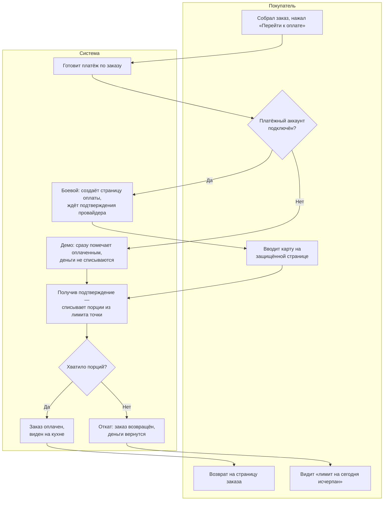
```mermaid
flowchart TB
  subgraph BUYER[Покупатель]
    B1[Собрал заказ, нажал «Перейти к оплате»]
    B2{Платёжный аккаунт<br/>подключён?}
    B3[Вводит карту на<br/>защищённой странице]
    B4[Возврат на страницу заказа]
    B5[Видит «лимит на сегодня исчерпан»]
  end
  subgraph SYS[Система]
    S1[Готовит платёж по заказу]
    S2[Демо: сразу помечает оплаченным,<br/>деньги не списываются]
    S3[Боевой: создаёт страницу оплаты,<br/>ждёт подтверждения провайдера]
    S4[Получив подтверждение —<br/>списывает порции из лимита точки]
    S5{Хватило порций?}
    S6[Заказ оплачен,<br/>виден на кухне]
    S7[Откат: заказ возвращён,<br/>деньги вернутся]
  end

  B1 --> S1 --> B2
  B2 -- Нет --> S2 --> S4
  B2 -- Да --> S3 --> B3 --> S4
  S4 --> S5
  S5 -- Да --> S6 --> B4
  S5 -- Нет --> S7 --> B5
```

### Sequence-диаграмма (для разработки)

```mermaid
sequenceDiagram
  autonumber
  actor FE as Клиент (grabzi-web)
  participant PAY as POST /api/payments/checkout-session
  participant DB as БД (orders, payments)
  participant MP as order_flow.mark_paid()
  participant CNT as LocationDailyCounter (FOR UPDATE)
  participant ST as Stripe
  participant WH as POST /api/payments/webhook

  FE->>PAY: { orderId } + Bearer customer
  PAY->>DB: get(Order); проверка user_id == owner
  alt order не найден / чужой
    PAY-->>FE: 404 NOT_FOUND
  else order.payment_status == "paid"
    PAY-->>FE: 409 ALREADY_PAID
  end
  PAY->>DB: insert Payment(status="pending", amount=order.total)

  alt settings.stripe_secret_key задан (боевой)
    PAY->>ST: stripe.checkout.Session.create(currency="aed", metadata={order_id,payment_id})
    ST-->>PAY: session{ id, url }
    PAY->>DB: payment.provider_id = session.id
    PAY-->>FE: { checkoutUrl: session.url, mock:false }
    Note over FE,ST: покупатель платит на hosted-форме Stripe
    ST->>WH: event checkout.session.completed (подпись stripe_signature)
    WH->>WH: construct_event(...) — проверка подписи (если есть webhook_secret)
    WH->>DB: get(Order), get(Payment) по metadata
    WH->>MP: mark_paid(order, provider_id)
  else mock-режим (ключа нет / SDK не установлен)
    PAY->>DB: payment.provider_id="mock_{id}", payment.status="succeeded"
    PAY->>MP: mark_paid(order, provider_id)
  end

  MP->>CNT: get_counter_row(loc, business_date, for_update=True)
  alt лимит исчерпан (committed + drinks > daily_drink_limit)
    MP->>DB: order.payment_status="refunded"; OrderEvent("refund")
    MP->>MP: notify(order)
    MP-->>PAY: raise LimitExceededError(remaining)
    PAY->>DB: payment.status="refunded"
    PAY-->>FE: 409 LOCATION_LIMIT_REACHED (+ remaining)
  else порций хватает
    MP->>CNT: committed_drinks += drinks
    MP->>DB: order.payment_status="paid"; купон→used; OrderEvent("paid")
    MP->>MP: notify(order)  %% см. VII.2 — каналы order:{id} / admin:orders / admin:orders:{loc}
    PAY-->>FE: { checkoutUrl: "/orders/{id}?paid=1", mock:true }  %% mock
  end
```

**Связки и инварианты.**

- Канон факта оплаты — подтверждение провайдера (webhook), а **не** редирект `?paid=1` (это лишь UX-цель
  редиректа). Webhook **идемпотентен**: при `order.payment_status == "paid"` повторное событие не
  пересписывает лимит (`order and payment and order.payment_status != "paid"`).
- Сумма к оплате — `order.total` (см. Часть IV, макет чека). VAT в коде не начисляется (⚠️ Часть IX).
- Дальнейшее списание лимита — единый процесс **VII.4**; здесь — только точка входа.
- Метки: ✅ реализовано · 🔧 mock без `STRIPE_SECRET_KEY` · ⚠️ VAT не реализован.

---

## VII.2. Жизненный цикл заказа и realtime по WebSocket

### Как это работает (простыми словами)

Оплаченный заказ проходит понятную цепочку из четырёх состояний: **принят → готовится → готов → выдан**.
Менеджер на кухне ведёт заказ по этой цепочке кнопками: «взять в работу», «готово», «выдан». Отдельно от
этой цепочки живёт флажок **«покупатель приехал»** (см. ST1 «Я приехал»): человек может нажать «I'm here»
на любой стадии — это не двигает заказ по цепочке, а лишь подсвечивает бариста «🚗 HERE», чтобы заказ
вынесли к окну. Возврат — отдельная, опциональная ветка из состояния «выдан».

Самое ценное для покупателя — он **не обновляет страницу**: статус приезжает сам, в реальном времени.
Как только бариста меняет состояние, страница заказа у покупателя и доска заказов на кухне обновляются
мгновенно. Если живое соединение по какой-то причине оборвалось (плохая сеть, спящий экран), система не
«молчит»: страница всё равно периодически перепроверяет статус сама (раз в 20 секунд у покупателя, раз в
10 секунд на кухне), так что человек не застрянет на устаревшей картинке. Чтобы соединение не «засыпало»,
сервер каждые 25 секунд шлёт короткий сигнал-пульс.

Менеджер видит **только свою точку**: его лента заказов отфильтрована по его точке на стороне сервера —
чужие заказы он не получает. Супер-админ видит ленту всех точек.

### Бизнес-схема «по дорожкам»

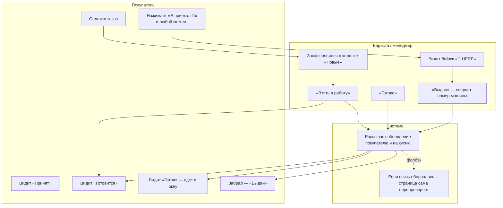
```mermaid
flowchart TB
  subgraph BUYER[Покупатель]
    B1[Оплатил заказ]
    B2[Видит «Принят»]
    B3[Нажимает «Я приехал 🚗»<br/>в любой момент]
    B4[Видит «Готовится»]
    B5[Видит «Готов» — едет к окну]
    B6[Забрал — «Выдан»]
  end
  subgraph BAR[Бариста / менеджер]
    K1[Заказ появился в колонке «Новые»]
    K2[«Взять в работу»]
    K3[«Готово»]
    K4[Видит бейдж «🚗 HERE»]
    K5[«Выдан» — сверяет номер машины]
  end
  subgraph SYS[Система]
    S1[Рассылает обновление<br/>покупателю и на кухню]
    S2[Если связь оборвалась —<br/>страница сама перепроверяет]
  end

  B1 --> K1 --> K2 --> S1 --> B4
  K2 --> B4
  K3 --> S1 --> B5
  B3 --> K4
  K4 --> K5 --> S1 --> B6
  S1 -.фолбэк.-> S2
```

### Sequence-диаграмма (для разработки)

```mermaid
sequenceDiagram
  autonumber
  actor CUST as Клиент (ST1 /orders/[id])
  actor MGR as Бариста (ADM-M /admin/kitchen)
  participant API as REST (orders / admin_orders)
  participant TR as order_flow.transition()
  participant NT as order_flow.notify()
  participant PS as core.pubsub (in-process)
  participant WSC as WS /ws/orders/{id}
  participant WSA as WS /ws/admin/orders

  Note over CUST,WSA: подписки (token в query, не в заголовке)
  CUST->>WSC: connect ?token=customer → канал order:{id}
  MGR->>WSA: connect ?token=staff → канал admin:orders ИЛИ admin:orders:{location_id}

  MGR->>API: POST /api/admin/orders/{id}/take
  API->>TR: transition(new → in_progress, by_staff_id)
  Note right of TR: TRANSITIONS={new:[in_progress], in_progress:[ready], ready:[completed], completed:[refund]}
  TR->>TR: order.manager_id = by_staff_id (закрепление менеджера)
  TR->>API: OrderEvent("status_change", status="in_progress"); commit
  TR->>NT: notify(order)
  NT->>PS: publish order:{id} {orderId,status,paymentStatus,arrived}
  NT->>PS: publish admin:orders {…,number,locationId}
  NT->>PS: publish admin:orders:{location_id} {…}
  PS-->>WSC: msg → CUST (статус «Making»)
  PS-->>WSA: msg → MGR (карточка переезжает в колонку)

  MGR->>API: POST /api/admin/orders/{id}/status {status:"ready"}
  API->>TR: transition(in_progress → ready)
  alt new_status ∉ allowed
    TR-->>API: 409 INVALID_TRANSITION:{from}->{to}
  end
  TR->>NT: notify → PS → WSC/WSA

  CUST->>API: POST /api/orders/{id}/arrived (независимый флаг)
  API->>API: order.arrived_at = utcnow() (идемпотентно); OrderEvent("arrived")
  API->>NT: notify → arrived:true → бейдж «🚗 HERE» у бариста

  MGR->>API: POST /api/admin/orders/{id}/status {status:"completed"}
  API->>TR: transition(ready → completed) → notify

  Note over CUST,WSA: heartbeat — _pump() шлёт {type:"ping"} каждые 25с при тишине
  Note over CUST: fallback — setInterval(refresh,20000) на ST1
  Note over MGR: fallback — setInterval(load,10000) на кухне
```

**Связки и инварианты.**

- Машина состояний — `TRANSITIONS` в `order_flow.py`; недопустимый переход → `409 INVALID_TRANSITION`.
  Полная статусная модель и расшифровка статусов — см. Часть 0 (§0.8) и Часть III.
- `arrived_at` — **независимый флаг**, не ступень цепочки (можно «приехать» на `new/in_progress/ready`;
  на `completed/refund` — `409 ORDER_FINISHED`).
- `notify()` публикует в **три канала**: `order:{id}` (владельцу заказа), `admin:orders` (супер-админ),
  `admin:orders:{location_id}` (менеджер точки). Полный список WS-каналов — см. Часть VIII.
- Аутентификация WS — токен в query (`?token=`), браузер не шлёт `Authorization` на WS. Клиент-канал
  открыт только владельцу заказа или персоналу; админ-канал — только персоналу; менеджер с привязкой к
  точке получает **только** `admin:orders:{location_id}`. Нарушение → close `1008`.
- Брокер `core/pubsub.py` — внутрипроцессный (asyncio); при горизонтальном масштабировании заменяется на
  Redis pub/sub (интерфейс совместим, `settings.redis_url`).
- Метки: ✅ реализовано · ⚠️ см. Часть IX (kitchen `name` i18n-контракт; super_admin на кухне).

---

## VII.3. Вход покупателя по телефону + OTP (сейчас заглушка)

### Как это работает (простыми словами)

Покупатель **не заводит пароль**. Он входит по номеру телефона, и все его заказы привязаны к этому
номеру — поэтому в «Моих заказах» он всегда видит свою историю на любом устройстве, где введёт тот же
номер. Задумано так: человек указывает телефон, получает SMS с одноразовым кодом, вводит код — и входит.
Первый вход заодно создаёт его профиль.

> **Статус (🔧 заглушка).** SMS-провайдер пока **не подключён**, поэтому проверка кода по умолчанию
> **выключена**: система пускает по номеру телефона без кода. В режиме разработки код фиксированный
> (демонстрационный) и возвращается прямо в ответе — для тестов. Это **конфигурация, а не поломка**: для
> публичного запуска нужно выбрать SMS-провайдера и включить проверку кода (см. Часть I, статус
> интеграций; Часть IX, открытый вопрос «SMS-провайдер»). На странице оформления заказа вход происходит
> «тихо» в момент оплаты — покупатель просто вводит телефон в форме и платит.

Телефон проверяется по строгому правилу формата (ведущий `+` и 9–15 цифр). После входа человек получает
«пропуск» (токен) на длительный срок, чтобы не логиниться каждый раз.

### Бизнес-схема «по дорожкам»

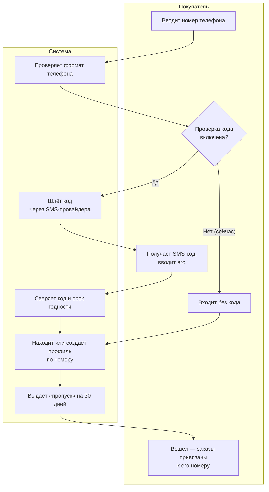
```mermaid
flowchart TB
  subgraph BUYER[Покупатель]
    B1[Вводит номер телефона]
    B2{Проверка кода<br/>включена?}
    B3[Получает SMS-код,<br/>вводит его]
    B4[Входит без кода]
    B5[Вошёл — заказы привязаны<br/>к его номеру]
  end
  subgraph SYS[Система]
    S1[Проверяет формат телефона]
    S2[Шлёт код<br/>через SMS-провайдера]
    S3[Сверяет код и срок годности]
    S4[Находит или создаёт профиль<br/>по номеру]
    S5[Выдаёт «пропуск» на 30 дней]
  end

  B1 --> S1 --> B2
  B2 -- Да --> S2 --> B3 --> S3 --> S4
  B2 -- Нет (сейчас) --> B4 --> S4
  S4 --> S5 --> B5
```

### Sequence-диаграмма (для разработки)

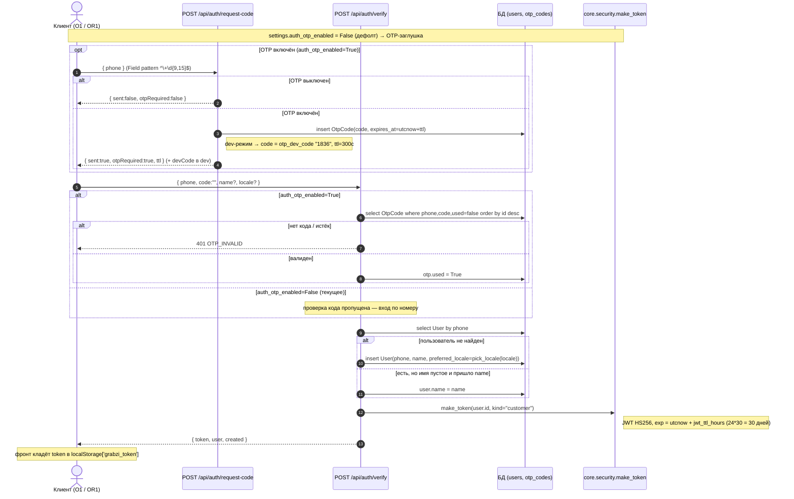
```mermaid
sequenceDiagram
  autonumber
  actor FE as Клиент (O1 / OR1)
  participant RC as POST /api/auth/request-code
  participant VF as POST /api/auth/verify
  participant DB as БД (users, otp_codes)
  participant SEC as core.security.make_token

  Note over FE,SEC: settings.auth_otp_enabled = False (дефолт) → OTP-заглушка

  opt OTP включён (auth_otp_enabled=True)
    FE->>RC: { phone } (Field pattern ^\+\d{9,15}$)
    alt OTP выключен
      RC-->>FE: { sent:false, otpRequired:false }
    else OTP включён
      RC->>DB: insert OtpCode(code, expires_at=utcnow+ttl)
      Note right of RC: dev-режим → code = otp_dev_code "1836", ttl=300с
      RC-->>FE: { sent:true, otpRequired:true, ttl } (+ devCode в dev)
    end
  end

  FE->>VF: { phone, code:"", name?, locale? }
  alt auth_otp_enabled=True
    VF->>DB: select OtpCode where phone,code,used=false order by id desc
    alt нет кода / истёк
      VF-->>FE: 401 OTP_INVALID
    else валиден
      VF->>DB: otp.used = True
    end
  else auth_otp_enabled=False (текущее)
    Note over VF: проверка кода пропущена — вход по номеру
  end
  VF->>DB: select User by phone
  alt пользователь не найден
    VF->>DB: insert User(phone, name, preferred_locale=pick_locale(locale))
  else есть, но имя пустое и пришло name
    VF->>DB: user.name = name
  end
  VF->>SEC: make_token(user.id, kind="customer")
  Note right of SEC: JWT HS256, exp = utcnow + jwt_ttl_hours (24*30 = 30 дней)
  VF-->>FE: { token, user, created }
  Note over FE: фронт кладёт token в localStorage['grabzi_token']
```

**Связки и инварианты.**

- Канон-валидация телефона на бэкенде — `^\+\d{9,15}$` (`PhoneIn.phone` в `auth.py`). ⚠️ Фронт мягче
  (`^\+?\d{7,15}$`) — расхождение зафиксировать в Часть IX; целевое правило — серверное.
- Дефолты заглушки (`core/config.py`): `auth_otp_enabled = False`, `otp_dev_mode = True`,
  `otp_dev_code = "1836"`, `otp_ttl_seconds = 300`.
- Токен — JWT HS256, TTL `jwt_ttl_hours = 24*30` (30 дней), `kind="customer"`; персонал — `kind="staff"`
  (см. VII.2 для WS-скоупа). Адаптер реального SMS подключается в `services/sms.py` при выборе провайдера.
- Метки: ✅ реализовано · 🔧 OTP-заглушка (вход без кода) · ⚠️ расхождение regex фронт/бэк.

---

## VII.4. Дневной лимит и счётчик — **ядро бизнес-модели**

> **Почему это самый важный процесс.** Вся концепция GRABZI — «**come early, we don't make more**»: точка
> делает строго ограниченное число порций в день. Значит, в один и тот же момент два покупателя могут
> «тянуться» к последней порции. Если посчитать остаток неаккуратно, можно продать одну порцию дважды.
> Этот раздел объясняет, как система гарантированно отдаёт последнюю порцию **ровно одному** покупателю.

### Как это работает (простыми словами)

У каждой точки есть дневной лимит порций (в сиде — 150). «Порция» — это **каждый напиток** в заказе, а
не заказ целиком: заказ из трёх напитков уменьшает остаток на три. Счётчик ведётся **по торговому дню в
часовом поясе точки** и сам обнуляется в полночь по местному времени — отдельной «ночной задачи» не
нужно, новый день — это просто новая дата, для которой счётчик ещё пуст.

Остаток проверяется **дважды, и это ключ к надёжности**:

1. **Мягко — пока покупатель набирает заказ.** Это подсказка: показать «осталось N на сегодня», не дать
   набрать заведомо больше остатка, не дать заказать распроданное. Но между «посмотрел» и «оплатил»
   проходит время, и остаток может измениться — поэтому мягкой проверке доверять для продажи нельзя.
2. **Строго — в момент оплаты, под «замком».** Прямо перед тем как списать порции, система **запирает**
   счётчик этой точки на этот день: пока один платёж считает остаток и списывает порции, второй платёж
   ждёт у запертой двери и заходит только после. Так два покупателя не могут одновременно «купить» одну
   последнюю порцию. Если под замком выясняется, что порций уже не хватает — оплата отменяется, заказ
   возвращается, деньги (в боевом режиме) возвращаются провайдеру, а покупатель видит «лимит на сегодня
   исчерпан».

**Что видит покупатель:** на витрине и в заказе — «TODAY'S LIMIT — осталось N» либо «Sold out for today».
**Что видит бариста:** в шапке кухни — «продано X / лимит Y, осталось Z» и прогресс-бар (зелёный <80 %,
жёлтый 80–99 %, красный ≥100 %). **Супер-админ** может вручную поправить счётчик дня (например, после
ручной продажи у окна) и видит историю.

**Возврат и счётчик.** Если оплаченный заказ возвращают **в тот же торговый день** — порции возвращаются
в остаток (счётчик уменьшается, но не ниже нуля), и они снова доступны другим покупателям. Если возврат
делают **на следующий день** — порции того дня уже «сгорели», прошлый лимит не восстанавливается (это
честно: те порции в тот день были «заняты»).

### Бизнес-схема «по дорожкам» — гонка за последней порцией

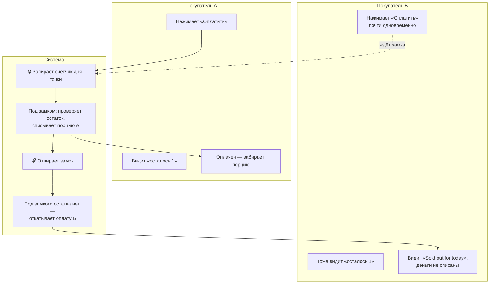
```mermaid
flowchart TB
  subgraph A[Покупатель А]
    A1[Видит «осталось 1»]
    A2[Нажимает «Оплатить»]
    A3[Оплачен — забирает порцию]
  end
  subgraph B[Покупатель Б]
    B1[Тоже видит «осталось 1»]
    B2[Нажимает «Оплатить»<br/>почти одновременно]
    B3[Видит «Sold out for today»,<br/>деньги не списаны]
  end
  subgraph SYS[Система]
    L[🔒 Запирает счётчик дня точки]
    C1[Под замком: проверяет остаток,<br/>списывает порцию А]
    U[🔓 Отпирает замок]
    C2[Под замком: остатка нет —<br/>откатывает оплату Б]
  end

  A2 --> L --> C1 --> U
  C1 --> A3
  B2 -. ждёт замка .-> L
  U --> C2 --> B3
```

### Sequence-диаграмма (для разработки)

```mermaid
sequenceDiagram
  autonumber
  participant PA as Платёж A (mark_paid)
  participant PB as Платёж Б (mark_paid)
  participant LS as location_service
  participant CNT as LocationDailyCounter
  participant DB as БД (tx + row lock)

  Note over PA,PB: оба заказа созданы при «осталось 1»; обе оплаты стартуют почти одновременно

  PA->>LS: business_date_for(loc)  %% дата в TZ точки
  PA->>CNT: get_counter_row(loc, bdate, for_update=True)
  Note right of CNT: SELECT ... WITH FOR UPDATE — пессимистическая блокировка строки дня
  CNT-->>PA: row { committed_drinks = 149 } (лимит 150)
  Note over PB,CNT: Платёж Б вызывает get_counter_row(... for_update=True) и БЛОКИРУЕТСЯ на строке

  alt committed + drinks(1) <= limit(150)
    PA->>CNT: row.committed_drinks += 1  → 150
    PA->>DB: order.payment_status="paid"; OrderEvent("paid"); commit (снимает lock)
  end
  PA->>PA: notify(order)  %% см. VII.2

  Note over PB,CNT: lock освобождён → Платёж Б продолжает с row.committed_drinks = 150
  PB->>CNT: повторная проверка под локом
  alt committed(150) + drinks(1) > limit(150)
    PB->>DB: order.payment_status="refunded"; OrderEvent("refund","limit_exceeded_refund"); commit
    PB->>PB: notify(order)
    PB-->>PB: raise LimitExceededError(remaining=0)
    Note right of PB: payments.py → 409 LOCATION_LIMIT_REACHED (+ remaining)
  end
```

**Связки и инварианты (канон — код).**

- Сущность счётчика — `LocationDailyCounter(location_id, business_date, committed_drinks)`; считает
  **напитки** (`sum(quantity)`), не заказы (см. Часть III).
- Торговый день — `business_date_for(loc, now)` = дата в TZ точки (`loc.timezone or "Asia/Dubai"`).
  «Сброс в полночь» — без cron: новый день = новая `business_date`, строка которой создаётся с `0` при
  первом обращении (`get_counter_row` создаёт строку с `committed_drinks=0`, если её нет).
- Мягкая проверка (до оплаты) — `assert_location_orderable()` в `order_flow.py`: `LOCATION_SOLD_OUT`
  (rem ≤ 0), `STOCK_LESS_THAN_ORDER` (`drinks_total > rem`, +`remaining`). Это **подсказка**, не гарантия.
- Строгая проверка (при оплате) — `mark_paid()`: `get_counter_row(..., for_update=True)` (блокировка
  строки `WITH FOR UPDATE`), затем `committed_drinks + drinks > daily_drink_limit` → откат:
  `payment_status="refunded"`, `OrderEvent("refund","limit_exceeded_refund")`, `notify`,
  `LimitExceededError(remaining)` → `payments.py` отдаёт `409 LOCATION_LIMIT_REACHED` (+ `remaining`).
- `daily_drink_limit is None` → точка без лимита: `remaining()` = `None`, проверка лимита не срабатывает,
  но `committed_drinks` всё равно инкрементируется (для аналитики).
- Возврат — `refund_order()`: декремент `committed_drinks` (не ниже 0) **только если** `business_date_for`
  по `created_at` (приведённому из UTC к TZ точки) равен текущему торговому дню. Иначе лимит прошлого дня
  не восстанавливается.
- Ручная корректировка — супер-админ: `POST /api/admin/locations/{id}/adjust-day` (`setCommitted` или
  `delta`, оба `max(0, …)`); просмотр — `GET …/{id}/daily` (см. Часть V, ADM-S-10; Часть VIII).
- Проекции: покупатель — «TODAY'S LIMIT / Sold out» (H1, L1, O1); кухня — прогресс-бар (ADM-M-04);
  супер-админ — adjust/daily/history (ADM-S-10).
- Метки: ✅ реализовано, покрыто тестами гонки (S9).

---

## VII.5. Стоп-лист напитков точки

### Как это работает (простыми словами)

Если на точке закончился ингредиент (например, сироп для одного напитка), бариста или супер-админ
помечает этот напиток как **временно недоступный именно на этой точке** — кладёт его в «стоп-лист». С
этого момента покупатель видит у напитка «Sold out» и не может его заказать; остальные напитки доступны.
Когда ингредиент завезли — напиток убирают из стоп-листа обратным действием, и он снова продаётся. Это
быстрый операционный рычаг «на сегодня», не трогающий каталог и цены сети.

Проверка работает на двух уровнях: покупатель сразу видит блокировку в меню/заказе, и **дополнительно**
сервер ещё раз проверяет стоп-лист в момент создания заказа — чтобы напиток, попавший в стоп-лист, пока
покупатель собирал заказ, всё равно не «проскочил».

### Бизнес-схема «по дорожкам»

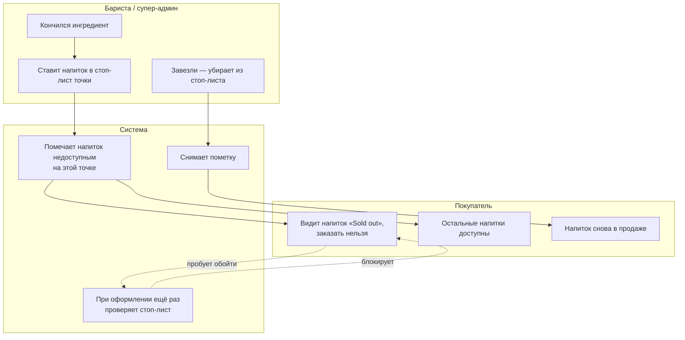
```mermaid
flowchart TB
  subgraph BAR[Бариста / супер-админ]
    K1[Кончился ингредиент]
    K2[Ставит напиток в стоп-лист точки]
    K3[Завезли — убирает из стоп-листа]
  end
  subgraph BUYER[Покупатель]
    B1[Видит напиток «Sold out»,<br/>заказать нельзя]
    B2[Остальные напитки доступны]
    B3[Напиток снова в продаже]
  end
  subgraph SYS[Система]
    S1[Помечает напиток недоступным<br/>на этой точке]
    S2[При оформлении ещё раз<br/>проверяет стоп-лист]
    S3[Снимает пометку]
  end

  K1 --> K2 --> S1 --> B1
  S1 --> B2
  B1 -. пробует обойти .-> S2 -. блокирует .-> B1
  K3 --> S3 --> B3
```

### Sequence-диаграмма (для разработки)

```mermaid
sequenceDiagram
  autonumber
  actor MGR as Бариста/админ (ADM-M-05)
  actor FE as Клиент (M1 / O1)
  participant ADM as admin/locations/{id}/stops
  participant LS as location_service.stopped_drink_ids
  participant OF as order_flow.assert_location_orderable
  participant DB as БД (location_drink_stops)

  MGR->>ADM: POST /api/admin/locations/{id}/stops { drinkId }
  ADM->>DB: insert LocationDrinkStop(location_id, drink_id)  %% existence-based
  Note over ADM,MGR: снять — DELETE …/stops/{drink_id}; список — GET …/stops

  FE->>LS: GET /api/drinks?location_id=… (меню по точке)
  LS->>DB: select drink_id from LocationDrinkStop where location_id
  LS-->>FE: помеченные напитки → «Sold out», заказ заблокирован

  FE->>OF: POST /api/orders { items, locationId }
  OF->>LS: stopped_drink_ids(db, loc.id)
  alt stopped ∩ drink_ids ≠ ∅
    OF-->>FE: 409 DRINK_UNAVAILABLE_AT_LOCATION
  else чисто
    OF->>OF: создание заказа продолжается
  end
```

**Связки и инварианты.**

- `LocationDrinkStop` — **existence-based**: факт наличия строки `(location_id, drink_id)` = «в стопе»;
  снятие — удаление строки (см. Часть III).
- Серверная проверка при оформлении — `assert_location_orderable()` (`order_flow.py`):
  `stopped & set(drink_ids)` → `409 DRINK_UNAVAILABLE_AT_LOCATION`.
- Стоп-лист **на уровне точки**; снятие напитка с публикации на уровне сети — это другой механизм
  (`Drink.status`, `DRINK_NOT_AVAILABLE` при `status != "published"` в `create_order`).
- Все операции точки пишут аудит (`LocationStatusEvent` / `OrderEvent`, см. Часть III).
- Проекции: клиент — «Sold out» (M1/O1); менеджер — стоп-лист (ADM-M-05); супер-админ — то же по сети.
- Метки: ✅ реализовано.

---

## VII.6. Купоны и рейтинг (👎 → купон)

### Как это работает (простыми словами)

После того как заказ выдан (или покупатель отметился «я приехал»), система предлагает оценить его
большим пальцем: **👍 или 👎**. Оценку можно поставить **один раз** на заказ. Логика компенсации: если
покупатель недоволен и ставит **👎**, ему **автоматически выдаётся купон** — скидка на следующий заказ
как извинение. За **👍** купон не выдаётся (доволен — компенсировать нечего).

Купон даёт **бесплатный один напиток** в следующем заказе: покупатель сам выбирает, на какой именно
напиток применить купон, и его цена вычитается из суммы. Купон «сгорает» (становится использованным)
**только после оплаты** того заказа, где его применили, — если оплата не прошла, купон остаётся
активным. Супер-админ может аннулировать активный купон.

> Номинал и срок действия купона жёстко не заданы в коде — это расход бизнеса; вынесено в открытый вопрос
> (см. Часть IX). Купон по умолчанию покрывает цену **одной** выбранной позиции следующего заказа.

### Бизнес-схема «по дорожкам»

```mermaid
flowchart TB
  subgraph BUYER[Покупатель]
    B1[Заказ выдан / отметился «приехал»]
    B2{Оценка}
    B3[👍 — спасибо, купона нет]
    B4[👎 — получает купон]
    B5[В следующем заказе выбирает<br/>напиток и применяет купон]
    B6[Оплачивает — напиток бесплатно]
  end
  subgraph SYS[Система]
    S1[Фиксирует оценку (одну на заказ)]
    S2[На 👎 — создаёт купон]
    S3[Вычитает цену выбранного напитка]
    S4[После оплаты — гасит купон]
  end
  subgraph ADM[Супер-админ]
    AD1[Может аннулировать<br/>активный купон]
  end

  B1 --> B2
  B2 -- 👍 --> S1 --> B3
  B2 -- 👎 --> S1 --> S2 --> B4 --> B5 --> S3 --> B6 --> S4
  AD1 -.void.-> S2
```

### Sequence-диаграмма (для разработки)

```mermaid
sequenceDiagram
  autonumber
  actor FE as Клиент
  participant RT as POST /api/orders/{id}/rate
  participant ORD as POST /api/orders (create_order)
  participant MP as order_flow.mark_paid
  participant DB as БД (orders, coupons)

  Note over FE,DB: рейтинг
  FE->>RT: { rating: "like" | "dislike" }
  alt rating ∉ {like,dislike}
    RT-->>FE: 422 VALIDATION_ERROR
  else уже оценён
    RT-->>FE: 409 ALREADY_RATED
  else не выдан и не «приехал»
    RT-->>FE: 409 ORDER_NOT_RATABLE
  end
  RT->>DB: order.rating; OrderEvent("rated", note=rating)
  alt rating == "dislike"
    RT->>DB: insert Coupon(user_id, source_order_id, status="active")
    RT-->>FE: { couponIssued:true, couponId }
  else like
    RT-->>FE: { couponIssued:false }
  end

  Note over FE,DB: применение в следующем заказе
  FE->>ORD: POST /api/orders { items, couponId, couponItemIndex }
  ORD->>DB: get Coupon
  alt coupon нет / чужой / не active
    ORD-->>FE: 409 COUPON_INVALID
  else couponItemIndex не указывает напиток
    ORD-->>FE: 422 COUPON_ITEM_REQUIRED
  else ок
    ORD->>DB: item.paid_by_coupon=True; coupon_discount = цена напитка
    ORD->>DB: order.total = subtotal − coupon_discount; OrderEvent("coupon_applied")
  end

  Note over FE,MP: купон гасится только при оплате
  FE->>MP: оплата заказа (см. VII.1)
  MP->>DB: coupon.status="used"; used_at; used_order_id; used_item_id; discount_amount
```

**Связки и инварианты.**

- Выдача купона — только при `rating == "dislike"` (`routers/orders.py`); один рейтинг на заказ
  (`ALREADY_RATED`); оценивать можно при `status == "completed"` **или** `arrived_at` задан
  (иначе `ORDER_NOT_RATABLE`).
- Применение — `create_order()` (`order_flow.py`): купон валиден если `user_id` совпадает и
  `status == "active"`; покупатель сам указывает `couponItemIndex` (какой напиток покрывает купон),
  иначе `COUPON_ITEM_REQUIRED`; `coupon_discount = цена выбранного напитка`; `total = subtotal − discount`.
- Гашение — `mark_paid()`: `coupon.status = "used"` после оплаты (см. VII.1). До оплаты купон остаётся
  `active`.
- Аннулирование супер-админом — `coupon.status = "void"` (`POST /api/admin/coupons/{id}/void`, см.
  Часть V, ADM-S-05). Список купонов клиента — `GET /api/coupons`.
- Номинал/срок — в коде не зафиксированы → ❓ открытый вопрос (Часть IX).
- Метки: ✅ реализовано.

---

## VII.7. Статус точки (вычисляемый `open / paused / closed / inactive`)

### Как это работает (простыми словами)

Статус точки **нигде не хранится как «галочка» — он вычисляется** каждый раз из трёх вещей: включена ли
точка в принципе, не поставлена ли она «на паузу» вручную, и попадает ли текущее время в её рабочие часы.
Так статус всегда честный и не «протухает».

Порядок проверки (важен приоритет): если точка вообще выключена — она **«неактивна»**; иначе если её
вручную поставили на паузу — **«пауза»**; иначе если сейчас вне рабочих часов — **«закрыто»** (и
показывается, во сколько откроется); и только если всё в порядке — **«открыто»**. Рабочие часы умеют
работать и «через полночь» (например, окно до 02:00 ночи учитывается как продолжение предыдущего дня).

**Что видит покупатель:** на карточке точки — цветной бейдж статуса, часы работы, и «opens HH:MM», если
закрыто. Заказать можно только на открытой точке: при попытке оформить заказ на закрытой/паузнутой
система понятно объяснит причину. **Бариста** ставит свою точку на паузу одним движением, когда нужно
временно остановить приём (завал, уборка). **Супер-админ** управляет паузой и часами по всей сети.

### Бизнес-схема «по дорожкам»

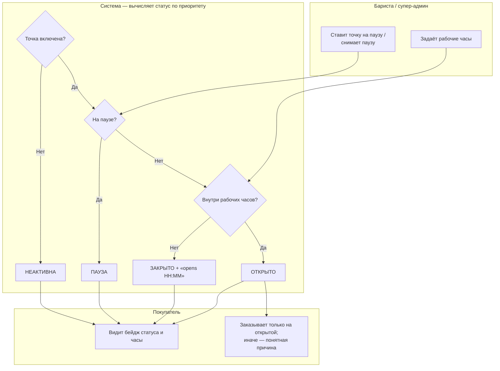
```mermaid
flowchart TB
  subgraph BAR[Бариста / супер-админ]
    K1[Ставит точку на паузу /<br/>снимает паузу]
    K2[Задаёт рабочие часы]
  end
  subgraph SYS[Система — вычисляет статус по приоритету]
    S1{Точка включена?}
    S2{На паузе?}
    S3{Внутри рабочих часов?}
    R1[НЕАКТИВНА]
    R2[ПАУЗА]
    R3[ЗАКРЫТО + «opens HH:MM»]
    R4[ОТКРЫТО]
  end
  subgraph BUYER[Покупатель]
    B1[Видит бейдж статуса и часы]
    B2[Заказывает только на открытой;<br/>иначе — понятная причина]
  end

  K1 --> S2
  K2 --> S3
  S1 -- Нет --> R1 --> B1
  S1 -- Да --> S2
  S2 -- Да --> R2 --> B1
  S2 -- Нет --> S3
  S3 -- Нет --> R3 --> B1
  S3 -- Да --> R4 --> B1
  R4 --> B2
```

### Sequence-диаграмма (для разработки)

```mermaid
sequenceDiagram
  autonumber
  actor FE as Клиент (L1) / Кухня (ADM-M-04)
  participant API as locations / admin/location-status
  participant LS as location_service.effective_status
  participant OF as order_flow.assert_location_orderable

  FE->>API: GET /api/locations (список с бейджами)
  API->>LS: effective_status(loc, now)
  Note right of LS: приоритет — not is_active→"inactive"; not accepting_orders→"paused";<br/>not schedule_open→"closed"; иначе "open"
  LS->>LS: schedule_open → in_schedule(now, working_hours, tz) (учёт окна через полночь)
  LS-->>API: status (+ next_open_at если closed)
  API-->>FE: бейдж + часы + «opens HH:MM»

  Note over FE,OF: попытка заказа на закрытой/паузнутой точке
  FE->>OF: POST /api/orders { locationId, items }
  alt not loc.is_active
    OF-->>FE: 404 LOCATION_NOT_FOUND
  else not accepting_orders
    OF-->>FE: 409 LOCATION_PAUSED
  else not schedule_open
    OF-->>FE: 409 LOCATION_CLOSED (+ next_open_at)
  end
```

**Связки и инварианты.**

- `effective_status()` (`location_service.py`) — **не хранится в БД**, вычисляется из `is_active`,
  `accepting_orders`, `schedule_open()`; приоритет: `inactive → paused → closed → open`.
- `in_schedule()` — поддержка окна через полночь (`close < open`): учитывается «голова» сегодняшнего и
  «хвост» вчерашнего интервала; пустой массив дня = выходной.
- `next_open_at()` — ближайшее открытие в пределах 14 дней (для copy «opens HH:MM»).
- Серверный gate при заказе — `assert_location_orderable()`: `LOCATION_NOT_FOUND` / `LOCATION_PAUSED` /
  `LOCATION_CLOSED` (+ `next_open_at`).
- Пауза — `accepting_orders=false` (менеджер/супер-админ); все смены пишут `LocationStatusEvent` (аудит,
  Часть III).
- Проекции: клиент — бейдж/часы (L1); кухня — статус в шапке (ADM-M-04); супер-админ — pause/часы (ADM-S-10).
- Метки: ✅ реализовано.

---

## VII.8. Медиа: загрузка и отдача через S3/MinIO

### Как это работает (простыми словами)

Картинки и короткие видео для каталога (превью напитков, баннеры) супер-админ загружает в облачное
хранилище. Загруженный файл получает короткий внутренний адрес (ключ), который и сохраняется в карточке
напитка; полный веб-адрес для показа покупателю система собирает «на лету» при отдаче. Это позволяет
поменять хранилище или CDN без переписывания базы — в базе лежит только ключ, не жёсткая ссылка.

Хранилище защищено: принимаются только разрешённые типы (картинки JPEG/PNG/WebP, видео MP4/WebM) и файлы
до 25 МБ; имя файла генерируется системой (нельзя «подсунуть» путь). Если хранилище не настроено, загрузка
аккуратно отключается (вернётся «хранилище недоступно»), а **остальное приложение продолжает работать** —
можно временно указывать готовые внешние ссылки на медиа.

### Бизнес-схема «по дорожкам»

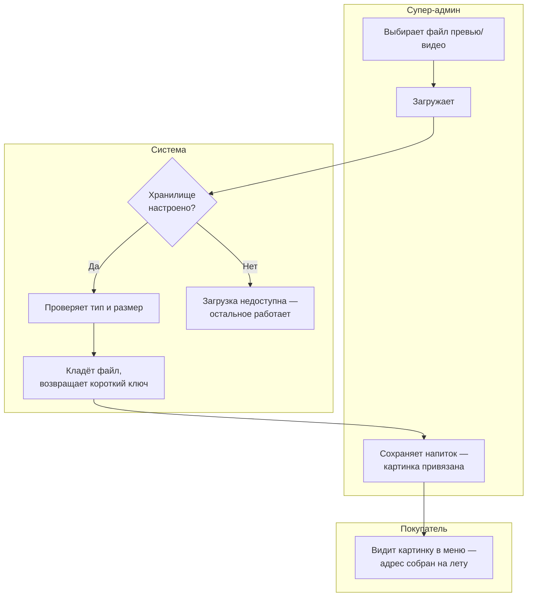
```mermaid
flowchart TB
  subgraph ADM[Супер-админ]
    A1[Выбирает файл превью/видео]
    A2[Загружает]
    A3[Сохраняет напиток —<br/>картинка привязана]
  end
  subgraph SYS[Система]
    S1{Хранилище<br/>настроено?}
    S2[Проверяет тип и размер]
    S3[Кладёт файл,<br/>возвращает короткий ключ]
    S4[Загрузка недоступна —<br/>остальное работает]
  end
  subgraph BUYER[Покупатель]
    B1[Видит картинку в меню —<br/>адрес собран на лету]
  end

  A1 --> A2 --> S1
  S1 -- Да --> S2 --> S3 --> A3 --> B1
  S1 -- Нет --> S4
```

### Sequence-диаграмма (для разработки)

```mermaid
sequenceDiagram
  autonumber
  actor ADM as Супер-админ
  participant UP as POST /api/admin/media
  participant ST as services.storage.upload
  participant S3 as S3 / MinIO
  participant CAT as admin/catalog PATCH
  actor FE as Клиент (M1)

  ADM->>UP: multipart { file, folder } (require_super_admin)
  UP->>ST: upload(file, folder)
  alt content_type ∉ ALLOWED
    ST-->>ADM: 422 MEDIA_TYPE_NOT_ALLOWED
  else size > 25 МБ
    ST-->>ADM: 413 MEDIA_TOO_LARGE
  else s3_bucket не задан / boto3 нет
    ST-->>ADM: 503 MEDIA_STORAGE_DISABLED
  else ок
    ST->>S3: put_object(key="media/{folder}/{uuid}{ext}", CacheControl=1y)
    ST-->>ADM: { key, url, contentType, size }
  end
  ADM->>CAT: PATCH drink { previewUrl: key }  %% в БД хранится КЛЮЧ
  FE->>FE: GET /api/drinks → media_url(key)
  Note right of FE: media_url: абсолютный URL = s3_public_url|s3_endpoint_url + bucket + key;<br/>уже-абсолютные ("http"/"/") отдаются как есть
```

**Связки и инварианты.**

- Единственное место, знающее про хранилище, — `services/storage.py` (provider-swap без переписывания БД).
- `ALLOWED` — `image/jpeg|png|webp`, `video/mp4|webm`; `MAX_BYTES = 25 МБ`; ключ генерируется
  (`media/{folder}/{uuid}{ext}`) — нет path-traversal.
- `enabled()` = `bool(s3_bucket)`; без bucket — `503 MEDIA_STORAGE_DISABLED` (graceful degradation),
  внешние URL-строки остаются фолбэком. `boto3` импортируется лениво.
- `media_url(key)` собирает абсолютный URL из `s3_public_url`/`s3_endpoint_url` + bucket + key; ключи,
  начинающиеся с `http://`/`https://`/`/`, отдаются как есть (сид-пути, внешние CDN).
- Доступ — только `require_super_admin`. Проекции: супер-админ — загрузка (ADM-S-12); клиент — показ (M1/P1).
- Метки: ✅ реализовано · 🔧 без bucket загрузка выключена.

---

## VII.9. CMS-контент (InfoBlock)

### Как это работает (простыми словами)

Тексты страницы «Инфо» (история бренда, контакты, часы, соцсети) ведёт супер-админ как набор **блоков**:
у каждого блока есть ключ, заголовок и тело, порядок и переключатель «показывать / скрыть». Покупателю на
странице «Инфо» показываются **только активные** блоки, в заданном порядке, на нужном языке. Так
владелец меняет тексты без участия разработчиков, а на витрине ничего не «ломается»: скрытый блок просто
не показывается.

### Бизнес-схема «по дорожкам»

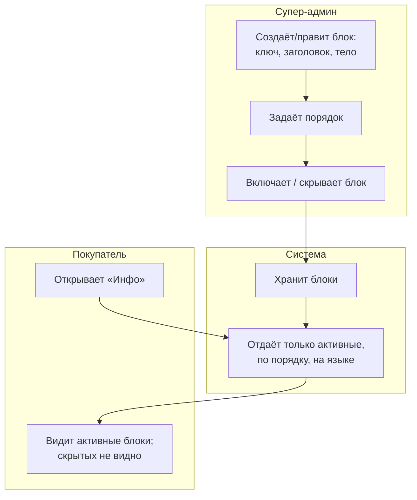
```mermaid
flowchart TB
  subgraph ADM[Супер-админ]
    A1[Создаёт/правит блок:<br/>ключ, заголовок, тело]
    A2[Задаёт порядок]
    A3[Включает / скрывает блок]
  end
  subgraph SYS[Система]
    S1[Хранит блоки]
    S2[Отдаёт только активные,<br/>по порядку, на языке]
  end
  subgraph BUYER[Покупатель]
    B1[Открывает «Инфо»]
    B2[Видит активные блоки;<br/>скрытых не видно]
  end

  A1 --> A2 --> A3 --> S1
  B1 --> S2 --> B2
  S1 --> S2
```

### Sequence-диаграмма (для разработки)

```mermaid
sequenceDiagram
  autonumber
  actor ADM as Супер-админ
  participant AC as /api/admin/content (require_super_admin)
  participant PC as GET /api/content (public)
  participant DB as БД (info_blocks)
  participant I18 as services.i18n
  actor FE as Клиент (I1 /info)

  ADM->>AC: POST { key, title{}, body{}, sort, isActive }
  alt key уже занят
    AC-->>ADM: 409 KEY_TAKEN
  else ок
    AC->>DB: insert InfoBlock
  end
  ADM->>AC: PATCH /{id} { title?/body?/sort?/isActive? } (только переданные поля)

  FE->>PC: GET /api/content?locale=…
  PC->>DB: select InfoBlock where is_active=true order by sort
  PC->>I18: t(block.title, locale), t(block.body, locale)  %% см. VII.10
  PC-->>FE: [{ key, title, body }] — активные блоки по порядку
```

**Связки и инварианты.**

- Админ-CRUD — `require_super_admin`; публичная выдача — `GET /api/content` (только `is_active=true`,
  порядок `sort`). Дублирующий `key` → `409 KEY_TAKEN`.
- `PATCH` применяет **только переданные поля** (`model_fields_set`) — частичное обновление.
- Заголовок/тело — i18n JSON (`{ru,ar,en}`); отдаются через `t(..., locale)` (см. VII.10).
- Проекции: супер-админ — CMS (ADM-S-12); клиент — `/info` (I1) с фолбэком при пустом контенте.
- Метки: ✅ реализовано.

---

## VII.10. Локализация контента (`pick_locale`, fallback)

### Как это работает (простыми словами)

Все «контентные» тексты (имена и описания напитков, блоки «Инфо») хранятся **сразу на нескольких языках**
в одном поле. При запросе клиент указывает желаемый язык, и система выбирает нужный перевод. Если для
выбранного языка перевода нет — текст не пропадает: система показывает запасной язык, а если и его нет —
первый доступный перевод. Так покупатель **никогда не видит пустоту** вместо названия.

> **Текущее состояние и ⚠️ расхождение.** Инфраструктура многоязычности (хранение `{ru,ar,en}`, выбор
> языка, запасные варианты, готовность к арабскому/RTL) **заложена**. Интерфейс приложения сейчас по сути
> одноязычный. При этом в коде **язык по умолчанию — `ru`**, а список поддерживаемых — `["ru","ar"]`,
> тогда как бренд GRABZI позиционируется **EN-first** (рынок ОАЭ). Это расхождение «целевая модель
> EN-first ↔ дефолт `ru` в конфиге» нужно зафиксировать и привести к одному значению (см. Часть IX,
> открытые вопросы; настройка `default_locale`/`locales` в `core/config.py`).

### Бизнес-схема «по дорожкам»

```mermaid
flowchart TB
  subgraph BUYER[Покупатель]
    B1[Открывает меню / «Инфо»<br/>на своём языке]
    B4[Видит текст —<br/>всегда непустой]
  end
  subgraph SYS[Система выбирает перевод]
    S1{Есть перевод<br/>на нужный язык?}
    S2[Берёт нужный язык]
    S3{Есть язык<br/>по умолчанию?}
    S4[Берёт язык по умолчанию]
    S5[Берёт первый доступный перевод]
  end

  B1 --> S1
  S1 -- Да --> S2 --> B4
  S1 -- Нет --> S3
  S3 -- Да --> S4 --> B4
  S3 -- Нет --> S5 --> B4
```

### Sequence-диаграмма (для разработки)

```mermaid
sequenceDiagram
  autonumber
  actor FE as Клиент (M1 / I1 / P1)
  participant API as catalog / content
  participant PL as i18n.pick_locale
  participant T as i18n.t

  FE->>API: GET …?locale=<req>  %% дефолт query "ru" в роутерах каталога
  API->>PL: pick_locale(req)
  Note right of PL: locale if req ∈ settings.locales else settings.default_locale
  PL-->>API: locale
  loop по каждому i18n-полю (name/description/title/body)
    API->>T: t(value, locale)
    Note right of T: value.get(locale) → value.get(default_locale) → next(iter(values)) → ""
  end
  API-->>FE: тексты на выбранном языке (с фолбэком)
```

**Связки и инварианты (канон — код).**

- `pick_locale(locale)` (`services/i18n.py`): `locale if locale in settings.locales else default_locale`.
- `t(value, locale)` — тройной фолбэк: запрошенный язык → `default_locale` → первый доступный перевод →
  `""` (пустое поле). Применяется к именам/описаниям напитков, заголовкам/телам InfoBlock.
- Конфиг (`core/config.py`): `default_locale = "ru"`, `locales = ["ru","ar"]`; роутеры каталога
  принимают `locale` как query (`Query("ru")`). Профиль клиента хранит `preferred_locale`
  (`pick_locale` при регистрации, PATCH в профиле). ⚠️ Расхождение с EN-first — см. Часть IX.
- AR/RTL (`dir`, выбор языка) — заложен, но UI фактически одноязычный (V1.1, см. Часть I, локализация).
- Проекции: клиент — меню/инфо (M1/P1/I1); супер-админ — заполнение переводов в каталоге/CMS.
- Метки: ✅ инфраструктура реализована · ⚠️ EN-first ↔ дефолт `ru`.

---

> **Перекрёстные ссылки.** Статусная модель и расшифровка статусов — Часть 0 (§0.8). Сущности
> (`LocationDailyCounter`, `LocationDrinkStop`, `Order`, `Payment`, `Coupon`, `InfoBlock`, `OrderEvent`,
> `LocationStatusEvent`) — Часть III. Эндпоинты и WS-каналы — Часть VIII. Коды ошибок — Приложение C.
> Деньги, статус интеграций (mock-Stripe / OTP-заглушка / Redis / S3 / WS) — Часть I. Открытые вопросы и
> противоречия (VAT, телефон-regex, EN-first vs `ru`, kitchen `name`-контракт) — Часть IX.


---

# Часть VIII. СПРАВОЧНИК API

> **Канон достоверности — код** (`backend/app/routers/*.py`, `backend/app/main.py`, `backend/app/core/security.py`,
> `backend/app/core/errors.py`). Все пути, методы, поля и коды ошибок ниже выписаны из реально
> смонтированных роутеров; ничего не выдумано. Where поведение задаётся сервисами — см. сквозные
> процессы (**см. Часть VII**); модель данных и enum — **см. Часть III**; реестр кодов ошибок —
> **см. Часть IX / Приложение C**.

---

## VIII.0 Общие конвенции API

### VIII.0.1 База, версии, форматы
- **База URL (dev):** `http://localhost:8000`. Префикс всех REST-маршрутов — `/api/...` (исключение —
  служебный `GET /health` без префикса). WebSocket — `/ws/...`.
- **Формат тела и ответа** — `application/json`. Денежные значения — числа в **AED** (поля `total`,
  `subtotal`, `amount`, `basePrice` и т. п.); налоговая строка (VAT) в ответах **отсутствует** —
  цена является финальной (⚠️ VAT 5 % как требование — **см. Часть IX**).
- **i18n-поля** (`name`, `description`, `title`, `body`) в публичных ответах уже **разрешены в строку**
  под текущую локаль (параметр `locale`); в админских ответах отдаются **как объект** `{"en":…,"ru":…,"ar":…}`
  целиком (для редактирования). Эта асимметрия — реальный контракт кода (⚠️ дефект kitchen↔location-status
  из-за неё — **см. Часть IX**, дефект №1).

### VIII.0.2 Авторизация и роли
Авторизация — через заголовок **`Authorization: Bearer <JWT>`** (HS256, TTL 30 дней; `core/security.py`).
В токене различаются два «вида» (`kind`): `customer` (клиент) и `staff` (персонал), у `staff` — поле
`role` (`manager` | `super_admin`). Зависимости-гарды и их смысл:

| Гард (зависимость) | Кого пускает | Нарушение → |
|---|---|---|
| `get_current_user` | только `kind=customer` | нет токена → **401** `AUTH_REQUIRED`; чужой вид → **403** `FORBIDDEN` |
| `get_current_staff` | только `kind=staff` (не `disabled`) | **401** `AUTH_REQUIRED` / **403** `FORBIDDEN` |
| `require_super_admin` | `staff` с `role=super_admin` | **403** `FORBIDDEN` |
| `require_manager_or_super` | `staff` с `role∈{manager,super_admin}` | **403** `FORBIDDEN` |
| `manager_scope_location` (не гард, а скоуп) | возвращает `location_id` менеджера или `None` для super_admin | при обращении к чужой точке → **403** `FOREIGN_LOCATION` |

> **Ролевой скоуп точки.** Менеджер, привязанный к точке (`location_id ≠ null`), на всех «операционных»
> эндпоинтах (заказы, стоп-лист, статус точки) **жёстко ограничен своей точкой** — обращение к чужой
> отдаёт `FOREIGN_LOCATION` (403). Super_admin скоупом не ограничен. Подробнее о ролях — **см. Часть 0.6**.

### VIII.0.3 Формат ошибок
Доменные ошибки отдаются по контракту `core/errors.py` (`http_error`): тело — либо **строка-код**
(`detail: "LOCATION_PAUSED"`), либо **объект** `{"code": "...", ...meta}`, когда есть метаданные
(например `remaining`, `next_open_at`). Глобальный обработчик `ValueError` → **422**
`{"code":"VALIDATION_ERROR","detail":…}`. Полный реестр доменных кодов — **см. Приложение C**;
ниже у каждого эндпоинта перечислены только релевантные.

### VIII.0.4 Порядок монтирования (из `main.py`)
`catalog → locations → auth → orders → payments → coupons → staff → admin_catalog → admin_orders →
admin_locations → admin_locations.status_router → admin_settings → admin_media → content →
content.public_router → dashboard → ws`. **15 файлов роутеров → 17 смонтированных `APIRouter`**
(в `content` и `admin_locations` по два роутера). Плюс `GET /health` объявлен прямо в `main.py`.

---

## VIII.1. Публичное API

> Доступно клиенту (часть — без токена, часть — под `customer`-токеном). Группы: **auth**, **catalog**,
> **locations**, **orders**, **payments**, **coupons**, **content (public)**.

### A.1 auth — авторизация клиента (`/api/auth`)
Файл `routers/auth.py`. Вход по телефону + (опционально) OTP; токен — `customer`. SMS-провайдер не выбран
(⚠️ заглушка, **см. Часть VII / OTP**).

| Метод · путь | Авторизация | Ключевые поля запроса | Ответ | Ошибки |
|---|---|---|---|---|
| `POST /api/auth/request-code` | публично | `phone` (валидируется `^\+\d{9,15}$`) | OTP **выкл.**: `{sent:false, otpRequired:false}`; **вкл.**: `{sent:true, otpRequired:true, ttl, devCode?}` | 422 валидация телефона |
| `POST /api/auth/verify` | публично | `phone`, `code`(=""), `name?`, `locale?` | `{token, user:{id,phone,name,carPlate,emirate,locale}, created}` | **401** `OTP_INVALID` (если OTP включён) |
| `GET /api/auth/me` | `customer` | — | `{id,phone,name,carPlate,emirate,locale}` | 401 |
| `PATCH /api/auth/me` | `customer` | `name?`, `carPlate?` (→ UPPERCASE), `emirate?`, `locale?` | тот же payload пользователя | **422** `VALIDATION_ERROR` (неизвестная локаль) |

> `car_plate` приводится к верхнему регистру на сервере. `locale` нормализуется к поддерживаемым
> (иначе берётся дефолтная). PII (`phone`, `car_plate`) — **см. Часть I / PDPL**.

### A.2 catalog — каталог напитков (`/api`)
Файл `routers/catalog.py`. Публичный, без токена. Отдаёт только опубликованные напитки
(`status="published"`). Addon-конфигуратор (`/preview`, поле `addons`) в потоке GRABZI «спит» 🧩.

| Метод · путь | Авторизация | Ключевые поля запроса | Ответ | Ошибки |
|---|---|---|---|---|
| `GET /api/categories` | публично | `locale?` | `[{id,name,photoUrl,videoUrl}]` (только активные, по `sort`) | — |
| `GET /api/drinks` | публично | `category?` (id), `location_id?`, `locale?` | `[{id,slug,name,previewUrl,videoUrl,basePrice,kcal,categoryId,soldOut}]` | — |
| `GET /api/drinks/{slug}` | публично | `slug`, `locale?` | деталка `{id,slug,name,description,…,basePrice,kcal/protein/fat/carbs,addons[]}` | **404** `NOT_FOUND` (нет/не published) |
| `POST /api/drinks/{slug}/preview` 🧩 | публично | `selections:[{addonId,portions}]` | `{price,kcal,protein,fat,carbs,addons[]}` (серверный пересчёт) | 404; **409** `ADDON_NOT_AVAILABLE` / `ADDON_PORTIONS_OUT_OF_RANGE` / `SELECTION_TYPE_VIOLATED` |

> `location_id` нужен, чтобы пометить напитки стоп-листа точки флагом `soldOut:true` (не скрывает —
> фронт гасит степпер). Стоп-лист — **см. Часть VII**.

### A.3 locations — точки (`/api/locations`)
Файл `routers/locations.py`. Публичный. Отдаёт точку с **вычисленным** статусом (`open/paused/closed/inactive`),
остатком в напитках и `nextOpenAt` (если закрыта). Логика статуса — `location_service` (**см. Часть VII**).

| Метод · путь | Авторизация | Поля | Ответ | Ошибки |
|---|---|---|---|---|
| `GET /api/locations` | публично | `locale?` | `[{id,name,description,address,coordinates,workingHours,timezone,dailyDrinkLimit,soldToday,remaining,isSoldOut,isOpen,status,nextOpenAt,acceptingOrders,color,imageUrl}]` (только активные) | — |
| `GET /api/locations/{location_id}` | публично | `location_id`, `locale?` | тот же объект точки | **404** `LOCATION_NOT_FOUND` (нет/неактивна) |

### A.4 orders — заказы клиента (`/api/orders`)
Файл `routers/orders.py`. Под `customer`-токеном; клиент видит только свои заказы. Создание заказа,
отметка прибытия, оценка (👎 выдаёт купон). Жизненный цикл и лимит — `order_flow` (**см. Часть VII**).

| Метод · путь | Авторизация | Ключевые поля запроса | Ответ | Ошибки |
|---|---|---|---|---|
| `POST /api/orders` | `customer` | `items:[{drinkId,quantity,customName?,addons[]}]`, `locationId?`, `customerName?`, `carPlate?`, `emirate?`, `couponId?`, `couponItemIndex?`; `?locale` | заказ `order_payload` (full) | **422** `CART_EMPTY` / `CAR_PLATE_REQUIRED`; **409** `LOCATION_*`, `DRINK_*`, `STOCK_LESS_THAN_ORDER` (из `create_order`) |
| `GET /api/orders` | `customer` | — | `[order_payload(full=false)]` (свои, по убыв. id) | 401 |
| `GET /api/orders/{order_id}` | `customer` (свой) | `order_id` | заказ (full) + `ratingPromptDue:bool` | **404** `NOT_FOUND` (чужой/нет) |
| `POST /api/orders/{order_id}/arrived` | `customer` (свой) | `order_id` | заказ (idempotent — флаг `arrived`) | 404; **409** `ORDER_NOT_PAID` / `ORDER_FINISHED` |
| `POST /api/orders/{order_id}/rate` | `customer` (свой) | `rating` (`like`\|`dislike`) | `{ok, couponIssued, couponId}` | 404; **422** `VALIDATION_ERROR`; **409** `ALREADY_RATED` / `ORDER_NOT_RATABLE` |

> Форма `order_payload`: `id, number, status, paymentStatus, arrived, subtotal, couponDiscount, total,
> createdAt, rating, items[]`; при `full=true` ещё `customerName, phone, carPlate, emirate, events[]`.
> `arrived` — независимый флаг, **не** часть цепочки статусов (**см. Часть 0.8**). `dislike` создаёт
> один `Coupon` на заказ.

### A.5 payments — оплата (`/api/payments`)
Файл `routers/payments.py`. Stripe Checkout; без `STRIPE_SECRET_KEY` → **mock** (платёж сразу `succeeded`,
заказ → `paid`, редирект `/orders/{id}?paid=1`). Webhook — публичный (подпись по секрету). Поток оплаты
и гонка лимита — **см. Часть VII**.

| Метод · путь | Авторизация | Ключевые поля запроса | Ответ | Ошибки |
|---|---|---|---|---|
| `POST /api/payments/checkout-session` | `customer` (свой заказ) | `orderId`, `successUrl?`, `cancelUrl?` | реальный: `{checkoutUrl, mock:false}`; mock: `{checkoutUrl:"/orders/{id}?paid=1", mock:true}` | **404** `NOT_FOUND`; **409** `ALREADY_PAID`; **409** `LOCATION_LIMIT_REACHED` (+`remaining`, гонка под `FOR UPDATE`) |
| `POST /api/payments/webhook` | публично (Stripe-подпись) | сырое тело Stripe + заголовок `Stripe-Signature` | `{received:true}` | **400** `BAD_SIGNATURE` (если задан webhook-секрет и подпись неверна) |

> Webhook реагирует на `checkout.session.completed`: помечает платёж `succeeded` и заказ `paid`
> (через `mark_paid`); при гонке лимита платёж → `refunded`.

### A.6 coupons — купоны клиента (`/api/coupons`)
Файл `routers/coupons.py`. Под `customer`-токеном.

| Метод · путь | Авторизация | Поля | Ответ | Ошибки |
|---|---|---|---|---|
| `GET /api/coupons` | `customer` | — | `[{id,status,issuedAt,sourceOrderId,usedOrderId,discountAmount}]` (свои, по убыв. id) | 401 |

> Купоны выдаются за 👎 в `POST /api/orders/{id}/rate` и применяются при создании заказа
> (`couponId`/`couponItemIndex`). Аннулирование — у супер-админа (см. B.5). Номинал/срок жёстко не
> зафиксированы (❓ открытый вопрос — **см. Часть IX**).

### A.7 content (public) — инфо-страница (`/api/content`)
Файл `routers/content.py`, роутер `public_router`. Публичный.

| Метод · путь | Авторизация | Поля | Ответ | Ошибки |
|---|---|---|---|---|
| `GET /api/content` | публично | `locale?` | `[{key,title,body}]` (только активные, по `sort`, разрешено под локаль) | — |

---

## VIII.2. Админ / Staff API

> Под `staff`-токеном. Группы: **staff** (вход/менеджеры), **admin_catalog**, **admin_orders**
> (+клиенты/платежи/купоны), **admin_locations** (+location-status), **admin_settings**, **admin_media**,
> **dashboard**, **admin content (CRUD)**. Большинство админ-роутеров — `super_admin`-only (гард на уровне
> роутера); операционные эндпоинты заказов/стоп-листа доступны и менеджеру в скоупе его точки.

### B.1 staff — персонал (`/api/staff`)
Файл `routers/staff.py`. Вход — email + пароль (pbkdf2_sha256), токен — `staff` с `role`. Управление
менеджерами — `super_admin`. Удаление — **мягкое** (`disabled=true`, история `by_staff_id` сохраняется).

| Метод · путь | Авторизация | Ключевые поля | Ответ | Ошибки |
|---|---|---|---|---|
| `POST /api/staff/login` | публично | `email`, `password` | `{token, staff:{id,email,name,role,locationId,disabled}}` | **401** `INVALID_CREDENTIALS` (нет/`disabled`/пароль) |
| `GET /api/staff/me` | `staff` | — | `staff`-payload | 401/403 |
| `GET /api/staff/managers` | `super_admin` | — | `[staff-payload]` | 403 |
| `POST /api/staff/managers` | `super_admin` | `email,password,name,role?(=manager),locationId?` | `staff`-payload | **422** `VALIDATION_ERROR` (роль); **409** `EMAIL_TAKEN` |
| `PATCH /api/staff/managers/{staff_id}` | `super_admin` | `name?,role?,locationId?,disabled?` | `staff`-payload | **404** `NOT_FOUND`; 422 (роль) |
| `DELETE /api/staff/managers/{staff_id}` | `super_admin` | `staff_id` | `{ok:true}` (soft-delete) | **409** `CANNOT_DELETE_SELF`; **404** `NOT_FOUND` |

### B.2 admin_catalog — каталог CRUD (`/api/admin/catalog`)
Файл `routers/admin_catalog.py`. **Весь роутер — `super_admin`** (гард на уровне роутера). i18n-поля
(`name`,`description`) принимаются/отдаются как объекты `{locale:…}`. Группы: категории напитков,
единицы, категории добавок, добавки, напитки + связки addon (последние 🧩 «спят» в публичном потоке).

| Метод · путь | Ключевые поля / тело | Ответ | Ошибки |
|---|---|---|---|
| `GET /api/admin/catalog/drink-categories` | — | `[{id,name,photoUrl,videoUrl,isActive,sort}]` | — |
| `POST /api/admin/catalog/drink-categories` | `name,photoUrl?,videoUrl?,isActive,sort` | категория | — |
| `PATCH /api/admin/catalog/drink-categories/{cat_id}` | те же поля | категория | **404** `NOT_FOUND` |
| `GET /api/admin/catalog/units` | — | `[{id,code,name}]` | — |
| `POST /api/admin/catalog/units` | `code,name` | unit | **409** `CODE_TAKEN` |
| `GET /api/admin/catalog/addon-categories` | — | `[{id,name,iconUrl,isActive,selectionType}]` | — |
| `POST /api/admin/catalog/addon-categories` | `name,iconUrl?,isActive,selectionType(single\|multi\|counter)` | addon-категория | **422** `VALIDATION_ERROR` |
| `PATCH /api/admin/catalog/addon-categories/{cat_id}` | те же поля | addon-категория | **404** `NOT_FOUND` |
| `GET /api/admin/catalog/addons` | — | `[{id,name,imageUrl,categoryId,unitId,kcal/protein/fat/carbsPer100,basePrice,isActive}]` | — |
| `POST /api/admin/catalog/addons` | `name,categoryId,unitId,*Per100,basePrice,isActive,imageUrl?` | addon | — |
| `PATCH /api/admin/catalog/addons/{addon_id}` | те же поля | addon | **404** `NOT_FOUND` |
| `GET /api/admin/catalog/drinks` | — | `[drink]` (все: draft/published/hidden, с `bindings[]`) | — |
| `POST /api/admin/catalog/drinks` | `slug,name,description,status(draft\|published\|hidden),previewUrl?,videoUrl?,basePrice,kcal/…,categoryId` | drink | **422** `VALIDATION_ERROR` (status); **409** `SLUG_TAKEN` |
| `PATCH /api/admin/catalog/drinks/{drink_id}` | те же поля | drink | **404** `NOT_FOUND` |
| `PUT /api/admin/catalog/drinks/{drink_id}/bindings` 🧩 | `[{addonId,priceOverride?,minPortions,defaultPortions,maxPortions,portionAmount,selectionTypeOverride?}]` (полная замена) | drink с `bindings[]` | **404** `NOT_FOUND`; **409** `ADDON_NOT_FOUND:{id}`; **422** `PORTIONS_RANGE_INVALID` |

### B.3 admin_orders — заказы / клиенты / платежи / купоны (`/api/admin`)
Файл `routers/admin_orders.py`, prefix `/api/admin`. Заказы доступны **любому staff** в скоупе точки
(менеджер — своя точка, иначе `FOREIGN_LOCATION`); клиенты/платежи/купоны — **`super_admin`-only** (гард
на эндпоинте). Только оплаченные заказы (`payment_status="paid"`). Переходы статусов — `transition`/`refund`
из `order_flow` (**см. Часть VII**), они шлют WS-нотификации.

### Заказы (staff + скоуп точки)
| Метод · путь | Авторизация | Ключевые поля | Ответ | Ошибки |
|---|---|---|---|---|
| `GET /api/admin/orders` | `staff` (скоуп точки) | `active?`, `manager_id?`, `location_id?`(super), `unassigned?` | `[order_row]` (paid; по убыв. id) | 401/403 |
| `GET /api/admin/orders/{order_id}` | `staff` (скоуп) | `order_id` | `order_row` + `events[]` (с `byStaffId/byUserId/note`) | **404** `NOT_FOUND`; **403** `FOREIGN_LOCATION` |
| `POST /api/admin/orders/{order_id}/take` | `staff` (скоуп) | — | `order_row` (→ `in_progress` + закреплён менеджер) | 404; 403; **409** `ORDER_NOT_PAID` |
| `POST /api/admin/orders/{order_id}/status` | `staff` (скоуп) | `status`(`ready`\|`completed`), `note?` | `order_row` | 404; 403; **422** `VALIDATION_ERROR` |
| `POST /api/admin/orders/{order_id}/refund` 🧩 | `staff` (скоуп) | `note?` | `order_row` (статус `refund`, лимит дня декрементируется) | 404; 403 |

### Клиенты (`super_admin`)
| Метод · путь | Поля | Ответ | Ошибки |
|---|---|---|---|
| `GET /api/admin/customers` | — | `[{id,phone,name,carPlate,locale,createdAt}]` | 403 |
| `GET /api/admin/customers/{user_id}` | `user_id` | профиль + `orders[]`,`payments[]`,`coupons[]` | **404** `NOT_FOUND` |
| `PATCH /api/admin/customers/{user_id}` | `name?,carPlate?(→UPPER),emirate?` | `{ok:true}` | **404** `NOT_FOUND` |

### Платежи и купоны (`super_admin`)
| Метод · путь | Поля | Ответ | Ошибки |
|---|---|---|---|
| `GET /api/admin/payments` | — | `[{id,orderId,amount,currency,provider,providerId,status,createdAt,orderNumber,customerPhone,userId}]` | 403 |
| `GET /api/admin/coupons` | — | `[{id,userId,status,sourceOrderId,usedOrderId,usedItemId,discountAmount,issuedAt,usedAt}]` | 403 |
| `POST /api/admin/coupons/{coupon_id}/void` | `coupon_id` | купон (`status=void`) | **404** `NOT_FOUND`; **409** `COUPON_NOT_ACTIVE` |

### B.4 admin_locations — точки (`/api/admin/locations`) + статус (`/api/admin`)
Файл `routers/admin_locations.py`. **Два роутера:** `router` (CRUD/pause/daily/adjust/history/stops) и
`status_router` (`/api/admin/location-status`). Гарды — **пер-эндпоинтные**: CRUD/пауза/счётчик/история —
`super_admin`; стоп-лист — `manager_or_super` + скоуп; location-status — любой staff (со скоупом).

### CRUD и операции (`super_admin`)
| Метод · путь | Ключевые поля | Ответ | Ошибки |
|---|---|---|---|
| `GET /api/admin/locations` | — | `[admin_row]` (все, с `soldToday/remaining/status/isOpen`) | 403 |
| `POST /api/admin/locations` | `name,description,address?,coordinates?,workingHours,timezone,dailyDrinkLimit?,acceptingOrders,color?,imageUrl?,isActive,sort` | `admin_row` | 403 |
| `PATCH /api/admin/locations/{location_id}` | любые из полей (partial; `model_fields_set` отличает null от «не задано») | `admin_row` | **404** `LOCATION_NOT_FOUND` |
| `POST /api/admin/locations/{location_id}/pause` | `acceptingOrders`(bool), `reason?` | `admin_row` (идемпотентно, пишет аудит) | 404; 403 |
| `GET /api/admin/locations/{location_id}/daily` | `date?` | `{date,soldDrinks,limit,remaining}` | 404 |
| `POST /api/admin/locations/{location_id}/adjust-day` | `date?`, `setCommitted?` \| `delta?` | `{date,soldDrinks}` | 404 |
| `GET /api/admin/locations/{location_id}/history` | — | `[{id,action,drinkId,byStaffId,reason,at,durationMinutes}]` (длительность паузы — на чтении) | 404 |

### Стоп-лист (`manager_or_super` + скоуп точки)
| Метод · путь | Ключевые поля | Ответ | Ошибки |
|---|---|---|---|
| `GET /api/admin/locations/{location_id}/stops` | — | `[{id,drinkId,reason,byStaffId,createdAt}]` | 404; **403** `FOREIGN_LOCATION` |
| `POST /api/admin/locations/{location_id}/stops` | `drinkId`, `reason?` | `{id,drinkId,alreadyStopped}` (идемпотентно, аудит) | 404; 403 |
| `DELETE /api/admin/locations/{location_id}/stops/{drink_id}` | `drink_id` | **204** (без тела; идемпотентно, аудит) | 404; 403 |

### Панель статуса/остатка точки (`status_router`, любой staff)
| Метод · путь | Авторизация | Поля | Ответ | Ошибки |
|---|---|---|---|---|
| `GET /api/admin/location-status` | `staff` | `location_id?`, `scope?(="all")` | manager → своя точка `{locationId,name,status,soldToday,limit,remaining,isOpen,nextOpenAt}`; super → одна точка или `{scope:"all",totalSold,totalLimit,locations[]}` | 401/403 |

> ⚠️ **Дефект контракта** (kitchen): поле `name` здесь отдаётся как i18n-**объект** (`{"en":…}`), тогда
> как фронт KDS ждёт строку → ложное «Session expired». Для super_admin без точки/без параметров
> возвращается `{scope:"all", locations:[]}`, которого схема кухни не ожидает (KDS рассчитан на
> менеджера). Оба — **см. Часть IX**, дефекты №1/№2.

### B.5 admin_settings — настройки (`/api/admin/settings`)
Файл `routers/admin_settings.py`. **Весь роутер — `super_admin`**. Редактируемые бизнес-дефолты
(`app_settings`) и read-only зеркало интеграций (только статус `configured|missing`, без секретов).

| Метод · путь | Поля | Ответ | Ошибки |
|---|---|---|---|
| `GET /api/admin/settings` | — | `{editable:{general,defaults}, readonly:{integrations:{stripe,stripeWebhook,otpEnabled,jwtAlg,database,redis,ratingTimeoutMinutes,locales}}}` | 403 |
| `PATCH /api/admin/settings` | произвольные editable-ключи `{key:value}` | `{ok:true, values}` | **422** `UNKNOWN_SETTING_KEY` (+`key`) / `INVALID_SETTING` (+`key`,`reason`) |

### B.6 admin_media — загрузка медиа (`/api/admin`)
Файл `routers/admin_media.py`. **Весь роутер — `super_admin`**. Multipart-загрузка в S3/MinIO
(fallback — URL-строки). Сервис — `storage` (**см. Часть VII**).

| Метод · путь | Поля (multipart) | Ответ | Ошибки |
|---|---|---|---|
| `POST /api/admin/media` | `file` (UploadFile), `folder` (="misc") | `{key,url,…}` | 403 |

### B.7 dashboard — аналитика (`/api/admin/dashboard`)
Файл `routers/dashboard.py`. **Весь роутер — `super_admin`**. Считает по оплаченным заказам с фильтром
по периоду/точке.

| Метод · путь | Поля | Ответ | Ошибки |
|---|---|---|---|
| `GET /api/admin/dashboard` | `from?`, `to?`, `location_id?` | `{revenue, ordersCount, drinksSold, byLocation[], avgDrinksPerOrder, avgOrderValue, ordersByHour, topProducts[], topCustomers[]}` | 403 |

### B.8 admin content — CMS CRUD (`/api/admin/content`)
Файл `routers/content.py`, роутер `router`. **Весь роутер — `super_admin`**. Управление инфо-блоками
(публичная выдача — A.7). i18n-поля `title`/`body` — объекты.

| Метод · путь | Ключевые поля | Ответ | Ошибки |
|---|---|---|---|
| `GET /api/admin/content` | — | `[{id,key,title,body,sort,isActive}]` (по `sort`) | 403 |
| `POST /api/admin/content` | `key,title,body,sort,isActive` | блок | **409** `KEY_TAKEN` |
| `PATCH /api/admin/content/{block_id}` | `title?,body?,sort?,isActive?` (partial) | блок | **404** `NOT_FOUND` (отдаётся через `LOCATION_NOT_FOUND` generic) |

---

## VIII.3. WebSocket-каналы

> Файл `routers/ws.py`. Реальный WebSocket (asyncio in-process через `core/pubsub`). Браузер не шлёт
> `Authorization` на WS → **токен передаётся query-параметром `?token=`** (тот же JWT). Heartbeat:
> сервер шлёт `{"type":"ping"}` каждые ~25 с при отсутствии событий. Нотификации публикуются из
> `order_flow.notify` (**см. Часть VII**). Закрытие при отказе авторизации — код **1008**
> (`WS_1008_POLICY_VIOLATION`).

| Канал | Кто допускается | Подписка (pubsub-канал) | Сообщения |
|---|---|---|---|
| `WS /ws/orders/{order_id}?token=` | владелец заказа (`customer`-токен, проверка `user_id`) **или** любой `staff` | `order:{order_id}` | `{orderId,status,paymentStatus,arrived}` + `{type:"ping"}` |
| `WS /ws/admin/orders?token=` | только `staff` (не `disabled`); **менеджер с точкой → свой per-location канал** | `admin:orders` (super) или `admin:orders:{location_id}` (менеджер) | `{orderId,status,paymentStatus,arrived,number,locationId}` + `{type:"ping"}` |

> Менеджер, привязанный к точке, подписывается **только** на `admin:orders:{location_id}` — глобальную
> ленту не видит. Super_admin (без точки) — на глобальный `admin:orders`.

---

## VIII.4. Прочее (вне групп)

| Метод · путь | Источник | Авторизация | Ответ |
|---|---|---|---|
| `GET /health` | `main.py` (не роутер) | публично | `{status:"ok"}` |

---

## VIII.5. Полный список эндпоинтов (сверка с фактом)

> **Сводка по коду.** 15 файлов роутеров → 17 смонтированных `APIRouter`. **69 REST-эндпоинтов в
> роутерах + 2 WebSocket = 71 декоратор-эндпоинт**, плюс служебный `GET /health` в `main.py` →
> **итого 72 маршрута** (70 REST + 2 WS). Разбивка по файлам:
> auth 4 · catalog 4 · locations 2 · orders 5 · payments 2 · coupons 1 · content 4 (3 admin + 1 public) ·
> staff 6 · admin_catalog 15 · admin_orders 11 · admin_locations 11 (10 CRUD/stops + 1 status_router) ·
> admin_settings 2 · admin_media 1 · dashboard 1 · ws 2.

| # | Метод | Путь | Группа | Авторизация |
|---|---|---|---|---|
| 1 | GET | `/api/categories` | catalog | публично |
| 2 | GET | `/api/drinks` | catalog | публично |
| 3 | GET | `/api/drinks/{slug}` | catalog | публично |
| 4 | POST | `/api/drinks/{slug}/preview` | catalog 🧩 | публично |
| 5 | GET | `/api/locations` | locations | публично |
| 6 | GET | `/api/locations/{location_id}` | locations | публично |
| 7 | POST | `/api/auth/request-code` | auth | публично |
| 8 | POST | `/api/auth/verify` | auth | публично |
| 9 | GET | `/api/auth/me` | auth | customer |
| 10 | PATCH | `/api/auth/me` | auth | customer |
| 11 | POST | `/api/orders` | orders | customer |
| 12 | GET | `/api/orders` | orders | customer |
| 13 | GET | `/api/orders/{order_id}` | orders | customer (свой) |
| 14 | POST | `/api/orders/{order_id}/arrived` | orders | customer (свой) |
| 15 | POST | `/api/orders/{order_id}/rate` | orders | customer (свой) |
| 16 | POST | `/api/payments/checkout-session` | payments | customer (свой) |
| 17 | POST | `/api/payments/webhook` | payments | публично (подпись) |
| 18 | GET | `/api/coupons` | coupons | customer |
| 19 | POST | `/api/staff/login` | staff | публично |
| 20 | GET | `/api/staff/me` | staff | staff |
| 21 | GET | `/api/staff/managers` | staff | super_admin |
| 22 | POST | `/api/staff/managers` | staff | super_admin |
| 23 | PATCH | `/api/staff/managers/{staff_id}` | staff | super_admin |
| 24 | DELETE | `/api/staff/managers/{staff_id}` | staff | super_admin |
| 25 | GET | `/api/admin/catalog/drink-categories` | admin_catalog | super_admin |
| 26 | POST | `/api/admin/catalog/drink-categories` | admin_catalog | super_admin |
| 27 | PATCH | `/api/admin/catalog/drink-categories/{cat_id}` | admin_catalog | super_admin |
| 28 | GET | `/api/admin/catalog/units` | admin_catalog | super_admin |
| 29 | POST | `/api/admin/catalog/units` | admin_catalog | super_admin |
| 30 | GET | `/api/admin/catalog/addon-categories` | admin_catalog | super_admin |
| 31 | POST | `/api/admin/catalog/addon-categories` | admin_catalog | super_admin |
| 32 | PATCH | `/api/admin/catalog/addon-categories/{cat_id}` | admin_catalog | super_admin |
| 33 | GET | `/api/admin/catalog/addons` | admin_catalog | super_admin |
| 34 | POST | `/api/admin/catalog/addons` | admin_catalog | super_admin |
| 35 | PATCH | `/api/admin/catalog/addons/{addon_id}` | admin_catalog | super_admin |
| 36 | GET | `/api/admin/catalog/drinks` | admin_catalog | super_admin |
| 37 | POST | `/api/admin/catalog/drinks` | admin_catalog | super_admin |
| 38 | PATCH | `/api/admin/catalog/drinks/{drink_id}` | admin_catalog | super_admin |
| 39 | PUT | `/api/admin/catalog/drinks/{drink_id}/bindings` | admin_catalog 🧩 | super_admin |
| 40 | GET | `/api/admin/orders` | admin_orders | staff (скоуп) |
| 41 | GET | `/api/admin/orders/{order_id}` | admin_orders | staff (скоуп) |
| 42 | POST | `/api/admin/orders/{order_id}/take` | admin_orders | staff (скоуп) |
| 43 | POST | `/api/admin/orders/{order_id}/status` | admin_orders | staff (скоуп) |
| 44 | POST | `/api/admin/orders/{order_id}/refund` | admin_orders 🧩 | staff (скоуп) |
| 45 | GET | `/api/admin/customers` | admin_orders | super_admin |
| 46 | GET | `/api/admin/customers/{user_id}` | admin_orders | super_admin |
| 47 | PATCH | `/api/admin/customers/{user_id}` | admin_orders | super_admin |
| 48 | GET | `/api/admin/payments` | admin_orders | super_admin |
| 49 | GET | `/api/admin/coupons` | admin_orders | super_admin |
| 50 | POST | `/api/admin/coupons/{coupon_id}/void` | admin_orders | super_admin |
| 51 | GET | `/api/admin/locations` | admin_locations | super_admin |
| 52 | POST | `/api/admin/locations` | admin_locations | super_admin |
| 53 | PATCH | `/api/admin/locations/{location_id}` | admin_locations | super_admin |
| 54 | POST | `/api/admin/locations/{location_id}/pause` | admin_locations | super_admin |
| 55 | GET | `/api/admin/locations/{location_id}/daily` | admin_locations | super_admin |
| 56 | POST | `/api/admin/locations/{location_id}/adjust-day` | admin_locations | super_admin |
| 57 | GET | `/api/admin/locations/{location_id}/history` | admin_locations | super_admin |
| 58 | GET | `/api/admin/locations/{location_id}/stops` | admin_locations | manager_or_super (скоуп) |
| 59 | POST | `/api/admin/locations/{location_id}/stops` | admin_locations | manager_or_super (скоуп) |
| 60 | DELETE | `/api/admin/locations/{location_id}/stops/{drink_id}` | admin_locations | manager_or_super (скоуп) |
| 61 | GET | `/api/admin/location-status` | admin_locations (status_router) | staff (скоуп) |
| 62 | GET | `/api/admin/settings` | admin_settings | super_admin |
| 63 | PATCH | `/api/admin/settings` | admin_settings | super_admin |
| 64 | POST | `/api/admin/media` | admin_media | super_admin |
| 65 | GET | `/api/admin/content` | content (admin) | super_admin |
| 66 | POST | `/api/admin/content` | content (admin) | super_admin |
| 67 | PATCH | `/api/admin/content/{block_id}` | content (admin) | super_admin |
| 68 | GET | `/api/content` | content (public) | публично |
| 69 | GET | `/api/admin/dashboard` | dashboard | super_admin |
| 70 | WS | `/ws/orders/{order_id}` | ws | customer(свой)/staff (`?token=`) |
| 71 | WS | `/ws/admin/orders` | ws | staff (`?token=`) |
| 72 | GET | `/health` | main.py | публично |

> **Итог сверки:** 71 маршрут в смонтированных роутерах (69 REST + 2 WS) + `GET /health` = **72**. Это
> совпадает с фактом по коду (`grep` декораторов: 71 в роутерах + 1 в `main.py`). Число «17 смонтированных
> роутеров» из `_FACTS_SPINE` относится к объектам `APIRouter`, а не к эндпоинтам.

---

### Метки
✅ всё перечисленное реально смонтировано в `main.py`. 🧩 «спящие» в публичном потоке GRABZI:
addon-конфигуратор (`/api/drinks/{slug}/preview`, `…/bindings`) и возврат (`…/orders/{id}/refund`).
🔧 оплата работает в mock-режиме без `STRIPE_SECRET_KEY`; OTP — заглушка. ⚠️ контрактные дефекты
location-status (i18n-`name` + `{scope:"all",locations:[]}`) — **см. Часть IX**.


---

# Часть IX. КАЧЕСТВО, ОГРАНИЧЕНИЯ, ОТКРЫТЫЕ ВОПРОСЫ

> Канон достоверности — код прототипа (`backend/`, `grabzi-web/`). Бизнес-термины — простым языком;
> идентификаторы (поля, enum, коды ошибок, маршруты) — латиницей. Перекрёстные ссылки: `см. Часть N`.

## IX.1. Каталог бизнес-правил (BR-01…BR-11) — для утверждения заказчиком

> **Для заказчика.** Это «свод законов» продукта простым языком: что система делает и **почему именно так**.
> Каждое правило вы можете подтвердить или попросить изменить — на этом строятся все экраны и процессы.
> Технические детали каждого правила раскрыты в сквозных процессах (`см. Часть VII`); здесь — суть и статус.

**Условные обозначения статуса:** ✅ действует (реализовано в прототипе) · 🔧 заглушка/конфигурация (требует
подключения в проде) · ⚠️ требование, **не реализовано в коде** (к настройке) · 🧩 опциональный модуль · ❓ требует
решения заказчика.

| ID | Правило простым языком | Зачем так (для бизнеса) | Где применяется | Статус |
|---|---|---|---|---|
| **BR-01** | **Дневной лимит «больше не делаем».** Каждая точка продаёт за день не больше заданного числа порций напитков (в сиде — **150**). Когда лимит выбран — приём заказов на сегодня закрывается, и человек видит «Sold out for today». | Предсказуемый объём, гарантия свежести, эффект дефицита («приходи раньше»), нет списаний несвежего продукта. | Сбор заказа (O1), оплата, экран кухни (KDS), дашборд. `см. Часть VII «Дневной лимит»` | ✅ |
| **BR-02** | **Обязательный номер машины.** Заказ нельзя оформить без номера автомобиля; номер приводится к ЗАГЛАВНЫМ буквам. По нему бариста узнаёт клиента у окна выдачи. | Выдача «к машине» (curbside) без имён и очередей — основа модели drive-through. | Сбор заказа (O1), выдача, экран кухни. | ✅ |
| **BR-03** | **Стоп-лист напитков по точке.** Менеджер может пометить напиток недоступным на своей точке (кончился сироп) — клиент видит «Sold out» и не может его заказать; снимается обратным действием. | Точечно убрать позицию из продажи, не трогая каталог сети; меньше отказов на выдаче. | Меню (M1), сбор заказа (O1), кухня (ADM-M-05). `см. Часть VII «Стоп-лист»` | ✅ |
| **BR-04** | **Цена и НДС (VAT 5 %).** Цена напитка показывается в дирхамах ОАЭ (AED). Налог НДС 5 % по умолчанию считается **включённым в цену** (модель «inclusive»): отдельной налоговой строки в чеке нет, цена — финальная. Итог к оплате = сумма позиций − скидка по купону. | Прозрачная цена для покупателя; соответствие требованиям ОАЭ (TRN/VAT). | Меню, сбор заказа, чек, оплата. `см. Часть VII «Платёж»`, `см. Часть I «Деньги/VAT»` | ⚠️ **VAT не реализован в коде** (нет налоговой строки; `total = subtotal − coupon_discount`). Модель «включён» — решение к подтверждению (см. ❓Q-VAT) |
| **BR-05** | **Бизнес-день по времени точки, сброс в полночь.** «Сегодняшний» лимит считается по часовому поясу точки (`Asia/Dubai`) и обнуляется в полночь по времени точки, а не сервера. | Корректный учёт продаж и лимита в местном времени; единая логика дня для продажи и возврата. | Дневной лимит, счётчик, возврат. `см. Часть VII «Дневной лимит»` | ✅ |
| **BR-06** | **Возврат и дневной счётчик.** Менеджер может вернуть оплаченный заказ. Если возврат сделан в тот же бизнес-день, что и продажа, освободившиеся порции возвращаются в дневной лимит (счётчик не уходит ниже нуля). Возврат в другой день лимит прошлого дня не восстанавливает. | Честный учёт остатка дня; нельзя «накрутить» лимит возвратами из прошлого. | Возврат на кухне (ADM-M-06 🧩). `см. Часть VII «Жизненный цикл заказа»` | ✅ (модуль возврата — 🧩 опциональный) |
| **BR-07** | **Купон за оценку 👎.** После заказа клиент ставит 👍 или 👎. Дизлайк (👎) выдаёт купон-компенсацию (скидку на следующий заказ); 👍 не выдаёт. Один рейтинг на заказ; купон списывает **одну** позицию следующего заказа. | Возврат недовольного клиента, сигнал о проблеме качества, удержание. | Статус заказа (ST1), оценка/купон, сбор заказа. `см. Часть VII «Купоны/рейтинг»` | ✅ (номинал/срок купона — ❓Q-COUPON) |
| **BR-08** | **Менеджер видит только свою точку.** Бариста/менеджер работает с заказами и статусом одной привязанной точки; чужие точки, каталог сети, цены, персонал и деньги ему недоступны. Супер-админ — вся сеть. | Защита данных сети; у сотрудника точки нет лишних полномочий. | Кухня (ADM-M), супер-админ (ADM-S). `см. Часть V`, `см. Часть VI` | ✅ (сервер возвращает 403 `FOREIGN_LOCATION` на чужую точку) |
| **BR-09** | **Минимальная сумма заказа.** Минимальный порог суммы заказа в коде **не задан** — заказать можно на любую сумму > 0 (с непустой корзиной). | Влияет на юнит-экономику мелких заказов и нагрузку утреннего пика. | Сбор заказа (O1), оплата. | ❓ **не задано** — требует решения (см. ❓Q-MINORDER) |
| **BR-10** | **Вход без SMS-кода (сейчас).** Клиент входит по номеру телефона; SMS-код сейчас **не запрашивается** (проверка OTP выключена). Все заказы привязываются к номеру и видны клиенту в «Мои заказы». | Быстрый вход без пароля; для прода — защита от чужого номера через SMS. | Вход клиента, оплата, «Мои заказы» (OR1). `см. Часть VII «OTP»` | 🔧 заглушка (`auth_otp_enabled = false`; для прода — SMS-провайдер, см. ❓Q-SMS) |
| **BR-11** | **Оплата картой через провайдера (сейчас имитируется).** Заказ становится виден кухне только после оплаты. Без подключённого платёжного провайдера оплата **имитируется** (реальные деньги не списываются, заказ сразу «оплачен»). | Кухня готовит только оплаченные заказы (нет «брошенных» корзин); для прода — реальный приём денег. | Оплата, кухня. `см. Часть VII «Платёж»` | 🔧 mock без ключа провайдера (для прода — Stripe merchant + TRN, см. ❓Q-STRIPE/Q-TRN) |

> **Подпись заказчика:** _Заказчик подтверждает бизнес-правила BR-01…BR-11 (с учётом решений по ❓-вопросам ниже)._
>
> | Роль | ФИО | Решение | Дата | Подпись |
> |---|---|---|---|---|
> | Заказчик / спонсор |  |  |  |  |
> | Владелец продукта |  |  |  |  |

---

## IX.2. NFR — статус приёмки (канон порогов — §I.5)

> ⚠️ **Единственный канонический реестр NFR** (с порогами и способами проверки) — **§I.5**. Здесь — только
> **приёмочный статус** по тем же ID, без переопределения порогов. 📝 — целевое допущение к подтверждению
> на нагрузочном тесте; ✅ — реализовано/покрыто тестом; ⚠️ — требует подтверждения.

| ID (§I.5) | Кратко | Статус приёмки |
|---|---|---|
| NFR-01 | p95 GET ≤ 300 мс | 📝 цель — нагрузочный тест |
| NFR-02 | p95 оплаты ≤ 800 мс (с `FOR UPDATE`) | 📝 цель |
| NFR-03 | WS-пуш статуса ≤ 1 с (fallback polling 20с/10с) | ✅ realtime реализован (asyncio); задержку замерить |
| NFR-04 | TTI `/menu` на 3G ≤ 3 с | 📝 цель — Lighthouse |
| NFR-05 | ≥ 20 конкурентных заказов без потери лимита | ✅ покрыт тестом гонки (S9) |
| NFR-06 | лимит конфигурируем (150 / `null`) | ✅ |
| NFR-07 | uptime ≥ 99.5 %/мес | 📝 цель — мониторинг прод |
| NFR-08 | идемпотентность вебхука оплаты | ⚠️ к подтверждению (см. §IX.6, Q-WEBHOOK) |
| NFR-09 | RPO ≤ 5 мин / RTO ≤ 1 ч | 📝 регламент бэкапов |
| NFR-10 | целостность лимита (`FOR UPDATE`, не за лимит/не ниже 0) | ✅ покрыт (S9) |
| NFR-11 | безопасность (JWT/pbkdf2/секреты в ENV) | ✅ |
| NFR-12 | браузеры + мин. ширина **320 px** | ✅ mobile-frame; кросс-браузер — проверить |
| NFR-13 | a11y WCAG 2.2 AA | 🔧 цель; дефекты контраста — §II / §IX.6 |

---

## IX.3. Что НЕ входит в MVP (Out-of-scope) и Future/Roadmap

> Полный Scope — `см. Часть 0 (§0.2)`. Здесь — напоминание границ, привязанное к статусу.

**Out-of-scope (явно исключено из проекта):**

| Пункт | Почему вне MVP |
|---|---|
| Нативные мобильные приложения (iOS/Android) | продукт — mobile-web; нативка не планируется |
| Доставка курьером / интеграция с агрегаторами | модель — drive-through/curbside, прямые продажи без посредника |
| Программа лояльности / бонусные баллы | вне модели; компенсация ограничена купоном за 👎 (BR-07) |
| Мультиарендность (несколько брендов в одной системе) | одна сеть GRABZI |
| КБЖУ/нутриенты в публичном потоке | `kcal = 0`, поля КБЖУ в потоке GRABZI «спят» |

**Future / Roadmap (отложено, инфраструктура частично заложена):**

| Пункт | Статус сейчас |
|---|---|
| Арабский язык и RTL-вёрстка | 🚧 инфраструктура заложена (`dir`, `pick_locale`, i18n-поля `{ru,ar,en}`); UI EN-only — V1.1 |
| Реальные SMS-OTP | 🔧 заглушка (вход без кода); включается выбором SMS-провайдера |
| Реальный приём денег (Stripe live) | 🔧 mock без ключа; включается Stripe merchant + TRN |
| Addon-конфигуратор (допы/единицы/привязки) | 🧩 таблицы есть, в публичном потоке GRABZI «спят» |
| Возвраты как полноценный модуль | 🧩 базовый возврат реализован (BR-06), UI — на этапе реализации |
| Полный супер-админ в `grabzi-web` (мобильный) | 🚧 существует на API (S2/S3); экран — контур B (`см. Приложение D`) |

---

## IX.4. Статус интеграций (сводка)

> Полное «что это значит для запуска» простыми словами — `см. Часть I (§статус интеграций)`. Здесь — таблица состояния.

| Интеграция | Состояние в прототипе | Что нужно для прода |
|---|---|---|
| **Stripe (оплата)** | 🔧 реальный SDK; без `STRIPE_SECRET_KEY` → **mock**: заказ сразу `paid`, редирект `/orders/{id}?paid=1`, деньги не списываются | Stripe merchant-аккаунт + TRN (❓Q-STRIPE, ❓Q-TRN) |
| **SMS-OTP** | 🔧 **заглушка**: `auth_otp_enabled = false` → вход по телефону без кода; dev-режим вернул бы код | выбор SMS-провайдера, включение проверки кода (❓Q-SMS) |
| **Redis (pub/sub, кэш)** | ✅ опционально; при отсутствии — in-memory fallback | для горизонтального масштаба — отдельный Redis |
| **WebSocket (realtime)** | ✅ реальный (asyncio in-process); fallback polling | — |
| **S3 / MinIO (медиа)** | ✅ реальный; fallback на URL-строки | bucket/креды для прода |
| **JWT / пароли** | ✅ HS256 TTL 30 дней; pbkdf2_sha256 | секрет-менеджмент в проде |

---

## IX.5. Охват тестами (backend/tests)

> Канон — `backend/tests/**`. Всего **77 тестов** (`def test_*`, подтверждено `grep`). Тесты — контракт
> «что считается рабочим». Сквозная привязка к историям — `см. Приложение A`.

| Файл тестов | Кол-во | Что покрывает | Связанные истории |
|---|---|---|---|
| `test_auth.py` | 9 | вход клиента (телефон, OTP вкл/выкл, создание/привязка пользователя), валидация телефона | OR1, вход клиента, BR-10 |
| `test_catalog.py` | 10 | каталог: категории/напитки, статусы публикации, i18n-выдача, preview-расчёт | M1, P1, ADM-S-07/08 |
| `test_locations_api.py` | 4 | публичная выдача точек, поля статуса/часов/остатка | L1, ADM-S-10 |
| `test_location_logic.py` | 10 | бизнес-день/TZ, расписание open/closed, `next_open_at`, остаток, вычисляемый статус | BR-01, BR-05, статус точки |
| `test_location_orders.py` | 8 | заказ на точке: предпроверки (часы/пауза/стоп-лист/остаток), коды ошибок | O1, BR-01/03 |
| `test_orders_flow.py` | 6 | создание заказа, снэпшоты, переходы статуса, события, оплата (mark_paid) | O1, ST1, ADM-M-03 |
| `test_limit_race.py` | 1 | конкуренция за последнюю порцию под `FOR UPDATE` (защита от гонки) | BR-01, NFR-04 |
| `test_coupons.py` | 4 | выдача купона за 👎, применение к одной позиции, статусы `active/used/void` | BR-07, оценка/купон, ADM-S-05 |
| `test_staff_scope.py` | 3 | скоуп менеджера (своя точка), 403 `FOREIGN_LOCATION` на чужую | BR-08, ADM-M, ADM-S-02 |
| `test_admin.py` | 8 | админ-операции (заказы, переходы, take/status, дашборд-доступ) | ADM-M-02/03, ADM-S-01/02 |
| `test_admin_locations.py` | 5 | админ-локации: CRUD, pause, adjust-day, история, location-status | ADM-S-10, ADM-M-04 |
| `test_admin_settings_content.py` | 3 | настройки (locales/OTP/дефолты), CMS-контент (InfoBlock) | ADM-S-11/12 |
| `test_media.py` | 3 | загрузка медиа в S3/MinIO, выдача URL | ADM-S-12 |
| `test_ws_auth.py` | 3 | авторизация WebSocket-канала по токену/роли | realtime, ST1, ADM-M-02 |
| **Итого** | **77** | | |

**Пробелы покрытия (для DoD):** платёжный вебхук-идемпотентность (NFR-08) — ⚠️ к подтверждению; модуль возврата
(BR-06) покрыт частично через `order_flow.refund_order`; экраны контура B (ADM-S в `grabzi-web`) тестами
UI не покрыты — `см. Приложение D`.

---

## IX.6. Реестр дефектов / расхождений ⚠️ (код ↔ факты, фронт ↔ бэк)

> Канон — код. Это **известные расхождения прототипа**, которые надо устранить до прода; в ТЗ они
> фиксируются как риски, а не «исправляются на бумаге».

| ID | Дефект / расхождение | Где (файл) | Симптом / последствие | Рекомендация |
|---|---|---|---|---|
| **DEF-01** | **Контракт статуса точки на кухне: имя точки.** Фронт ожидает `name: string`, бэкенд `location-status` отдаёт `name` как i18n-объект (`{"en": …}`). | бэк: `routers/admin_locations.py` (`row()` → `"name": loc.name`); фронт: `app/admin/kitchen/page.tsx` (`type Loc = { name: string; … }`) | при честном контракте имя приходит объектом → возможно ложное «Session expired» / некорректный рендер; для скриншота имя нормализовано на лету | привести к одному виду: бэк отдаёт `pick_locale(loc.name)` строкой **или** фронт распаковывает i18n; зафиксировать в контракте `см. Часть VIII` |
| **DEF-02** | **Супер-админ на экране кухни.** `GET /api/admin/location-status` для super_admin без точки и без `scope`/`location_id` отдаёт `{"scope":"all","locations":[]}`, которого схема кухни не ждёт (она рассчитана на менеджера одной точки). | `routers/admin_locations.py` (хвост `location_status`); `app/admin/kitchen/page.tsx` | супер-админ, открыв кухню без выбранной точки, видит пустой/сломанный хедер | кухня (KDS) — рабочее место **менеджера**; для super_admin требовать `?location_id` или `?scope=all` и поддержать агрегатную форму на фронте |
| **DEF-03** | **VAT 5 % не реализован.** Налоговой строки в расчёте нет; `order.total = subtotal − coupon_discount` (цена = финальная). | `services/order_flow.py` (`create_order`, `order.total`) | чек без явного НДС; модель налога не зафиксирована в коде | реализовать модель «VAT включён в цену» (BR-04) или вынести строку НДС; решение — ❓Q-VAT |
| **DEF-04** | **Телефон-regex расходится фронт/бэк.** Бэкенд (канон): `^\+\d{9,15}$` (ведущий `+` обязателен, 9–15 цифр). Фронт мягче: `^\+?\d{7,15}$` (`+` опционален, 7–15 цифр). | бэк: `routers/auth.py` (`Field(pattern=…)`); фронт: `app/order/page.tsx:68`, `app/orders/page.tsx:32` | фронт пропускает номер, который бэк отклонит (например, без `+` или 7–8 цифр) → ошибка валидации на сервере после прохождения клиентской | привести к **единому канону бэка** `^\+\d{9,15}$` на обоих слоях |

---

## IX.7. Единый реестр открытых вопросов ❓ (бизнес-проекция)

> **Для заказчика.** Цель — за 5 минут принять все ключевые решения. Сначала — **блокирующие запуск**.
> «Дефолт» — предлагаемое значение, чтобы не блокировать работу, если решение откладывается.

| ID | Вопрос простыми словами | Почему важно для бизнеса | Предлагаемый дефолт | Блокирует запуск? | Кто решает |
|---|---|---|---|---|---|
| **Q-STRIPE** | Под каким мерчант-аккаунтом принимаем реальные деньги? | без реального аккаунта оплата только имитируется — нельзя продавать | подключить Stripe merchant сети | **ДА** | Заказчик + владелец платежей |
| **Q-TRN** | Какой налоговый номер (TRN) и модель НДС используем? | соответствие требованиям ОАЭ; корректный чек | TRN сети; VAT 5 % **включён в цену** | **ДА** | Заказчик + бухгалтерия/юрист |
| **Q-SMS** | Какого SMS-провайдера подключаем для кода входа? | сейчас вход без кода — чужой может войти по номеру | выбрать провайдера (напр. региональный SMS-шлюз), включить OTP | **ДА** (для защиты входа) | Заказчик + разработка |
| **Q-VAT** | НДС включён в цену или начисляется сверху? | определяет цену для покупателя и чек | **включён в цену** (inclusive) | ДА (для корректного чека) | Заказчик + бухгалтерия |
| **Q-COUPON** | Какой номинал и срок действия у купона за 👎? | это прямой расход бизнеса; в коде не зафиксировано | номинал = цена одной позиции следующего заказа; срок 30 дней 📝 | нет | Владелец продукта |
| **Q-MINORDER** | Есть ли минимальная сумма заказа? | влияет на экономику мелких заказов и утренний пик | **без минимума** (как в коде) | нет | Владелец продукта |
| **Q-GRENADINE** | Лицензия на фирменный шрифт Grenadine MVB закрыта? | риск использования шрифта без прав | до подтверждения — фолбэк (Bricolage Grotesque/system-ui) | нет | Заказчик + дизайн |
| **Q-RETENTION** | Сколько храним заказы и PII (телефон, номер машины)? | требование PDPL ОАЭ; путь удаления данных | хранить заказы 24 мес; PII обезличивать по запросу 📝 | нет (но к проду — обязательно) | Заказчик + юрист/PDPL |
| **Q-PLATE-PII** | Считаем ли номер машины персональными данными? | определяет режим хранения/маскирования | трактовать как PII (PDPL), маскировать в логах | нет | Юрист/PDPL |
| **Q-LANG** | На каком языке финальное ТЗ и UI для рынка ОАЭ? | бренд EN-first; возможна билингва AR | ТЗ — RU; UI — EN-only, AR/RTL — V1.1 | нет | Заказчик |
| **Q-WEBHOOK** | Гарантирована ли идемпотентность платёжного вебхука? | двойная доставка не должна списать лимит дважды (NFR-08) | добавить ключ идемпотентности по событию оплаты | нет (но к проду — обязательно) | Разработка |

> **Готово к публичному запуску, когда решены:** Q-STRIPE, Q-TRN, Q-SMS, Q-VAT (+ закрыт NFR-08/Q-WEBHOOK).

---
---

# ПРИЛОЖЕНИЯ

## Приложение A. Матрица трассируемости

> История ↔ экран ↔ эндпоинт ↔ сущность ↔ процесс ↔ тест ↔ приоритет. Заполнено по известным историям
> (`см. Часть IV/V/VI`). Эндпоинты — `см. Приложение B / Часть VIII`; сущности — `см. Часть III`;
> процессы — `см. Часть VII`; коды экранов — `см. Часть IV §5.1`. Приоритет — MoSCoW.

| История | Экран | Ключевые эндпоинты | Сущности | Процесс (Часть VII) | Тест (backend/tests) | Приоритет |
|---|---|---|---|---|---|---|
| H1 Сводка дня и старт заказа | H1 `/` | `GET /api/locations` | Location, LocationDailyCounter | дневной лимит | `test_locations_api`, `test_location_logic` | Must |
| L1 Выбор точки | L1 `/locations` | `GET /api/locations` | Location, LocationStatusEvent | статус точки | `test_locations_api`, `test_location_logic` | Must |
| M1 Просмотр меню | M1 `/menu` | `GET /api/drinks` | Drink, DrinkCategory, LocationDrinkStop | стоп-лист, i18n | `test_catalog`, `test_location_orders` | Must |
| P1 Карточка напитка 🧩 | P1 `/product/[slug]` | `GET /api/drinks/{slug}`, preview | Drink, Addon* | i18n | `test_catalog` | Could |
| O1 Сбор заказа | O1 `/order` | `GET /api/locations/{id}`, `GET /api/drinks`, `POST /api/auth/verify`, `POST /api/orders`, `POST /api/payments/checkout-session` | Order, OrderItem, Location, Coupon | дневной лимит, платёж | `test_location_orders`, `test_orders_flow`, `test_limit_race` | Must |
| Оплата заказа (Stripe/mock) | O1→ST1 | `POST /api/payments/checkout-session`, webhook | Order, Payment | платёж | `test_orders_flow` | Must |
| ST1 Отслеживание статуса | ST1 `/orders/[id]` | `GET /api/orders/{id}`, `WS /ws/orders/{id}` | Order, OrderEvent | жизненный цикл + WS | `test_orders_flow`, `test_ws_auth` | Must |
| ST1 «Я приехал» 🚗 | ST1 `/orders/[id]` | `POST /api/orders/{id}/arrived` | Order (`arrived_at`) | жизненный цикл | `test_orders_flow` | Must |
| OR1 Мои заказы / вход | OR1 `/orders` | `POST /api/auth/request-code`, `POST /api/auth/verify`, `GET /api/orders` | User, Order | OTP | `test_auth`, `test_orders_flow` | Must |
| Оценка 👍/👎 и купон | ST1 / OR1 | `POST /api/orders/{id}/rate`, `GET /api/coupons` | Order (`rating`), Coupon | купоны/рейтинг | `test_coupons` | Should |
| Применение купона | O1 | `POST /api/orders` (`couponId`/`couponItemIndex`) | Coupon, Order, OrderItem | купоны/рейтинг | `test_coupons`, `test_orders_flow` | Should |
| I1 Инфо/контент | I1 `/info` | `GET /api/content` | InfoBlock | CMS | `test_admin_settings_content` | Should |
| ADM-M-01 Вход персонала | `/admin/login` | `POST /api/staff/login` | StaffUser | — | `test_staff_scope`, `test_admin` | Must |
| ADM-M-02 Канбан заказов | `/admin/kitchen` | `GET /api/admin/orders`, `WS /ws/admin/orders` | Order, OrderEvent | жизненный цикл + WS | `test_admin`, `test_ws_auth` | Must |
| ADM-M-03 Смена статусов | `/admin/kitchen` | `POST /api/admin/orders/{id}/take`, `POST …/{id}/status` | Order, OrderEvent | жизненный цикл | `test_admin`, `test_orders_flow` | Must |
| ADM-M-04 Статус точки + лимит | `/admin/kitchen` | `GET /api/admin/location-status` | Location, LocationDailyCounter | дневной лимит, статус точки | `test_admin_locations` | Must |
| ADM-M-05 Стоп-лист | `/admin/kitchen` | `GET/POST/DELETE …/locations/{id}/stops` | LocationDrinkStop | стоп-лист | `test_location_orders`, `test_admin_locations` | Must |
| ADM-M-06 Возврат 🧩 | `/admin/kitchen` | `POST /api/admin/orders/{id}/refund` | Order, Payment, LocationDailyCounter | жизненный цикл | `test_orders_flow` (refund) | Could |
| ADM-S-01 Дашборд | контур B 🚧 | `GET /api/admin/dashboard` | Order, Payment, Drink | — | `test_admin` | Should |
| ADM-S-02 Все заказы | контур B 🚧 | `GET /api/admin/orders[/{id}]` | Order, OrderItem, OrderEvent | жизненный цикл | `test_admin`, `test_staff_scope` | Must |
| ADM-S-03 Клиенты | контур B 🚧 | `GET/PATCH /api/admin/customers[/{id}]` | User, Order, Coupon | — | `test_admin` | Should |
| ADM-S-04 Платежи | контур B 🚧 | `GET /api/admin/payments` | Payment, Order | платёж | `test_admin` | Should |
| ADM-S-05 Купоны | контур B 🚧 | `GET /api/admin/coupons`, `POST …/{id}/void` | Coupon | купоны/рейтинг | `test_coupons` | Should |
| ADM-S-06 Персонал | контур B 🚧 | `GET/POST /api/staff/managers`, `PATCH/DELETE …/{id}` | StaffUser | — | `test_staff_scope` | Should |
| ADM-S-07 Категории каталога | контур B 🚧 | `…/admin/catalog/drink-categories` | DrinkCategory | i18n | `test_catalog`, `test_admin` | Should |
| ADM-S-08 Напитки | контур B 🚧 | `…/admin/catalog/drinks` | Drink | i18n, медиа | `test_catalog`, `test_admin` | Should |
| ADM-S-09 Допы/единицы/привязки 🧩 | контур B 🚧 | `…/admin/catalog/addons,units,addon-categories`, `PUT …/drinks/{id}/bindings` | Addon, AddonCategory, Unit, DrinkAddon | — | `test_catalog` | Could |
| ADM-S-10 Локации | контур B 🚧 | `…/admin/locations[/{id}]`, `…/pause`, `…/daily`, `…/adjust-day`, `…/history` | Location, LocationDailyCounter, LocationStatusEvent | дневной лимит, статус точки | `test_admin_locations` | Must |
| ADM-S-11 Настройки | контур B 🚧 | `GET/PATCH /api/admin/settings` | AppSetting | — | `test_admin_settings_content` | Should |
| ADM-S-12 CMS + медиа | контур B 🚧 | `…/admin/content`, `POST /api/admin/media` | InfoBlock | CMS, медиа | `test_admin_settings_content`, `test_media` | Should |

> 🚧 контур B — экраны ADM-S существуют на API, но не в `grabzi-web` (`см. Приложение D`, контур B).
> Точные методы/пути и тела запросов — `см. Приложение B / Часть VIII`.

---

## Приложение B. Полный список эндпоинтов

> Канон — `backend/app/routers/**` (**15 файлов / 17 смонтированных роутеров**; ~69 объявлений маршрутов
> по `grep` `@router/@status_router`). **Полный справочник с методами, путями, телами и кодами ошибок —
> `см. Часть VIII (Справочник API)`.** Здесь — карта роутеров по доменам, чтобы список был обозрим.

| Роутер (файл) | Префикс / домен | Назначение | Проекция |
|---|---|---|---|
| `auth.py` | `/api/auth` | вход клиента: телефон + OTP (сейчас без кода) | клиент |
| `catalog.py` | `/api/drinks`, `/api/categories` | каталог, preview-расчёт, i18n | клиент |
| `locations.py` | `/api/locations` | точки: статус, часы, остаток дня | клиент |
| `orders.py` | `/api/orders` | заказ: создание, статус, `arrive`, `rating` | клиент |
| `payments.py` | `/api/payments` | Stripe Checkout + mock + webhook | клиент / бэкенд |
| `coupons.py` | `/api/coupons` | купоны клиента (выдача — в `orders.py`) | клиент |
| `content.py` | `/api/content` | публичные CMS-блоки (InfoBlock) | клиент |
| `staff.py` | `/api/staff` | вход персонала (email+пароль), управление менеджерами | админ/кухня |
| `dashboard.py` | `/api/admin/dashboard` | метрики/аналитика сети | супер-админ |
| `admin_orders.py` | `/api/admin/orders` | все заказы, take/status/refund, скоуп | супер-админ / кухня |
| `admin_locations.py` | `/api/admin/locations`, `/api/admin/location-status` | локации CRUD, pause, adjust-day, history, стоп-лист, статус-панель | супер-админ / кухня |
| `admin_catalog.py` | `/api/admin/catalog/*` | категории, напитки, допы, единицы, привязки | супер-админ |
| `admin_settings.py` | `/api/admin/settings`, `/api/admin/content` | глобальные настройки, CMS-контент | супер-админ |
| `admin_media.py` | `/api/admin/media` | загрузка медиа в S3/MinIO | супер-админ |
| `ws.py` | `/ws/*` | WebSocket: `/ws/orders/{id}`, `/ws/admin/orders` (каналы `order:{id}`, `admin:orders`, `admin:orders:{location_id}`) | клиент / кухня / супер-админ |

---

## Приложение C. Реестр кодов ошибок

> Здесь — **канонический enum** из `backend/app/core/errors.py` (14 кодов). **Полный реестр всех ~47 кодов** (enum + объявленные в роутерах) с HTTP-статусами — **Приложение G**.

> Здесь — канонический enum из `backend/app/core/errors.py` (14 кодов). **Полный реестр всех ~47 кодов (enum + объявленные в роутерах) с HTTP-статусами — Приложение G.**

> Канон — `backend/app/core/errors.py` (класс `Err`). Фронт матчит ровно эти строки в `detail`/`code`
> (через `ERR_COPY`). При наличии метаданных сервер отдаёт `detail = {"code": …, …meta}`, иначе — строку-код.

| Код (`Err`) | HTTP | Смысл | Доп. поле |
|---|---|---|---|
| `LOCATION_REQUIRED` | 422 | точка не выбрана | — |
| `LOCATION_NOT_FOUND` | 404 | точка не найдена | — |
| `LOCATION_CLOSED` | 409 | вне рабочих часов | `next_open_at` |
| `LOCATION_PAUSED` | 409 | точка на паузе (`accepting_orders=false`) | — |
| `LOCATION_LIMIT_REACHED` | 409 | дневной лимит исчерпан | `remaining` |
| `LOCATION_SOLD_OUT` | 409 | всё распродано на сегодня | — |
| `DRINK_UNAVAILABLE_AT_LOCATION` | 409 | напиток в стоп-листе точки | — |
| `STOCK_LESS_THAN_ORDER` | 409 | остаток меньше заказа | `remaining` |
| `DRINK_NOT_AVAILABLE` | 409 | напиток снят с публикации (`status != published`) | — |
| `CART_EMPTY` | 422 | пустой заказ | — |
| `CAR_PLATE_REQUIRED` | 422 | не указан номер машины | — |
| `ORDER_NOT_PAID` | 409 | действие требует оплаченного заказа | — |
| `FORBIDDEN` | 403 | нет прав | — |
| `FOREIGN_LOCATION` | 403 | менеджер обратился к чужой точке | — |

> **📝 Прочие коды, встречающиеся в роутерах вне `Err`-enum** (зафиксированы строками в обработчиках,
> не в каноническом реестре — кандидаты на перенос в `errors.py`): `COUPON_INVALID` (409),
> `COUPON_ITEM_REQUIRED` (422), `OTP_INVALID` (401), `VALIDATION_ERROR` (422),
> `INVALID_TRANSITION:{from}->{to}` (409). Источники: `services/order_flow.py`, `routers/auth.py`.

---

## Приложение D. Карта скриншотов (две корзины)

> Канон путей — `docs/screens/grabzi/<slug>.png`, viewport **390×844** (iPhone), fullPage.
> **Контур A** — реальные мобильные экраны `grabzi-web` (без плейсхолдеров). **Контур B** — ADM-S,
> которого ещё нет в `grabzi-web`: референс из desktop-прототипа `app/` или 🚧-плейсхолдер с дисклеймером.

### Корзина A — реализованные экраны (контур A, реальные)

| slug | Экран | Состояние |
|---|---|---|
| `home` | H1 Home `/` | данные |
| `home--offline` | H1 Home | offline-баннер |
| `locations` | L1 `/locations` | данные |
| `locations--error` | L1 | ошибка загрузки |
| `menu` | M1 `/menu` | данные |
| `menu--error` | M1 | ошибка загрузки |
| `product` | P1 `/product/classic-ice-v60` | данные |
| `order--empty` | O1 `/order` | точка не выбрана |
| `order--loaded` | O1 `/order` | заказ собран (2× Classic, 1× Cherry, AED 92) |
| `orders--signed-out` | OR1 `/orders` | не авторизован (форма входа) |
| `orders--list` | OR1 `/orders` | список заказов |
| `orders--list--error` | OR1 | ошибка загрузки |
| `order-status` | ST1 `/orders/{id}` | оплачен + «We know you're here ✓» |
| `info` | I1 `/info` | контент/фолбэк |
| `admin-login` | ADM-M вход `/admin/login` | форма |
| `admin-kitchen` | ADM-M `/admin/kitchen` | канбан: NEW(🚗 HERE)/MAKING/READY×2/DONE |

### Корзина B — супер-админ ADM-S (контур B, референс/плейсхолдер)

> Для всех 12 доменов ADM-S **скриншота `grabzi-web` нет** → пометка 🚧: «экран проектируется по контракту
> API; визуальный референс — desktop Juicy admin `app/` (S10); мобильная версия — на этапе реализации».
> Это **видимый пробел покрытия**, а не скрытый.

| Домен ADM-S | Источник референса | Пометка |
|---|---|---|
| ADM-S-01 Дашборд · ADM-S-02 Заказы · ADM-S-03 Клиенты · ADM-S-04 Платежи · ADM-S-05 Купоны · ADM-S-06 Персонал · ADM-S-07/08/09 Каталог · ADM-S-10 Локации · ADM-S-11 Настройки · ADM-S-12 CMS/Медиа | desktop-прототип `app/` (S10) | 🚧 контур B — референс/плейсхолдер с дисклеймером |

---

## Приложение E. Краткая смета по функционалу (опц.) — ЯДРО vs ОПЦИИ 🧩

> Образец — `Juicy_документы/Juicy_СМЕТА_по_функционалу.md`. Разделение **ЯДРО** (= Must) и **ОПЦИИ 🧩**
> (= Could/Won't/Future). Привязка — к ID историй (`см. Приложение A`). Численные оценки трудозатрат —
> бизнес-решение проекта; здесь — **состав** блоков и приоритет (часы намеренно не выдуманы, 📝).

### ЯДРО (Must — обязательный MVP)

| Блок | Истории | Приоритет |
|---|---|---|
| Каталог и витрина (точки, меню) | H1, L1, M1 | Must |
| Однооэкранный заказ + номер машины | O1 | Must |
| Оплата (провайдер + mock) | Оплата заказа, BR-11 | Must |
| Статус заказа в реальном времени + «Я приехал» | ST1 | Must |
| Дневной лимит и счётчик (защита от гонки) | O1, ADM-M-04, BR-01 | Must |
| Экран кухни / KDS (канбан, take/ready/handed) | ADM-M-01…05 | Must |
| Авторизация (клиент по телефону; персонал email+пароль) | OR1, ADM-M-01 | Must |
| Стоп-лист напитков | ADM-M-05, BR-03 | Must |
| Управление локациями (часы/лимит/пауза/корректировка) | ADM-S-10 | Must |
| Все заказы со скоупом (менеджер/супер-админ) | ADM-S-02, BR-08 | Must |

### ОПЦИИ 🧩 (Could / Won't / Future)

| Блок | Истории | Приоритет |
|---|---|---|
| Карточка напитка `/product/[slug]` | P1 | Could |
| Купоны и рейтинг 👍/👎 | оценка/купон, ADM-S-05, BR-07 | Should |
| Дашборд-аналитика | ADM-S-01 | Should |
| Клиенты / Платежи (супер-админ) | ADM-S-03, ADM-S-04 | Should |
| Каталог CRUD + категории + медиа | ADM-S-07/08, ADM-S-12 | Should |
| Addon-конфигуратор (допы/единицы/привязки) | ADM-S-09 | Could 🧩 (в потоке GRABZI «спит») |
| Возвраты | ADM-M-06, BR-06 | Could 🧩 |
| CMS-контент | I1, ADM-S-12 | Should |
| Реальные SMS-OTP | BR-10, Q-SMS | Future 🔧 |
| AR / RTL локализация | — | Future 🚧 |
| Полный супер-админ в `grabzi-web` (mobile) | ADM-S-01…12 | Future 🚧 (контур B) |

---

> **Конец Части IX и Приложений A–E.** Перекрёстные части: введение/Scope/KPI — `см. Часть 0`;
> архитектура/NFR/PDPL/a11y/деньги — `см. Часть I`; дизайн-система — `см. Часть II`; модель данных —
> `см. Часть III`; истории клиента — `см. Часть IV`; супер-админ — `см. Часть V`; кухня/KDS — `см. Часть VI`;
> сквозные процессы — `см. Часть VII`; справочник API — `см. Часть VIII`.


---

# Приложения-дополнения (F–J): сравнение с Juicy, полнота, доп. скриншоты

> Этот блок закрывает выявленные пробелы анализа и добавляет: карту происхождения функционала
> **GRABZI ↔ Juicy** (Приложение F), полный реестр кодов ошибок и сверку ERR_COPY (G), дополнения к
> реестру дефектов (H), галерею desktop-референсов супер-админки (I) и дополнительные состояния
> клиентских экранов (J). Канон достоверности — код прототипа.

---

## Приложение F. Карта происхождения функционала — GRABZI vs Juicy

> **Для заказчика.** GRABZI и Juicy используют **общую кодовую базу backend** (один сервер, разные сиды:
> `seed()` — Juicy, `seed_grabzi()` — GRABZI). Поэтому часть функционала **унаследована** из Juicy «как
> есть», часть — **доработана** под формат drive-through, а часть — **создана с нуля** под GRABZI.
> Метка в таблице сразу показывает, что переиспользовано, а что — новое (это же лежит в основе сметы,
> см. отдельный файл `GRABZI_СМЕТА_по_функционалу.xlsx`).

**Легенда меток происхождения** (используется и в заголовках частей ТЗ):

| Метка | Значение |
|---|---|
| 🟦 **JUICY** | функционал из проекта Juicy, переиспользован практически без изменений |
| 🟨 **GRABZI⁺** | блок Juicy, **доработанный** под GRABZI (указано, в чём именно доработка) |
| 🟩 **GRABZI** | **новый** функционал под GRABZI, которого в Juicy не было |

| # | Функциональный блок | Метка | Что в GRABZI | Соответствие Juicy-сметы |
|---|---|---|---|---|
| 1 | Инфраструктура и окружение (репо, БД, JWT, WebSocket, Stripe-webhook, S3/MinIO) | 🟨 GRABZI⁺ | Juicy-каркас + хранилище медиа S3/MinIO, отдельный фронт `grabzi-web` (Next.js 16) | стр. 1 |
| 2 | Каталог: категории + список напитков + карточка | 🟦 JUICY | те же модели; в GRABZI 1 категория «Ice V'60», 4 напитка; без видео-hero | стр. 2 |
| 3 | Конструктор добавок + КБЖУ (live-пересчёт) | 🟦 JUICY | таблицы есть, но в публичном потоке GRABZI **«спят»** (kcal=0, без допов) 🧩 | стр. 3 |
| 4 | Заказ: **однооэкранный** (без корзины) | 🟩 GRABZI | весь заказ на одном экране `/order`; заменяет Juicy-корзину; новый фронт + UX | заменяет стр. 4 (корзина) |
| 5 | Авторизация по телефону + SMS-OTP | 🟦 JUICY | та же логика; в GRABZI OTP — **заглушка** (вход без кода) | стр. 5 |
| 6 | Оформление заказа + оплата Stripe + webhook | 🟨 GRABZI⁺ | добавлены `car_plate`/`emirate`, привязка к точке, **жёсткая проверка дневного лимита под `FOR UPDATE`** при оплате | стр. 6 |
| 7 | Статусы + realtime WS + «Я приехал» | 🟨 GRABZI⁺ | curbside-выдача **по номеру машины**, бейдж «🚗 HERE», **per-location** admin-WS-каналы | стр. 7 |
| 8 | Мои заказы + профиль | 🟦 JUICY | переиспользовано; профиль минимальный | стр. 8, 9 |
| 9 | Админ-каркас, вход персонала, роли | 🟨 GRABZI⁺ | добавлен **location-scoped manager** (бариста видит только свою точку, 403 на чужую) | стр. 10 |
| 10 | Админ-каталог (категории/добавки/ед.изм./напитки/привязки) | 🟦 JUICY | переиспользовано «как есть» | стр. 11 |
| 11 | Админ-заказы (фильтры, «Взять», статусы, состав) | 🟨 GRABZI⁺ | добавлен фильтр/скоуп по точке для менеджера | стр. 12 |
| 12 | Дизайн / редизайн под grabzi.ae | 🟩 GRABZI | новая фирменная система: терракота/лайм, шрифт Grenadine, иконки, mobile-frame | стр. 13 (дизайн) |
| 13 | **Локации**: модель, выбор точки (клиент), CRUD, рабочие часы (TZ, смена через полночь) | 🟩 GRABZI | новые сущности `Location`/часы/таймзона; экран выбора точки L1 | **нет в Juicy** |
| 14 | **Дневной лимит + счётчик** (резерв под `FOR UPDATE`, adjust-day, освобождение при возврате/в полночь, TODAY'S LIMIT) | 🟩 GRABZI | **ядро бизнес-модели** «come early — we don't make more» | **нет в Juicy** |
| 15 | **Curbside**: `car_plate`/`emirate`, «Я приехал» по машине, «🚗 HERE» на кухне | 🟩 GRABZI | выдача в окне по номеру машины | **нет в Juicy** |
| 16 | **Стоп-лист напитков по точке** (`LocationDrinkStop`) | 🟩 GRABZI | бариста скрывает напиток на точке; в Juicy был только глобальный `Drink.status=hidden` | **нет в Juicy** |
| 17 | **Статус точки** (open/paused/closed/inactive, вычисляемый) + пауза/история событий | 🟩 GRABZI | оперативное управление точкой | **нет в Juicy** |
| 18 | **Кухня / KDS** (канбан NEW/MAKING/READY/DONE, take/ready/handover, realtime, панель остатка) | 🟩 GRABZI | новый **планшетный операционный экран**; Juicy «админ-заказы» — список, не KDS | расширяет стр. 12 → новый экран |
| 19 | **Управление точками** (супер-админ): CRUD, пауза, adjust-day, история | 🟩 GRABZI | панель сети точек | **нет в Juicy** |
| 20 | **CMS** `InfoBlock` + публичная `/info` | 🟩 GRABZI | редактируемый контент (Story/Contact/Hours) | **нет в Juicy** |
| 21 | **Настройки** сети (`AppSetting` registry) | 🟩 GRABZI | глобальные дефолты/флаги; в Juicy ADM-S-11 была только локализация | **частично** (стр. 16 → расширено) |
| 22 | Оффлайн-баннер (PWA-мелочь) | 🟩 GRABZI | глобальный баннер при потере сети | **нет в Juicy** |
| 23 | Оценка 👍/👎 → купон (лояльность) | 🟦 JUICY | на API есть; клиентского UI в `grabzi-web` пока нет 🚧 | стр. 14, 15 (O1/O2) |
| 24 | Локализация RU/AR + RTL | 🟦 JUICY | в GRABZI EN-first; AR/RTL инфраструктурно заложен (V1.1) | стр. 16 (O3) |
| 25 | Админ: клиенты + платежи | 🟦 JUICY | переиспользовано | стр. 17 (O4) |
| 26 | Дашборд: 9 метрик | 🟦 JUICY | переиспользовано; работает на данных GRABZI | стр. 18 (O5) |
| 27 | Возврат заказа (refund) | 🟨 GRABZI⁺ | Juicy-возврат + **декремент дневного счётчика** того же бизнес-дня | стр. 19 (O6) |

**Итог сравнения (для заказчика).** Из ~27 блоков: **🟦 JUICY** (переиспользовано) — 9; **🟨 GRABZI⁺**
(доработано) — 6; **🟩 GRABZI** (новое) — 12. Ядро отличия GRABZI от Juicy — **локации + дневной лимит +
curbside-выдача + кухня (KDS) + операционное управление точкой**; это и формирует основную стоимость
«доработки» (см. смету, вариант B).

---

## Приложение G. Полный реестр кодов ошибок (расширяет Приложение C)

> В Приложении C сведён канонический `Err`-enum (`backend/app/core/errors.py`, 14 кодов). Фактически в
> роутерах/сервисах выбрасывается **~47** строковых кодов. Ниже — полный список (сверено
> `grep` по `backend/app/routers/**` и `services/**`). Колонка «В `Err`» отмечает, входит ли код в
> канонический enum (остальные определены прямо в роутерах — кандидаты на перенос в `errors.py`, см. DEF-08).

### G.1 Канонический `Err`-enum (14) — см. Приложение C
`LOCATION_REQUIRED` 422 · `LOCATION_NOT_FOUND` 404 · `LOCATION_CLOSED` 409 (+next_open_at) · `LOCATION_PAUSED` 409 ·
`LOCATION_LIMIT_REACHED` 409 (+remaining) · `LOCATION_SOLD_OUT` 409 · `DRINK_UNAVAILABLE_AT_LOCATION` 409 ·
`STOCK_LESS_THAN_ORDER` 409 (+remaining) · `DRINK_NOT_AVAILABLE` 409 · `CART_EMPTY` 422 · `CAR_PLATE_REQUIRED` 422 ·
`ORDER_NOT_PAID` 409 · `FORBIDDEN` 403 · `FOREIGN_LOCATION` 403.

### G.2 Коды вне `Err`-enum (определены в роутерах/сервисах)

| Код | HTTP | Где/смысл | В `Err` |
|---|---|---|---|
| `AUTH_REQUIRED` | 401 | требуется токен (зависимость авторизации) | нет |
| `INVALID_CREDENTIALS` | 401 | неверный email/пароль персонала (`staff.py`) | нет |
| `OTP_INVALID` | 401/422 | неверный/просроченный SMS-код (`auth.py`) | нет |
| `PHONE_INVALID` | 422 | телефон не по маске `^\+\d{9,15}$` (`auth.py`) | нет |
| `NOT_FOUND` | 404 | сущность не найдена (общий, разные роутеры) | нет |
| `ALREADY_PAID` | 409 | заказ уже оплачен (`payments.py`) | нет |
| `ALREADY_RATED` | 409 | заказ уже оценён (`orders.py /rate`) | нет |
| `ORDER_NOT_RATABLE` | 409 | заказ нельзя оценить (не выдан) | нет |
| `ORDER_FINISHED` | 409 | действие невозможно на завершённом заказе | нет |
| `COUPON_NOT_ACTIVE` | 409 | купон не активен (использован/аннулирован) | нет |
| `COUPON_INVALID` | 409 | купон не принадлежит клиенту/невалиден | нет |
| `COUPON_ITEM_REQUIRED` | 422 | не указана позиция для применения купона | нет |
| `EMAIL_TAKEN` | 409 | email персонала занят (`admin staff`) | нет |
| `SLUG_TAKEN` | 409 | slug напитка занят (`admin catalog`) | нет |
| `CODE_TAKEN` | 409 | код единицы измерения занят | нет |
| `KEY_TAKEN` | 409 | ключ InfoBlock/настройки занят | нет |
| `CANNOT_DELETE_SELF` | 409 | супер-админ не может удалить себя | нет |
| `BAD_SIGNATURE` | 400 | неверная подпись Stripe-webhook | нет |
| `MEDIA_STORAGE_DISABLED` | 503 | S3/MinIO не настроен (`admin_media`) | нет |
| `MEDIA_TOO_LARGE` | 413 | файл превышает лимит | нет |
| `MEDIA_TYPE_NOT_ALLOWED` | 415 | недопустимый тип файла | нет |
| `ADDON_NOT_AVAILABLE` | 409 | доп недоступен (конструктор 🧩) | нет |
| `ADDON_PORTIONS_OUT_OF_RANGE` | 422 | порции допа вне диапазона | нет |
| `SELECTION_TYPE_VIOLATED` | 422 | нарушено правило выбора (single/multi/counter) | нет |
| `PORTIONS_RANGE_INVALID` | 422 | некорректный диапазон порций (админ) | нет |
| `UNKNOWN_SETTING_KEY` | 422 | неизвестный ключ настройки | нет |
| `INVALID_SETTING` / `VALIDATION_ERROR` | 422 | значение настройки не прошло валидацию | нет |
| `EMAIL_INVALID` · `TZ_INVALID` · `INT_INVALID` · `BOOL_EXPECTED` · `ENUM_INVALID` | 422 | примитивы валидатора настроек/полей | нет |

> **DEF-08 (новый дефект-консистентность).** ~33 кода выбрасываются вне `Err`-enum. Рекомендация: свести
> все коды в `core/errors.py` (единый реестр) — упростит сверку и фронтовый ERR_COPY.

### G.3 Сверка фронтового ERR_COPY (полнота кодов ошибок)

Фронт «очеловечивает» коды только в `grabzi-web/src/app/order/page.tsx` (карта `ERR_COPY`). Покрыто **7**
кодов; всё остальное падает в дженерик-фолбэк «Something went wrong.» / «Payment couldn't start.».

| Код | Текст ERR_COPY (фронт) | Покрытие |
|---|---|---|
| `LOCATION_CLOSED` | "This spot is closed now." | ✅ |
| `LOCATION_PAUSED` | "This spot paused new orders." | ✅ |
| `LOCATION_LIMIT_REACHED` | "Sold out for today at this spot." | ✅ |
| `LOCATION_SOLD_OUT` | "Sold out for today." | ✅ |
| `DRINK_UNAVAILABLE_AT_LOCATION` | "A drink just sold out here." | ✅ |
| `STOCK_LESS_THAN_ORDER` | "Only a few left — reduce the quantity." | ✅ |
| `NETWORK` | "Can't reach GRABZI. Check your connection." | ✅ |
| `CAR_PLATE_REQUIRED`, `ORDER_NOT_PAID`, `OTP_INVALID`, `LOCATION_CLOSED`(др.экраны) и ~40 прочих | дженерик-фолбэк | 🚧 пробел UX |

> **Рекомендация (UX-пробел).** Расширить `ERR_COPY` и вынести его в общий модуль: как минимум добавить
> человекочитаемые тексты для `CAR_PLATE_REQUIRED`, `OTP_INVALID`, `LOCATION_NOT_FOUND`, `ORDER_NOT_PAID`,
> `ORDER_FINISHED`. Зафиксировано как открытый вопрос (UX).

---

## Приложение H. Дополнения к реестру дефектов (к §IX.6)

| ID | Дефект | Риск | Рекомендация |
|---|---|---|---|
| **DEF-05** | Две оси статуса платежа: `Payment.status` = `succeeded`, а `Order.payment_status` = `paid` | Ошибки маппинга в отчётах/сверках, webhook пишет в обе сущности | Задокументировать правило соответствия `succeeded↔paid`; единый словарь статусов в отчётах |
| **DEF-06** | `GET /api/admin/dashboard` отдаёт `name` в `byLocation`/`topProducts` как i18n-объект `{en:…}` (тот же класс, что DEF-01) | На будущем экране ADM-S-01 пустые/[object Object] подписи | Распаковывать через `pick_locale` на фронте или нормализовать на бэке |
| **DEF-07 (PII)** | `GET /api/admin/dashboard` → `topCustomers` возвращает **сырые `phone` и `name`** клиентов | Раскрытие прямого идентификатора (PDPL) в аналитике | Маскировать телефон в рейтинге или ограничить доступ/обосновать правовым основанием (привязать к Q-PLATE-PII) — отразить в AC ADM-S-01 и §I.6 |
| **DEF-08** | ~33 кода ошибок вне `Err`-enum (см. G.2) | Рассинхрон фронт/бэк, неполный ERR_COPY | Свести коды в `core/errors.py` |

---

## Приложение I. Галерея супер-админки (ADM-S) — desktop-референс

> **Дисклеймер (контур B).** Экраны супер-админа в `grabzi-web` ещё не реализованы как отдельный UI;
> ниже — **рабочий desktop-референс**: UI-оболочка прежнего прототипа (`app/`) на **реальных данных
> GRABZI** (вход супер-админом `admin@grabzi.ae`, backend GRABZI). ⚠️ **Брендинг оболочки служебный** — в
> логотипе/входе может встречаться «Juicy» (наследие прототипа); целевой grabzi-UI проектируется на этапе
> реализации. Где раздел пуст — это **честное состояние данных GRABZI** (например, добавки/группы не
> используются 🧩, купоны ещё не выдавались), а не ошибка экрана. Скриншоты viewport 1440×900.

| История | Экран | Скриншот |
|---|---|---|
| **ADM-S-01** | Дашборд сети — метрики (выручка/чеки/порции/средний чек/топ-напитки/топ-клиенты; набор — см. AC ADM-S-01) | 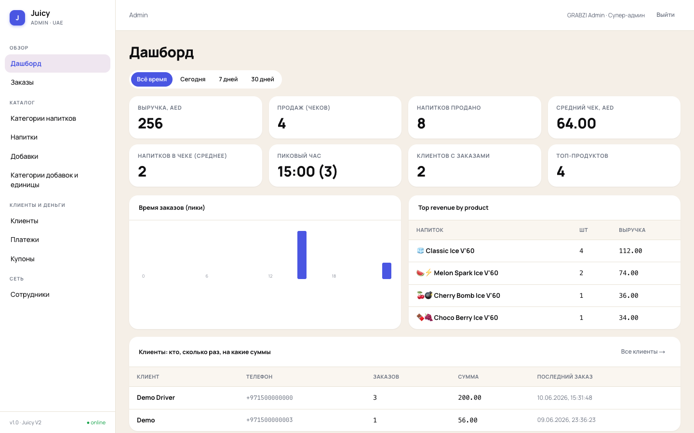 |
| **ADM-S-02** | Все заказы сети (фильтры, статусы) | 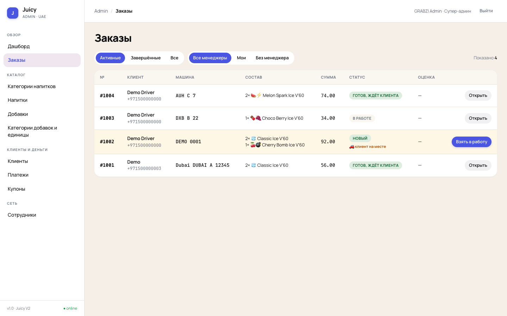 |
| **ADM-S-03** | Клиенты (PII: телефон/номер машины/эмират) | 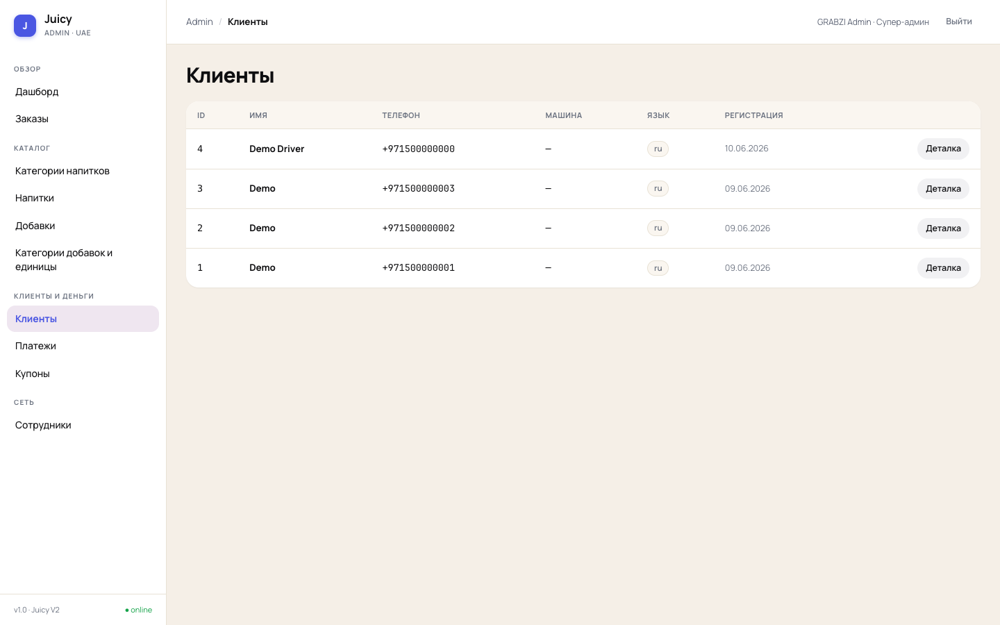 |
| **ADM-S-04** | Платежи — журнал транзакций (видно `mock`-режим Stripe) | 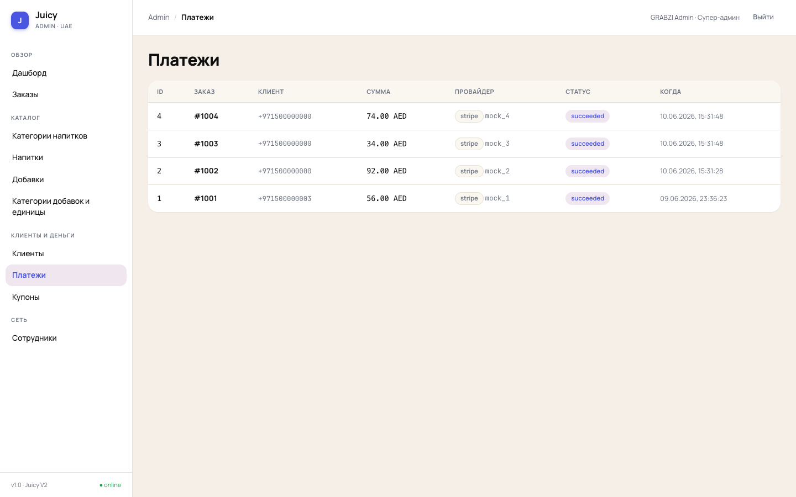 |
| **ADM-S-05** | Купоны — реестр + аннулирование (*сейчас пусто: купоны не выдавались*) | 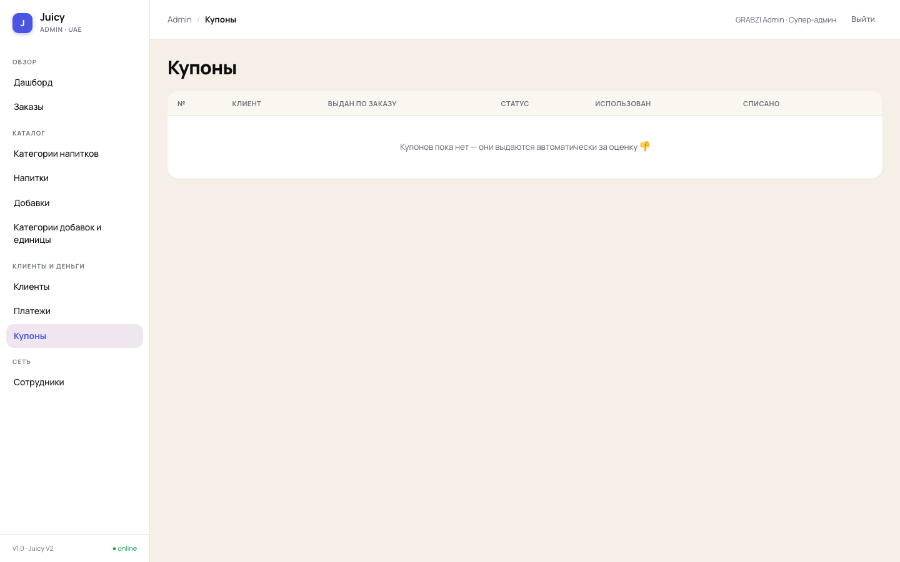 |
| **ADM-S-06** | Персонал — роли/привязка/отключение | 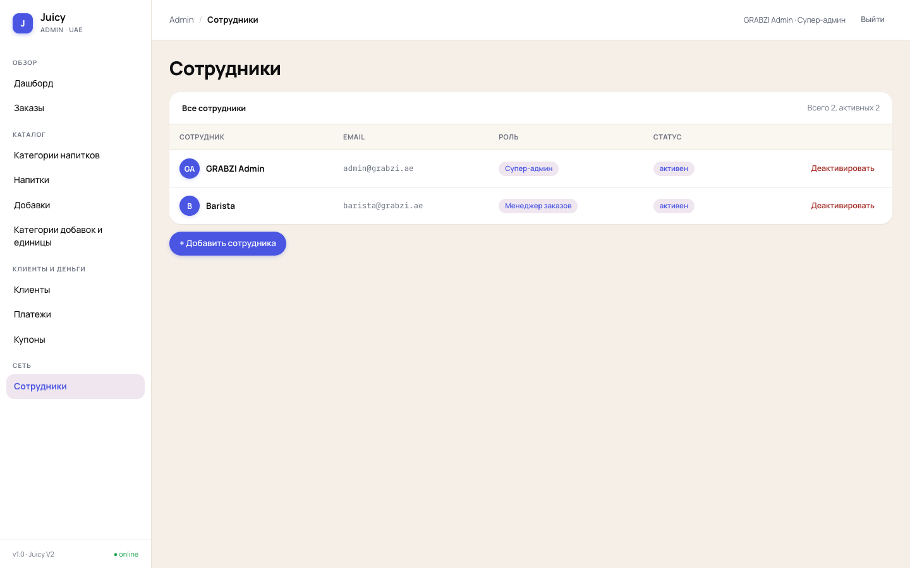 |
| **ADM-S-07** | Каталог: категории напитков | 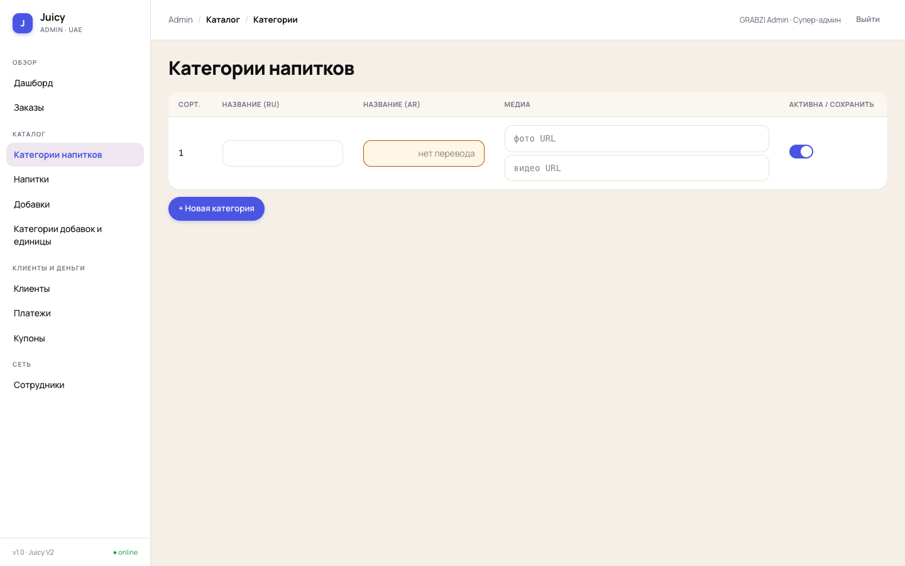 |
| **ADM-S-08** | Каталог: напитки (цена/медиа/статус; у напитков GRABZI нет AR-перевода и допов — это норма) | 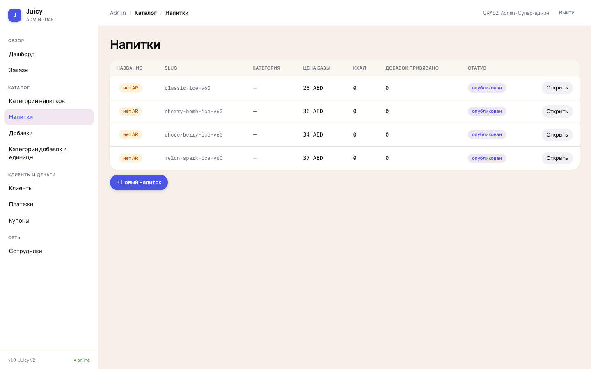 |
| **ADM-S-09** | Каталог: добавки/группы 🧩 (*пусто — в GRABZI конструктор добавок не используется, модуль на вырост*) | 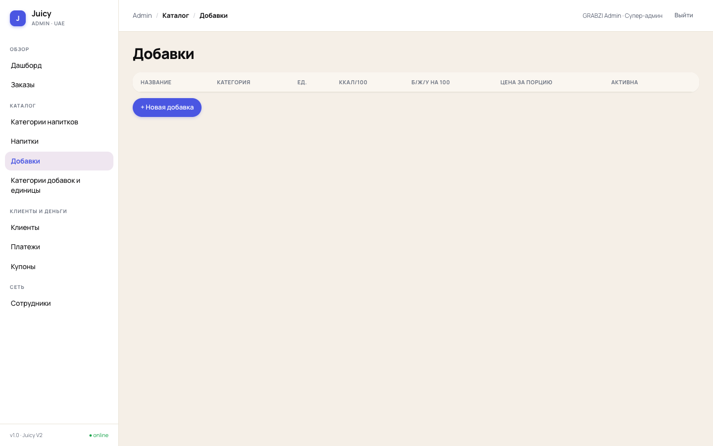 · 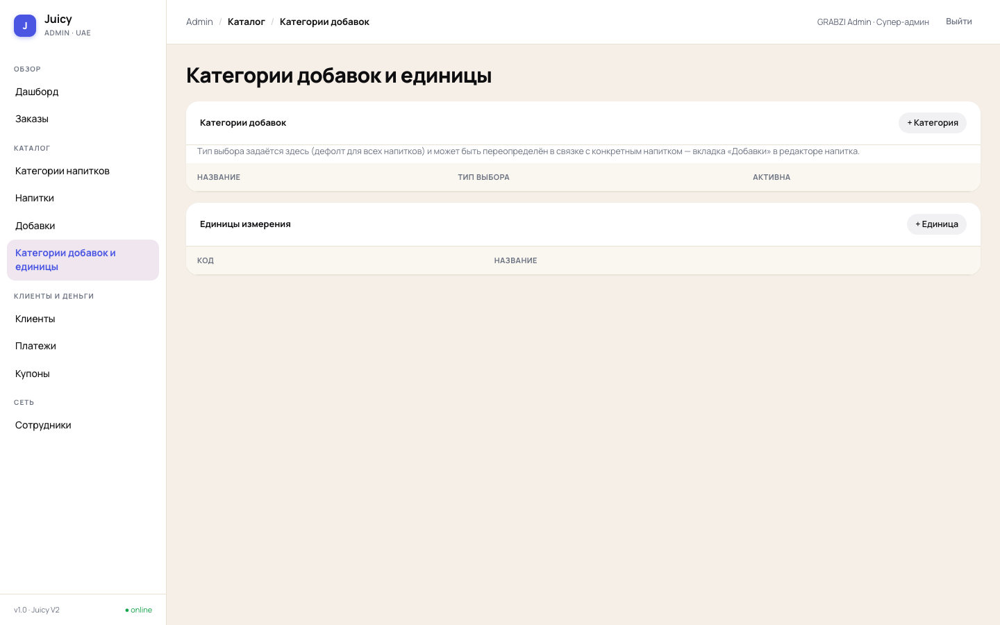 |
| **ADM-S-10** | Локации/точки (часы, лимит, пауза) | 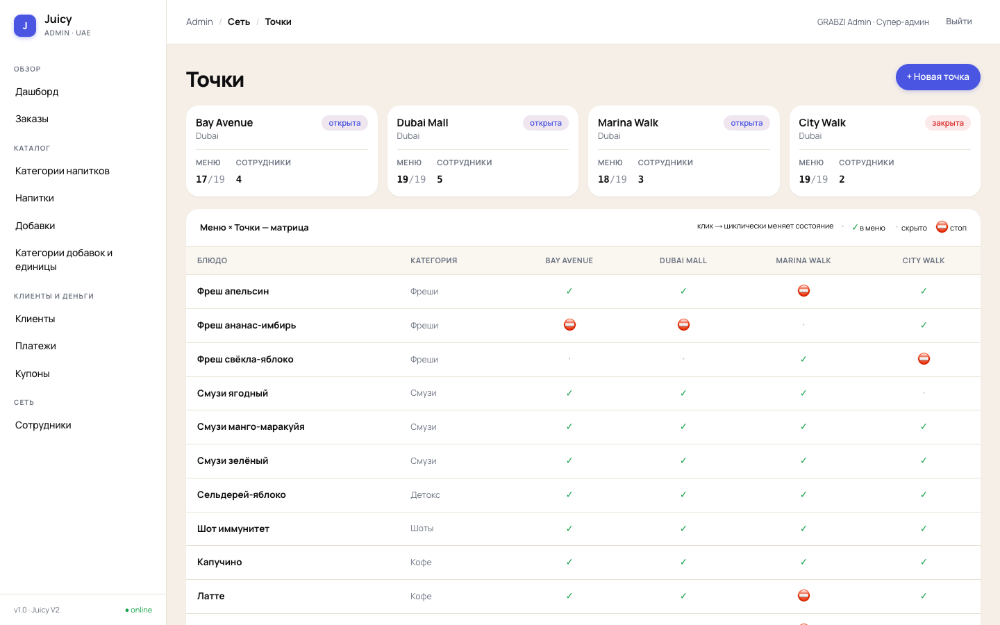 |

> ADM-S-11 «Настройки» и ADM-S-12 «CMS/медиа» отдельных маршрутов в desktop-референсе `app/` не имеют →
> остаются 🚧-плейсхолдером (проектируются по контракту API; см. ADM-S-11/12 в Части V).

---

## Приложение J. Дополнительные состояния клиентских экранов (контур A)

> Доснятые мобильные состояния (390×844) к ранее описанным историям — дополняют визуальное покрытие (Приложение D).

| Экран · состояние | История | Скриншот |
|---|---|---|
| ST1 «Готовим» (in_progress) + кнопка «I'm here 🚗» | ST1-a/ST1-b | 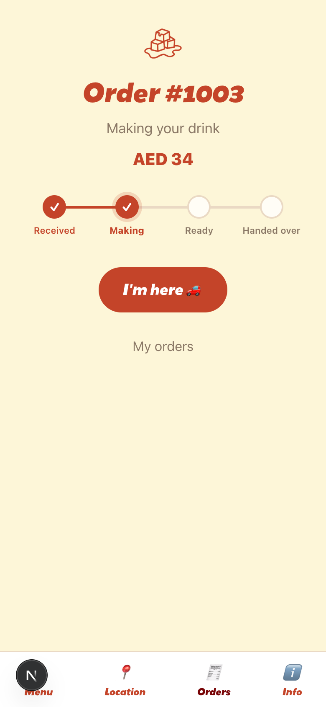 |
| ST1 «Готов — подъезжайте» (ready) | ST1-a | 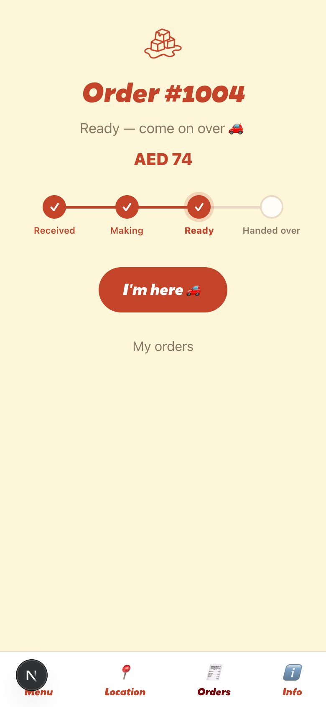 |
| OR1 пустой список (авторизован, заказов нет) | OR1 | 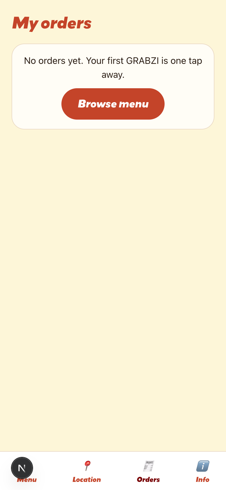 |
| P1 «Напиток не найден» | P1 | 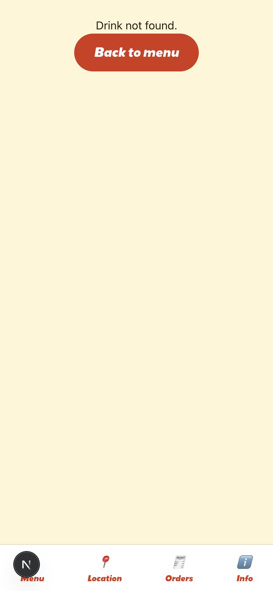 |
| O1 ошибка загрузки заказа («Change location») | O1 | 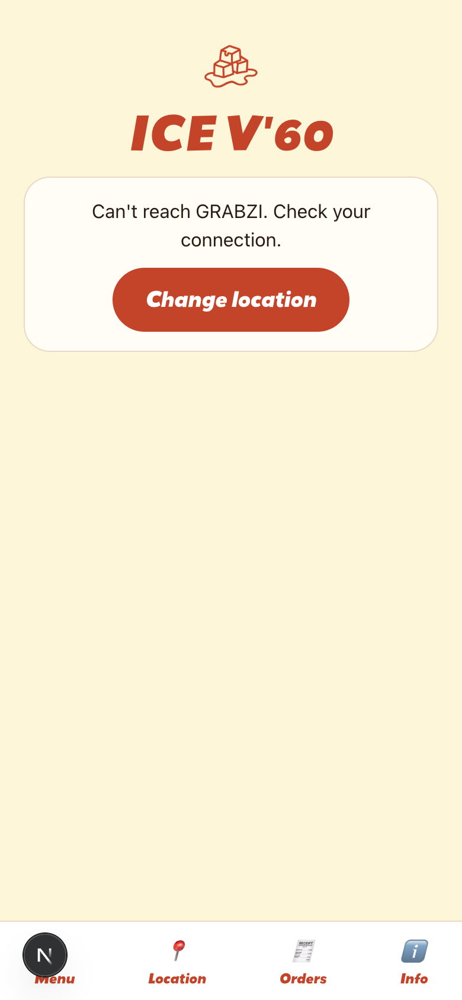 |
| ADM-M кухня — «Session expired» (истёкший токен) | ADM-M-01/02 | 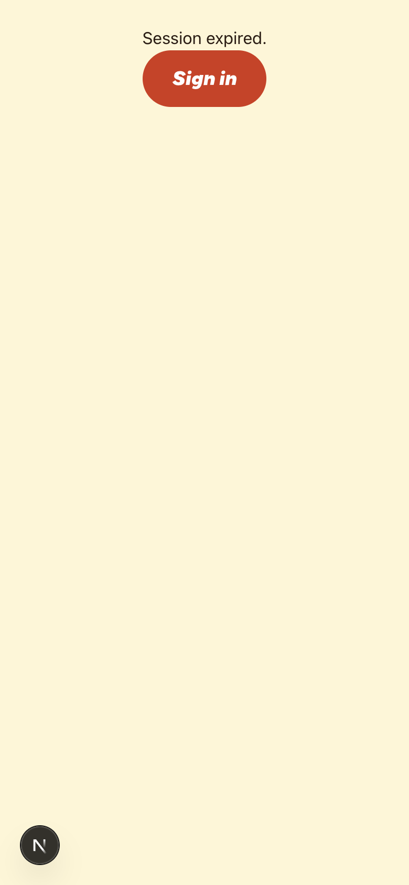 |

**Осознанно не сняты (зафиксировано как пробел):** O1 «лимит исчерпан» overlay и «применённый купон»
(UI купона в `grabzi-web` не реализован 🚧); ST1 refund (опц. модуль). Снимаются после реализации
соответствующего UI.


---

