# Juicy (jooz.ae) — Единое техническое задание

**Продукт:** mobile-web сервис предзаказа для juice bar в ОАЭ (модель Drinkit, curbside-выдача по номеру машины, конструктор напитков с КБЖУ).
**Версия документа:** 1.0 · **Дата:** 2026-06-04 · **Статус:** собрано из источников S1–S11, готово к оценке.
**Назначение:** единое описание функционала, по которому можно (1) разработать продукт и (2) собрать поблочную смету (см. `Juicy_СМЕТА.md`).

---

## Легенда и конвенции

**Пометки статуса:**
- ✅ — реализовано в прототипе `app/` и покрыто e2e;
- 🔧 — поведение только в dev/mock (демо-данные, авто-таймеры, имитация оплаты), в проде не действует;
- 🚧 — не реализовано / только в спеке `BACKEND.md` / нет экрана;
- ⚠️ — изменение «прототип → целевой продукт» или противоречие источников;
- 🧩 — обоснованное допущение в рамках концепции (требует подтверждения заказчиком).

**Единицы и форматы:**
- Деньги — **AED**, в API минорные единицы/decimal-string `"12.50"`; **VAT 5 %** (на старте чеки/фискализация не требуются — ⚠️ см. §0.1, печать чека вне MVP).
- КБЖУ — ккал / белки(г) / жиры(г) / углеводы(г); live-пересчёт `база + Σ(добавки)`.
- Объёмы/дозы рецептов — `ml`/`g` (см. §IV).
- **Номер машины (plate)** — Latin-only (`[A-Z0-9 ]`), потенциальный PII (PDPL UAE).
- Телефон — мультикод стран Залива (UAE `+971`, Kuwait и соседние); ⚠️ в прототипе только `+971`.
- Языки — **EN + AR (RTL)** (целевой продукт); ⚠️ в прототипе UI на RU.
- Идентификаторы (поля, enum, маршруты, статусы, коды ошибок) — латиницей, как в коде.

**Формат функциональных требований:** `Назначение → Что видит пользователь → Данные/API → Действия → Состояния → Бизнес-правила → Оценочный объём`.

**Четыре проекции продукта:** Клиент (mobile-web) · Админка (desktop) · KDS (планшет) · Бэкенд. Связаны сквозными процессами (§VII).

---

## §0.1 Реестр изменений «прототип → целевой продукт» (КЛЮЧЕВОЕ)

Прототип `app/` собран под раннюю гипотезу (клон Drinkit: кофе+еда, RU, Tap, OTP). Созвон (S7) и опросник (S9) уточнили **целевой продукт**. Везде ниже канон бизнес-решений — созвон/опросник; прототип описывается «как есть» с пометкой ⚠️ там, где требуется доработка.

| # | Тема | Прототип / спека (как есть) | Целевой продукт (канон S7/S9/S10) | Влияние на смету |
|---|---|---|---|---|
| C1 | Продукт/каталог | кофе+еда+соки, 8 категорий, 19 позиций | **соки**: 4 раздела — Classic · Signature Mixes · Смузи/Авокадо · Wellness/Nutrition | перенастройка каталога (тест-данные) |
| C2 | Платежи | Tap Payments (спека) / mock | **Stripe**, оплата сразу онлайн картой | замена платёжной интеграции |
| C3 | Авторизация | телефон + SMS-OTP | **без OTP** на старте: имя + телефон + **номер машины**; юзер создаётся в БД | упрощение auth, минус SMS-провайдер |
| C4 | Локализация | только RU | **EN + AR (RTL)** с самого старта | + арабская локализация и RTL |
| C5 | Платформа | mobile-web | mobile-web по **QR**, домен **jooz.ae**; нативного приложения нет | без изменений (web) |
| C6 | Чеки/фискализация | заложено в спеке | **не нужны** на старте | минус блок |
| C7 | Возвраты/отмены | заложено | **не нужны** (вместо — переделать/ваучер) | минус блок |
| C8 | Телефон | только `+971` | мультикод стран Залива | + маска/валидация |
| C9 | Выдача | curbside | curbside по **номеру машины**, без парковочных слотов | как есть |
| C10 | KDS | нет в прототипе | **планшет**: «Принять заказ» + таймер (1 у кассира, возм. 2-й на кухне) | новый блок (🚧) |
| C11 | Лояльность | нет | **задел** логики (миграция старой базы — позже) | задел в модели |
| C12 | Фишки Drinkit | нет | ваучер за превышение времени ожидания; «переделать напиток» (заявка) | опциональный блок |
| C13 | Нагрузка | — | низкая, ~100 заказов/день, тестовый режим | мягкие NFR |

---

# ЧАСТЬ I. Архитектура и сквозные конвенции

## I.1 Технологический стек

- **Frontend (клиент + админка):** Next.js **16** (App Router) + React **19.2** + TypeScript + Tailwind v4; состояние — Zustand (в прототипе persist в localStorage; в проде — серверное API). ⚠️ Расхождение источников: compass S1 — Next.js 15 / PG 16; КП S4 и код S3 — Next.js 16 / React 19. **Канон — код (Next.js 16).**
- **Backend (план, S2):** FastAPI (Python 3.12) + PostgreSQL + Redis (rate-limit/кэш/pub-sub) + S3-совместимое хранилище медиа. 🚧 в прототипе бэкенда нет — `lib/data.ts` (каталог) и Zustand (корзина/заказы), всё mock.
- **Платежи:** ⚠️ **Stripe** (целевой; карта, оплата сразу). В спеке S2 фигурирует Tap Payments — заменяется на Stripe.
- **Реалтайм:** SSE для статусов клиенту; WebSocket для KDS (🚧).
- **Хостинг:** регион ОАЭ (`me-central-1`) либо EU; домен **jooz.ae**; PDPL-комплаенс.
- **Вход:** по QR-коду на здании → mobile-web.

## I.2 Аутентификация и роли

- **Клиент (целевой):** ⚠️ **без OTP** на старте. Лёгкая регистрация: имя + телефон (мультикод) + номер машины. Пользователь создаётся в БД, заказ привязывается к **номеру телефона** (номера машин меняются: один телефон — несколько машин; встречается «police car» вместо номера). Полноценный личный кабинет — позже. Задел: возможность срастить со старой базой клиентов (лояльность). 🚧 OTP/SMS — на этап мобильного приложения.
- **Персонал (S2 §0):** JWT с `roles: string[]` и `outletScope: string[] | "*"`. Роли: `super_admin`, `catalog_admin`, `outlet_manager`, `barista` (KDS), `finance`, `support`. ⚠️ Для MVP соков критичны `super_admin`, `catalog_admin`, `outlet_manager`, `barista`; `finance`/`support` — задел.

## I.3 Деньги, идемпотентность, заголовки
- VAT 5 % считается на сервере; `subtotal → vat → total`. В прототипе `computeCartTotal` (`VAT_RATE=0.05`). На старте чек/TRN не печатаются (⚠️ C6).
- Идемпотентность: `Idempotency-Key` обязателен для мутаций (создание заказа и т. п.).
- Заголовки запроса (S2 §1): `Authorization: Bearer <jwt>`, `Accept-Language: en|ar`, `X-Outlet-Id: <outletId>`, `Idempotency-Key: <uuid>`.

## I.4 Формат ошибок (RFC 9457) и пагинация
Единый конверт ошибки + коды — см. §VIII.3. Пагинация списков — курсорная (`?cursor=…`).

## I.5 Локализация (целевой EN+AR)
- ⚠️ Целевой продукт: EN + AR с RTL **с самого старта** (аудитория — местные, часто без английского). Прототип — RU.
- Разделение (S7 E3): UI-строки — на стороне разработки (часть генерируется/хардкодится, можно прогнать через ИИ); контент (названия/описания напитков, ингредиенты) — заполняется заказчиком через админку на EN/AR.
- RTL-готовность: logical properties (`margin-inline-*`, `ms-/me-`), зеркалирование направленных иконок; НЕ зеркалить логотипы, фото товаров, поля цифр (`dir="ltr"` для телефона/номера/карты).
- Шрифты (S1): латиница — Inter/Manrope; арабский — IBM Plex Sans Arabic / Tajawal.

## I.6 Дизайн-система (S1, прототип)
- Первичный цвет индиго **#4A56E2** (-600 `#3B47C9`, -100 `#E5E7FC`); бежево-сиреневые подложки продуктов (`#F5EFE7`, `#E8DCD0`, `#EFE6F0`, `#D8C8E0`); semantic success `#16A34A` / warning `#F59E0B` / error `#DC2626`.
- Радиусы pill `9999`, карточки 16–24; spacing 4/8/12/16/24/32; тач-таргеты ≥ 44×44.
- mobile-frame: 100 % ширины на телефоне, центрирование в ~390 px на десктопе; скроллятся внутренние контейнеры; safe-area через `env(safe-area-inset-*)`.
- Медиа: каждому напитку — короткая MP4-петля (`<DrinkMedia>`), фолбэк — SVG `<DrinkArt>`.

---

# ЧАСТЬ II. Модель данных

Канон — `BACKEND.md` (S2 §2, ~27 таблиц), скорректировано под целевой продукт (Stripe, без OTP, EN/AR). Ниже — сводка ключевых сущностей; полные DB-поля — в S2.

## II.1 Каталог
- **Outlet** — `id`, `name`, `address`, `city`, `geo{lat,lng}`, `hours` (WeeklyHours), `isOpen` (computed, TZ Asia/Dubai), `closingSoon?`, `trn?`, `printerWebhook?` (V2). В прототипе 4 точки (Bay Avenue, Emaar Square, Dubai Marina, City Centre Mirdif).
- **Category** — `slug`, `name{en,ar(,ru)}`, `emoji?`, `sortOrder`, `visible`. ⚠️ Целевые разделы: Classic / Signature Mixes / Смузи-Авокадо / Wellness-Nutrition (тест-данные — текущие 8 категорий).
- **Product** — `id`, `slug`, `categorySlug`, `name{en,ar}`, `description{en,ar}`, `badge?` (`BESTSELLER|NEW|LIMITED|SEASONAL`), `baseNutrition` (ккал/Б/Ж/У/сахар/клетчатка/вес, для размера M), `variants[]`, `addonGroupBindings[]`, `media{videoUrl?,posterUrl(req),pngUrl?,bgColor}`, `tags[]`, `inStock` (per-outlet), `visible`, `prepTimeSec`, `sortOrder`.
- **Variant** — `code` (S/M/L), `name`, `volumeMl?`, `weightG?`, `priceAed`, `nutritionMod` (дельта к базе), `inStock`.

## II.2 Конструктор (детально — §IV)
- **Addon** — `id`, `name{en,ar}`, `pngUrl` (req), `unit` (`shot|scoop|piece|portion|ml|g`), `doseAmount`+`doseUnit` (`g|ml`), `nutritionPer100`, `pricePerUnitAed`, `allergens[]`, `tags[]`, `visible`. Формула вклада КБЖУ: `(doseAmount × qty / 100) × nutritionPer100`.
- **AddonGroup** — `slug`, `name`, `selectionType` (`single|multi|counter`), `items[]` (addon ids), `visible`.
- **AddonGroupBinding** (product↔group, тут групповые правила) — `groupSlug`, `required`, `minTotal?`, `maxTotal?`, `defaultAddonIds?`, `overrides[]`.
- **AddonOverride** (product↔addon) — `minUnits?`, `maxUnits?`, `defaultUnits?`, `pricePerUnitAedOverride?`, `free?`, `doseAmountOverride?`, `hidden?`.
- **CompatibilityRule** — кросс-аддонные правила (forbid / auto-add / require / discount-percent). См. §IV.3.

## II.3 Заказ
- **Order** — `id`, `number` (публичный 4-значный), `createdAt`, `outletId`, `items[]`, `subtotalAed`, `vatAed`, `discountAed`, `totalAed`, `status` (OrderStatus), `statusHistory[]`, `payment{method, providerChargeId?, providerStatus?}`, `pickup{car{emirate,plate}, scheduledFor?, arrivedAt?}`, `customer{id?,name?,phone}`, `baristaId?`, `prepEtaSec?`.
- **OrderItem** — `productId`, `variantCode`, `quantity`, `customName?`, `addons[{addonId,groupSlug,units}]`, + снапшоты `productNameSnapshot`, `unitPriceAedSnapshot`, `nutritionSnapshot` (изменение каталога не ломает историю).
- **OrderStatus**: `CREATED → PAID → ACCEPTED → PREPARING → READY → PICKED_UP` (+ `CANCELLED`, `REFUNDED` 🚧). В прототипе клиентский тип статуса без CANCELLED/REFUNDED.

## II.4 Пользователи и персонал
- **User** — `id`, `phone`, `name?`, `defaultEmirate?`, `defaultCarPlate?`, `preferredLocale` (`en|ar`), `marketingOptIn`, `blocked`.
- **StaffUser** — `id`, `email`, `name`, `roles[]`, `outletScope[]|"*"`, `twoFactorEnabled` (V2), `disabled`.

---

# ЧАСТЬ III. Клиентское mobile-web приложение (поэкранно)

> Канон «как есть» — код `app/app/**` (S3). Прототип frontend-only: данные mock, оплата/SMS/готовка симулируются. Скриншоты сняты с прототипа (`screens/<slug>.png`). Навигация: нижние табы `BottomNav` (Главная/Меню/Заказы/Профиль), `mobile-frame` 390 px.

## A. Старт и вход

### A1. Splash / роутер (`/`)
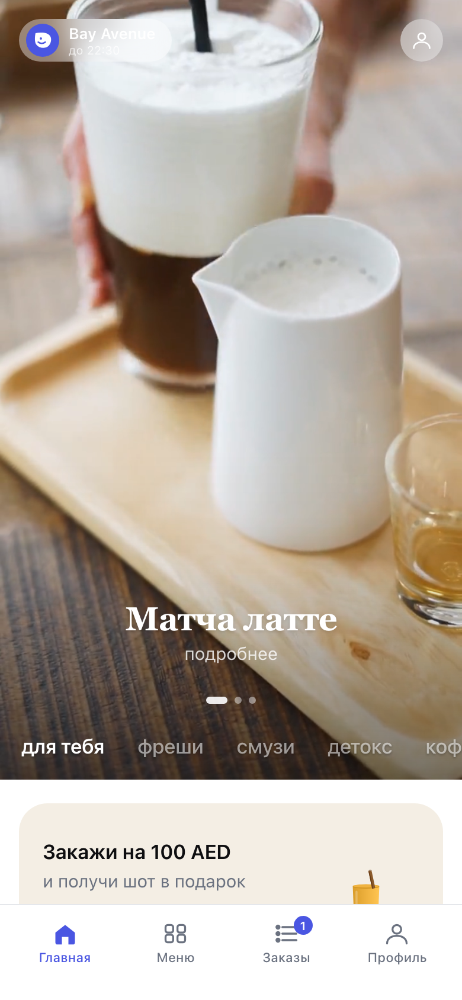
> 📷 _скрин: `screens/splash.png` (маршрут `/`)._
- **Статус.** ✅ Заставка-редирект.
- **Назначение.** Гейт входа: по состоянию ведёт в онбординг / выбор точки / домой.
- **Что видит.** Лого-капля с пульсацией, `juicy`, подпись `фреш по предзаказу`.
- **Данные.** `onboardingSeen`, `selectedOutletId` из store.
- **Действия.** Авто-redirect: нет онбординга → `/onboarding`; нет точки → `/outlets`; иначе → `/home`.
- **Бизнес-правила.** Порядок гейтов онбординг→точка→дом.
- **Оценочный объём.** Готово (S).

### A2. Онбординг (`/onboarding`)
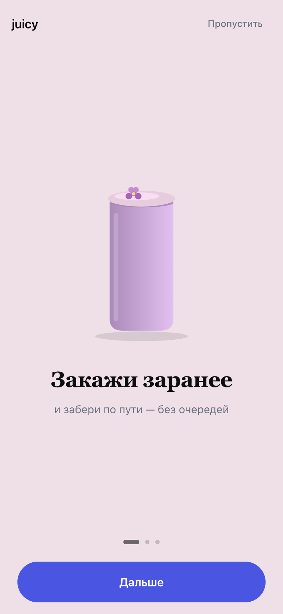
- **Статус.** ✅ 3 промо-слайда со свайпом.
- **Что видит.** Лого, `Пропустить`; слайды: «Закажи заранее», «Укажи номер машины», «Калории — на тебе»; пагинация; кнопка `Дальше`/`Начать`.
- **Действия.** Свайп листает; `Начать`/`Пропустить` → `setOnboardingSeen` + `/outlets`.
- **Оценочный объём.** Готово; ⚠️ перевод текстов на EN/AR (S).

### A3. Выбор точки (`/outlets`)
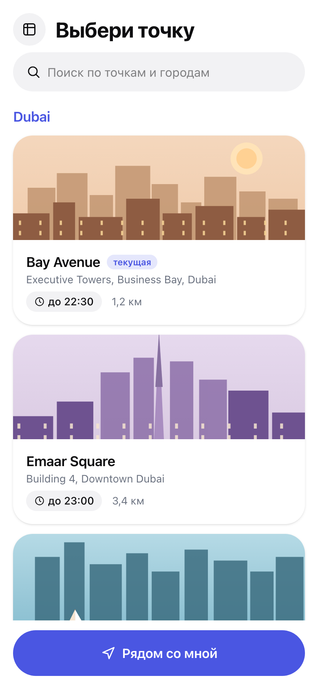
- **Статус.** ✅ (🔧 сортировка «рядом со мной» фейковая — реальной геолокации нет).
- **Что видит.** Заголовок `Выбери точку`, поиск, карточки точек (имя, адрес, чип `до <время>`, дистанция), кнопка `Рядом со мной`.
- **Данные.** `outlets` из `lib/data.ts`; `setOutlet`.
- **Действия.** Тап по точке → `setOutlet` + `/home`; `Рядом со мной` → сортировка по `distanceKm`.
- **Бизнес-правила.** Фильтр по имени/городу.
- **Оценочный объём.** Готово; 🚧 реальная геолокация (M, опция).

### A4. Телефон (`/auth/phone`)
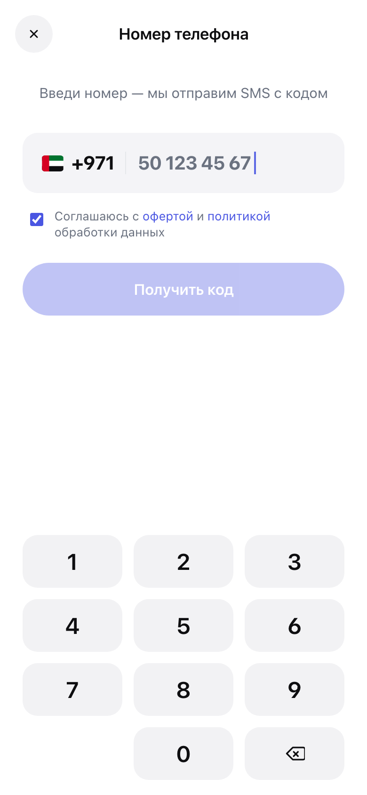
- **Статус.** ✅ ввод номера; ⚠️ целевой — мультикод (не только +971), и без OTP (см. A5).
- **Что видит.** Поле с флагом ОАЭ, префиксом `+971`, маска `50 123 45 67`; чекбокс согласия с офертой; кнопка `Получить код`; кастомный NumPad.
- **Бизнес-правила.** Прототип: ровно 9 цифр после +971, кнопка активна при `valid && agreed`. ⚠️ Целевой: мультикод стран Залива; без OTP — после телефона сразу к имени/машине.
- **Оценочный объём.** ⚠️ Доработка: мультикод + убрать шаг OTP (M).

### A5. OTP-код (`/auth/otp`)

- **Статус.** 🔧 mock (код автозаполняется `1836`); ⚠️ **в целевом MVP OTP не нужен** (S9 C5/C8) — экран исключается из флоу.
- **Что видит.** 4 ячейки кода, таймер `Отправить снова через 0:NN`, подсказка `Источник · Telegram или SMS`.
- **Оценочный объём.** ⚠️ Убрать из MVP (экономия); 🚧 вернуть на этапе приложения.

### A6. Имя (`/auth/name`)
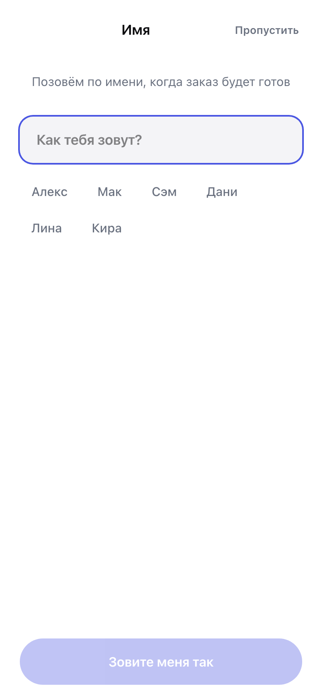
- **Статус.** ✅ ввод имени.
- **Что видит.** Поле `Как тебя зовут?`, чипы-подсказки, кнопка `Зовите меня так`, `Пропустить` (→ имя `Гость`).
- **Действия.** `setUser({name})` → `/home`.
- **Оценочный объём.** Готово; ⚠️ сюда же добавить ввод номера машины при регистрации (S, см. C3) (M).

## B. Каталог

### B1. Главная (`/home`)
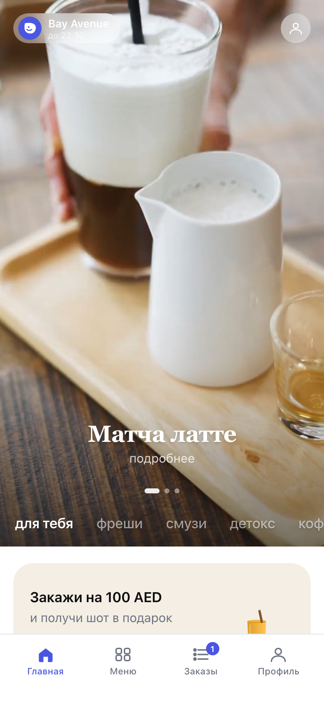
- **Статус.** ✅ Витрина с full-bleed видео-hero, табами категорий, промо-карточкой, сеткой карточек.
- **Что видит.** Полноэкранное видео ротируемых товаров; чип точки + иконка профиля; заголовок товара + `подробнее`; горизонтальные табы категорий; промо `Закажи на 100 AED / и получи шот в подарок`; сетка `ProductCard` 2 кол.; `BottomNav`.
- **Данные.** `categories`, `products`, `popularProductIds`, `getProductVideo`.
- **Действия.** hero/карточка → `/product/<slug>`; чип точки → `/outlets`; профиль → `/profile`; промо → `/menu`.
- **Бизнес-правила.** «для тебя» = популярные; цена на карточке = `min(variants.priceAed)`.
- **Оценочный объём.** Готово; ⚠️ перенастройка категорий на 4 раздела (M).

### B2. Меню (`/menu`)

- **Статус.** ✅ Полный каталог по категориям.
- **Что видит.** `TopBar "Меню"` + корзина; sticky-табы `всё` + категории; секции с сеткой карточек.
- **Действия.** Табы фильтруют; карточка → `/product/<slug>`; корзина → `/cart`.
- **Оценочный объём.** Готово (S).

## C. Продукт и конструктор

### C1. Карточка товара (`/product/[slug]`)
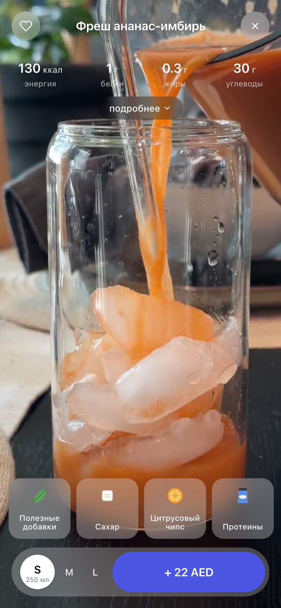
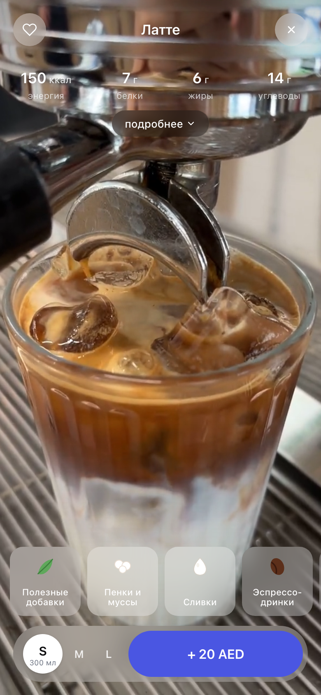
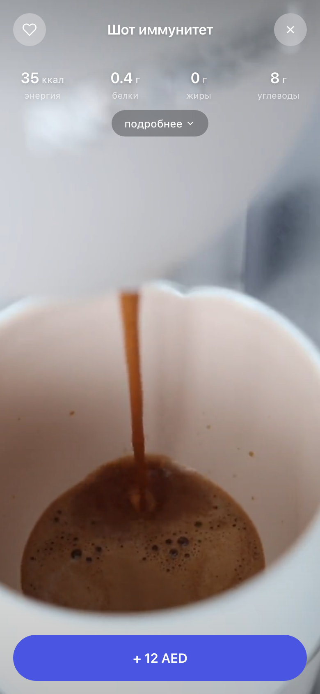
> 📷 три примера: лёгкий набор добавок / полный набор / без добавок.
- **Статус.** ✅ Конфигуратор: размер S/M/L, добавки (inline `AddonPopover`), кастомное имя, live-КБЖУ и цена, добавление в корзину.
- **Что видит.** Full-bleed видео; KBJU-полоса (`энергия/белки/жиры/углеводы`); `подробнее`; ряд чипов групп добавок с бейджем количества; селектор размеров (с объёмом мл); CTA `+ <total> AED`; шторки «Назови напиток» и «Описание» (аллергены).
- **Данные.** `findProduct`, `findAddonGroup`, `getProductVideo`; `addToCart`.
- **Действия.** Выбор размера/добавок → пересчёт; `+ … AED` → `addToCart` + toast → назад.
- **Состояния.** Popover группы; toast 1.8 с; `notFound()` если товар не найден.
- **Бизнес-правила.** Типы групп `single`/`multi`/`counter` (лимит `maxSelect`); пересчёт `price = variant + Σ(addon×qty)`, КБЖУ = база + `caloriesMod` + Σ дельт; кастомное имя ≤ 30 симв.; наборы `lightAddons` (фреши/детокс) vs `standardDrinkAddons`. **Ключевой экран для конструктора — см. §IV.**
- **Оценочный объём.** Каркас готов; ⚠️ доведение до полноценного движка формул/правил/лимитов — крупный блок (§IV) (XL).

## D. Заказ и оплата

### D1. Корзина (`/cart`)
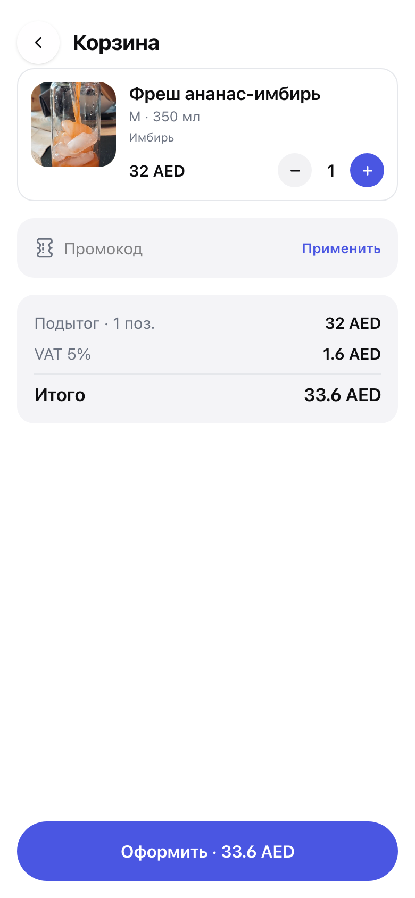
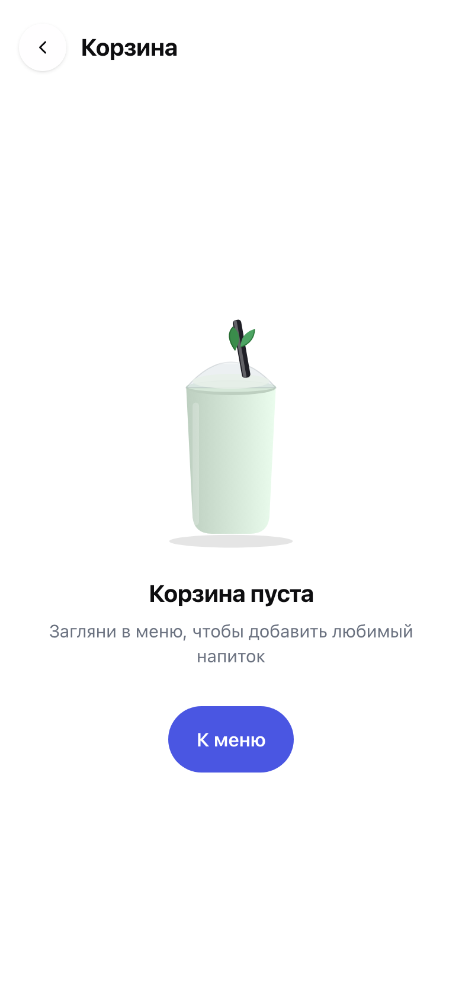
- **Статус.** ✅ Позиции, степпер ±, промокод (UI без логики 🔧), итоги VAT 5 %.
- **Что видит.** Карточки позиций (медиа, имя/кастомное имя, `код·объём`, добавки, цена, степпер); поле `Промокод`+`Применить`; `Подытог·N поз.`/`VAT 5%`/`Итого`; кнопка `Оформить · <total> AED`. Пусто → иллюстрация + `Корзина пуста` + `К меню`.
- **Действия.** Степпер → `updateQty`; `Оформить` → если нет телефона → `/auth/phone`, иначе `/checkout`.
- **Бизнес-правила.** Требуется вход для оформления; итоги из `computeCartTotal`.
- **Оценочный объём.** Готово; промокод — задел (V2).

### D2. Оформление (`/checkout`)
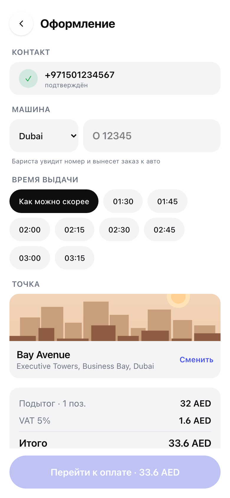
- **Статус.** ✅ Контакт, авто (curbside), время выдачи, точка.
- **Что видит.** `Контакт` (телефон + `подтверждён`); `Машина` (select эмирата + поле номера `O 12345`, подпись «Бариста увидит номер и вынесет к авто»); `Время выдачи` (`Как можно скорее` + 8 слотов по 15 мин); `Точка` + `Сменить`; итоги; кнопка `Перейти к оплате · <total> AED`.
- **Данные.** `user`, `emirates`, `getOutlet`, `useCartTotal`.
- **Действия.** → `setUser({plate,emirate})` + `/payment?slot=<slot>`.
- **Бизнес-правила.** `canSubmit = plate.length ≥ 2`; plate форсится UPPERCASE; слоты от now+15 мин шагом 15; эмират по умолчанию Dubai. ⚠️ Время к выдаче — в целевом MVP можно не требовать (S9 F4) 🧩.
- **Оценочный объём.** Готово; ⚠️ Latin-only валидация plate подтянуть к §VIII (S).

### D3. Оплата (`/payment`)
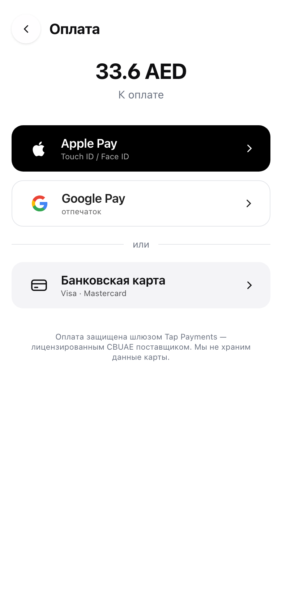
- **Статус.** 🔧 mock (спиннер → создание заказа); ⚠️ целевой провайдер — **Stripe** (карта). Подпись в прототипе про Tap — заменить.
- **Что видит.** Сумма `<total> AED`; кнопки `Apple Pay`, `Google Pay`, `Банковская карта`; сноска о защите платежа.
- **Действия.** Способ → `pay()`: спиннер 1.1 с → `createOrder` + `clearCart` → `/orders/<id>`.
- **Бизнес-правила.** Заказ `CREATED`, номер из `nextOrderNumber` (старт 1247).
- **Оценочный объём.** ⚠️ Реальная интеграция Stripe (создание платежа, статус PAID, webhook) — отдельный блок (L). Apple/Google Pay — опция поверх Stripe.

## E. Заказы

### E1. История (`/orders`)
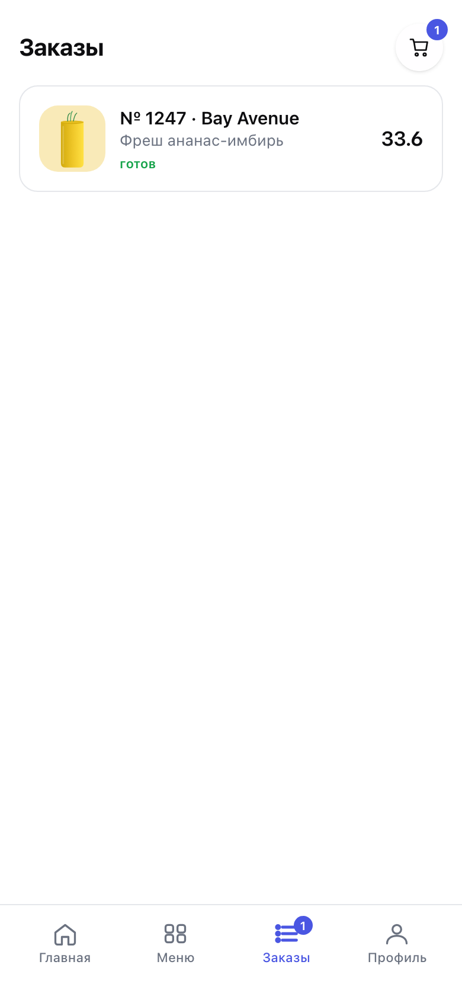
- **Статус.** ✅ Список заказов со статус-лейблами.
- **Что видит.** Карточки `№<number>·<точка>`, позиции, статус, сумма. Пусто → `Здесь будут твои заказы`.
- **Действия.** Карточка → `/orders/<id>`.
- **Оценочный объём.** Готово (S).

### E2. Статус заказа (`/orders/[id]`)
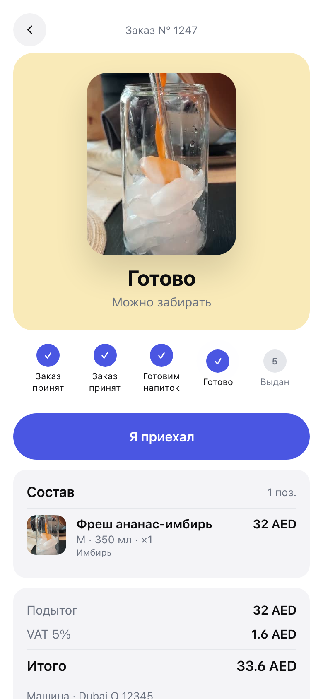
- **Статус.** ✅ (🔧 авто-прогресс статусов по таймерам).
- **Что видит.** Заголовок этапа + иллюстрация; горизонтальный степпер 5 шагов; кнопка `Я приехал` (после готовности → `✓ Бариста знает что вы приехали`); блок `Состав`; итоги (`Машина·<emirate> <plate>`, `Выдача·<slot>`, `Оплата·<method>`); `Позвонить`, `На главную`.
- **Действия.** `Я приехал` → `markOrderArrived`; `Позвонить` → tel.
- **Бизнес-правила.** Авто-прогресс CREATED→…→READY по таймингам (в проде — SSE, §VII). ⚠️ Сюда добавляются фишки Drinkit: лайк/дизлайк→ваучер; «переделать напиток» (§VII, опция).
- **Оценочный объём.** Готово; 🚧 реальный SSE-канал (часть бэка); 🚧 фишки Drinkit (M, опция).

## F. Профиль

### F1. Профиль (`/profile`)

- **Статус.** ✅ Данные, авто, язык, помощь, выход. Требуется вход (иначе CTA `Войти по телефону`).
- **Что видит.** Имя/телефон, статы `Заказов`/`Любимая точка`; секция `Машина` (просмотр/редактирование `<emirate> <plate>`); `Язык` (`Русский`/`English`/`العربية` — последняя disabled ⚠️); `Помощь`; `Выйти`.
- **Бизнес-правила.** plate Latin-only UPPERCASE; ⚠️ целевой — языки EN/AR активны (RU убрать).
- **Оценочный объём.** Готово; ⚠️ активировать AR + RTL (часть блока локализации).

## Сводка клиентской бизнес-логики (для заказчика)
Вход без OTP (имя+телефон+номер машины) → выбор точки → каталог из 4 разделов → карточка с конструктором и live-КБЖУ → корзина (VAT 5 %) → оформление (эмират + номер машины + время) → оплата Stripe сразу → статус заказа со степпером и кнопкой «Я приехал» (бариста видит номер машины и выносит). Языки EN/AR. Без чеков и возвратов на старте.

## Ограничения прототипа (честно)
1. Бэкенда/БД нет — всё mock (Zustand+localStorage). 2. Оплата/SMS/готовка — имитация таймерами 🔧. 3. Геолокация «рядом со мной» фейковая. 4. UI только RU (целевой — EN/AR) ⚠️. 5. Платёжка-подпись Tap (целевой — Stripe) ⚠️. 6. OTP-экран mock (целевой — без OTP) ⚠️. 7. Каталог — 19 mock-позиций (тест-данные). 8. KDS, Web Push, AR-RTL, реальный SSE — отсутствуют 🚧.

## Реализовано в спеке без экрана клиента (S2)
`OutletInventory` (стоп-листы по точкам), аналитика/события (`/events`), часть админ-возможностей — описаны в S2, но без клиентского экрана.

---

# ЧАСТЬ IV. Конструктор и формулы напитков (ключевой раздел)

> Канон требований — уточнения Малика (S11) + созвон (S7); канон модели — `BACKEND.md` §2.4–2.6; «как есть» — `lib/data.ts` (11 addon-групп) и карточка `product/[slug]`. Каталог — **тест-данные** (🧩, финальный файл от Абдулазиза заменит данные без изменения движка).

## IV.1 Принцип (S11): гибкость и масштабируемость
Формула напитка и правила задаются **данными**, а движок один. Новые комбинации/ингредиенты/правила добавляются в админке без изменения кода. Три требования заказчика:
1. **Состав рецептов** — ингредиенты + граммовки (формат формулы);
2. **Правила сочетания** — что с чем нельзя смешивать;
3. **Стоп-логика/лимиты** — когда сказать пользователю «стоп».

## IV.2 Модель данных конструктора (4 слоя + правила)

**Слой A — Addon (глобальное определение ингредиента/добавки).**
`unit` (`shot|scoop|piece|portion|ml|g`), `doseAmount`+`doseUnit` (`g|ml`), `nutritionPer100` (КБЖУ на 100 г/мл), `pricePerUnitAed`, `allergens[]`. Это и есть «ингредиент с граммовкой» (S11.1). Вклад в КБЖУ: `(doseAmount × qty / 100) × nutritionPer100`.

**Слой B — AddonGroup (способ выбора).**
`selectionType`: `single` (ровно один, radio) / `multi` (несколько, чекбоксы) / `counter` (счётчик units на аддон). В прототипе 11 групп: supplements(single), foam(counter≤2), cream(single), espresso(counter≤3), tapioca(counter≤2), toppings(multi), sugar(single), syrups(multi), citrus(counter≤2), protein(single), collagen(single).

**Слой C — AddonGroupBinding (product↔group): ГРУППОВЫЕ ОГРАНИЧЕНИЯ.**
`required` (надо ли выбрать), `minTotal?`/`maxTotal?` (лимит суммарных units по группе — это и есть **стоп-логика по группе**, S11.3), `defaultAddonIds?`, `overrides[]`.

**Слой D — AddonOverride (product↔addon): per-добавка в контексте блюда.**
`minUnits?`/`maxUnits?` (напр. ≤4 шотов — стоп по добавке), `defaultUnits?`, `pricePerUnitAedOverride?`/`free?`, `doseAmountOverride?`, `hidden?`. Резолв: `effPrice = override ?? (free?"0":base)`, `effDose = doseOverride ?? base`, `effMax = maxUnits ?? ∞`.

## IV.3 Правила сочетания — CompatibilityRule (S11.2)
Отдельная сущность, редактируется в админке без кода:
```ts
type CompatibilityRule = {
  id: string; scope: "product"|"global"; productSlug?: string;
  when: { addonId: string; minUnits?: number }[];   // конъюнкция: все условия выбраны
  effect:
    | { type: "forbid";  addonId: string; message?: {en,ar} }   // запрет несовместимого → 409 ADDONS_INCOMPATIBLE
    | { type: "auto-add"; addonId: string; units: number }      // авто-добавление
    | { type: "require";  groupSlug: string }                   // обязать выбор в группе
    | { type: "discount-percent"; percent: number };            // комбо-скидка
};
```
Примеры: `[milk-oat] → forbid milk-regular` (нет двойного молока); `[shot-decaf] → forbid shot-regular` (кофеин/декаф взаимоисключение); `[croissant, hot-chocolate] → discount-percent 10` (комбо).

## IV.4 Движок («сердце формул»)
При каждом изменении выбора клиент шлёт `POST /products/{slug}/preview {variantCode, addons[]}`. Сервер прогоняет AddonGroupBinding + CompatibilityRules и возвращает `{ allowedAddons, forbidden[], autoAdded[], priceAed, nutrition }`. Клиенту не нужно знать формулы. Менеджер тестирует правила кнопкой «Проверить» (`POST /admin/dryrun-preview`).

## IV.5 Стоп-логика и поведение UI (S11.3)
- Лимиты: `maxTotal` по группе, `maxUnits` по добавке, `forbid` по правилу, `inStock=false` на любом уровне.
- При достижении лимита: кнопка «+» блокируется, показывается подсказка-причина; запрещённые добавки — задизейблены с локализованным сообщением из правила.
- Доп. лимиты сборки (🧩, на согласование): максимум добавок на напиток / макс. объём — параметризуемо.

## IV.6 Привязка к разделам (целевой каталог)
- **Classic** — минимальная кастомизация (lightAddons-аналог).
- **Signature Mixes** — готовые формулы с ограниченной правкой.
- **Смузи/Авокадо** — слоистая сборка (база → мусс → топпинги).
- **Wellness/Nutrition** — по цели, кастомизация минимальна.

## IV.7 Снапшоты
Цены/КБЖУ/дозы снапшотятся в позицию заказа (`order_item_addons`), изменение каталога не ломает историю.

---

# ЧАСТЬ V. Админ-панель (desktop) + KDS

> Канон «как есть» — `app/admin/**` (S3, на mock-данных `lib/admin-mock.ts`). Оболочка `AdminShell`: сайдбар (Обзор/Каталог/Сеть), переключатель `Просмотр как <роль>` (RBAC), breadcrumbs. Скриншоты сняты с прототипа.

## V.1 Дашборд (`/admin`)

- **Статус.** ✅ Сводка дня.
- **Что видит.** 4 стат-карты (Заказов сегодня, Выручка AED, Среднее время готовки, Точек онлайн); панель `Активные заказы` (таблица); панель `Точки` (live/total, открыта/закрыта).
- **Оценочный объём.** Каркас готов; ⚠️ состав метрик уточняет Абдулазиз (S9 D9) 🧩.

## V.2 Заказы — список (`/admin/orders`)
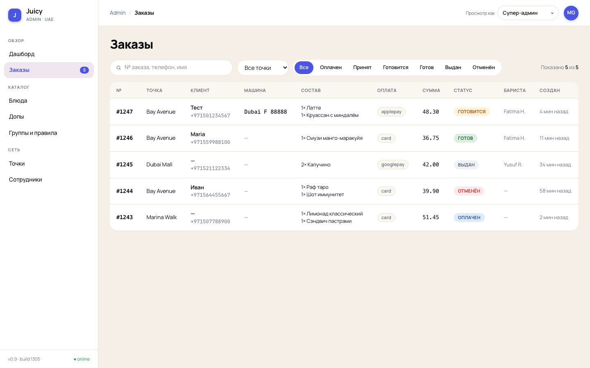
- **Статус.** ✅ Поиск (№/телефон/имя), фильтр по точке/статусу; таблица №/Точка/Клиент/Машина/Состав/Оплата/Сумма/Статус/Бариста/Создан.
- **Оценочный объём.** Каркас готов; ⚠️ привязка к реальному API заказов (M).

## V.3 Заказ — карточка (`/admin/orders/[id]`)

- **Статус.** ✅ Управление заказом: смена статуса, оповещения, отмена.
- **Что видит.** Состав + Итого; панели `Клиент` (имя, телефон, машина curbside), `Оплата` (метод, charge id, точка); `Переход статуса` (пиллы стадий, `→ след.статус`); `Оповестить клиента` (`Готов`, `Задержка`, `Отмена`, `Своё сообщение` + журнал); `Хронология`.
- **Бизнес-правила.** STAGES CREATED→…→PICKED_UP; отмена недоступна на CANCELLED/PICKED_UP.
- **Оценочный объём.** Каркас готов; ⚠️ реальные оповещения/статусы (часть бэка) (M).

## V.4 Каталог — блюда (`/admin/catalog/products`)
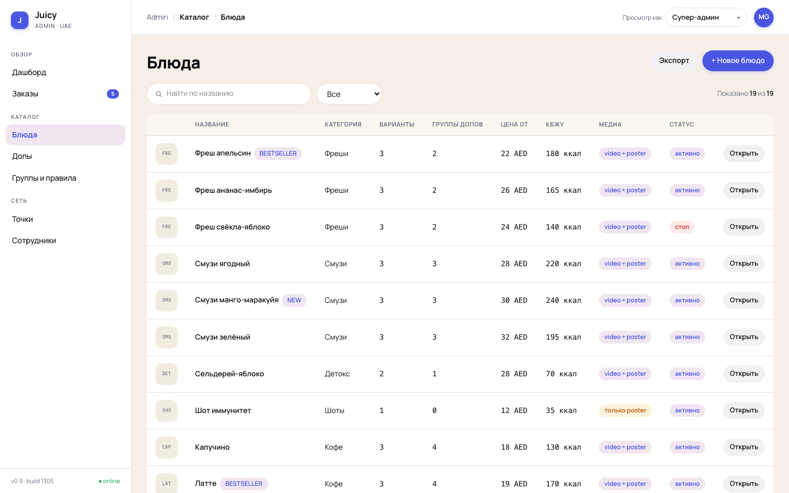
- **Статус.** ✅ Реестр + создание черновика. Таблица thumb/Название/Категория/Варианты/Группы допов/Цена от/КБЖУ/Медиа/Статус.
- **Оценочный объём.** Каркас готов; CRUD на API (M).

## V.5 Каталог — редактор блюда (`/admin/catalog/products/[slug]`)

- **Статус.** ✅ Вкладки `Основное`/`Медиа`/`Варианты`/`Допы`/`Правила`/`Точки`.
- **Что видит.** Основное (EN/AR названия+описание, категория, бейдж, время готовки, теги, КБЖУ базы); Медиа (видео/постер(req)/PNG/цвет фона); Варианты (S/M/L: объём/цена/Δкбжу/наличие); Допы (привязка групп required/min/max/default + overrides); Правила (when→effect, песочница preview); Точки (per-outlet наличие/стоп).
- **Бизнес-правила.** Это интерфейс настройки **конструктора** (§IV) — критичен для S11.
- **Оценочный объём.** Каркас готов; ⚠️ полноценное редактирование формул/правил + EN/AR контент (L).

## V.6 Каталог — допы (`/admin/catalog/addons`)

- **Статус.** ✅ Справочник добавок: unit, доза, КБЖУ/100, цена/unit, аллергены; пересчёт `ккал/unit`.
- **Оценочный объём.** Каркас готов; CRUD на API (M).

## V.7 Каталог — группы и правила (`/admin/catalog/groups`)
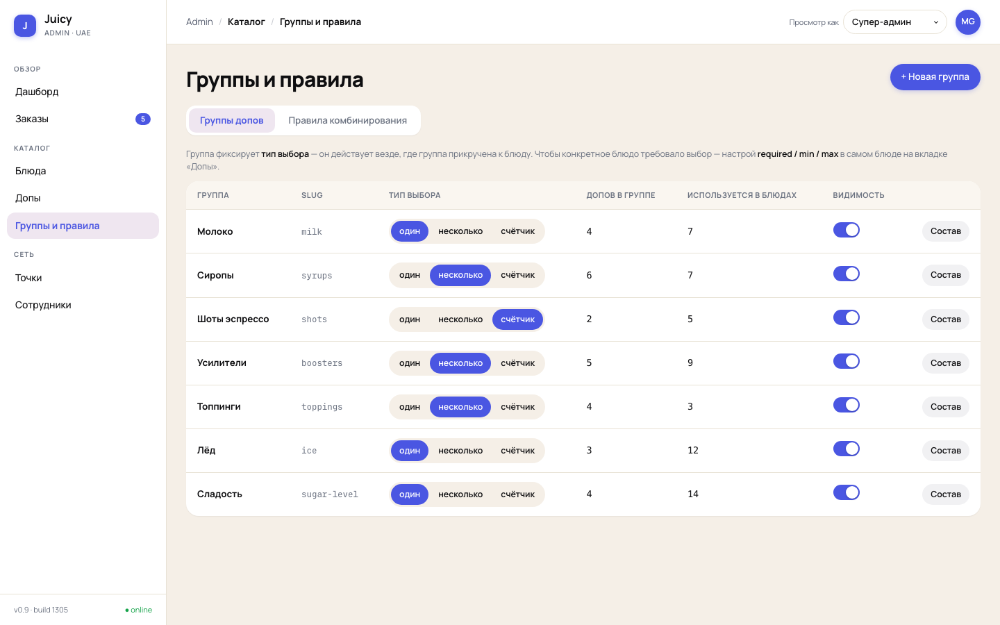
- **Статус.** ✅ Вкладки `Группы допов` (тип выбора single/multi/counter) и `Правила комбинирования` (when→effect: запрет/скидка, scope, сообщение клиенту, активность) + песочница dry-run.
- **Бизнес-правила.** Это редактор **правил сочетания** (§IV.3, S11.2).
- **Оценочный объём.** Каркас готов; ⚠️ движок правил на бэке (часть §IV) (входит в XL-блок конструктора).

## V.8 Сеть — точки + матрица (`/admin/outlets`)
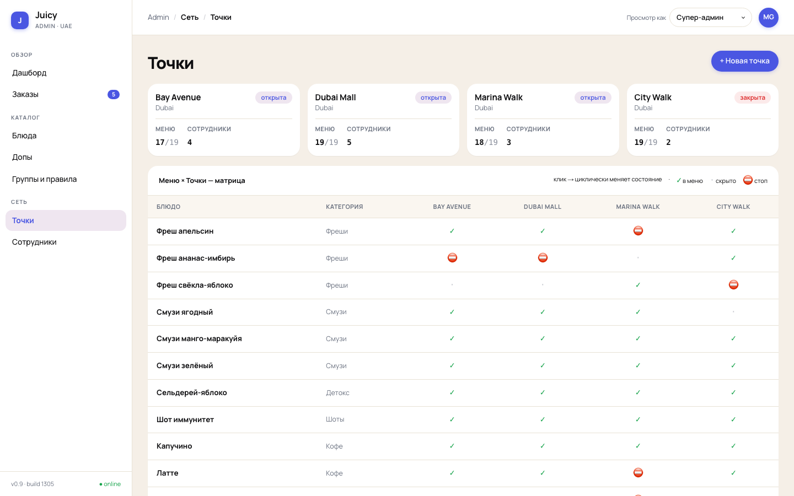
- **Статус.** ✅ Карточки точек + матрица `Меню × Точки` (✓ в меню / · скрыто / ⛔ стоп).
- **Оценочный объём.** Каркас готов; multi-outlet — задел (S9: на старте 1 точка) (M).

## V.9 Сеть — точка (`/admin/outlets/[id]`)
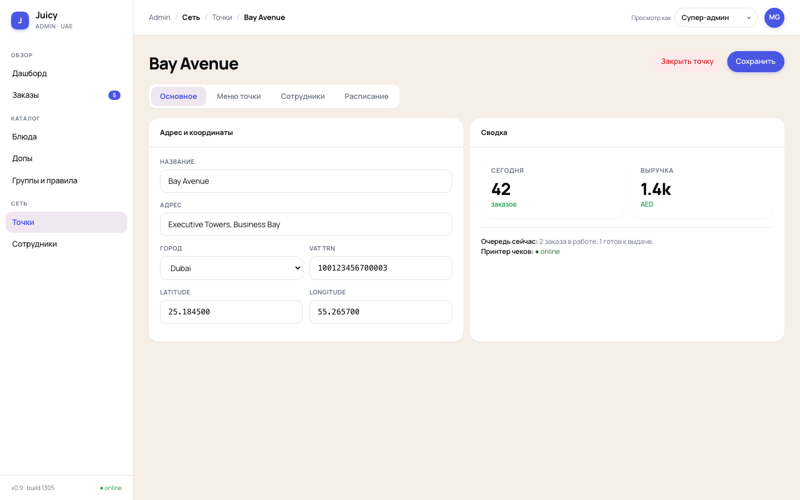
- **Статус.** ✅ Вкладки `Основное` (адрес, город, VAT TRN, гео), `Меню точки` (стоп-листы), `Сотрудники`, `Расписание` (7 дней).
- **Оценочный объём.** Каркас готов (M).

## V.10 Сеть — сотрудники (`/admin/staff`)
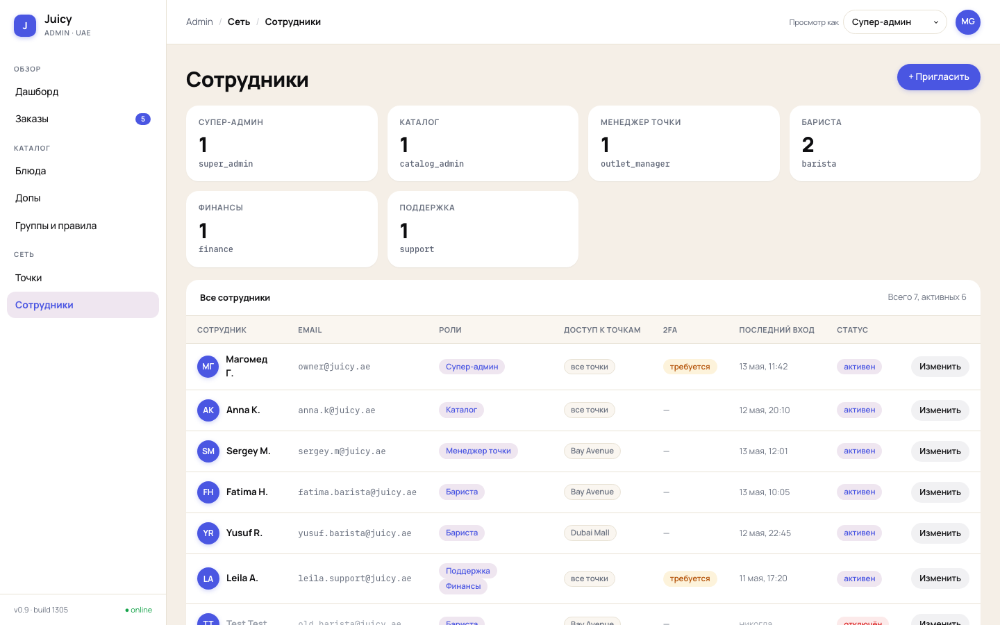
- **Статус.** ✅ RBAC: 6 ролей, доступ к точкам, 2FA-флаг, приглашение/редактирование.
- **Бизнес-правила.** 2FA требуется для `super_admin`/`finance`; пустой scope → `"*"`.
- **Оценочный объём.** Каркас готов; ⚠️ для MVP соков нужны 4 роли (S).

## V.11 KDS — экран бариста (планшет) 🚧
> 🚧 **Нет в прототипе** — спроектировать. Внешний референс — менеджерский экран кофейного проекта (S7: Lovable, кнопка «Принять заказ» + таймер).
- **Назначение.** Очередь заказов точки на закреплённом планшете; приём и проводка по статусам.
- **Что видит (спека).** Список активных заказов (номер, состав, машина/эмират, время с создания); кнопки `Принять` → `Готовить` → `Готов` → `Выдан`; звук/пульсация на новый заказ; индикатор «клиент приехал» (по `arrived`).
- **API.** `GET /kds/queue`, `WS /kds/stream`, `POST /kds/orders/{id}/{accept|start|ready|picked-up|reject}` (§VI).
- **Бизнес-правила.** Привязка «кто взял заказ» — не нужна на старте (S9 D7); 1 планшет у кассира, возможно 2-й на кухне.
- **Оценочный объём.** Новый блок: экран + WS-канал + статусы (L).

---

# ЧАСТЬ VI. API (клиент / админ / KDS)

> Канон — `BACKEND.md` §4. Base `/api/v1`, JSON, ошибки RFC 9457 (§VIII.3). ⚠️ Платёжные эндпоинты переведены на Stripe; OTP — вне MVP (задел).

## VI.1 Клиент — Auth ⚠️ (целевой: без OTP)
| Метод | Путь | Запрос | Ответ |
|---|---|---|---|
| POST | `/auth/register` 🧩 | `{name, phone, carPlate?, emirate?}` | `{user, token}` (лёгкая регистрация без OTP) |
| GET | `/me` | — | User |
| PATCH | `/me` | имя, plate, эмират, локаль | User |
| DELETE | `/me` | — | self-delete (PDPL) |
> 🚧 На этапе приложения: `/auth/otp/request`, `/auth/otp/verify` (S2 §4.1).

## VI.2 Клиент — Catalog
| Метод | Путь | Ответ / ошибки |
|---|---|---|
| GET | `/outlets?lat&lng` · `/outlets/{id}` | список/деталь |
| GET | `/catalog?outletId=` | `{categories, products, addonGroups, addons, compatibilityRules}` (ETag, кэш 60 с) |
| GET | `/products/{slug}?outletId=` | деталь · `NOT_FOUND` |
| POST | `/products/{slug}/preview` | `{variantCode, addons[]}` → `{allowedAddons, forbidden[], autoAdded[], price, nutrition}` · `ADDON_BINDING_VIOLATED`, `ADDONS_INCOMPATIBLE` |

## VI.3 Клиент — Orders
| Метод | Путь | Заметки |
|---|---|---|
| POST | `/orders` (Idempotency-Key) | бэк считает subtotal/vat/total/КБЖУ · `OUTLET_CLOSED`, `PRODUCT_OUT_OF_STOCK`, `ADDON_*`, `ADDONS_INCOMPATIBLE` |
| GET | `/orders?cursor=` · `/orders/{id}` | список/деталь |
| POST | `/orders/{id}/arrived` | «Я приехал» |
| GET | `/orders/{id}/stream` | SSE: `status`/`eta` |
> ⚠️ `/orders/{id}/cancel` — отмена/возврат не нужны на старте (C7), эндпоинт-задел.

## VI.4 Платежи ⚠️ (Stripe)
| Метод | Путь | Заметки |
|---|---|---|
| POST | `/payments/intent` | `{orderId, method}` → Stripe PaymentIntent/redirect · `PAYMENT_FAILED` |
| POST | `/webhooks/stripe` | подписанный вебхук `payment_intent.succeeded` → `PAID` |
> 🚧 рефанды (`/payments/{id}/refund`) — задел.

## VI.5 Персонал/Админ (S2 §4.2, §4.6–4.11)
- **Staff auth:** `POST /staff/login` · `/staff/refresh` · `/staff/logout` · `GET /staff/me`.
- **Каталог:** `GET/POST /admin/categories`, `…/products`, `…/products/{id}/media`, `…/addons`, `…/addons/{id}/png`, `…/addon-groups`, `…/products/{id}/bindings`, `…/compatibility-rules`, `POST /admin/dryrun-preview`.
- **Точки:** `GET/POST /admin/outlets`, `PATCH /admin/outlets/{id}`, `…/inventory/stop`, `…/inventory/resume`.
- **Заказы/финансы:** `GET /admin/orders`, `…/{id}`, `POST …/{id}/status`, `…/{id}/notify` (`ready|delayed|cancelled|custom`), `…/{id}/cancel` 🚧, `…/{id}/comment`.
- **Пользователи/персонал:** `GET /admin/users`, `PATCH …/{id}`, `GET/POST /admin/staff`, `PATCH …/{id}`.
- **Аналитика (read-only):** `/admin/analytics/{revenue|top-products|funnel|avg-prep-time}`.

## VI.6 KDS (`barista`, scope=outlet) 🚧
`GET /kds/queue` · `WS /kds/stream` · `POST /kds/orders/{id}/{accept|start|ready|picked-up|reject|print}`.

## VI.7 Аналитика-ingest
`POST /events` (батч): `product_view`, `addon_toggle`, `addon_blocked_by_rule`, `cart_checkout_start`, `order_created`, `payment_success`, `order_arrived`, `order_pickup`, `kds_accept`, `kds_ready`, …

---

# ЧАСТЬ VII. Сквозные процессы

1. **Регистрация без OTP** ⚠️ — телефон+имя+plate → создание `User` в БД → заказ привязан к телефону. Задел: срастка со старой базой лояльности (миграция, §C11).
2. **Оплата Stripe** ⚠️ — `POST /payments/intent` → оплата (карта; Apple/Google Pay опц.) → webhook `payment_intent.succeeded` → заказ `PAID`. Без чеков/возвратов на старте.
3. **Жизненный цикл заказа + curbside** — `CREATED→PAID→ACCEPTED→PREPARING→READY→PICKED_UP`; клиент жмёт `Я приехал` (`/orders/{id}/arrived`) → KDS показывает номер машины → бариста выносит. В прототипе статусы авто-симулируются 🔧; в проде — SSE-канал.
4. **Конструктор/формулы** — см. §IV (preview-движок: binding + compatibility rules → allowed/forbidden/auto-add/price/nutrition).
5. **KDS realtime** 🚧 — `WS /kds/stream`: `order_new`, `customer_arrived{orderId, carPlate}`; статусные действия бариста.
6. **Лояльность-задел** — структура под «каждый N-й бесплатный» и перенос истории (реализация — V2).
7. **Фишки Drinkit (опция, C12)** — (а) ваучер при превышении времени ожидания (лайк/дизлайк → ваучер); (б) «переделать напиток» = заявка особого типа: один напиток, без возврата/доплаты, оповещение менеджеру.

---

# ЧАСТЬ VIII. Справочники

## VIII.1 Статусы заказа
`CREATED` (создан, ожидает оплаты) · `PAID` (оплачен) · `ACCEPTED` (принят бариста) · `PREPARING` (готовится) · `READY` (готов) · `PICKED_UP` (выдан) · `CANCELLED`/`REFUNDED` 🚧 (вне MVP).

## VIII.2 Константы
VAT 5 % · слоты выдачи шаг 15 мин от now+15 · кастомное имя ≤30 · plate `^[A-Z0-9 ]{1,12}$` · телефон UAE `^\+971(50|52|54|55|56|58)\d{7}$` (⚠️ расширить на коды Залива) · номер заказа от 1247 (прототип) · лимиты добавок: foam ≤2, espresso ≤3, tapioca ≤2, citrus ≤2 (тест-данные).

## VIII.3 Коды ошибок (S2 §9)
`VALIDATION_ERROR`(400) · `AUTH_REQUIRED`(401) · `FORBIDDEN`(403) · `NOT_FOUND`(404) · `OUTLET_CLOSED`(409) · `PRODUCT_OUT_OF_STOCK`(409) · `ADDON_OUT_OF_STOCK`(409) · `ADDON_BINDING_VIOLATED`(409) · `ADDONS_INCOMPATIBLE`(409) · `ORDER_NOT_CANCELLABLE`(409) · `PAYMENT_FAILED`(422) · `RATE_LIMITED`(429) · `INTERNAL`(500). 🚧 OTP-коды (`OTP_INVALID`, `OTP_THROTTLED`) — на этапе приложения.

## VIII.4 Внешние интеграции
- ⚠️ **Stripe** (карта; Apple/Google Pay опц.; вебхук с подписью).
- 🚧 SMS-провайдер (Twilio/Unifonic) — только при возврате OTP/уведомлений (этап приложения).
- 🚧 Учётная/POS-система (аналог iiko/Shopify ERP) — выберет Абдулазиз; на старте не интегрируем, заложить возможность.
- Аналитика-события `/events`; Sentry/OpenTelemetry (NFR).

## VIII.5 Глоссарий
блюдо = продукт = напиток (`Product`); точка = `Outlet`; добавки = доп = add-on; бариста = KDS-оператор; конструктор = кастомайзер.

---

# ЧАСТЬ IX. Качество, ограничения, открытые вопросы

## IX.1 NFR (целевой, с учётом S7/S9)
- **Нагрузка низкая:** ~до 100 заказов/день на точку, тестовый режим, трафик специально не нагоняют (S9 F3). p95 `/catalog` < 200 мс, `POST /orders` < 400 мс (S2 — ориентир).
- **Аптайм:** жёстких требований нет на старте (S9 F4); заказчик против траты времени на доп. безопасность/тест на старте (S7).
- **Масштабируемость:** заложить мультилокационную архитектуру и задел под мобильное приложение/общую БД (S7/S8).
- **Безопасность/PDPL:** plate/телефон — PII; `DELETE /me`; хостинг в регионе ОАЭ — на согласование (открытый вопрос).

## IX.2 Что НЕ нужно в MVP (S2 §12 + S7/S9)
Лояльность с бонусами (только задел), промокоды (поле-заглушка), Web Push, мультивалютность, подписки, доставка (только curbside), нативное приложение, OTP/SMS, чеки/фискализация, возвраты, POS-интеграция (только возможность), расширенная аналитика.

## IX.3 Покрытие тестами (S3)
Прототип: 44 e2e Playwright (`e2e/`): smoke по маршрутам, отсутствие console-ошибок, «нет мёртвых кнопок», golden-path splash→READY.

## IX.4 Единый реестр открытых вопросов (S9 «Открыт/Частично» + S2 §14)
| Тема | Вопрос | Источник | Кто закрывает |
|---|---|---|---|
| Каталог | финальный файл-конструктор (ингредиенты+граммовки, правила, лимиты) | S11/S9 A5 | Абдулазиз |
| Платежи | merchant/KYC Stripe, статус | S9 C1 | Абдулазиз |
| Аналитика | состав метрик дашборда | S9 D9 | Абдулазиз |
| Учётная система | выбор (iiko/Shopify/…) для задела интеграции | S9 G1/G5 | Абдулазиз |
| Хостинг/PDPL | регион me-central-1, OPEX, хранение plate как PII | S2 §14, S9 B3/F1 | юрист/Абдулазиз |
| Договор | сторона/юрисдикция (РФ/ОАЭ), валюта, порядок оплаты | S9 H1–H3 | Абдулазиз |
| Дизайн | Figma/бренд-гайд/лого по сокам | S9 B9 | заказчик |
| Медиа/КБЖУ | источник данных КБЖУ и медиа напитков | S9 B10 | Абдулазиз |
| KDS | один планшет или два (кассир+кухня) | S9 D5 | Абдулазиз |
| Apple/Google Pay | нужны ли кнопки Pay поверх Stripe | S2 §C3 | заказчик |
| NDA/кейс | можно ли публично упоминать проект | S9 A6 | заказчик |

---

# Приложения

## A. Матрица трассируемости (экран ↔ процесс ↔ API)
| Экран | Процесс (§VII) | Ключевые эндпоинты (§VI) |
|---|---|---|
| A4/A6 вход | 1 регистрация без OTP | `/auth/register`, `/me` |
| B1/B2 каталог | 4 конструктор | `/catalog`, `/products/{slug}` |
| C1 карточка | 4 конструктор | `/products/{slug}/preview` |
| D2 checkout | 3 заказ/curbside | `/orders` |
| D3 оплата | 2 Stripe | `/payments/intent`, `/webhooks/stripe` |
| E2 статус | 3 + 7 фишки | `/orders/{id}`, `/orders/{id}/arrived`, SSE |
| KDS 🚧 | 3 + 5 realtime | `/kds/*` |
| AD5/AD7 админ | 4 конструктор | `/admin/products/{id}/bindings`, `/admin/compatibility-rules`, `/admin/dryrun-preview` |

## B. Реестр изменений «прототип → целевой» — см. §0.1 (канон).

## C. Источники
S1 compass · S2 BACKEND.md · S3 `app/` (код+`e2e`) · S4 КП · S5 references (Drinkit) · S7 транскрипт созвона · S8 notes · S9 опросник заполненный · S10 материалы для ТЗ · S11 уточнения Малика.

> Смета по этому ТЗ — `docs/Juicy_СМЕТА.md` (+ `.csv`). Каждый блок сметы ссылается на разделы этого документа.
