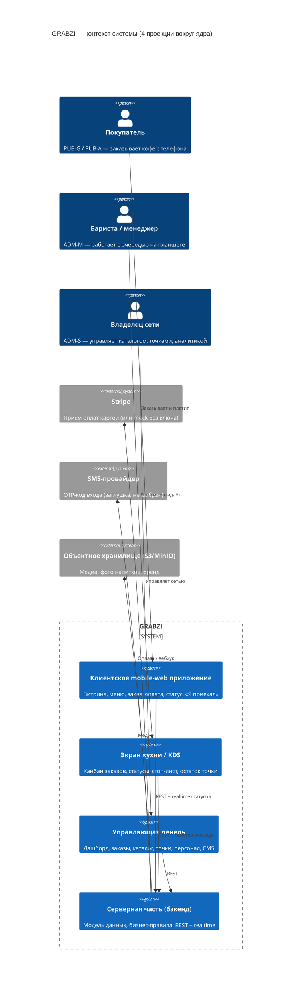
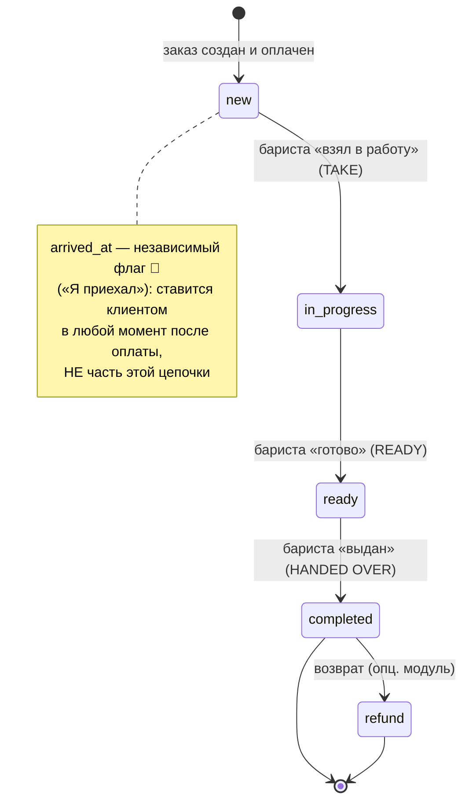

# GRABZI — Единое техническое задание

> **Продукт:** GRABZI — mobile-web сервис предзаказа спешелти-кофе по модели drive-through
> (выдача к машине по номеру авто, дневной лимит «Come early — we don't make more»).
> **Рынок:** ОАЭ, Dubai · бренд grabzi.ae · англоязычный интерфейс (EN-first).

| Параметр | Значение |
|---|---|
| **Название документа** | Единое техническое задание проекта GRABZI |
| **Часть** | **Часть 0. ВВЕДЕНИЕ** |
| **Версия** | 1.0 |
| **Дата** | 2026-06-10 |
| **Статус** | Draft |
| **Авторы** | Технический писатель / системный аналитик (на основе прототипа `backend/` + `grabzi-web/`) |
| **Согласующие** | Владелец продукта · Заказчик/спонсор · Технический лид |
| **Канон достоверности** | Код прототипа (`backend/`, `grabzi-web/`), затем проектные спеки `docs/` |

### История изменений

| Версия | Дата | Автор | Суть изменения |
|---|---|---|---|
| 1.0 | 2026-06-10 | Тех. писатель | Первичная редакция Части 0 (Введение): Executive Summary, бизнес-ценность, экономика, границы, KPI, стейкхолдеры/RACI, глоссарий, роли, карта системы, статусная модель, «день из жизни», «Возможность→Выгода». |

### Порядок внесения изменений

Изменения вносятся через инкремент версии в этой таблице (semver: мажор — смена скоупа/архитектуры; минор — новые истории/правила; патч — правки текста). Каждая правка фиксирует автора и суть. Статус документа повышается по маршруту **Draft → Review → Approved**; перевод в Approved требует подписи согласующих (см. блок ниже).

### Согласование (подписи заказчика)

| Роль | ФИО | Решение (утверждаю / на доработку) | Дата | Подпись |
|---|---|---|---|---|
| Заказчик / спонсор |  |  |  |  |
| Владелец продукта |  |  |  |  |
| Технический лид |  |  |  |  |

---

## Легенда

**Единицы и форматы (зафиксированы один раз; применяются во всём ТЗ):**

| Что | Правило |
|---|---|
| Деньги | **AED** (дирхам ОАЭ). На фронте — `DHS. X.XX` / `AED {total}`. Цена напитка — `base_price`. |
| Налог | **VAT 5 %** — требование/решение (модель «включён в цену» по умолчанию). ⚠️ В коде налоговая строка **не реализована**: `total = subtotal − coupon_discount`. Детали и пример чека — см. Часть I и Часть IX (каталог бизнес-правил). |
| Номер машины (`car_plate`) | Обязателен для выдачи; приводится к UPPERCASE; класс PII (PDPL UAE) — см. Часть I. |
| Эмират (`emirate`) | Поле заказа/профиля. |
| Телефон | Формат `+971…`. Канон-валидация бэкенда — `^\+\d{9,15}$`. ⚠️ Фронт мягче (`^\+?\d{7,15}$`) — расхождение, см. Часть IX. |
| Локализация | Контентные поля — JSON `{"en":…[,"ar"]}`; UI пока **EN-only**, инфраструктура AR/RTL заложена (V1.1). |
| Часовой пояс | У точки свой (`Asia/Dubai`); «бизнес-день» считается в TZ точки. |
| Идентификаторы | Латиницей / как в коде (только в технических слоях). |

**Метки статуса (используются по всему ТЗ):**

| Метка | Значение |
|---|---|
| ✅ | Реализовано в прототипе (и/или покрыто тестами). |
| 🔧 | Режим заглушки/конфигурации (mock-оплата без ключа Stripe, dev-OTP) — требует подключения в проде. |
| 🚧 | Существует на уровне API, но без экрана в `grabzi-web` (проектируется по контракту). |
| 🧩 | Опциональный модуль (может быть исключён из MVP). |
| ❓ | Открытый вопрос. |
| 📝 | Примечание/допущение (не подтверждено кодом). |
| ⚠️ | Расхождение/риск (код ↔ спека или фронт ↔ бэк). |
| 🚗 | Клиент на месте (`arrived_at`). |

**Приоритет (MoSCoW):** **Must** (ядро) · **Should** · **Could** · **Won't** (отложено/исключено).

**Светофор готовности:** 🟢 работает · 🟡 заглушка/конфигурация · 🔴 ещё нет.

**Метка происхождения (GRABZI vs Juicy):** 🟦 **JUICY** — переиспользовано из проекта Juicy · 🟨 **GRABZI⁺**
— блок Juicy, доработанный под GRABZI · 🟩 **GRABZI** — новый функционал под GRABZI. Полная карта
происхождения по каждому блоку — **Приложение F**; на ней же построена смета (файл
`GRABZI_СМЕТА_по_функционалу.xlsx`, два варианта: «с нуля как Juicy» и «только доработка»).

**Перекрёстные ссылки:** на части ТЗ — `см. Часть N`; на сквозной процесс — `см. Часть VII`; на дизайн — `см. Часть II`. Факт описывается в одном каноническом месте; в остальных — ссылка.

---

# Часть 0. ВВЕДЕНИЕ

## 0.0 Резюме для руководителя (Executive Summary)

**Что это.** GRABZI — это сайт-приложение в телефоне, через которое покупатель за минуту заранее заказывает и оплачивает спешелти-кофе, а потом забирает его к машине, не выходя и не стоя в очереди (модель «закажи заранее — забери у окна»).

**Какую проблему решает.**
*Для покупателя* — утром не нужно стоять в очереди и ждать: он оформляет заказ из машины или по дороге, платит картой и подъезжает к готовому стакану.
*Для владельца сети* — продаёт кофе напрямую, без посредников-агрегаторов и их комиссии, сам видит всех своих клиентов и сам управляет скоростью выдачи и качеством.

**Как зарабатывает.** Прямые продажи кофе через приложение с оплатой картой; вся выручка остаётся у сети (без комиссии агрегатора доставки).

**Что входит в MVP (что заказчик получает на руки):**
- Витрина бренда и меню кофе с ценами и «остатком на сегодня».
- Сбор и оплата заказа на одном экране (ввод номера машины и телефона).
- Отслеживание готовности заказа в реальном времени и кнопка «Я приехал».
- Рабочий экран для бариста (планшет): очередь заказов, отметка «взял / готов / выдан», стоп-лист напитков, остаток дня.
- Управляющая панель владельца сети (точки, часы, лимиты, каталог, заказы, платежи, аналитика, контент).
- Дневной лимит «больше не делаем» — встроен в продукт.

**Текущая готовность (светофор):**
- 🟢 **Работает:** весь покупательский путь (выбор точки → заказ → оплата → статус → «Я приехал»), экран кухни, дневной лимит, стоп-лист, статусы заказа в реальном времени.
- 🟡 **В режиме заглушки (конфигурация, не поломка):** оплата (без подключённого Stripe деньги реально не списываются — имитируется успех); вход по телефону пока без SMS-кода (пускает по номеру).
- 🔴 **Чего ещё нет на экранах:** управляющая панель владельца существует на уровне сервера, но её визуальные экраны под GRABZI ещё не собраны (описываются в ТЗ по контракту); арабская версия интерфейса; начисление налога VAT в чеке.

**Что нужно от заказчика для публичного запуска:**
1. Торговый аккаунт **Stripe** + налоговый номер **TRN** — чтобы принимать реальные деньги.
2. Выбранный **SMS-провайдер** — чтобы вход подтверждался кодом.
3. Подтверждение модели **VAT 5 %** (включён в цену) и реквизитов для чека.

**Ключевые риски / открытые вопросы:**
- Без Stripe и SMS-провайдера запуск «по-настоящему» невозможен — это внешние подключения, которые предоставляет заказчик.
- Налог VAT 5 % сейчас не отражается в сумме — нужно решение и реквизиты (см. Часть IX).
- Номинал и срок жизни купона за оценку 👎 в коде не зафиксированы — это прямой расход бизнеса, требует решения заказчика (см. Часть IX).

---

## 0.1 Обзор продукта и бизнес-ценность

> **Для заказчика.** GRABZI — это «утренний кофе без очереди»: фирменный спешелти-кофе, который покупатель заказывает заранее с телефона и забирает к машине у окна выдачи. Сердце концепции — **дневной лимит**: каждый день готовится ограниченное число порций («Come early — we don't make more»). Это даёт свежесть, предсказуемый объём и эффект «успей купить».

**Что видит покупатель.** Заходит на витрину бренда, видит, сколько порций ещё осталось на сегодня, выбирает точку (с её часами и остатком), собирает заказ на одном экране, вводит номер машины и телефон, оплачивает картой, следит за готовностью в реальном времени и жмёт «Я приехал». Кофе выносят к окну, сверяя номер машины.

**Что получает владелец сети.** Прямой канал продаж без агрегатора: свои клиенты, свои данные, свой контроль скорости выдачи. Управляющая панель даёт каталог и цены, точки с часами и лимитами, все заказы и платежи, аналитику по точкам, контент сайта и персонал. Бариста на точке работает с очередью заказов на планшете и ведёт стоп-лист, когда что-то заканчивается.

**Где ценность.**
- **Скорость утреннего потока** — заказ готов к приезду, очередь у окна не копится.
- **Предсказуемость** — дневной лимит планирует загрузку и исключает списания нераспроданного.
- **Прямое владение клиентом** — без посредника, с полной аналитикой и контентом в своих руках.
- **Узнаваемый бренд** — единый фирменный стиль grabzi.ae на каждом экране.

Четыре проекции одного продукта (подробнее — §0.7): клиентское mobile-web приложение · экран кухни/KDS бариста · управляющая панель владельца · серверная часть.

### 0.1.1 Экономика и почему именно эта модель

> **Для заказчика.** Ниже — деловое обоснование, почему GRABZI устроен именно так. Конкретные проценты приведены **как допущения** 📝 (в коде/источниках их нет) — они иллюстрируют логику, а не являются финансовой моделью.

**1. Модель выручки.** Прямые продажи кофе через mobile-web с оплатой картой. Покупатель платит в приложении, заказ привязывается к его телефону, выдача — к машине. Посредника (агрегатора доставки) в цепочке нет — вся выручка остаётся у сети.

**2. Логика дневного лимита («Come early — we don't make more»).** Каждая точка готовит ограниченное число порций в день (в текущих данных — **150** напитков). Это даёт:
- **Свежесть и качество** — готовится столько, сколько распродаётся, без «вчерашних» остатков.
- **Предсказуемый объём** — закупка ингредиентов и смена планируются под известный потолок.
- **Эффект дефицита и утренний пик** — «успей, пока есть» подталкивает заказывать рано, выравнивая поток к открытию.
- **Нет списаний** — не делается лишнее, которое пришлось бы выбрасывать.

**3. Почему drive-through/curbside, а не агрегаторы доставки.**
- **Нет комиссии агрегатора** 📝 (у агрегаторов доставки она обычно составляет десятки процентов от чека — это допущение, иллюстрирующее экономию; точное значение зависит от площадки).
- **Прямое владение клиентом и его данными** — телефон, история заказов, аналитика остаются у сети, а не у площадки.
- **Контроль скорости и бренда** — выдача у окна по номеру машины управляется самой точкой; покупатель видит фирменный стиль GRABZI, а не интерфейс агрегатора.

**4. Что это значит для юнит-экономики (простыми словами).** Каждый проданный стакан приносит сети полную цену за вычетом себестоимости и эквайринга (комиссии платёжной системы) 📝, без удержания агрегатора. Дневной лимит превращает спрос в прогнозируемый план, снижая потери на списаниях и переработке. Прямые данные о клиентах позволяют возвращать их повторно без оплаты «за лид» площадке.

> Источник фактов: README, `docs/GRABZI_IMPLEMENTATION_PLAN.md`, описание бренда grabzi.ae и сид-данные (`seed_grabzi.py`). Проценты и суммы — допущения 📝.

---

## 0.2 Границы проекта (Scope)

> **Для заказчика.** Ниже — три явных списка: что **точно делаем** (MVP), что **точно не делаем** сейчас, и что **отложено на будущее**. Каждый пункт помечен статусом, чтобы границы и готовность были однозначны.

### In-scope (MVP) — доставляемое и проверяемое

| Возможность | Приоритет | Статус |
|---|---|---|
| Витрина бренда и «остаток на сегодня» (Home) | Must | ✅ |
| Выбор точки с часами, статусом и остатком | Must | ✅ |
| Просмотр меню кофе с ценами | Must | ✅ |
| Сбор и оплата заказа на одном экране (номер машины + телефон) | Must | ✅ |
| Оплата картой (Stripe Checkout) | Must | 🔧 (без ключа — mock) |
| Вход клиента по телефону | Must | 🔧 (OTP-заглушка, вход без кода) |
| Отслеживание статуса заказа в реальном времени | Must | ✅ |
| Отметка «Я приехал» (curbside-выдача) | Must | ✅ |
| Мои заказы / вход по телефону | Must | ✅ |
| Дневной лимит в напитках + атомарная проверка при оплате | Must | ✅ |
| Стоп-лист напитков по точке | Must | ✅ |
| Статус точки (open/paused/closed/inactive) | Must | ✅ |
| Экран кухни / KDS (канбан, взять/готов/выдан) | Must | ✅ |
| Управляющая панель владельца: дашборд, заказы, клиенты, платежи, купоны, персонал, каталог, локации, настройки, CMS, медиа | Must | 🚧 (на API, без экрана в `grabzi-web`) |
| Инфо-страница (CMS-блоки) | Should | ✅ |
| Информ-страница инфо/контакты | Should | ✅ |

### Out-of-scope — явно исключено

| Что не делаем | Статус |
|---|---|
| Нативные мобильные приложения (iOS/Android) | Won't |
| Доставка курьером / интеграция с агрегаторами | Won't |
| Программа лояльности/баллы (помимо купона за оценку) | Won't |
| Мультиарендность (несколько брендов на одной платформе) | Won't |
| Конфигуратор добавок в публичном потоке (таблицы есть, «спят») | Won't / 🧩 |
| Корзина-многошаговый чекаут, онбординг, отдельный ввод имени | Won't |

### Future / Roadmap — отложено на будущее

| Что планируется | Приоритет | Статус |
|---|---|---|
| Арабская версия интерфейса (AR/RTL) — V1.1 | Could | 🚧 (инфраструктура заложена) |
| Реальные SMS-OTP (подключение провайдера) | Should | 🔧 |
| Реальная оплата Stripe + TRN/VAT в чеке | Must для прода | 🔧 |
| Конфигуратор добавок (single/multi/counter) | Could | 🧩 |
| Возвраты заказа (refund) как полноценный модуль | Could | 🧩 |
| Карточка напитка `/product/[slug]` | Could | 🧩 |

---

## 0.3 Метрики успеха (KPI)

> **Для заказчика.** KPI сформулированы как вопросы владельца бизнеса. Технический термин — в скобках. Для каждого — почему он важен. Базовые/целевые значения проставляются после первого месяца работы.

| # | Вопрос владельца | Что измеряем (термин) | Почему важно | Baseline → Target |
|---|---|---|---|---|
| KPI-1 | Сколько начавших заказ доходят до оплаты? | конверсия экрана заказа O1 | прямая выручка: каждый «отвалившийся» — потерянная продажа | 📝 определить |
| KPI-2 | За сколько минут заказ готов? | медиана «заказ → готов» | пропускная способность окна и довольство клиента | 📝 определить |
| KPI-3 | Какая доля дневного лимита распродаётся? | sell-through (продано / лимит) | показывает спрос vs лимит — пора ли поднимать лимит/открывать точку | 📝 определить |
| KPI-4 | Какая доля оплат проходит успешно? | success-rate платежей | деньги, теряемые на сбоях оплаты | 📝 определить |
| KPI-5 | Каково соотношение 👍 / 👎 после заказа? | рейтинг удовлетворённости | сигнал качества и повод для купона-компенсации | 📝 определить |
| KPI-6 | Сколько клиентов возвращаются? | доля повторных заказов по телефону | ценность прямого владения клиентом vs агрегатор | 📝 определить |

> Системные критерии приёмки релиза (UAT exit) ведутся отдельно от per-story критериев приёмки — см. Часть IX.

---

## 0.4 Заинтересованные стороны (стейкхолдеры) и RACI

> **Для заказчика.** Стейкхолдеры — это люди и команды вокруг проекта (в отличие от системных ролей в продукте, §0.6). RACI показывает, кто за что отвечает в ключевых решениях: **R** — исполняет, **A** — отвечает за результат (один на решение), **C** — консультируют, **I** — информируют.

**Стейкхолдеры:**

| Стейкхолдер | Кто это | Интерес |
|---|---|---|
| Заказчик / спонсор | владелец бизнеса GRABZI, финансирует проект | запуск, выручка, бренд |
| Владелец продукта | принимает решения по объёму и приоритетам | соответствие продукта бизнес-целям |
| Команда разработки | фронт/бэк-инженеры | исполнимость требований |
| Владелец платежей и юр./PDPL | отвечает за Stripe, TRN/VAT, защиту персональных данных | легальность приёма денег и обработки PII |
| Персонал точек (бариста/менеджеры) | работают на экране кухни | удобство операционки |

**RACI ключевых решений:**

| Решение | Заказчик | Владелец продукта | Разработка | Платежи/юр./PDPL |
|---|---|---|---|---|
| Подключение Stripe + TRN | **A** | C | R | C |
| Выбор SMS-провайдера | **A** | C | R | I |
| Модель VAT (включён/сверху) | **A** | C | I | **C** |
| Номинал/срок купона за 👎 | **A** | R | I | I |
| Срок хранения заказов / PII | C | R | C | **A** |
| Запуск арабской версии (V1.1) | **A** | R | C | I |
| Приоритеты MVP / scope | C | **A** | C | I |

> Полный реестр открытых вопросов с бизнес-колонками (почему важно · дефолт · блокирует ли запуск · кто решает) — см. Часть IX.

---

## 0.5 Глоссарий и сокращения

| Термин / аббревиатура | Простое определение |
|---|---|
| **GRABZI** | Сервис предзаказа спешелти-кофе по модели drive-through (этот продукт). |
| **Drive-through / curbside pickup** | Выдача заказа к машине у окна: покупатель не выходит, не стоит в очереди. |
| **Спешелти-кофе** | Кофе высокого качества, приготовленный по особой технологии (здесь — Ice V'60). |
| **Дневной лимит** | Максимум порций, которые точка готовит за день («больше не делаем»). Считается в напитках. |
| **«Come early — we don't make more»** | Слоган-концепция дневного лимита: приходи раньше, лишнего не готовим. |
| **Стоп-лист** | Список напитков, временно недоступных на точке (кончился ингредиент). |
| **Бизнес-день** | Сутки в часовом поясе точки; по нему считается лимит, сбрасывается в местную полночь. |
| **mock-режим** | Имитация работы внешнего сервиса без реального подключения (напр. оплата без Stripe). |
| **Эмират** | Административная единица ОАЭ; поле заказа/профиля. |
| **Номер машины (car_plate)** | Госномер авто покупателя — по нему узнают у окна выдачи; персональные данные. |
| **base_price** | Базовая цена напитка в каталоге. |
| **Soft-delete (мягкое удаление)** | Отключение записи без физического удаления (история сохраняется). |
| **effective_status / статус точки** | Вычисляемый статус точки: open / paused / closed / inactive. |
| **arrived_at («Я приехал»)** | Независимая отметка «клиент на месте»; не входит в цепочку статусов заказа. |
| **MVP** | Минимально жизнеспособный продукт — то, что доставляется первым релизом. |
| **JTBD** | «Job To Be Done» — задача, которую продукт решает для пользователя. |
| **KDS** | Kitchen Display System — экран кухни с очередью заказов для бариста. |
| **OTP** | One-Time Password — одноразовый код (для входа по SMS). |
| **VAT** | Value Added Tax — налог на добавленную стоимость (в ОАЭ — 5 %). |
| **TRN** | Tax Registration Number — налоговый номер продавца (нужен для чеков/VAT). |
| **PDPL** | Personal Data Protection Law — закон ОАЭ о защите персональных данных. |
| **PII** | Personally Identifiable Information — персональные данные (телефон, номер машины, имя). |
| **WS / WebSocket** | Канал постоянной связи сервер↔браузер для обновлений в реальном времени. |
| **JWT** | JSON Web Token — подписанный токен авторизации. |
| **KPI** | Key Performance Indicator — ключевая метрика успеха. |
| **MoSCoW** | Приоритизация: Must / Should / Could / Won't. |
| **RACI** | Матрица ответственности: Responsible / Accountable / Consulted / Informed. |
| **RTO / RPO** | Целевое время восстановления / допустимая потеря данных (надёжность). |
| **КБЖУ** | Калории/белки/жиры/углеводы (в публичном потоке GRABZI не используются, `kcal=0`). |
| **PUB-G / PUB-A / ADM-M / ADM-S** | Коды ролей в ТЗ: гость / авторизованный клиент / менеджер-бариста / супер-админ (§0.6). |
| **AED / DHS** | Дирхам ОАЭ — валюта расчётов (на фронте `DHS. X.XX`). |

> Любой термин, встречающийся далее в ТЗ, должен присутствовать в этой таблице.

---

## 0.6 Роли «по-человечески» + матрица доступа

> **Для заказчика.** В продукте четыре роли. Сначала — кто это и что может/не может (и почему), затем — таблица «роль × право».

**PUB-G — Гость.** Любой посетитель, ещё не вошедший в систему. Свободно листает витрину, точки, меню и инфо, собирает заказ. Платить и видеть «мои заказы» не может, пока не «представится» — на оплате он входит по номеру телефона. Так покупателю не нужно регистрироваться, чтобы посмотреть продукт.

**PUB-A — Авторизованный клиент.** Тот, кто вошёл по телефону. Может оплачивать, отслеживать статус, жать «Я приехал», видеть свою историю заказов, ставить оценку 👍/👎 и применять купон. Все его заказы привязаны к его номеру — пароль не нужен.

**ADM-M — Менеджер / бариста (рабочее место ОДНОЙ точки).** Видит и обрабатывает только заказы и статус **своей** точки: берёт заказ в работу, отмечает «готов» и «выдан», ведёт стоп-лист, видит остаток дня. **Не видит** другие точки, **не управляет** каталогом, ценами, персоналом и деньгами сети — так данные сети защищены, а у сотрудника точки нет лишних полномочий. Вход — по email и паролю.

**ADM-S — Супер-админ (владелец/администратор всей сети).** Полный доступ: каталог и цены, все точки, персонал, все заказы, платежи, купоны, настройки, контент и аналитика. Видит все заказы сети. Вход — по email и паролю.

> Эта же расшифровка приводится рядом с историями кухни и админки (см. Часть V, Часть VI).

**Матрица «роль × право доступа»** (✓ — доступно, — — нет):

| Право / возможность | PUB-G | PUB-A | ADM-M | ADM-S |
|---|:--:|:--:|:--:|:--:|
| Просмотр витрины/меню/точек/инфо | ✓ | ✓ | ✓ | ✓ |
| Сбор заказа | ✓ | ✓ | — | — |
| Оплата заказа | — | ✓ | — | — |
| «Мои заказы» / история | — | ✓ | — | — |
| Статус заказа в реальном времени | — | ✓ | — | — |
| Отметка «Я приехал» | — | ✓ | — | — |
| Оценка 👍/👎 и купон | — | ✓ | — | — |
| Очередь заказов своей точки (канбан) | — | — | ✓ | ✓ |
| Смена статуса заказа (взять/готов/выдан) | — | — | ✓ (своя точка) | ✓ |
| Стоп-лист напитков | — | — | ✓ (своя точка) | ✓ |
| Остаток/лимит точки | — | — | ✓ (своя точка) | ✓ |
| Пауза точки | — | — | ⚠️ см. прим. | ✓ |
| Заказы всей сети | — | — | — | ✓ |
| Клиенты / платежи / купоны (управление) | — | — | — | ✓ |
| Каталог и цены (CRUD) | — | — | — | ✓ |
| Локации (CRUD, часы, лимиты, корректировки) | — | — | — | ✓ |
| Персонал (CRUD, привязка к точке) | — | — | — | ✓ |
| Настройки и контент (CMS), медиа | — | — | — | ✓ |
| Аналитика (дашборд) | — | — | своя точка | ✓ |

> ⚠️ **Примечание по паузе точки.** Проектное решение (план §5.14) — пауза точки только у супер-админа. В прототипе пауза включается через `accepting_orders`; точное разграничение прав менеджер/супер-админ для этого действия фиксируется в Части VI/IX. Менеджер всегда видит статус своей точки.

---

## 0.7 Карта системы (4 проекции)

> **Для заказчика.** GRABZI — это одна система, видимая с четырёх сторон: глазами покупателя (приложение в телефоне), глазами бариста (планшет на точке), глазами владельца (управляющая панель) и «под капотом» (сервер, который всё связывает). Ниже — как они соединены.

**Как проекции связаны (сквозные процессы — подробно см. Часть VII):**

| Сквозная нить | Откуда видна |
|---|---|
| Жизненный цикл заказа + realtime | клиент (статус) ↔ кухня (канбан) ↔ владелец (заказы) ↔ сервер |
| Дневной лимит и счётчик | клиент («осталось N») ↔ кухня (прогресс) ↔ владелец (корректировка) ↔ сервер |
| Стоп-лист напитков | клиент («Sold out») ↔ менеджер (стоп-лист) ↔ сервер |
| Статус точки | клиент (бейдж) ↔ кухня (хедер) ↔ владелец (пауза) ↔ сервер |
| Оплата (Stripe + mock + вебхук) | клиент (оплата) ↔ владелец (платежи) ↔ сервер |
| Купоны и рейтинг | клиент (оценка/купон) ↔ владелец (купоны) ↔ сервер |

> Технологический стек (Next.js / FastAPI / БД / хранилище) и контейнерная схема — см. Часть I.

---

## 0.8 Статусная модель заказа

> **Для заказчика.** У заказа есть две независимые «оси»: **стадия готовки** (новый → делается → готов → выдан) и **факт оплаты**. Отдельно от них — флаг **«Я приехал»**: покупатель может отметить, что он у окна, на любой стадии, и это не двигает готовку. Ниже — машина состояний стадии готовки.

**Расшифровка статусов «для людей» (`Order.status`):**

| Статус | Колонка кухни | Что значит по-человечески | Кто двигает |
|---|---|---|---|
| `new` | NEW | Оплаченный заказ упал в очередь — его ещё никто не взял. | система (после оплаты) |
| `in_progress` | MAKING | Бариста взял заказ в работу и готовит; за заказом закреплён менеджер. | ADM-M (кнопка TAKE) |
| `ready` | READY · HANDOUT | Кофе готов и ждёт выдачи у окна. | ADM-M (кнопка READY) |
| `completed` | DONE | Заказ выдан покупателю; остаётся в истории. | ADM-M (кнопка HANDED OVER) |
| `refund` | — | Заказ возвращён (опциональный модуль); деньги возвращены, день-счётчик откатывается, если возврат в тот же бизнес-день. | ADM-M (возврат) |

**Независимый флаг `arrived_at` (🚗 «Я приехал»):** покупатель нажимает «I'm here 🚗» — у бариста на карточке загорается «🚗 HERE». Это **отдельная отметка**, а не ступень цепочки: можно приехать, когда заказ ещё `new` или уже `ready`. Бариста выносит кофе, сверяя номер машины. (Хореография выдачи — см. Часть IV, ST1; процесс — см. Часть VII.)

**Параллельная ось оплаты (`payment_status`):** `pending → paid` (основной путь), `failed` / `refunded` (отклонения). Заказ становится виден кухне и списывает дневной лимит **только** после `paid`. Детали — см. Часть VII (платёж, дневной лимит).

---

## 0.9 Сценарии «день из жизни»

> **Для заказчика.** Два связных рассказа обычным языком — чтобы «прожить» рабочий день продукта. Коды экранов в скобках для навигации по ТЗ.

### Сценарий А — День покупателя

Утром по дороге на работу Лейла открывает GRABZI на телефоне. На витрине (H1) сразу видит крупное **«TODAY'S LIMIT»** — сколько порций ещё осталось на сегодня, и кнопку «ORDER NOW». Она выбирает ближайшую точку (L1): видит, что точка открыта, её часы и что свободно ещё много порций. На экране заказа (O1) Лейла кнопками «+/−» набирает два «Classic Ice V'60» и один «Cherry Bomb», тут же видит сумму **AED 92** и остаток на день. Вводит номер машины (по нему её узнают у окна) и телефон, к которому привяжется заказ, и жмёт «Proceed to Payment». Оплата проходит картой, и она попадает на экран статуса (ST1): шаги «Received · Making · Ready · Handed over» обновляются сами. Подъезжая, Лейла жмёт «I'm here 🚗». Когда статус становится «Ready», бариста выносит кофе к её машине, сверив номер. Лейла ставит 👍.

*Негативный поворот.* На следующий день Лейла заходит позже обычного. На экране заказа точка показывает **«Sold out for today»**: дневной лimit исчерпан, кнопка оплаты неактивна, и появляется понятное сообщение «приходите раньше — больше сегодня не готовим». Лейла понимает правило и приезжает завтра пораньше. *(≈210 слов)*

### Сценарий Б — Смена бариста / менеджера

Карим открывает смену: входит на планшете по email и паролю (ADM-M-01) и попадает на экран кухни (ADM-M-02). В липком хедере он видит имя своей точки, её статус «Open» и прогресс **«Sold 0 / Limit 150»**. С первым оплаченным заказом в колонке **NEW** появляется карточка с номером и таймером ⏱. Карим жмёт «TAKE ▶» — карточка уходит в **MAKING**, заказ закрепляется за ним. Готовит кофе, жмёт «READY ✓» — карточка в **READY · HANDOUT**. На одной из карточек загорается бейдж **«🚗 HERE»** — клиент уже у окна; Карим выносит стакан, сверяет номер машины и жмёт «HANDED OVER ✓» — карточка уходит в **DONE**. Ближе к полудню заканчивается сироп для «Cherry Bomb» — Карим в два тапа ставит напиток в **стоп-лист**, и у покупателей он сразу показывается «Sold out». Прогресс на хедере растёт: жёлтый при 80 %, красный при достижении лимита. К вечеру счётчик упирается в **150** — точка показывает «закрыто на сегодня», новые заказы не принимаются. Карим закрывает смену. *(≈205 слов)*

---

## 0.10 Таблица «Возможность → Выгода»

> **Для заказчика.** Обзорная таблица: что умеет продукт, что это даёт покупателю и владельцу, где это в ТЗ. Первые три колонки — без терминов.

| Возможность | Что это значит для покупателя | Что даёт владельцу сети | Где в продукте |
|---|---|---|---|
| Заказ на одном экране | Собрал кофе, ввёл номер машины и телефон, оплатил — без блужданий по корзине | Меньше шагов → больше доведённых до оплаты заказов, быстрее утренний поток | Часть IV (O1) |
| Выдача к машине по номеру (curbside) | Не выходишь и не стоишь в очереди — забираешь у окна | Быстрая выдача, не нужен зал ожидания | Часть IV (ST1), Часть VI |
| Дневной лимит «больше не делаем» | Видишь, сколько осталось; берёшь свежий кофе | Предсказуемый объём, свежесть, нет списаний, утренний пик | Часть VII (дневной лимит) |
| Статус в реальном времени | Видишь, когда кофе готов, и жмёшь «Я приехал» | Меньше звонков и недопонимания у окна | Часть IV (ST1), Часть VII |
| Экран кухни (KDS) | Кофе готовят по очереди, ничего не теряется | Прозрачная операционка, контроль скорости | Часть VI |
| Стоп-лист напитков | Не закажешь то, что кончилось — без разочарования у окна | Бариста в 2 тапа убирает недоступное, нет отказов после оплаты | Часть VI, Часть VII |
| Аналитика дашборда | — | Видно выручку, продажи и выработку лимита по точкам | Часть V |
| Купоны за оценку | За неудачный заказ получаешь компенсацию-скидку | Возврат лояльности недовольных, удержание клиента | Часть IV, Часть VII |
| Мультиточечность | Выбираешь удобную точку с её часами и остатком | Управление сетью точек с разными часами и лимитами | Часть V, Часть VII |
| Вход без пароля (по телефону) | Не заводишь пароль — все заказы привязаны к номеру | Ниже барьер входа → выше конверсия | Часть IV (OR1) |

---

> **Конец Части 0.** Архитектура, стек, NFR, безопасность (PDPL), доступность, единицы и пример чека с VAT — см. **Часть I**. Дизайн-система — см. **Часть II**. Модель данных — см. **Часть III**.
