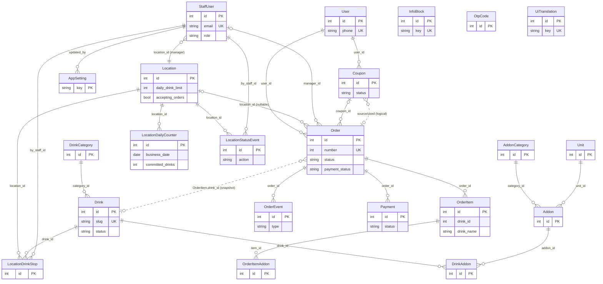

# Часть III. МОДЕЛЬ ДАННЫХ

> **Канон.** Все поля, типы и значения по умолчанию в этой части взяты **поле-в-поле** из кода:
> `backend/app/models/catalog.py`, `locations.py`, `orders.py`, `users.py`. Где правило выходит за рамки
> схемы (расчёт итога, инкремент счётчика, блокировки) — ссылка на сквозные процессы (см. Часть VII).
> Идентификаторы (имена таблиц, полей, enum) — латиницей, как в коде.

---

## Для заказчика

> **Что система помнит и зачем.** Чтобы сервис работал, GRABZI хранит несколько групп сведений —
> и ничего лишнего:
>
> - **Каталог** — что вы продаёте: категории, напитки, цены, картинки, описания. Сюда же заложен (но
>   в текущем потоке «спит») конструктор добавок — на будущее, когда захотите кастомизацию напитков.
> - **Точки выдачи** — где работает drive-through: адрес, часы по дням недели, дневной лимит порций
>   («сегодня делаем не больше N»), временная пауза приёма заказов и список «сегодня здесь закончилось».
> - **Заказы и деньги** — каждый заказ: кто, какая машина, что заказал, сколько заплатил, на какой он
>   стадии (принят → готовим → готов → выдан), оценка клиента и купон-компенсация, история платежей.
> - **Люди** — клиенты (узнаются по номеру телефона, пароль не нужен) и персонал (бариста-менеджер
>   точки и супер-админ сети).
>
> Два важных принципа, заметных бизнесу:
>
> 1. **Тексты для клиента многоязычны.** Названия и описания хранятся сразу на нескольких языках в одном
>    месте — добавить язык можно без переделки системы (см. «i18n-поля» ниже). Сейчас интерфейс
>    англоязычный, арабский/RTL заложен на будущее.
> 2. **Ничего не теряется бесследно.** Каждое значимое действие с заказом и с точкой записывается в
>    журнал (кто, что, когда): оплата, смена стадии, пауза точки, «закончилось здесь». Это даёт прозрачную
>    историю для разбора спорных ситуаций и аналитики (см. «Аудит» ниже).
>
> Всего система оперирует **22 видами записей** (сущностей). Полный технический перечень — ниже.

---

## III.0. Обзор сущностей (факт: 22 ORM-класса)

**Зафиксированный факт.** В `backend/app/models/**` ровно **22** ORM-класса, сгруппированных по 4 файлам:

| Файл | Кол-во | Сущности (классы) |
|---|---:|---|
| `catalog.py` | **6** | `DrinkCategory`, `Unit`, `AddonCategory`, `Addon`, `Drink`, `DrinkAddon` |
| `locations.py` | **6** | `Location`, `LocationDailyCounter`, `LocationDrinkStop`, `LocationStatusEvent`, `AppSetting`, `InfoBlock` |
| `orders.py` | **6** | `Order`, `OrderItem`, `OrderItemAddon`, `OrderEvent`, `Payment`, `Coupon` |
| `users.py` | **4** | `User`, `StaffUser`, `OtpCode`, `UiTranslation` |
| **Итого** | **22** | — |

> Базовый класс всех сущностей — `Base` (`app/core/db.py`). Технология ORM — SQLAlchemy 2.x
> (`Mapped[...]` / `mapped_column`). СУБД — PostgreSQL (прод) / SQLite (dev), тип `JSON` маппится на
> `JSONB`/`JSON` соответственно. Архитектура и стек — см. Часть I.

Группировка по доменам:

- **Каталог** (`catalog.py`) — что продаётся и как конфигурируется напиток.
- **Точки и операционка** (`locations.py`) — где продаётся, лимиты, паузы, стоп-лист, настройки, CMS.
- **Заказы и платежи** (`orders.py`) — транзакции клиента, позиции, события, деньги, купоны.
- **Люди и i18n** (`users.py`) — клиенты, персонал, OTP-коды, словарь UI-строк.

---

## III.1. Сущности каталога — `catalog.py`

> **Замечание о статусе.** Конструктор добавок (`Unit`, `AddonCategory`, `Addon`, `DrinkAddon`) в коде
> полностью описан схемой, но в текущем публичном потоке GRABZI **не используется** («спит» 🧩 — см.
> Часть IX). Таблицы сохранены под будущую кастомизацию напитков (ADM-S-02/03/04). Поля приведены как в
> коде, без додумывания.

### `DrinkCategory` — категория напитков (переключатель каталога)
Таблица `drink_categories`.

| Поле | Тип (код) | Default | Назначение |
|---|---|---|---|
| `id` | `int` PK | — | идентификатор |
| `name` | `JSON` (i18n) | — | название категории `{ru,ar,en}` |
| `photo_url` | `str(300)` \| null | — | картинка категории |
| `video_url` | `str(300)` \| null | — | видео категории |
| `is_active` | `bool` | `True` | активна в каталоге |
| `sort` | `int` | `0` | порядок сортировки |

Связь: `drinks` (1→N `Drink`).

### `Unit` — справочник единиц измерения 🧩
Таблица `units`.

| Поле | Тип (код) | Default | Назначение |
|---|---|---|---|
| `id` | `int` PK | — | идентификатор |
| `code` | `str(20)` unique | — | код единицы: `g`, `ml`, `pcs`, `l` |
| `name` | `JSON` (i18n) | — | человекочитаемое имя единицы |

### `AddonCategory` — категория добавок 🧩
Таблица `addon_categories`.

| Поле | Тип (код) | Default | Назначение |
|---|---|---|---|
| `id` | `int` PK | — | идентификатор |
| `name` | `JSON` (i18n) | — | название категории добавок |
| `icon_url` | `str(300)` \| null | — | иконка категории |
| `is_active` | `bool` | `True` | активна |
| `selection_type` | `str(10)` | `"counter"` | тип выбора по умолчанию: `single` \| `multi` \| `counter` |

Связь: `addons` (1→N `Addon`).

### `Addon` — ингредиент/добавка 🧩
Таблица `addons`. КБЖУ хранятся на 100 единиц, цена — за порцию.

| Поле | Тип (код) | Default | Назначение |
|---|---|---|---|
| `id` | `int` PK | — | идентификатор |
| `name` | `JSON` (i18n) | — | название добавки |
| `image_url` | `str(300)` \| null | — | изображение |
| `category_id` | `int` FK→`addon_categories.id` | — | категория |
| `unit_id` | `int` FK→`units.id` | — | единица измерения |
| `kcal_per_100` | `float` | `0` | ккал на 100 ед. |
| `protein_per_100` | `float` | `0` | белки на 100 ед. |
| `fat_per_100` | `float` | `0` | жиры на 100 ед. |
| `carbs_per_100` | `float` | `0` | углеводы на 100 ед. |
| `base_price` | `float` | `0` | цена за 1 порцию (дефолт) |
| `is_active` | `bool` | `True` | активна |

Связи: `category` (N→1 `AddonCategory`), `unit` (N→1 `Unit`).

### `Drink` — напиток (ядро каталога)
Таблица `drinks`.

| Поле | Тип (код) | Default | Назначение |
|---|---|---|---|
| `id` | `int` PK | — | идентификатор |
| `slug` | `str(80)` unique, index | — | человекочитаемый ключ (маршрут `/product/[slug]`) |
| `name` | `JSON` (i18n) | — | название напитка `{ru,ar,en}` |
| `description` | `JSON` (i18n) | `dict` | описание |
| `status` | `str(12)` | `"draft"` | `draft` \| `published` \| `hidden` |
| `preview_url` | `str(300)` \| null | — | превью (PNG-стикер) |
| `video_url` | `str(300)` \| null | — | видео |
| `base_price` | `float` | `0` | базовая цена напитка (AED) |
| `kcal` | `float` | `0` | калорийность (в потоке GRABZI `0` — не используется) |
| `protein` | `float` | `0` | белки |
| `fat` | `float` | `0` | жиры |
| `carbs` | `float` | `0` | углеводы |
| `category_id` | `int` FK→`drink_categories.id` | — | категория |

Связи: `category` (N→1 `DrinkCategory`), `addon_links` (1→N `DrinkAddon`, `cascade=all,delete-orphan`).

### `DrinkAddon` — связка напиток × добавка 🧩
Таблица `drink_addons`. Промежуточная таблица конфигуратора: переопределяет цену/тип выбора и задаёт
диапазон порций для конкретного напитка.

| Поле | Тип (код) | Default | Назначение |
|---|---|---|---|
| `id` | `int` PK | — | идентификатор |
| `drink_id` | `int` FK→`drinks.id`, index | — | напиток |
| `addon_id` | `int` FK→`addons.id` | — | добавка |
| `price_override` | `float` \| null | `null` | переопределение цены; `null` = бесплатна (включена в стоимость) |
| `min_portions` | `int` | `0` | минимум порций |
| `default_portions` | `int` | `1` | порций по умолчанию |
| `max_portions` | `int` | `3` | максимум порций |
| `portion_amount` | `float` | `30` | грамм/мл в одной порции |
| `selection_type_override` | `str(10)` \| null | `null` | перекрывает `selection_type` категории |

Связи: `drink` (N→1 `Drink`), `addon` (N→1 `Addon`).

---

## III.2. Сущности точек и операционки — `locations.py`

> **Ключевое архитектурное решение (из docstring модели):** статус точки (`open`/`paused`/`closed`)
> **не хранится** в БД — он **вычисляется при чтении** из `is_active` + `accepting_orders` + расписания
> `working_hours` в часовом поясе точки. Дневной лимит считается **в напитках** (сумма количеств) через
> материализованный счётчик `LocationDailyCounter`. Логика вычисления — `services/location_service.py`,
> бизнес-правила — см. Часть VII («статус точки», «дневной лимит»).

### `Location` — точка выдачи (drive-through)
Таблица `locations`. Контентные поля локализуемы (JSON i18n; в сиде заполняется `en`).

| Поле | Тип (код) | Default | Назначение |
|---|---|---|---|
| `id` | `int` PK | — | идентификатор |
| `name` | `JSON` (i18n) | `dict` | название точки |
| `description` | `JSON` (i18n) | `dict` | описание |
| `address` | `str(300)` \| null | — | адрес |
| `coordinates` | `JSON` \| null | `null` | `{"lat":..,"lng":..}` |
| `working_hours` | `JSON` | `dict` | часы по дням недели `{"mon":[{"open":"05:30","close":"22:00"}], …, "sun":[]}` |
| `timezone` | `str(40)` | `"Asia/Dubai"` | TZ точки (бизнес-день считается здесь) |
| `daily_drink_limit` | `int` \| null | `null` | дневной лимит напитков; `null` = без лимита |
| `accepting_orders` | `bool` (not null) | `True` | ручная операционная пауза приёма заказов |
| `color` | `str(20)` \| null | — | фирменный цвет точки (сид: `#c44429`) |
| `image_url` | `str(300)` \| null | — | относительный ключ MinIO |
| `is_active` | `bool` | `True` | точка активна |
| `sort` | `int` | `0` | порядок |
| `created_at` | `datetime` | `func.now()` | дата создания |

Связи: `counters` (1→N `LocationDailyCounter`), `stops` (1→N `LocationDrinkStop`),
`status_events` (1→N `LocationStatusEvent`); все три — `cascade=all,delete-orphan`.

> **Расхождение код↔факт (зафиксировано).** Конфиг бэкенда (`core/config.py`) объявляет
> `locales = ["ru","ar"]`, а слой i18n GRABZI и FACTS-канон оперируют тройкой `{ru,ar,en}`/EN-first
> (см. III.5). На уровне схемы это не препятствие (JSON хранит любые ключи), но реестр поддерживаемых
> локалей в коде ≠ заявленному. Внести в открытые вопросы (см. Часть IX).

### `LocationDailyCounter` — материализованный счётчик проданных напитков за бизнес-день
Таблица `location_daily_counters`. Уникальность `(location_id, business_date)` (`uq_location_day`) —
одна строка на точку-день. Инкремент O(1) под `FOR UPDATE` в момент оплаты; декремент при возврате того
же дня (не ниже 0) — см. Часть VII.

| Поле | Тип (код) | Default | Назначение |
|---|---|---|---|
| `id` | `int` PK | — | идентификатор |
| `location_id` | `int` FK→`locations.id` (`ondelete=CASCADE`), index | — | точка |
| `business_date` | `date`, index | — | торговый день в TZ точки |
| `committed_drinks` | `int` (not null) | `0` | сумма проданных напитков за день |
| `updated_at` | `datetime` | `func.now()` / `onupdate` | время обновления |

Связь: `location` (N→1 `Location`).

### `LocationDrinkStop` — стоп напитка на точке («кончилось здесь»)
Таблица `location_drink_stops`. Existence-based: стоп = наличие строки, снятие = удаление строки.
Уникальность `(location_id, drink_id)` (`uq_location_drink`). Отдельная ось от глобального
`Drink.status=hidden`.

| Поле | Тип (код) | Default | Назначение |
|---|---|---|---|
| `id` | `int` PK | — | идентификатор |
| `location_id` | `int` FK→`locations.id` (`ondelete=CASCADE`), index | — | точка |
| `drink_id` | `int` FK→`drinks.id` (`ondelete=CASCADE`), index | — | напиток |
| `reason` | `str(200)` \| null | `null` | причина стопа |
| `by_staff_id` | `int` FK→`staff_users.id` \| null | `null` | кто поставил стоп |
| `created_at` | `datetime` | `func.now()` | когда |

Связь: `location` (N→1 `Location`).

### `AppSetting` — глобальные бизнес-дефолты (key-value)
Таблица `app_settings`. Типизированный key-value: `value` — JSON-конверт `{"v": <typed>}`. Реестр
допустимых ключей/типов — `services/settings_registry.py`. Редактирует супер-админ (`/admin/settings`).

| Поле | Тип (код) | Default | Назначение |
|---|---|---|---|
| `key` | `str(64)` **PK** | — | ключ настройки |
| `value` | `JSON` | `dict` | значение-конверт `{"v":…}` |
| `updated_at` | `datetime` | `func.now()` / `onupdate` | обновлено |
| `updated_by` | `int` FK→`staff_users.id` \| null | `null` | кем |

### `InfoBlock` — CMS-контент публичного сайта
Таблица `info_blocks`. Story / Contact / часы / соцсети. Контент локализуем (JSON i18n).
Источник экрана `/info` (I1).

| Поле | Тип (код) | Default | Назначение |
|---|---|---|---|
| `id` | `int` PK | — | идентификатор |
| `key` | `str(64)` unique, index | — | ключ блока |
| `title` | `JSON` (i18n) | `dict` | заголовок |
| `body` | `JSON` (i18n) | `dict` | тело (richtext) |
| `sort` | `int` | `0` | порядок |
| `is_active` | `bool` | `True` | активен |
| `updated_at` | `datetime` | `func.now()` / `onupdate` | обновлено |

---

## III.3. Сущности заказов и платежей — `orders.py`

> **Цепочка статусов (из модели, `ORDER_STATUSES`):** `new → in_progress → ready → completed`
> (+ терминальный `refund`). Кто ставит статус (`STATUS_SETTER`): `new` — `system`, остальные —
> `staff`. **`arrived_at` — независимый флаг** «клиент на месте», ставится клиентом в любой момент
> после оплаты и **не входит** в цепочку статусов. Расчёт денег (факт из `order_flow.py`):
> `order.total = round(subtotal − coupon_discount, 2)`. **VAT 5 % в коде не реализован** (нет налоговой
> строки; `total` = финальная сумма) — в ТЗ VAT описывается как требование/решение (см. Часть I, IX).

### `Order` — заказ
Таблица `orders`.

| Поле | Тип (код) | Default | Назначение |
|---|---|---|---|
| `id` | `int` PK | — | идентификатор |
| `number` | `int` unique, index | — | публичный номер заказа |
| `user_id` | `int` FK→`users.id`, index | — | клиент |
| `location_id` | `int` FK→`locations.id` \| null, index | `null` | точка заказа (null для исторических Juicy) |
| `status` | `str(15)`, index | `"new"` | `new`\|`in_progress`\|`ready`\|`completed`\|`refund` |
| `payment_status` | `str(15)` | `"pending"` | `pending`\|`paid`\|`failed`\|`refunded` |
| `customer_name` | `str(80)` \| null | — | имя клиента |
| `phone` | `str(20)` | — | телефон (`+971…`) |
| `car_plate` | `str(20)` | — | номер машины (выдача; PII) |
| `emirate` | `str(40)` \| null | — | эмират |
| `subtotal` | `float` | `0` | сумма позиций |
| `coupon_discount` | `float` | `0` | скидка по купону |
| `total` | `float` | `0` | к оплате (`subtotal − coupon_discount`) |
| `manager_id` | `int` FK→`staff_users.id` \| null | `null` | менеджер, взявший заказ |
| `coupon_id` | `int` FK→`coupons.id` \| null | `null` | применённый купон |
| `rating` | `str(8)` \| null | `null` | `like` \| `dislike` |
| `rated_at` | `datetime` \| null | `null` | время оценки |
| `arrived_at` | `datetime` \| null | `null` | **независимый флаг** «клиент приехал» |
| `created_at` | `datetime` | `func.now()` | создан |

Связи: `items` (1→N `OrderItem`, cascade), `events` (1→N `OrderEvent`, cascade), `payments` (1→N `Payment`).

### `OrderItem` — позиция заказа (снэпшот на момент покупки)
Таблица `order_items`.

| Поле | Тип (код) | Default | Назначение |
|---|---|---|---|
| `id` | `int` PK | — | идентификатор |
| `order_id` | `int` FK→`orders.id`, index | — | заказ |
| `drink_id` | `int` | — | id напитка (не FK — снэпшот) |
| `drink_name` | `str(160)` | — | снэпшот названия в локали заказа |
| `custom_name` | `str(60)` \| null | — | пользовательское имя позиции |
| `unit_price` | `float` | — | цена напитка со всеми добавками |
| `quantity` | `int` | `1` | количество |
| `paid_by_coupon` | `bool` | `False` | позиция оплачена купоном (PUB-A-05) |

Связи: `order` (N→1 `Order`), `addons` (1→N `OrderItemAddon`, cascade).

### `OrderItemAddon` — добавка в позиции (снэпшот) 🧩
Таблица `order_item_addons`.

| Поле | Тип (код) | Default | Назначение |
|---|---|---|---|
| `id` | `int` PK | — | идентификатор |
| `item_id` | `int` FK→`order_items.id`, index | — | позиция |
| `addon_id` | `int` | — | id добавки (снэпшот) |
| `addon_name` | `str(160)` | — | снэпшот названия добавки |
| `portions` | `int` | `1` | число порций |
| `amount` | `float` | `0` | граммовка: `portions * portion_amount` |
| `unit_code` | `str(20)` | `"g"` | единица |
| `price_per_portion` | `float` | `0` | цена за порцию (снэпшот) |

### `OrderEvent` — журнал событий заказа (аудит)
Таблица `order_events`. См. III.6 «Аудит».

| Поле | Тип (код) | Default | Назначение |
|---|---|---|---|
| `id` | `int` PK | — | идентификатор |
| `order_id` | `int` FK→`orders.id`, index | — | заказ |
| `type` | `str(20)` | — | `created`\|`paid`\|`status_change`\|`coupon_applied`\|`rated`\|`refund` |
| `status` | `str(15)` \| null | `null` | статус (для `status_change`) |
| `by_user_id` | `int` \| null | `null` | кто из клиентов |
| `by_staff_id` | `int` \| null | `null` | кто из персонала |
| `note` | `str(300)` \| null | `null` | примечание |
| `created_at` | `datetime` | `func.now()` | когда |

Связь: `order` (N→1 `Order`).

### `Payment` — платёж
Таблица `payments`. Связь заказ↔платёж↔клиент. Stripe (реальный) либо mock (без ключа) — см. Часть VII.

| Поле | Тип (код) | Default | Назначение |
|---|---|---|---|
| `id` | `int` PK | — | идентификатор |
| `order_id` | `int` FK→`orders.id`, index | — | заказ |
| `amount` | `float` | — | сумма |
| `currency` | `str(5)` | `"AED"` | валюта |
| `provider` | `str(20)` | `"stripe"` | провайдер |
| `provider_id` | `str(120)` \| null | — | id транзакции у провайдера |
| `status` | `str(15)` | `"pending"` | `pending`\|`succeeded`\|`failed`\|`refunded` |
| `created_at` | `datetime` | `func.now()` | когда |

Связь: `order` (N→1 `Order`).

### `Coupon` — купон-компенсация за дизлайк
Таблица `coupons`. Один купон на заказ; списывает **1** напиток в следующем заказе.
Номинал/срок в коде жёстко не зафиксированы (открытый вопрос — см. Часть IX).

| Поле | Тип (код) | Default | Назначение |
|---|---|---|---|
| `id` | `int` PK | — | идентификатор |
| `user_id` | `int` FK→`users.id`, index | — | владелец |
| `source_order_id` | `int` | — | заказ с дизлайком |
| `status` | `str(10)` | `"active"` | `active`\|`used`\|`void` |
| `issued_at` | `datetime` | `func.now()` | выпущен |
| `used_at` | `datetime` \| null | `null` | использован |
| `used_order_id` | `int` \| null | `null` | заказ применения |
| `used_item_id` | `int` \| null | `null` | позиция применения |
| `discount_amount` | `float` \| null | `null` | сумма скидки |

> ⚠️ `source_order_id`, `used_order_id`, `used_item_id` в коде объявлены как `Integer` **без** FK-связи
> (логические ссылки, не enforced на уровне БД). Зафиксировано как есть.

---

## III.4. Сущности людей и i18n — `users.py`

### `User` — клиент публичного сайта
Таблица `users`. Узнаётся по телефону (пароль не нужен; вход по OTP — см. Часть VII).

| Поле | Тип (код) | Default | Назначение |
|---|---|---|---|
| `id` | `int` PK | — | идентификатор |
| `phone` | `str(20)` unique, index | — | телефон (`+971…`) — естественный ключ клиента |
| `name` | `str(80)` \| null | — | имя |
| `car_plate` | `str(20)` \| null | — | номер машины (PII) |
| `emirate` | `str(40)` \| null | — | эмират |
| `preferred_locale` | `str(5)` | `"ru"` | предпочтительный язык (фиксируется при регистрации, PUB-A-09) |
| `created_at` | `datetime` | `func.now()` | создан |

### `StaffUser` — персонал админки
Таблица `staff_users`. Роли: `super_admin` (вся сеть, `location_id=null`) и `manager` (привязан к точке).
Мягкое удаление через `disabled=true` (история `by_staff_id` сохраняется).

| Поле | Тип (код) | Default | Назначение |
|---|---|---|---|
| `id` | `int` PK | — | идентификатор |
| `email` | `str(120)` unique, index | — | логин |
| `password_hash` | `str(200)` | — | хэш пароля (pbkdf2_sha256, см. Часть I) |
| `name` | `str(80)` | — | имя сотрудника |
| `role` | `str(20)` | `"manager"` | `super_admin` \| `manager` |
| `location_id` | `int` FK→`locations.id` \| null | `null` | точка (обязательна для `manager`, `null` для `super_admin`) |
| `disabled` | `bool` | `False` | мягкое удаление |
| `created_at` | `datetime` | `func.now()` | создан |

### `OtpCode` — OTP-коды (fallback-хранилище без Redis)
Таблица `otp_codes`.

| Поле | Тип (код) | Default | Назначение |
|---|---|---|---|
| `id` | `int` PK | — | идентификатор |
| `phone` | `str(20)`, index | — | телефон |
| `code` | `str(6)` | — | код |
| `expires_at` | `datetime` | — | истекает |
| `used` | `bool` | `False` | использован |

### `UiTranslation` — словарь системных строк UI
Таблица `ui_translations`. Здесь — переводы **интерфейсных** строк (статусы, кнопки, сообщения).
Контентные переводы (названия напитков и т.п.) живут в JSON-полях самих сущностей.

| Поле | Тип (код) | Default | Назначение |
|---|---|---|---|
| `id` | `int` PK | — | идентификатор |
| `key` | `str(120)` unique, index | — | ключ строки |
| `values` | `JSON` (i18n) | `dict` | переводы `{ru,ar,…}` |

> **Примечание о ролях.** Код использует **две** роли персонала: `manager`, `super_admin`. Роль
> `customer` из FACTS-канона — это **клиент** (`User`), а не значение `StaffUser.role`. Коды историй ТЗ:
> PUB-G / PUB-A (клиент), ADM-M (= `manager`), ADM-S (= `super_admin`).

---

## III.5. Перечисления (enum)

> В коде перечисления реализованы **строковыми полями** (`String(N)`), а не SQL-`ENUM` — допустимые
> значения зафиксированы в комментариях модели и в логике сервисов/роутеров. Таблица сводит **все**
> такие наборы значений из четырёх файлов моделей.

| Enum (поле) | Сущность.поле | Тип | Допустимые значения | Default | Канон |
|---|---|---|---|---|---|
| Статус напитка | `Drink.status` | `str(12)` | `draft` \| `published` \| `hidden` | `draft` | `catalog.py` |
| Тип выбора добавок | `AddonCategory.selection_type` | `str(10)` | `single` \| `multi` \| `counter` | `counter` | `catalog.py` |
| Переопределение типа выбора | `DrinkAddon.selection_type_override` | `str(10)` \| null | `single` \| `multi` \| `counter` | `null` | `catalog.py` |
| Статус заказа | `Order.status` | `str(15)` | `new` \| `in_progress` \| `ready` \| `completed` \| `refund` | `new` | `orders.py` (`ORDER_STATUSES`) |
| Статус оплаты заказа | `Order.payment_status` | `str(15)` | `pending` \| `paid` \| `failed` \| `refunded` | `pending` | `orders.py` |
| Оценка | `Order.rating` | `str(8)` \| null | `like` \| `dislike` | `null` | `orders.py` |
| Тип события заказа | `OrderEvent.type` | `str(20)` | `created` \| `paid` \| `status_change` \| `coupon_applied` \| `rated` \| `refund` | — | `orders.py` |
| Статус платежа | `Payment.status` | `str(15)` | `pending` \| `succeeded` \| `failed` \| `refunded` | `pending` | `orders.py` |
| Статус купона | `Coupon.status` | `str(10)` | `active` \| `used` \| `void` | `active` | `orders.py` |
| Провайдер платежа | `Payment.provider` | `str(20)` | `stripe` (по факту; mock тоже пишется как stripe) | `stripe` | `orders.py` |
| Тип события точки | `LocationStatusEvent.action` | `str(20)` | `pause` \| `open` \| `drink_stopped` \| `drink_resumed` | — | `locations.py` |
| Роль персонала | `StaffUser.role` | `str(20)` | `super_admin` \| `manager` | `manager` | `users.py` |
| Код единицы | `Unit.code` | `str(20)` unique | `g` \| `ml` \| `pcs` \| `l` (примеры) | — | `catalog.py` 🧩 |

**Вычисляемый «enum» (НЕ хранится в БД):** статус точки `effective_status` ∈
`open` / `paused` / `closed` / `inactive` — выводится в `services/location_service.py` из
`is_active` + `accepting_orders` + `working_hours`/TZ. См. Часть VII («статус точки»).

> ⚠️ **Несостыковки наборов статусов между слоями (для финальной сверки, см. Часть IX):**
> - `Payment.status` использует `succeeded`, а `Order.payment_status` — `paid`. Это **разные** оси
>   (платёж vs. заказ); не путать при маппинге.
> - `Order.payment_status` допускает `failed`/`refunded`, но default-цикл — `pending → paid`.

---

## III.6. ER-обзор (ключевые связи)

> Диаграмма отражает **связи, объявленные через `relationship`/`ForeignKey` в коде**. Логические ссылки
> без FK (`OrderItem.drink_id`, `OrderEvent.by_*`, `Coupon.source_order_id`/`used_*`,
> `LocationStatusEvent.drink_id`) показаны пунктиром как «слабые» (snapshot/audit) и не enforce'ятся БД.

**Узлы без FK-связей с другими сущностями** (стоят особняком в схеме): `InfoBlock`, `OtpCode`,
`UiTranslation`, `AppSetting` (имеет лишь nullable `updated_by`→`StaffUser`). Это справочно-контентные
таблицы.

---

## III.7. i18n-поля (JSON `{ru, ar, en}`)

> **Архитектурное решение (docstring `catalog.py`):** контентные многоязычные поля хранятся как
> JSON-словарь `{"ru":…, "ar":…, "en":…}` прямо в строке сущности. Добавление языка **не требует
> миграции схемы** (требование ADM-S-11). Извлечение перевода — `services/i18n.py::t(value, locale)` с
> fallback на `default_locale`; выбор локали — `pick_locale(locale)`.

**Полный перечень JSON-i18n полей по сущностям:**

| Сущность | i18n-поля (JSON) |
|---|---|
| `DrinkCategory` | `name` |
| `Unit` | `name` 🧩 |
| `AddonCategory` | `name` 🧩 |
| `Addon` | `name` 🧩 |
| `Drink` | `name`, `description` |
| `Location` | `name`, `description` |
| `InfoBlock` | `title`, `body` |
| `UiTranslation` | `values` (словарь системных UI-строк) |

**Как работает fallback (`i18n.py::t`):** взять значение по запрошенной локали, если её нет в
`settings.locales` — взять `default_locale`; если в JSON нет ключа — отдать значение
`default_locale`, иначе — первое доступное значение, иначе пустую строку.

> ⚠️ **Расхождение код↔факт (зафиксировано для финальной сверки):**
> 1. **Реестр локалей.** Код (`core/config.py`): `default_locale="ru"`, `locales=["ru","ar"]` —
>    **`en` отсутствует** в реестре поддерживаемых локалей, хотя FACTS-канон и слой UI заявляют
>    `{ru,ar,en}` и EN-first. Сами JSON-поля и сиды используют ключ `en`, но `t()`/`pick_locale()`
>    воспринимают только `ru`/`ar`. Это означает: при запросе локали `en` функция нормализует её к
>    `default_locale="ru"`, а не к `en`. **Несостыковка** — внести в Часть IX (открытые вопросы).
> 2. **`User.preferred_locale` default = `"ru"`** — расходится с EN-first позиционированием продукта.
> 3. Снэпшоты в заказе (`OrderItem.drink_name`) — **не** i18n: это строка, зафиксированная в локали на
>    момент покупки (поле `String(160)`, не JSON), чтобы заказ не «переписывался» при смене языка/каталога.

**Разделение переводов:**
- **Контентные** (названия/описания напитков, точек, категорий, CMS) → JSON-поля сущностей.
- **Системные** (статусы, кнопки, сообщения UI) → `UiTranslation.values` (key→`{ru,ar,…}`).

---

## III.8. Аудит (журналы событий)

> **Принцип (для заказчика):** значимые операции с заказом и с точкой не теряются — каждая пишет строку
> в журнал «кто-что-когда». Это даёт историю для разбора спорных случаев, отчётности и восстановления
> хронологии. Два журнала: по заказам и по точкам.

### `OrderEvent` — журнал заказа
Аудит жизненного цикла одного заказа. На каждое значимое действие добавляется неизменяемая строка
(см. III.3 — поля). Покрываемые типы (`type`): `created`, `paid`, `status_change` (+ поле `status`),
`coupon_applied`, `rated`, `refund`. Авторство события: `by_user_id` (клиент) **или** `by_staff_id`
(персонал) — взаимоисключающе по контексту; `note` — свободный комментарий. Связь — `Order.events`
(`cascade=all,delete-orphan`, `order_by=OrderEvent.id`).

Трассировка событий ↔ процессов (см. Часть VII): `created`/`paid` — оплата; `status_change` — жизненный
цикл заказа + WS; `coupon_applied` — купоны; `rated` — рейтинг/купон; `refund` — возврат (декремент
дневного счётчика).

### `LocationStatusEvent` — журнал точки
Аудит операционных рычагов точки (см. III.2 — поля). Типы (`action`): `pause` / `open` (пауза и
возобновление приёма), `drink_stopped` / `drink_resumed` (стоп-лист напитка; для них заполняется
`drink_id`). Авторство — `by_staff_id`; `reason` — причина. Связь — `Location.status_events`
(`cascade=all,delete-orphan`, `order_by=LocationStatusEvent.id`).

Трассировка: процессы «стоп-лист» и «статус точки» (Часть VII); рычаги доступны ADM-M (свою точку) и
ADM-S (любую) — см. Части V, VI.

> **Косвенный аудит счётчика.** `LocationDailyCounter` (`updated_at`, `onupdate=func.now()`) фиксирует
> момент последнего изменения проданных напитков, дополняя журнал точки операционными цифрами дня.

> ⚠️ Контрактный дефект (известный, см. FACTS): экран кухни ожидает `name: string`, а бэкенд
> `/api/admin/location-status` отдаёт `name` как i18n-объект `{"en":…}` → ложное «Session expired».
> Это дефект **API-контракта**, не модели данных; зафиксирован в Часть IX. Здесь упомянут лишь как
> связанный с i18n-полем `Location.name`.

---

## III.9. Трассировка и перекрёстные ссылки

- **Деньги/налог:** `Order.subtotal/coupon_discount/total`; VAT 5 % — не в коде, описан как требование
  (см. Часть I «деньги», Часть IX «BR/открытые вопросы»).
- **Дневной лимит:** `Location.daily_drink_limit` + `LocationDailyCounter.committed_drinks` под
  `FOR UPDATE` — см. Часть VII («дневной лимит»).
- **Статус точки:** вычисляемый из `Location` — см. Часть VII («статус точки»).
- **Стоп-лист:** `LocationDrinkStop` — см. Часть VII («стоп-лист»).
- **Купоны/рейтинг:** `Coupon` + `Order.rating` — см. Часть VII («купоны/рейтинг»).
- **Платежи:** `Payment` + `Order.payment_status` — см. Часть VII («платёж»).
- **i18n:** JSON-поля + `UiTranslation` — см. Часть VII («i18n»).
- **API над сущностями** — см. Часть VIII; **коды ошибок** (`core/errors.py`) — см. Приложение C.
