# Часть VII. СКВОЗНЫЕ ПРОЦЕССЫ  🟦/🟨/🟩

> **Назначение части.** Здесь собраны процессы, которые «прошивают» сразу несколько проекций
> продукта (покупатель · бариста/менеджер ADM-M · супер-админ ADM-S · сервер) и потому не принадлежат
> ни одной отдельной user story. Каждая история в Частях IV–VI ссылается сюда фразой «см. Часть VII»,
> чтобы один факт жил в одном месте.
>
> **Формат каждого процесса — три блока (по методике, см. промпт §8.12):**
> 1. **Как это работает (простыми словами)** — поведение без кода: что видит покупатель, что делает
>    бариста, что происходит с деньгами / остатком / статусом, что в граничном случае.
> 2. **Бизнес-схема «по дорожкам»** — Mermaid `flowchart` с дорожками **Покупатель / Бариста / Система**,
>    шаги подписаны обычным языком (без статусов и эндпоинтов).
> 3. **Sequence-диаграмма (для разработки)** — Mermaid `sequenceDiagram`, технически точно: эндпоинты,
>    транзакции, блокировки, каналы, коды ошибок.
>
> **Канон достоверности — код прототипа** (`backend/app/services/order_flow.py`,
> `location_service.py`, `routers/payments.py`, `ws.py`, `auth.py`, `content.py`,
> `services/i18n.py`, `services/storage.py`, `core/pubsub.py`, `core/security.py`, `core/config.py`).
> Коды ошибок — `core/errors.py` (см. Приложение C). Сущности — см. Часть III. Деньги — AED (см. Часть I).

## Перечень процессов

| № | Процесс | Канон-источник | Статус |
|---|---|---|---|
| VII.1 | Платёж: Stripe Checkout + mock-режим + webhook | `routers/payments.py`, `order_flow.mark_paid` | ✅ / 🔧 mock без ключа |
| VII.2 | Жизненный цикл заказа `new→in_progress→ready→completed` (+`refund`) и realtime по WebSocket | `order_flow.transition/notify`, `ws.py`, `core/pubsub.py` | ✅ |
| VII.3 | Вход покупателя по телефону + OTP (сейчас заглушка) | `routers/auth.py`, `core/security.py`, `core/config.py` | ✅ / 🔧 OTP-заглушка |
| VII.4 | Дневной лимит и счётчик: резерв под блокировкой при оплате, освобождение при возврате/в полночь | `order_flow.mark_paid/refund_order`, `location_service.py` | ✅ **ядро модели** |
| VII.5 | Стоп-лист напитков точки | `location_service.stopped_drink_ids`, `order_flow.assert_location_orderable` | ✅ |
| VII.6 | Купоны и рейтинг (👎 → купон) | `routers/orders.py` (`rate`), `order_flow` (применение), `coupons.py` | ✅ |
| VII.7 | Статус точки (вычисляемый `open/paused/closed/inactive`) | `location_service.effective_status/is_open/next_open_at` | ✅ |
| VII.8 | Медиа: загрузка и отдача через S3/MinIO | `services/storage.py`, `routers/admin_media.py` | ✅ / 🔧 без bucket выключено |
| VII.9 | CMS-контент (InfoBlock) | `routers/content.py` | ✅ |
| VII.10 | Локализация контента (`pick_locale`, fallback) | `services/i18n.py`, `core/config.py` | ✅ / ⚠️ EN-first vs дефолт `ru` |

---

## VII.1. Платёж: Stripe Checkout + mock-режим + webhook

### Как это работает (простыми словами)

Когда покупатель на экране заказа (O1) нажимает «Proceed to Payment», система готовит оплату и
показывает форму ввода карты. Дальше возможны **два режима**, и для покупателя они выглядят почти
одинаково:

- **Боевой режим** (есть платёжный аккаунт): покупателя уводит на защищённую страницу оплаты картой;
  после успешного списания платёжная система присылает серверу отдельное подтверждение, и **только по
  этому подтверждению** заказ считается оплаченным. Возврат с формы на сайт — ещё не гарантия оплаты;
  каноном служит подтверждение от провайдера.
- **Демо-режим** (платёжный аккаунт не подключён): реальные деньги **не списываются**. Система сразу
  отмечает заказ как оплаченный и возвращает покупателя на страницу его заказа. Это нужно, чтобы продукт
  целиком работал на демонстрациях и тестах без настоящего эквайринга.

В обоих случаях в момент перехода заказа в «оплачено» происходит главное бизнес-действие — **списание
порций из дневного лимита точки** под защитой от гонки (см. VII.4). Если за то время, пока покупатель
платил, последние порции на сегодня раскупили, оплата отменяется, заказ помечается как возвращённый, и
человек видит понятное сообщение «лимит на сегодня исчерпан». Один и тот же заказ нельзя оплатить
дважды: повторная попытка отклоняется.

> **Статус (🔧).** Без ключа платёжного провайдера работает демо-режим — для публичного приёма реальных
> денег нужны платёжный аккаунт и налоговый номер (см. Часть I, статус интеграций; Часть IX, открытые
> вопросы). Налог VAT 5 % в расчёте суммы **пока не выделяется** — итог равен `подытог − скидка по купону`
> (⚠️ см. Часть IX; модель «VAT включён в цену» — требование к настройке).

### Бизнес-схема «по дорожкам»

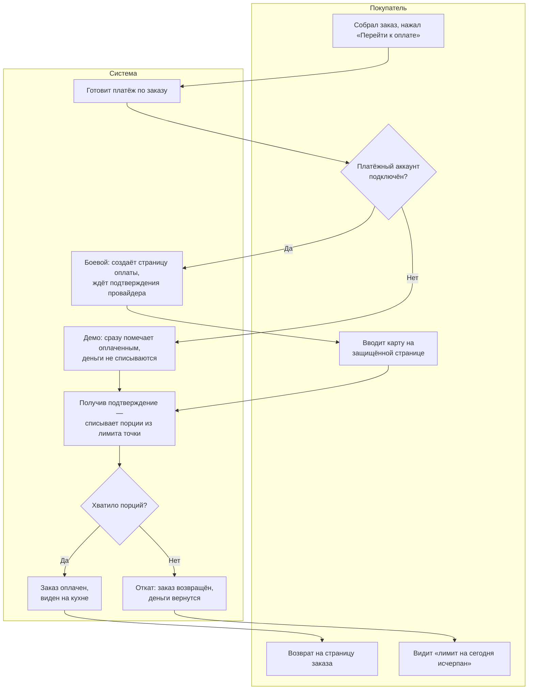

### Sequence-диаграмма (для разработки)

```mermaid
sequenceDiagram
  autonumber
  actor FE as Клиент (grabzi-web)
  participant PAY as POST /api/payments/checkout-session
  participant DB as БД (orders, payments)
  participant MP as order_flow.mark_paid()
  participant CNT as LocationDailyCounter (FOR UPDATE)
  participant ST as Stripe
  participant WH as POST /api/payments/webhook

  FE->>PAY: { orderId } + Bearer customer
  PAY->>DB: get(Order); проверка user_id == owner
  alt order не найден / чужой
    PAY-->>FE: 404 NOT_FOUND
  else order.payment_status == "paid"
    PAY-->>FE: 409 ALREADY_PAID
  end
  PAY->>DB: insert Payment(status="pending", amount=order.total)

  alt settings.stripe_secret_key задан (боевой)
    PAY->>ST: stripe.checkout.Session.create(currency="aed", metadata={order_id,payment_id})
    ST-->>PAY: session{ id, url }
    PAY->>DB: payment.provider_id = session.id
    PAY-->>FE: { checkoutUrl: session.url, mock:false }
    Note over FE,ST: покупатель платит на hosted-форме Stripe
    ST->>WH: event checkout.session.completed (подпись stripe_signature)
    WH->>WH: construct_event(...) — проверка подписи (если есть webhook_secret)
    WH->>DB: get(Order), get(Payment) по metadata
    WH->>MP: mark_paid(order, provider_id)
  else mock-режим (ключа нет / SDK не установлен)
    PAY->>DB: payment.provider_id="mock_{id}", payment.status="succeeded"
    PAY->>MP: mark_paid(order, provider_id)
  end

  MP->>CNT: get_counter_row(loc, business_date, for_update=True)
  alt лимит исчерпан (committed + drinks > daily_drink_limit)
    MP->>DB: order.payment_status="refunded"; OrderEvent("refund")
    MP->>MP: notify(order)
    MP-->>PAY: raise LimitExceededError(remaining)
    PAY->>DB: payment.status="refunded"
    PAY-->>FE: 409 LOCATION_LIMIT_REACHED (+ remaining)
  else порций хватает
    MP->>CNT: committed_drinks += drinks
    MP->>DB: order.payment_status="paid"; купон→used; OrderEvent("paid")
    MP->>MP: notify(order)  %% см. VII.2 — каналы order:{id} / admin:orders / admin:orders:{loc}
    PAY-->>FE: { checkoutUrl: "/orders/{id}?paid=1", mock:true }  %% mock
  end
```

**Связки и инварианты.**

- Канон факта оплаты — подтверждение провайдера (webhook), а **не** редирект `?paid=1` (это лишь UX-цель
  редиректа). Webhook **идемпотентен**: при `order.payment_status == "paid"` повторное событие не
  пересписывает лимит (`order and payment and order.payment_status != "paid"`).
- Сумма к оплате — `order.total` (см. Часть IV, макет чека). VAT в коде не начисляется (⚠️ Часть IX).
- Дальнейшее списание лимита — единый процесс **VII.4**; здесь — только точка входа.
- Метки: ✅ реализовано · 🔧 mock без `STRIPE_SECRET_KEY` · ⚠️ VAT не реализован.

---

## VII.2. Жизненный цикл заказа и realtime по WebSocket

### Как это работает (простыми словами)

Оплаченный заказ проходит понятную цепочку из четырёх состояний: **принят → готовится → готов → выдан**.
Менеджер на кухне ведёт заказ по этой цепочке кнопками: «взять в работу», «готово», «выдан». Отдельно от
этой цепочки живёт флажок **«покупатель приехал»** (см. ST1 «Я приехал»): человек может нажать «I'm here»
на любой стадии — это не двигает заказ по цепочке, а лишь подсвечивает бариста «🚗 HERE», чтобы заказ
вынесли к окну. Возврат — отдельная, опциональная ветка из состояния «выдан».

Самое ценное для покупателя — он **не обновляет страницу**: статус приезжает сам, в реальном времени.
Как только бариста меняет состояние, страница заказа у покупателя и доска заказов на кухне обновляются
мгновенно. Если живое соединение по какой-то причине оборвалось (плохая сеть, спящий экран), система не
«молчит»: страница всё равно периодически перепроверяет статус сама (раз в 20 секунд у покупателя, раз в
10 секунд на кухне), так что человек не застрянет на устаревшей картинке. Чтобы соединение не «засыпало»,
сервер каждые 25 секунд шлёт короткий сигнал-пульс.

Менеджер видит **только свою точку**: его лента заказов отфильтрована по его точке на стороне сервера —
чужие заказы он не получает. Супер-админ видит ленту всех точек.

### Бизнес-схема «по дорожкам»

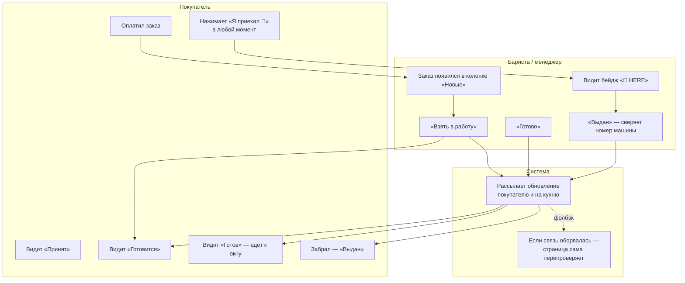

### Sequence-диаграмма (для разработки)

```mermaid
sequenceDiagram
  autonumber
  actor CUST as Клиент (ST1 /orders/[id])
  actor MGR as Бариста (ADM-M /admin/kitchen)
  participant API as REST (orders / admin_orders)
  participant TR as order_flow.transition()
  participant NT as order_flow.notify()
  participant PS as core.pubsub (in-process)
  participant WSC as WS /ws/orders/{id}
  participant WSA as WS /ws/admin/orders

  Note over CUST,WSA: подписки (token в query, не в заголовке)
  CUST->>WSC: connect ?token=customer → канал order:{id}
  MGR->>WSA: connect ?token=staff → канал admin:orders ИЛИ admin:orders:{location_id}

  MGR->>API: POST /api/admin/orders/{id}/take
  API->>TR: transition(new → in_progress, by_staff_id)
  Note right of TR: TRANSITIONS={new:[in_progress], in_progress:[ready], ready:[completed], completed:[refund]}
  TR->>TR: order.manager_id = by_staff_id (закрепление менеджера)
  TR->>API: OrderEvent("status_change", status="in_progress"); commit
  TR->>NT: notify(order)
  NT->>PS: publish order:{id} {orderId,status,paymentStatus,arrived}
  NT->>PS: publish admin:orders {…,number,locationId}
  NT->>PS: publish admin:orders:{location_id} {…}
  PS-->>WSC: msg → CUST (статус «Making»)
  PS-->>WSA: msg → MGR (карточка переезжает в колонку)

  MGR->>API: POST /api/admin/orders/{id}/status {status:"ready"}
  API->>TR: transition(in_progress → ready)
  alt new_status ∉ allowed
    TR-->>API: 409 INVALID_TRANSITION:{from}->{to}
  end
  TR->>NT: notify → PS → WSC/WSA

  CUST->>API: POST /api/orders/{id}/arrived (независимый флаг)
  API->>API: order.arrived_at = utcnow() (идемпотентно); OrderEvent("arrived")
  API->>NT: notify → arrived:true → бейдж «🚗 HERE» у бариста

  MGR->>API: POST /api/admin/orders/{id}/status {status:"completed"}
  API->>TR: transition(ready → completed) → notify

  Note over CUST,WSA: heartbeat — _pump() шлёт {type:"ping"} каждые 25с при тишине
  Note over CUST: fallback — setInterval(refresh,20000) на ST1
  Note over MGR: fallback — setInterval(load,10000) на кухне
```

**Связки и инварианты.**

- Машина состояний — `TRANSITIONS` в `order_flow.py`; недопустимый переход → `409 INVALID_TRANSITION`.
  Полная статусная модель и расшифровка статусов — см. Часть 0 (§0.8) и Часть III.
- `arrived_at` — **независимый флаг**, не ступень цепочки (можно «приехать» на `new/in_progress/ready`;
  на `completed/refund` — `409 ORDER_FINISHED`).
- `notify()` публикует в **три канала**: `order:{id}` (владельцу заказа), `admin:orders` (супер-админ),
  `admin:orders:{location_id}` (менеджер точки). Полный список WS-каналов — см. Часть VIII.
- Аутентификация WS — токен в query (`?token=`), браузер не шлёт `Authorization` на WS. Клиент-канал
  открыт только владельцу заказа или персоналу; админ-канал — только персоналу; менеджер с привязкой к
  точке получает **только** `admin:orders:{location_id}`. Нарушение → close `1008`.
- Брокер `core/pubsub.py` — внутрипроцессный (asyncio); при горизонтальном масштабировании заменяется на
  Redis pub/sub (интерфейс совместим, `settings.redis_url`).
- Метки: ✅ реализовано · ⚠️ см. Часть IX (kitchen `name` i18n-контракт; super_admin на кухне).

---

## VII.3. Вход покупателя по телефону + OTP (сейчас заглушка)

### Как это работает (простыми словами)

Покупатель **не заводит пароль**. Он входит по номеру телефона, и все его заказы привязаны к этому
номеру — поэтому в «Моих заказах» он всегда видит свою историю на любом устройстве, где введёт тот же
номер. Задумано так: человек указывает телефон, получает SMS с одноразовым кодом, вводит код — и входит.
Первый вход заодно создаёт его профиль.

> **Статус (🔧 заглушка).** SMS-провайдер пока **не подключён**, поэтому проверка кода по умолчанию
> **выключена**: система пускает по номеру телефона без кода. В режиме разработки код фиксированный
> (демонстрационный) и возвращается прямо в ответе — для тестов. Это **конфигурация, а не поломка**: для
> публичного запуска нужно выбрать SMS-провайдера и включить проверку кода (см. Часть I, статус
> интеграций; Часть IX, открытый вопрос «SMS-провайдер»). На странице оформления заказа вход происходит
> «тихо» в момент оплаты — покупатель просто вводит телефон в форме и платит.

Телефон проверяется по строгому правилу формата (ведущий `+` и 9–15 цифр). После входа человек получает
«пропуск» (токен) на длительный срок, чтобы не логиниться каждый раз.

### Бизнес-схема «по дорожкам»

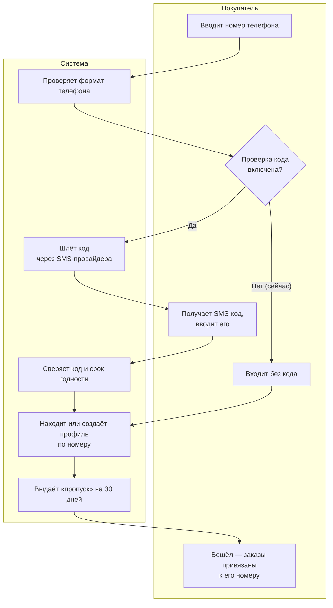

### Sequence-диаграмма (для разработки)

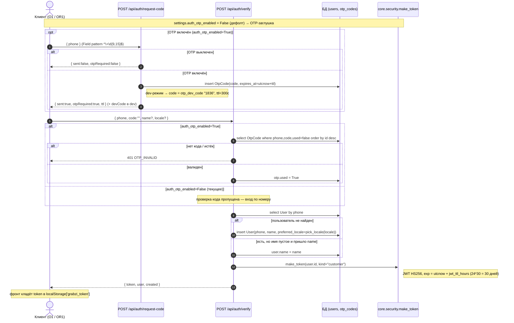

**Связки и инварианты.**

- Канон-валидация телефона на бэкенде — `^\+\d{9,15}$` (`PhoneIn.phone` в `auth.py`). ⚠️ Фронт мягче
  (`^\+?\d{7,15}$`) — расхождение зафиксировать в Часть IX; целевое правило — серверное.
- Дефолты заглушки (`core/config.py`): `auth_otp_enabled = False`, `otp_dev_mode = True`,
  `otp_dev_code = "1836"`, `otp_ttl_seconds = 300`.
- Токен — JWT HS256, TTL `jwt_ttl_hours = 24*30` (30 дней), `kind="customer"`; персонал — `kind="staff"`
  (см. VII.2 для WS-скоупа). Адаптер реального SMS подключается в `services/sms.py` при выборе провайдера.
- Метки: ✅ реализовано · 🔧 OTP-заглушка (вход без кода) · ⚠️ расхождение regex фронт/бэк.

---

## VII.4. Дневной лимит и счётчик — **ядро бизнес-модели**

> **Почему это самый важный процесс.** Вся концепция GRABZI — «**come early, we don't make more**»: точка
> делает строго ограниченное число порций в день. Значит, в один и тот же момент два покупателя могут
> «тянуться» к последней порции. Если посчитать остаток неаккуратно, можно продать одну порцию дважды.
> Этот раздел объясняет, как система гарантированно отдаёт последнюю порцию **ровно одному** покупателю.

### Как это работает (простыми словами)

У каждой точки есть дневной лимит порций (в сиде — 150). «Порция» — это **каждый напиток** в заказе, а
не заказ целиком: заказ из трёх напитков уменьшает остаток на три. Счётчик ведётся **по торговому дню в
часовом поясе точки** и сам обнуляется в полночь по местному времени — отдельной «ночной задачи» не
нужно, новый день — это просто новая дата, для которой счётчик ещё пуст.

Остаток проверяется **дважды, и это ключ к надёжности**:

1. **Мягко — пока покупатель набирает заказ.** Это подсказка: показать «осталось N на сегодня», не дать
   набрать заведомо больше остатка, не дать заказать распроданное. Но между «посмотрел» и «оплатил»
   проходит время, и остаток может измениться — поэтому мягкой проверке доверять для продажи нельзя.
2. **Строго — в момент оплаты, под «замком».** Прямо перед тем как списать порции, система **запирает**
   счётчик этой точки на этот день: пока один платёж считает остаток и списывает порции, второй платёж
   ждёт у запертой двери и заходит только после. Так два покупателя не могут одновременно «купить» одну
   последнюю порцию. Если под замком выясняется, что порций уже не хватает — оплата отменяется, заказ
   возвращается, деньги (в боевом режиме) возвращаются провайдеру, а покупатель видит «лимит на сегодня
   исчерпан».

**Что видит покупатель:** на витрине и в заказе — «TODAY'S LIMIT — осталось N» либо «Sold out for today».
**Что видит бариста:** в шапке кухни — «продано X / лимит Y, осталось Z» и прогресс-бар (зелёный <80 %,
жёлтый 80–99 %, красный ≥100 %). **Супер-админ** может вручную поправить счётчик дня (например, после
ручной продажи у окна) и видит историю.

**Возврат и счётчик.** Если оплаченный заказ возвращают **в тот же торговый день** — порции возвращаются
в остаток (счётчик уменьшается, но не ниже нуля), и они снова доступны другим покупателям. Если возврат
делают **на следующий день** — порции того дня уже «сгорели», прошлый лимит не восстанавливается (это
честно: те порции в тот день были «заняты»).

### Бизнес-схема «по дорожкам» — гонка за последней порцией

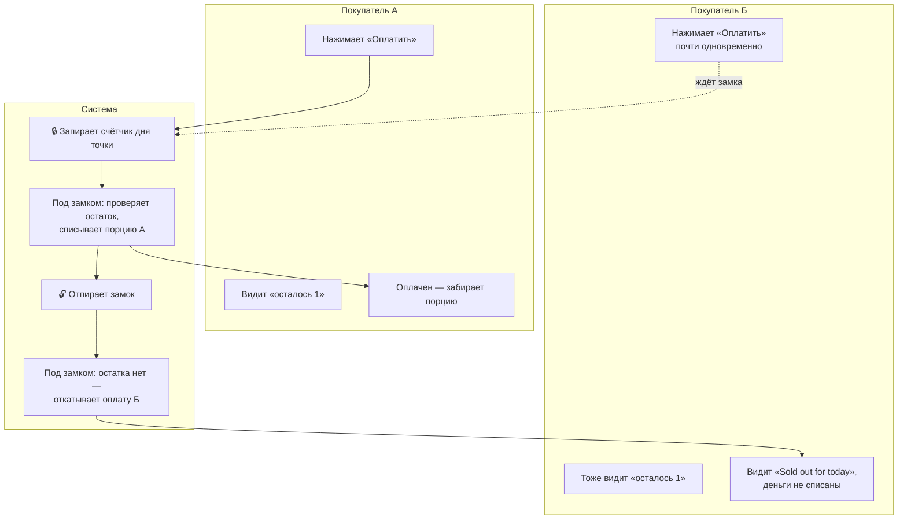

### Sequence-диаграмма (для разработки)

```mermaid
sequenceDiagram
  autonumber
  participant PA as Платёж A (mark_paid)
  participant PB as Платёж Б (mark_paid)
  participant LS as location_service
  participant CNT as LocationDailyCounter
  participant DB as БД (tx + row lock)

  Note over PA,PB: оба заказа созданы при «осталось 1»; обе оплаты стартуют почти одновременно

  PA->>LS: business_date_for(loc)  %% дата в TZ точки
  PA->>CNT: get_counter_row(loc, bdate, for_update=True)
  Note right of CNT: SELECT ... WITH FOR UPDATE — пессимистическая блокировка строки дня
  CNT-->>PA: row { committed_drinks = 149 } (лимит 150)
  Note over PB,CNT: Платёж Б вызывает get_counter_row(... for_update=True) и БЛОКИРУЕТСЯ на строке

  alt committed + drinks(1) <= limit(150)
    PA->>CNT: row.committed_drinks += 1  → 150
    PA->>DB: order.payment_status="paid"; OrderEvent("paid"); commit (снимает lock)
  end
  PA->>PA: notify(order)  %% см. VII.2

  Note over PB,CNT: lock освобождён → Платёж Б продолжает с row.committed_drinks = 150
  PB->>CNT: повторная проверка под локом
  alt committed(150) + drinks(1) > limit(150)
    PB->>DB: order.payment_status="refunded"; OrderEvent("refund","limit_exceeded_refund"); commit
    PB->>PB: notify(order)
    PB-->>PB: raise LimitExceededError(remaining=0)
    Note right of PB: payments.py → 409 LOCATION_LIMIT_REACHED (+ remaining)
  end
```

**Связки и инварианты (канон — код).**

- Сущность счётчика — `LocationDailyCounter(location_id, business_date, committed_drinks)`; считает
  **напитки** (`sum(quantity)`), не заказы (см. Часть III).
- Торговый день — `business_date_for(loc, now)` = дата в TZ точки (`loc.timezone or "Asia/Dubai"`).
  «Сброс в полночь» — без cron: новый день = новая `business_date`, строка которой создаётся с `0` при
  первом обращении (`get_counter_row` создаёт строку с `committed_drinks=0`, если её нет).
- Мягкая проверка (до оплаты) — `assert_location_orderable()` в `order_flow.py`: `LOCATION_SOLD_OUT`
  (rem ≤ 0), `STOCK_LESS_THAN_ORDER` (`drinks_total > rem`, +`remaining`). Это **подсказка**, не гарантия.
- Строгая проверка (при оплате) — `mark_paid()`: `get_counter_row(..., for_update=True)` (блокировка
  строки `WITH FOR UPDATE`), затем `committed_drinks + drinks > daily_drink_limit` → откат:
  `payment_status="refunded"`, `OrderEvent("refund","limit_exceeded_refund")`, `notify`,
  `LimitExceededError(remaining)` → `payments.py` отдаёт `409 LOCATION_LIMIT_REACHED` (+ `remaining`).
- `daily_drink_limit is None` → точка без лимита: `remaining()` = `None`, проверка лимита не срабатывает,
  но `committed_drinks` всё равно инкрементируется (для аналитики).
- Возврат — `refund_order()`: декремент `committed_drinks` (не ниже 0) **только если** `business_date_for`
  по `created_at` (приведённому из UTC к TZ точки) равен текущему торговому дню. Иначе лимит прошлого дня
  не восстанавливается.
- Ручная корректировка — супер-админ: `POST /api/admin/locations/{id}/adjust-day` (`setCommitted` или
  `delta`, оба `max(0, …)`); просмотр — `GET …/{id}/daily` (см. Часть V, ADM-S-10; Часть VIII).
- Проекции: покупатель — «TODAY'S LIMIT / Sold out» (H1, L1, O1); кухня — прогресс-бар (ADM-M-04);
  супер-админ — adjust/daily/history (ADM-S-10).
- Метки: ✅ реализовано, покрыто тестами гонки (S9).

---

## VII.5. Стоп-лист напитков точки

### Как это работает (простыми словами)

Если на точке закончился ингредиент (например, сироп для одного напитка), бариста или супер-админ
помечает этот напиток как **временно недоступный именно на этой точке** — кладёт его в «стоп-лист». С
этого момента покупатель видит у напитка «Sold out» и не может его заказать; остальные напитки доступны.
Когда ингредиент завезли — напиток убирают из стоп-листа обратным действием, и он снова продаётся. Это
быстрый операционный рычаг «на сегодня», не трогающий каталог и цены сети.

Проверка работает на двух уровнях: покупатель сразу видит блокировку в меню/заказе, и **дополнительно**
сервер ещё раз проверяет стоп-лист в момент создания заказа — чтобы напиток, попавший в стоп-лист, пока
покупатель собирал заказ, всё равно не «проскочил».

### Бизнес-схема «по дорожкам»

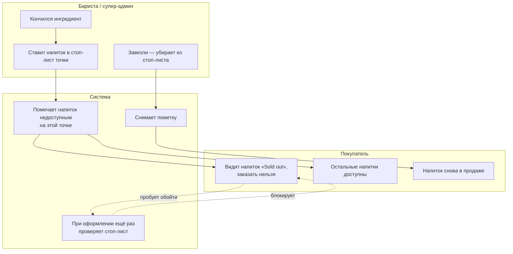

### Sequence-диаграмма (для разработки)

```mermaid
sequenceDiagram
  autonumber
  actor MGR as Бариста/админ (ADM-M-05)
  actor FE as Клиент (M1 / O1)
  participant ADM as admin/locations/{id}/stops
  participant LS as location_service.stopped_drink_ids
  participant OF as order_flow.assert_location_orderable
  participant DB as БД (location_drink_stops)

  MGR->>ADM: POST /api/admin/locations/{id}/stops { drinkId }
  ADM->>DB: insert LocationDrinkStop(location_id, drink_id)  %% existence-based
  Note over ADM,MGR: снять — DELETE …/stops/{drink_id}; список — GET …/stops

  FE->>LS: GET /api/drinks?location_id=… (меню по точке)
  LS->>DB: select drink_id from LocationDrinkStop where location_id
  LS-->>FE: помеченные напитки → «Sold out», заказ заблокирован

  FE->>OF: POST /api/orders { items, locationId }
  OF->>LS: stopped_drink_ids(db, loc.id)
  alt stopped ∩ drink_ids ≠ ∅
    OF-->>FE: 409 DRINK_UNAVAILABLE_AT_LOCATION
  else чисто
    OF->>OF: создание заказа продолжается
  end
```

**Связки и инварианты.**

- `LocationDrinkStop` — **existence-based**: факт наличия строки `(location_id, drink_id)` = «в стопе»;
  снятие — удаление строки (см. Часть III).
- Серверная проверка при оформлении — `assert_location_orderable()` (`order_flow.py`):
  `stopped & set(drink_ids)` → `409 DRINK_UNAVAILABLE_AT_LOCATION`.
- Стоп-лист **на уровне точки**; снятие напитка с публикации на уровне сети — это другой механизм
  (`Drink.status`, `DRINK_NOT_AVAILABLE` при `status != "published"` в `create_order`).
- Все операции точки пишут аудит (`LocationStatusEvent` / `OrderEvent`, см. Часть III).
- Проекции: клиент — «Sold out» (M1/O1); менеджер — стоп-лист (ADM-M-05); супер-админ — то же по сети.
- Метки: ✅ реализовано.

---

## VII.6. Купоны и рейтинг (👎 → купон)

### Как это работает (простыми словами)

После того как заказ выдан (или покупатель отметился «я приехал»), система предлагает оценить его
большим пальцем: **👍 или 👎**. Оценку можно поставить **один раз** на заказ. Логика компенсации: если
покупатель недоволен и ставит **👎**, ему **автоматически выдаётся купон** — скидка на следующий заказ
как извинение. За **👍** купон не выдаётся (доволен — компенсировать нечего).

Купон даёт **бесплатный один напиток** в следующем заказе: покупатель сам выбирает, на какой именно
напиток применить купон, и его цена вычитается из суммы. Купон «сгорает» (становится использованным)
**только после оплаты** того заказа, где его применили, — если оплата не прошла, купон остаётся
активным. Супер-админ может аннулировать активный купон.

> Номинал и срок действия купона жёстко не заданы в коде — это расход бизнеса; вынесено в открытый вопрос
> (см. Часть IX). Купон по умолчанию покрывает цену **одной** выбранной позиции следующего заказа.

### Бизнес-схема «по дорожкам»

```mermaid
flowchart TB
  subgraph BUYER[Покупатель]
    B1[Заказ выдан / отметился «приехал»]
    B2{Оценка}
    B3[👍 — спасибо, купона нет]
    B4[👎 — получает купон]
    B5[В следующем заказе выбирает<br/>напиток и применяет купон]
    B6[Оплачивает — напиток бесплатно]
  end
  subgraph SYS[Система]
    S1[Фиксирует оценку (одну на заказ)]
    S2[На 👎 — создаёт купон]
    S3[Вычитает цену выбранного напитка]
    S4[После оплаты — гасит купон]
  end
  subgraph ADM[Супер-админ]
    AD1[Может аннулировать<br/>активный купон]
  end

  B1 --> B2
  B2 -- 👍 --> S1 --> B3
  B2 -- 👎 --> S1 --> S2 --> B4 --> B5 --> S3 --> B6 --> S4
  AD1 -.void.-> S2
```

### Sequence-диаграмма (для разработки)

```mermaid
sequenceDiagram
  autonumber
  actor FE as Клиент
  participant RT as POST /api/orders/{id}/rate
  participant ORD as POST /api/orders (create_order)
  participant MP as order_flow.mark_paid
  participant DB as БД (orders, coupons)

  Note over FE,DB: рейтинг
  FE->>RT: { rating: "like" | "dislike" }
  alt rating ∉ {like,dislike}
    RT-->>FE: 422 VALIDATION_ERROR
  else уже оценён
    RT-->>FE: 409 ALREADY_RATED
  else не выдан и не «приехал»
    RT-->>FE: 409 ORDER_NOT_RATABLE
  end
  RT->>DB: order.rating; OrderEvent("rated", note=rating)
  alt rating == "dislike"
    RT->>DB: insert Coupon(user_id, source_order_id, status="active")
    RT-->>FE: { couponIssued:true, couponId }
  else like
    RT-->>FE: { couponIssued:false }
  end

  Note over FE,DB: применение в следующем заказе
  FE->>ORD: POST /api/orders { items, couponId, couponItemIndex }
  ORD->>DB: get Coupon
  alt coupon нет / чужой / не active
    ORD-->>FE: 409 COUPON_INVALID
  else couponItemIndex не указывает напиток
    ORD-->>FE: 422 COUPON_ITEM_REQUIRED
  else ок
    ORD->>DB: item.paid_by_coupon=True; coupon_discount = цена напитка
    ORD->>DB: order.total = subtotal − coupon_discount; OrderEvent("coupon_applied")
  end

  Note over FE,MP: купон гасится только при оплате
  FE->>MP: оплата заказа (см. VII.1)
  MP->>DB: coupon.status="used"; used_at; used_order_id; used_item_id; discount_amount
```

**Связки и инварианты.**

- Выдача купона — только при `rating == "dislike"` (`routers/orders.py`); один рейтинг на заказ
  (`ALREADY_RATED`); оценивать можно при `status == "completed"` **или** `arrived_at` задан
  (иначе `ORDER_NOT_RATABLE`).
- Применение — `create_order()` (`order_flow.py`): купон валиден если `user_id` совпадает и
  `status == "active"`; покупатель сам указывает `couponItemIndex` (какой напиток покрывает купон),
  иначе `COUPON_ITEM_REQUIRED`; `coupon_discount = цена выбранного напитка`; `total = subtotal − discount`.
- Гашение — `mark_paid()`: `coupon.status = "used"` после оплаты (см. VII.1). До оплаты купон остаётся
  `active`.
- Аннулирование супер-админом — `coupon.status = "void"` (`POST /api/admin/coupons/{id}/void`, см.
  Часть V, ADM-S-05). Список купонов клиента — `GET /api/coupons`.
- Номинал/срок — в коде не зафиксированы → ❓ открытый вопрос (Часть IX).
- Метки: ✅ реализовано.

---

## VII.7. Статус точки (вычисляемый `open / paused / closed / inactive`)

### Как это работает (простыми словами)

Статус точки **нигде не хранится как «галочка» — он вычисляется** каждый раз из трёх вещей: включена ли
точка в принципе, не поставлена ли она «на паузу» вручную, и попадает ли текущее время в её рабочие часы.
Так статус всегда честный и не «протухает».

Порядок проверки (важен приоритет): если точка вообще выключена — она **«неактивна»**; иначе если её
вручную поставили на паузу — **«пауза»**; иначе если сейчас вне рабочих часов — **«закрыто»** (и
показывается, во сколько откроется); и только если всё в порядке — **«открыто»**. Рабочие часы умеют
работать и «через полночь» (например, окно до 02:00 ночи учитывается как продолжение предыдущего дня).

**Что видит покупатель:** на карточке точки — цветной бейдж статуса, часы работы, и «opens HH:MM», если
закрыто. Заказать можно только на открытой точке: при попытке оформить заказ на закрытой/паузнутой
система понятно объяснит причину. **Бариста** ставит свою точку на паузу одним движением, когда нужно
временно остановить приём (завал, уборка). **Супер-админ** управляет паузой и часами по всей сети.

### Бизнес-схема «по дорожкам»

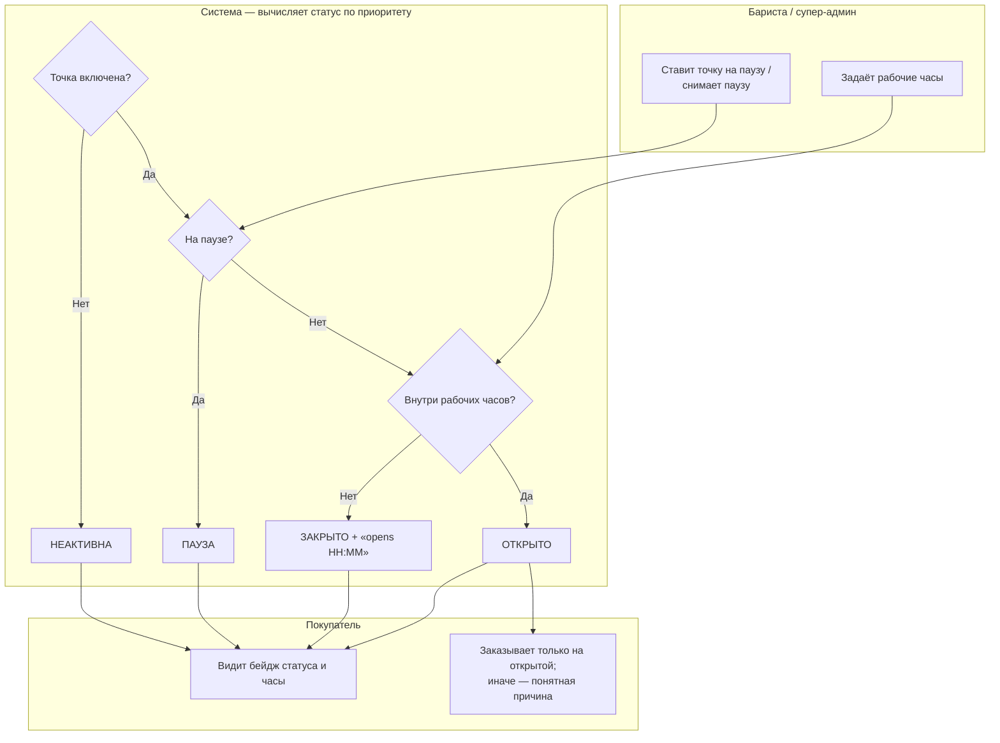

### Sequence-диаграмма (для разработки)

```mermaid
sequenceDiagram
  autonumber
  actor FE as Клиент (L1) / Кухня (ADM-M-04)
  participant API as locations / admin/location-status
  participant LS as location_service.effective_status
  participant OF as order_flow.assert_location_orderable

  FE->>API: GET /api/locations (список с бейджами)
  API->>LS: effective_status(loc, now)
  Note right of LS: приоритет — not is_active→"inactive"; not accepting_orders→"paused";<br/>not schedule_open→"closed"; иначе "open"
  LS->>LS: schedule_open → in_schedule(now, working_hours, tz) (учёт окна через полночь)
  LS-->>API: status (+ next_open_at если closed)
  API-->>FE: бейдж + часы + «opens HH:MM»

  Note over FE,OF: попытка заказа на закрытой/паузнутой точке
  FE->>OF: POST /api/orders { locationId, items }
  alt not loc.is_active
    OF-->>FE: 404 LOCATION_NOT_FOUND
  else not accepting_orders
    OF-->>FE: 409 LOCATION_PAUSED
  else not schedule_open
    OF-->>FE: 409 LOCATION_CLOSED (+ next_open_at)
  end
```

**Связки и инварианты.**

- `effective_status()` (`location_service.py`) — **не хранится в БД**, вычисляется из `is_active`,
  `accepting_orders`, `schedule_open()`; приоритет: `inactive → paused → closed → open`.
- `in_schedule()` — поддержка окна через полночь (`close < open`): учитывается «голова» сегодняшнего и
  «хвост» вчерашнего интервала; пустой массив дня = выходной.
- `next_open_at()` — ближайшее открытие в пределах 14 дней (для copy «opens HH:MM»).
- Серверный gate при заказе — `assert_location_orderable()`: `LOCATION_NOT_FOUND` / `LOCATION_PAUSED` /
  `LOCATION_CLOSED` (+ `next_open_at`).
- Пауза — `accepting_orders=false` (менеджер/супер-админ); все смены пишут `LocationStatusEvent` (аудит,
  Часть III).
- Проекции: клиент — бейдж/часы (L1); кухня — статус в шапке (ADM-M-04); супер-админ — pause/часы (ADM-S-10).
- Метки: ✅ реализовано.

---

## VII.8. Медиа: загрузка и отдача через S3/MinIO

### Как это работает (простыми словами)

Картинки и короткие видео для каталога (превью напитков, баннеры) супер-админ загружает в облачное
хранилище. Загруженный файл получает короткий внутренний адрес (ключ), который и сохраняется в карточке
напитка; полный веб-адрес для показа покупателю система собирает «на лету» при отдаче. Это позволяет
поменять хранилище или CDN без переписывания базы — в базе лежит только ключ, не жёсткая ссылка.

Хранилище защищено: принимаются только разрешённые типы (картинки JPEG/PNG/WebP, видео MP4/WebM) и файлы
до 25 МБ; имя файла генерируется системой (нельзя «подсунуть» путь). Если хранилище не настроено, загрузка
аккуратно отключается (вернётся «хранилище недоступно»), а **остальное приложение продолжает работать** —
можно временно указывать готовые внешние ссылки на медиа.

### Бизнес-схема «по дорожкам»

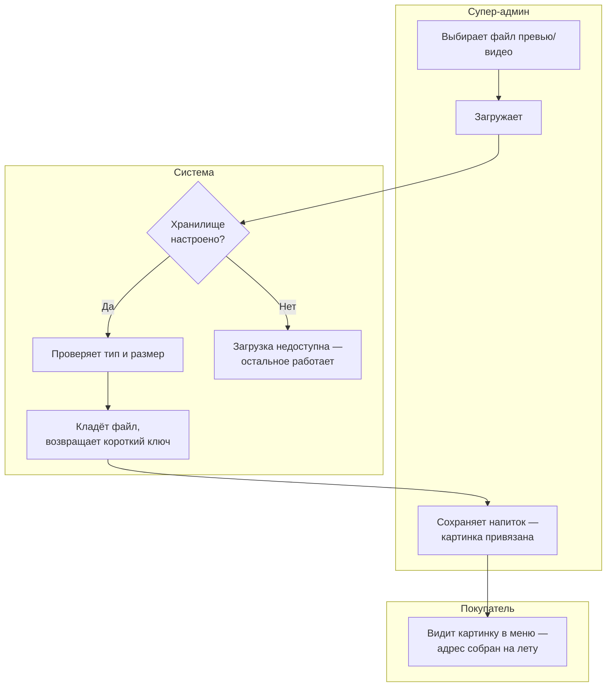

### Sequence-диаграмма (для разработки)

```mermaid
sequenceDiagram
  autonumber
  actor ADM as Супер-админ
  participant UP as POST /api/admin/media
  participant ST as services.storage.upload
  participant S3 as S3 / MinIO
  participant CAT as admin/catalog PATCH
  actor FE as Клиент (M1)

  ADM->>UP: multipart { file, folder } (require_super_admin)
  UP->>ST: upload(file, folder)
  alt content_type ∉ ALLOWED
    ST-->>ADM: 422 MEDIA_TYPE_NOT_ALLOWED
  else size > 25 МБ
    ST-->>ADM: 413 MEDIA_TOO_LARGE
  else s3_bucket не задан / boto3 нет
    ST-->>ADM: 503 MEDIA_STORAGE_DISABLED
  else ок
    ST->>S3: put_object(key="media/{folder}/{uuid}{ext}", CacheControl=1y)
    ST-->>ADM: { key, url, contentType, size }
  end
  ADM->>CAT: PATCH drink { previewUrl: key }  %% в БД хранится КЛЮЧ
  FE->>FE: GET /api/drinks → media_url(key)
  Note right of FE: media_url: абсолютный URL = s3_public_url|s3_endpoint_url + bucket + key;<br/>уже-абсолютные ("http"/"/") отдаются как есть
```

**Связки и инварианты.**

- Единственное место, знающее про хранилище, — `services/storage.py` (provider-swap без переписывания БД).
- `ALLOWED` — `image/jpeg|png|webp`, `video/mp4|webm`; `MAX_BYTES = 25 МБ`; ключ генерируется
  (`media/{folder}/{uuid}{ext}`) — нет path-traversal.
- `enabled()` = `bool(s3_bucket)`; без bucket — `503 MEDIA_STORAGE_DISABLED` (graceful degradation),
  внешние URL-строки остаются фолбэком. `boto3` импортируется лениво.
- `media_url(key)` собирает абсолютный URL из `s3_public_url`/`s3_endpoint_url` + bucket + key; ключи,
  начинающиеся с `http://`/`https://`/`/`, отдаются как есть (сид-пути, внешние CDN).
- Доступ — только `require_super_admin`. Проекции: супер-админ — загрузка (ADM-S-12); клиент — показ (M1/P1).
- Метки: ✅ реализовано · 🔧 без bucket загрузка выключена.

---

## VII.9. CMS-контент (InfoBlock)

### Как это работает (простыми словами)

Тексты страницы «Инфо» (история бренда, контакты, часы, соцсети) ведёт супер-админ как набор **блоков**:
у каждого блока есть ключ, заголовок и тело, порядок и переключатель «показывать / скрыть». Покупателю на
странице «Инфо» показываются **только активные** блоки, в заданном порядке, на нужном языке. Так
владелец меняет тексты без участия разработчиков, а на витрине ничего не «ломается»: скрытый блок просто
не показывается.

### Бизнес-схема «по дорожкам»

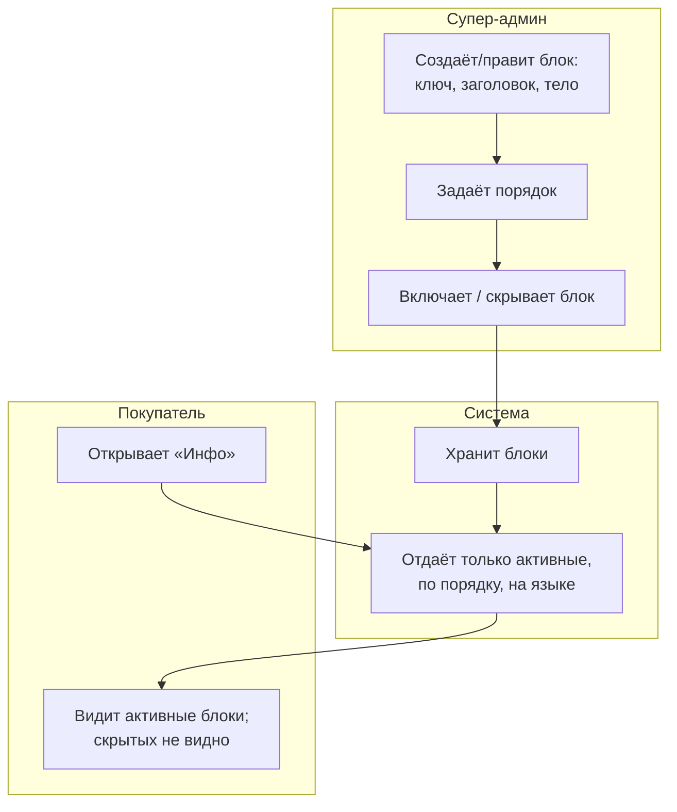

### Sequence-диаграмма (для разработки)

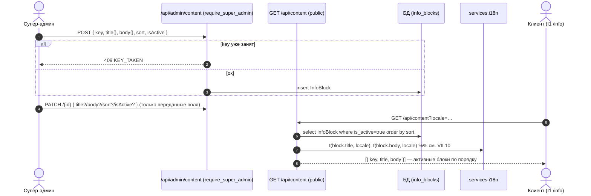

**Связки и инварианты.**

- Админ-CRUD — `require_super_admin`; публичная выдача — `GET /api/content` (только `is_active=true`,
  порядок `sort`). Дублирующий `key` → `409 KEY_TAKEN`.
- `PATCH` применяет **только переданные поля** (`model_fields_set`) — частичное обновление.
- Заголовок/тело — i18n JSON (`{ru,ar,en}`); отдаются через `t(..., locale)` (см. VII.10).
- Проекции: супер-админ — CMS (ADM-S-12); клиент — `/info` (I1) с фолбэком при пустом контенте.
- Метки: ✅ реализовано.

---

## VII.10. Локализация контента (`pick_locale`, fallback)

### Как это работает (простыми словами)

Все «контентные» тексты (имена и описания напитков, блоки «Инфо») хранятся **сразу на нескольких языках**
в одном поле. При запросе клиент указывает желаемый язык, и система выбирает нужный перевод. Если для
выбранного языка перевода нет — текст не пропадает: система показывает запасной язык, а если и его нет —
первый доступный перевод. Так покупатель **никогда не видит пустоту** вместо названия.

> **Текущее состояние и ⚠️ расхождение.** Инфраструктура многоязычности (хранение `{ru,ar,en}`, выбор
> языка, запасные варианты, готовность к арабскому/RTL) **заложена**. Интерфейс приложения сейчас по сути
> одноязычный. При этом в коде **язык по умолчанию — `ru`**, а список поддерживаемых — `["ru","ar"]`,
> тогда как бренд GRABZI позиционируется **EN-first** (рынок ОАЭ). Это расхождение «целевая модель
> EN-first ↔ дефолт `ru` в конфиге» нужно зафиксировать и привести к одному значению (см. Часть IX,
> открытые вопросы; настройка `default_locale`/`locales` в `core/config.py`).

### Бизнес-схема «по дорожкам»

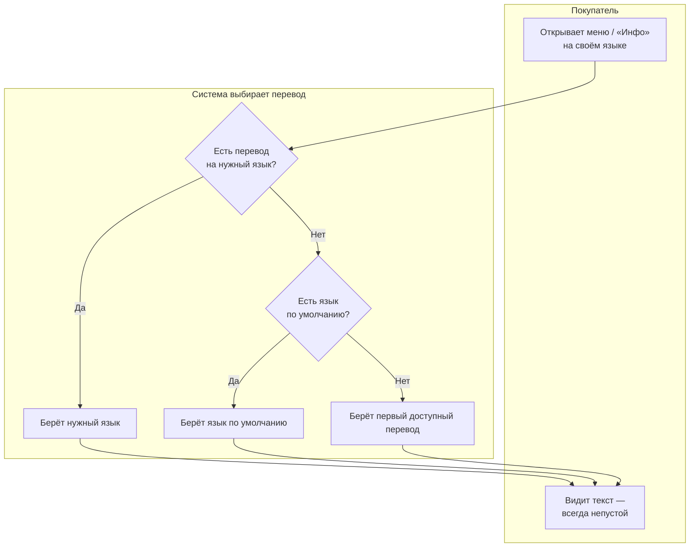

### Sequence-диаграмма (для разработки)

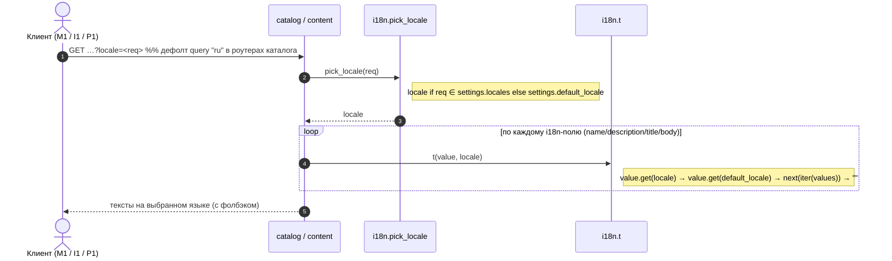

**Связки и инварианты (канон — код).**

- `pick_locale(locale)` (`services/i18n.py`): `locale if locale in settings.locales else default_locale`.
- `t(value, locale)` — тройной фолбэк: запрошенный язык → `default_locale` → первый доступный перевод →
  `""` (пустое поле). Применяется к именам/описаниям напитков, заголовкам/телам InfoBlock.
- Конфиг (`core/config.py`): `default_locale = "ru"`, `locales = ["ru","ar"]`; роутеры каталога
  принимают `locale` как query (`Query("ru")`). Профиль клиента хранит `preferred_locale`
  (`pick_locale` при регистрации, PATCH в профиле). ⚠️ Расхождение с EN-first — см. Часть IX.
- AR/RTL (`dir`, выбор языка) — заложен, но UI фактически одноязычный (V1.1, см. Часть I, локализация).
- Проекции: клиент — меню/инфо (M1/P1/I1); супер-админ — заполнение переводов в каталоге/CMS.
- Метки: ✅ инфраструктура реализована · ⚠️ EN-first ↔ дефолт `ru`.

---

> **Перекрёстные ссылки.** Статусная модель и расшифровка статусов — Часть 0 (§0.8). Сущности
> (`LocationDailyCounter`, `LocationDrinkStop`, `Order`, `Payment`, `Coupon`, `InfoBlock`, `OrderEvent`,
> `LocationStatusEvent`) — Часть III. Эндпоинты и WS-каналы — Часть VIII. Коды ошибок — Приложение C.
> Деньги, статус интеграций (mock-Stripe / OTP-заглушка / Redis / S3 / WS) — Часть I. Открытые вопросы и
> противоречия (VAT, телефон-regex, EN-first vs `ru`, kitchen `name`-контракт) — Часть IX.
